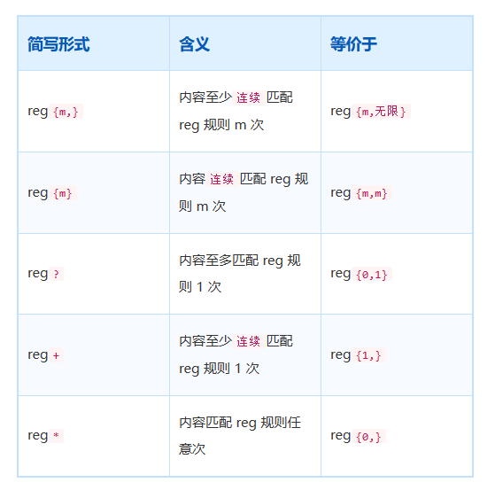
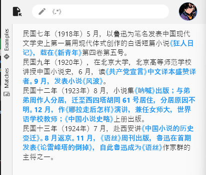
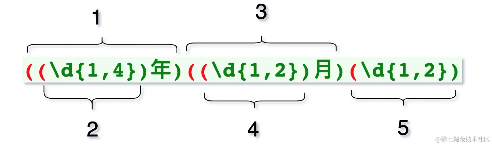
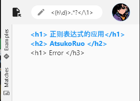
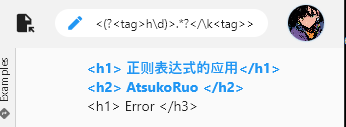

# 正则表达式

需要转义的字符：

~~~
* . ? + $ ^ [ ] ( ) { } | \ /
~~~

### 与

 `\d` 只能匹配到一个数字，而`\d\d` 就匹配到两个连续的数字。

`reg{m,n}` 内容连续匹配 `reg` 规则 至少 m 次，至多 n 次。

### 或

`reg1|reg2|reg3` 表示，内容符合 `reg1`、`reg2`、`reg3` 之一即可立即匹配。但是要注意或操作，具有短路效应，即如果前者匹配了，就被忽略后续字符的匹配。

`(\d+\.\d+)|(\d+)`，通过 `()` 来确保将两部分视为独立正则表达式。

`c1|c2|c3|...|cn`可以简写为`[c1c2c3c4...cn]`，其中`c1`等都是单字符。`[a-f]`表示`[abcdef]`，即`a|b|c|d|e|f`

`[^ap]`表示匹配除 `a` 或 `p` 字符以外的所有字符

- `\d`：一个十进制的数字 `[0-9]`
- `\D`：一个非数字
- `\w`：一个数字/字母/下划线 `[0-9a-zA-Z_]`
- `\W`：表示 \w 之外的字符
- `\s`：表示一个空白字符（空格，tab，换页符等）
- `\S`：表示一个非空白字符
- `.`：任意字符

### 贪婪模式

默认情况下会匹配尽可能多的字符。

如果希望匹配尽可能少的字符，可以在量词的后面添加`?`。

- 对于正则表达式 `a.*b`（贪婪模式），它会匹配字符串中从第一个 'a' 到最后一个 'b' 之间的所有字符。
- 对于正则表达式 `a.*?b`（非贪婪模式），它会匹配字符串中从第一个 'a' 到接下来最近的一个 'b' 之间的字符。

以下是其他的一些非贪婪的例子：

- `*?`：匹配前面的子表达式 0 次或多次，但尽可能少重复。
- `+?`：匹配前面的子表达式 1 次或多次，但尽可能少重复。
- `??`：匹配前面的子表达式 0 次或 1 次，但尽可能少重复。
- `{n,m}?`：匹配前面的子表达式至少 n 次，但不超过 m 次，尽可能少重复。

注意：`a?`表示 'a' 字符出现 0 次或 1 次，`a??`也表示 'a' 字符出现 0 次或 1 次，它们的结果是一样的。

`?`的三种含义

- 量词：`reg?`，即匹配至少一次 reg
- 位置匹配：`(?=regExp)`
- 懒惰模式：紧跟在量词的后面

### 位置匹配

**位置匹配**的特点是：匹配的内容为空字符，包括以下三类：

- 行

  - 行首`^`，从行首开始匹配，如果未开启多行模式，那么只会考虑第一行。`^abc`会匹配所有以`abc`开始的字符串。
  - 行尾`$`。`abc$` 将会匹配任何以 `abc` 结尾的字符串。

- 单词

  - 单词边界`\b`：在我们汉语中，并没有单词的概念，所以 `\b` 是无法匹配的。
  - 非单词边界`\B`：在所有位置中去除单词边界后所剩的位置

- 正则位置

  - `exp1(?=exp2)`：查找 exp2 前面的 exp1。

  - `(?<=exp2)exp1`：查找 exp2 后面的 exp1。

  - `exp1(?!exp2)`：查找后面不是 exp2 的 exp1

  - `(?<!exp2)exp1`：查找前面不是 exp2 的 exp1。

### 分组

`()` 可以创建分组，分组可以方便获取到局部正则匹配的内容。

多个括号嵌套时，分组规则为：从左到右数左括号 ，是第几个，就是第几组

我们可以通过`(?<name>reg)`正则语法，为分组起名字。

~~~dart
const reg = r'(\d{1,4})年(?<月份>\d{1,2})月(\d{1,2})';
RegExp exp = RegExp(reg);
Iterable<RegExpMatch> allMatches = exp.allMatches(src);
for (RegExpMatch match in allMatches) {
    String? month = match.namedGroup("月份");
    print("====match:$month");
    print("====groupNames:${match.groupNames}");
}

~~~

有时候，我们需要基于前面匹配的内容，对后面的匹配进行限制。也就是说，后续的匹配规则需要依赖于前面匹配的内容。比如，匹配前后一致的标签`<h1></h1>`。我们可以使用**反向引用**语法来完成上述需求

 如下，通过`\1` 就可以引用第一组的匹配结果

反向引用也支持命名的方式：`\k<name>`

有时候我们加括号只是为了表示独立，并不想把它视为**组**，这时可以使用特定的语法 `(?:reg)` 表示不捕获组。例如，`'a(?:[vm])'`

