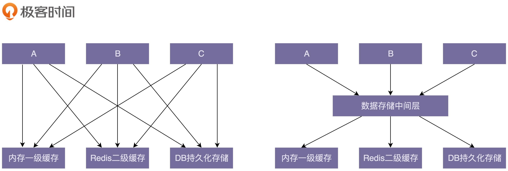

# 设计原则

切记不要教条主义，生搬硬套，适得其反。

当你对应用哪条设计原则而拿不定注意时，就要认识到：

- 设计原则是围绕代码的可维护性、可复用性、可扩展性而服务的，来应对系统的复杂性。
- 根据现有需求去考虑问题，而不要过度设计。前提是，需求是合理的！

[TOC]

## 高内聚、松耦合

“高内聚、松耦合”和“抽象”一样，是一个比较通用的设计思想，能够有效地提高代码的可读性和可维护性。它可以用来指导不同粒度代码的设计与开发，比如系统、模块、类，甚至是函数，也可以应用到不同的开发场景中，比如微服务、框架、组件、类库等。此外，**这种思想指导着大部分的设计原则**。

**解耦让我们聚焦于某一模块或类中，降低了阅读和修改代码的难度，缩小需求变更导致的代码修改该范围。**

这里我们以类为考察对象，来解释这个概念。在这个设计思想中，**“高内聚”用来指导类本身的设计，“松耦合”用来指导类与类之间依赖关系的设计**。具体来说：

- **高内聚**，就是指相近的功能应该放到同一个类中，不相近的功能不要放到同一个类中。相近的功能往往会被同时修改，放到同一个类中，修改会比较集中，代码容易维护。实际上，单一职责原则是实现代码高内聚非常有效的设计原则。
- **松耦合**，在代码中，类与类之间的依赖关系简单清晰。即使两个类有依赖关系，一个类的代码改动不会或者很少导致依赖类的代码改动。实际上依赖注入、接口隔离、基于接口而非实现编程，以及迪米特法则，都是为了实现代码的松耦合。

那么如何进行解耦？

- 封装与抽象：封装和抽象可以有效地隐藏实现的复杂性（隔离关注点），隔离实现的易变性，给依赖的模块提供稳定且易用的抽象接口。

- 中间层：引入中间层能简化模块或类之间的依赖关系。

  

- 模块化：不同的模块之间通过API来进行通信，每个模块之间耦合很小。每个团队聚焦于一个独立的高内聚模块来开发，最终像搭积木一样将各个模块组装起来，构建成一个超级复杂的系统。**模块化的底层逻辑就是分而治之**

## 单一职责原则

> A class or module should have a single responsibility
>
> 一个类或者模块只负责完成一个职责。

如果某类包含了若干个业务上不相关的功能，那么考虑将该类拆分成粒度更细、功能更加单一的多个类。

对于一个类是否符合SRP，是没有一个非常明确的、可以量化的标准。例如在一个社交产品中，我们用下面的UserInfo类来记录用户的信息：

~~~java
public class UserInfo {
  private long userId;
  private String username;
  private String email;
  private String telephone;
  private long createTime;
  private long lastLoginTime;
  private String avatarUrl;
  private String provinceOfAddress; // 省
  private String cityOfAddress; // 市
  private String regionOfAddress; // 区 
  private String detailedAddress; // 详细地址
  // ...省略其他属性和方法...
}
~~~

UserInfo类的设计是否满足单一职责原则呢？下面给出两种对立的观点。

- UserInfo类包含的都是跟用户相关的信息，所有的属性和方法都隶属于用户这样一个业务模型，满足单一职责原则
- 地址信息在UserInfo类中，所占的比重比较高，可以继续拆分成独立的UserAddress类。

哪种观点更对呢？实际上，要从中做出选择，我们**不能脱离具体的应用场景**。如果在这个社交产品中，用户的Address信息跟其他信息一样，只是单纯地用来展示，那UserInfo现在的设计就是合理的。如果地址在其他模块中使用掉，那我们最好将Address从UserInfo中拆分出来。

最推荐的做法是，我们可以先写一个满足业务需求的类。随着业务的发展，如果类越来越庞大，代码越来越多，这个时候，我们就可以将这个粗粒度的类，拆分成几个更细粒度的类。这就是所谓的持续重构。

一味地拆分类（强制应用单一职责原则），反而降低代码的可维护性以及内聚性。例如，Serialization类实现了一个简单协议的序列化和反序列功能：

~~~java
public class Serialization {
  private static final String IDENTIFIER_STRING = "UEUEUE;";
  
  public Serialization() {}
  public String serialize(Map<String, String> object) {}
  public Map<String, String> deserialize(String text) {}
}

~~~

如果我们想让类的职责更加单一，那么我们对Serialization类进一步拆分，拆分成一个只负责序列化工作的Serializer类，和另一个只负责反序列化工作的Deserializer类：

~~~java
public class Serializer {
  private static final String IDENTIFIER_STRING = "UEUEUE;";

  public Serializer() {}
  public String serialize(Map<String, String> object) {}
}

public class Deserializer {
  private static final String IDENTIFIER_STRING = "UEUEUE;";
  
  public Deserializer() {}
  public Map<String, String> deserialize(String text) {}
}
~~~

如果我们修改了协议的格式，数据标识从“UEUEUE”改为“DFDFDF”，那Serializer类和Deserializer类都需要做相应的修改，代码的内聚性显然没有原来Serialization高了。如果而忘记了修改Deserializer类的代码，那就会导致序列化、反序列化不匹配，程序运行出错，也就是说，拆分之后，代码的可维护性变差了。

要记住，**这些原则为了代码的可维护性、复用性、内聚性等而服务**。如果套用某个原则后，发现代码的可维护性下降了，那么就不要再使用该原则了。

## 开闭原则

> software entities (modules, classes, functions, etc.) should be open for extension , but closed for modification
>
> 软件实体（模块、类、方法等）应该“对扩展开放、对修改关闭”。

即添加一个新的功能应该是在已有代码基础上扩展代码（新增模块、类、方法等），而非修改已有代码（修改模块、类、方法等）。它解决的是代码的扩展性问题。

**开闭原则可以应用在不同粒度的代码中**，可以是模块，也可以类，还可以是方法（及其属性）。同样一个代码改动，在粗代码粒度下，被认定为“修改”，在细代码粒度下，又可以被认定为“扩展”。p判断准测就是**让修改尽量的集中**

添加一个新功能，不可能任何模块、类、方法的代码都不“修改”，这个是做不到的。类需要创建、组装、并且做一些初始化操作，才能构建成可运行的的程序，这部分代码的修改是在所难免的。我们要做的是尽量**让修改操作更集中**，让最核心、最复杂的那部分逻辑代码满足开闭原则。总结来说就是，**开闭原则并不是说完全杜绝修改，而是以最小的修改代码的代价来完成新功能的开发。**

我们根据现有的需求，去支持扩展点即可，**没必要为将来不明确要实现的需求提前买单，做过度设计**。等到以后有需求驱动的时候，再通过重构代码的方式来实现扩展的需求。此外，开闭原则也并不是免费的。有些情况下，代码的扩展性会跟可读性相冲突。

## 里式替换原则

这个原则最早是在1986年由Barbara Liskov提出，他是这么描述这条原则的

> If S is a subtype of T, then objects of type T may be replaced with objects of type S, without breaking the program
>
> 子类对象能够替换程序中父类对象出现的任何地方，并且保证原来程序的逻辑行为不变及正确性不被破坏。

在1996年，Robert Martin在他的SOLID原则中，重新描述了这个原则

>Functions that use pointers of references to base classes must be able to use objects of derived classes without knowing it。

实际上，里式替换原则还有另外一个更加能落地、更有指导意义的描述，那就是**“Design By Contract”（按照协议来设计）**

子类在设计的时候，要遵守父类的行为约定（或者叫协议）。如果父类定义了函数的行为约定，那子类不能改变函数原有的行为约定，但可以改变函数的内部实现逻辑。这里的行为约定包括：函数声明要实现的功能；对输入、输出、异常的约定；甚至包括注释中所罗列的任何特殊说明。

## 接口隔离原则

> Clients should not be forced to depend upon interfaces that they do not use
>
> 不应该强迫客户端依赖它不需要的接口

在这条原则中，我们可以把“接口”理解为下面三种东西：

*   一组 API 接口集合
*   单个 API 接口或函数
*   OOP 中的接口概念

接口隔离原则跟单一职责原则有点类似，不过还是有点区别。接口隔离原则相对于单一职责原则，它更侧重单一职责里的接口设计，并且它的思考的角度不同，即通过考虑调用者如何使用接口，来间接地判定接口是否职责单一。如果调用者只使用部分接口或接口的部分功能，那接口的设计就不够职责单一。

接下来，分别按照不同的理解方式，来解读这条原则：

### “接口”理解为一组接口集合

~~~java
//微服务用户系统提供了一组跟用户相关的API给其他系统使用

public interface UserService {
  boolean register(String cellphone, String password);
  boolean login(String cellphone, String password);
  UserInfo getUserInfoById(long id);
  UserInfo getUserInfoByCellphone(String cellphone);
}

public class UserServiceImpl implements UserService {
  //...
}
~~~

如果现在有删除用户的需求，那么简单直接的方法就是在 UserService 中新添加一个 deleteUserByCellphone() 或 deleteUserById() 接口。但是，这也隐藏了一些安全隐患。删除用户是一个非常慎重的操作，我们只希望通过后台管理系统来执行，而不是所有使用到 UserService 的系统。最好的解决方案是从架构设计的层面，通过接口鉴权的方式来限制接口的调用。我们还可以从代码设计的层面，参照接口隔离原则，将删除接口单独放到另外一个接口RestrictedUserService中。

~~~java
public interface UserService {
  boolean register(String cellphone, String password);
  boolean login(String cellphone, String password);
  UserInfo getUserInfoById(long id);
  UserInfo getUserInfoByCellphone(String cellphone);
}

public interface RestrictedUserService {
  boolean deleteUserByCellphone(String cellphone);
  boolean deleteUserById(long id);
}

public class UserServiceImpl implements UserService, RestrictedUserService {
  // ...省略实现代码...
}
~~~

### “接口”理解为单个API接口或函数

此时，那接口隔离原则就可以理解为：函数的设计要功能单一，不要将多个不同的功能逻辑在一个函数中实现。

~~~java
public class Statistics {
  private Long max;
  private Long min;
  private Long average;
  private Long sum;
  private Long percentile99;
  private Long percentile999;
  //...省略constructor/getter/setter等方法...
}

public Statistics count(Collection<Long> dataSet) {
  Statistics statistics = new Statistics();
  //...省略计算逻辑...
  return statistics;
}

~~~

count() 包含很多不同的统计功能，比如，求最大值、最小值、平均值等等。按照接口隔离原则，我们应该把 count() 函数拆成几个更小粒度的函数，每个函数负责一个独立的统计功能。拆分之后的代码如下所示：

~~~java
public Long max(Collection<Long> dataSet) { //... }
public Long min(Collection<Long> dataSet) { //... } 
public Long average(Colletion<Long> dataSet) { //... }
// ...省略其他统计函数...
~~~

## 依赖反转原则

### 控制反转

在介绍依赖反转原则之前，我们先来认识**“控制反转”（Inversion Of Control）**。这里的“控制”指的是对程序执行流程的控制，而“反转”指的是调用者与被调用者之间的控制权转移。例如，在没有使用框架之前，程序员自己控制整个程序的执行。在使用框架之后，整个程序的执行流程可以通过框架来控制。流程的控制权从程序员“反转”到了框架。

~~~java
public class UserServiceTest {
  public static boolean doTest() {
    // ... 
  }
  
  public static void main(String[] args) {//这部分逻辑可以放到框架中
    if (doTest()) {
      System.out.println("Test succeed.");
    } else {
      System.out.println("Test failed.");
    }
  }
}

~~~

在上面的代码中，所有的流程都由程序员来控制。下面，我们抽象出一个这样一个框架：

~~~java
public abstract class TestCase {
  public void run() {
    if (doTest()) {
      System.out.println("Test succeed.");
    } else {
      System.out.println("Test failed.");
    }
  }
  
  public abstract boolean doTest();
}

public class JunitApplication {
  private static final List<TestCase> testCases = new ArrayList<>();
  
  public static void register(TestCase testCase) {
    testCases.add(testCase);
  }
  
  public static final void main(String[] args) {
    for (TestCase case: testCases) {
      case.run();
    }
  }
}
~~~

把这个简化版本的测试框架引入到工程中之后，我们向doTest填充具体的测试代码即可，而无需考虑程序的执行流程：

~~~java
public class UserServiceTest extends TestCase {
  @Override
  public boolean doTest() {
    // ... 
  }
}

// 注册操作还可以通过配置的方式来实现，不需要程序员显示调用register()
JunitApplication.register(new UserServiceTest();
~~~

这里我们使用了模板设计模式，来实现了控制反转。此外，控制反转也可以通过依赖注入等方法来实现。

### 依赖注入

**依赖注入（Dependency Injection）**：不通过n ew() 的方式在类内部创建依赖类对象，而是将依赖的类对象在外部创建好之后，通过构造函数、函数参数等方式传递（注入）给类使用。也就是说，将对象的创建反转给上层来处理。读者可能认为这样做破坏了封装性，实则不然，因为仅仅是将私有状态的初始化操作交给调用者来负责而已，并未暴露该状态的修改方法。

我们现在要设计负责消息推送的Notification类。它依赖MessageSender类，来实现推送商品促销、验证码等消息给用户的功能。我们分别用依赖注入和非依赖注入两种方式来实现一下：

~~~java
// 非依赖注入实现方式
public class Notification {
  private MessageSender messageSender;
  
  public Notification() {
    this.messageSender = new MessageSender(); //此处有点像hardcode
  }
  
  public void sendMessage(String cellphone, String message) {
    //...省略校验逻辑等...
    this.messageSender.send(cellphone, message);
  }
}

public class MessageSender {
  public void send(String cellphone, String message) {
    //....
  }
}

// 使用Notification
Notification notification = new Notification();
~~~

~~~java
// 依赖注入的实现方式
public class Notification {
  private MessageSender messageSender;
  
  // 通过构造函数将messageSender传递进来
  public Notification(MessageSender messageSender) {
    this.messageSender = messageSender;
  }
  
  public void sendMessage(String cellphone, String message) {
    //...省略校验逻辑等...
    this.messageSender.send(cellphone, message);
  }
}

//使用Notification
MessageSender messageSender = new MessageSender();
Notification notification = new Notification(messageSender);
~~~

依赖注入的实现方式提高了代码的扩展性，我们可以灵活地替换依赖的类，这是符合开闭原则的。创建对象、组装（或注入）对象的工作仅仅是由更上层代码来负责而已，这还是需要程序员自己来完成这些工作：

~~~java
public class Demo {
  public static final void main(String args[]) {
    MessageSender sender = new SmsSender(); //创建对象
    Notification notification = new Notification(sender);//依赖注入
    notification.sendMessage("13918942177", "短信验证码：2346");
  }
}
~~~

在实际的软件开发中，一些项目可能会涉及几十、上百、甚至几百个类，类对象的创建、依赖注入、组件之间依赖关系的处理会变得非常复杂。而这些工作跟具体的业务无关，我们完全可以抽象成框架来自动完成，减少手动装配出错的可能性。

实际上，现成的依赖注入框架有很多，比如Google Guice、Java Spring、Pico Container、Butterfly Container等。

### 依赖反转原则

>High-level modules shouldn’t depend on low-level modules. Both modules should depend on abstractions. In addition, abstractions shouldn’t depend on details. Details depend on abstractions.
>
>高层模块不要依赖低层模块。高层模块和低层模块应该通过抽象来互相依赖。除此之外，抽象不要依赖具体实现细节，具体实现细节依赖抽象。

所谓高层模块和低层模块的划分，简单来说就是，在调用链上，调用者属于高层，被调用者属于低层。在平时的业务代码开发中，高层模块依赖底层模块是没有任何问题的。实际上，这条原则主要还是用来指导框架层面的设计。我们拿Tomcat这个Servlet容器作为例子来解释一下。

按照之前的划分原则，Tomcat 就是高层模块，我们编写的 Web 应用程序代码就是低层模块。Tomcat 和应用程序代码之间并没有直接的依赖关系，两者都依赖同一个“抽象”，也就是 Servlet 规范。Servlet 规范不依赖具体的 Tomcat 容器和应用程序的实现细节，而 Tomcat 容器和应用程序依赖Servlet规范。

这个规范本质上就是一个接口，它将两个变化的部分隔离开来，接口自身是一个不变的部分。

## KISS

KISS原则的英文描述有好几个版本

>*   Keep It Simple and Stupid.
>*   Keep It Short and Simple.
>*   Keep It Simple and Straightforward

它们的核心意思都是：尽量保持简单。

KISS原则就是保持代码可读和可维护的重要手段。代码足够简单，也就意味着很容易读懂，即便出现bug，修复起来也比较简单。不要觉得简单的东西就没有技术含量。实际上，越是能用简单的方法解决复杂的问题，越能体现一个人的能力。

### 代码行数越少越简单吗？

下面给出一个例子，检查输入的字符串ipAddress是否是合法的IP地址：

~~~java
// 第一种实现方式: 使用正则表达式
public boolean isValidIpAddressV1(String ipAddress) {
  if (StringUtils.isBlank(ipAddress)) return false;
  String regex = "^(1\\d{2}|2[0-4]\\d|25[0-5]|[1-9]\\d|[1-9])\\."
          + "(1\\d{2}|2[0-4]\\d|25[0-5]|[1-9]\\d|\\d)\\."
          + "(1\\d{2}|2[0-4]\\d|25[0-5]|[1-9]\\d|\\d)\\."
          + "(1\\d{2}|2[0-4]\\d|25[0-5]|[1-9]\\d|\\d)$";
  return ipAddress.matches(regex);
}

// 第二种实现方式: 使用现成的工具类
public boolean isValidIpAddressV2(String ipAddress) {
  if (StringUtils.isBlank(ipAddress)) return false;
  String[] ipUnits = StringUtils.split(ipAddress, '.');
  if (ipUnits.length != 4) {
    return false;
  }
  for (int i = 0; i < 4; ++i) {
    int ipUnitIntValue;
    try {
      ipUnitIntValue = Integer.parseInt(ipUnits[i]);
    } catch (NumberFormatException e) {
      return false;
    }
    if (ipUnitIntValue < 0 || ipUnitIntValue > 255) {
      return false;
    }
    if (i == 0 && ipUnitIntValue == 0) {
      return false;
    }
  }
  return true;
}

// 第三种实现方式: 不使用任何工具类
public boolean isValidIpAddressV3(String ipAddress) {
  char[] ipChars = ipAddress.toCharArray();
  int length = ipChars.length;
  int ipUnitIntValue = -1;
  boolean isFirstUnit = true;
  int unitsCount = 0;
  for (int i = 0; i < length; ++i) {
    char c = ipChars[i];
    if (c == '.') {
      if (ipUnitIntValue < 0 || ipUnitIntValue > 255) return false;
      if (isFirstUnit && ipUnitIntValue == 0) return false;
      if (isFirstUnit) isFirstUnit = false;
      ipUnitIntValue = -1;
      unitsCount++;
      continue;
    }
    if (c < '0' || c > '9') {
      return false;
    }
    if (ipUnitIntValue == -1) ipUnitIntValue = 0;
    ipUnitIntValue = ipUnitIntValue * 10 + (c - '0');
  }
  if (ipUnitIntValue < 0 || ipUnitIntValue > 255) return false;
  if (unitsCount != 3) return false;
  return true;
}
~~~

先说结论，第二种实现方式更符合KISS原则。第一种方式虽然行数最少，但是它使用了复杂的正则表达式。而第三种方式比第二种，实现起来更加有难度，容易出现bug。

但是从性能上来说，第三种要比第二种好。一般来说，工具类的功能都比较通用和全面，所以，在代码实现上，需要考虑和处理更多的细节，执行效率就会有所影响。

不过，最终还是选择第二种实现方法。因为第三种实际上是一种过度优化。除非isValidIpAddress() 函数是影响系统性能的瓶颈代码，否则，这样优化的投入产出比并不高，增加了代码实现的难度、牺牲了代码的可读性，性能上的提升却并不明显。

### 代码逻辑复杂就违背KISS原则吗？

我们先来看KMP算法的实现：

~~~java
// KMP algorithm: a, b分别是主串和模式串；n, m分别是主串和模式串的长度。
public static int kmp(char[] a, int n, char[] b, int m) {
  int[] next = getNexts(b, m);
  int j = 0;
  for (int i = 0; i < n; ++i) {
    while (j > 0 && a[i] != b[j]) { // 一直找到a[i]和b[j]
      j = next[j - 1] + 1;
    }
    if (a[i] == b[j]) {
      ++j;
    }
    if (j == m) { // 找到匹配模式串的了
      return i - m + 1;
    }
  }
  return -1;
}

// b表示模式串，m表示模式串的长度
private static int[] getNexts(char[] b, int m) {
  int[] next = new int[m];
  next[0] = -1;
  int k = -1;
  for (int i = 1; i < m; ++i) {
    while (k != -1 && b[k + 1] != b[i]) {
      k = next[k];
    }
    if (b[k + 1] == b[i]) {
      ++k;
    }
    next[i] = k;
  }
  return next;
}
~~~

这段代码完全符合我们刚提到的逻辑复杂、实现难度大、可读性差的特点，但它并不违反KISS原则。因为用复杂的方法来解决本身就复杂的问题，并不违背 KISS 原则。别指望用几百行代码实现一个操作系统 🤣。

### YAGNI

> You Ain’t Gonna Need It
>
> 你不会需要它

这个原则的意思是，不要去设计当前用不到的功能，即不要做过度设计。

在开发中，有些同事为了避免开发中library包缺失而频繁地修改Maven或者Gradle配置文件，提前往项目里引入大量常用的library包。实际上，这样的做法也是违背YAGNI原则的。

YAGNI原则跟KISS原则并非一回事儿。KISS原则讲的是“如何做”的问题（尽量保持简单），而YAGNI原则说的是“要不要做”的问题（当前不需要的就不要做）。

## DRY

>Don’t Repeat Yourself
>
>不要重复自己（不要重复造轮子）

三种典型的代码重复情况：

- 实现逻辑重复
- 功能语义重复
- 代码执行重复

我们看看这些重复情况是否违反 DRY

### 实现逻辑重复

~~~java
public class UserAuthenticator {
  public void authenticate(String username, String password) {
    if (!isValidUsername(username)) {
      // ...throw InvalidUsernameException...
    }
    if (!isValidPassword(password)) {
      // ...throw InvalidPasswordException...
    }
    //...省略其他代码...
  }

  private boolean isValidUsername(String username) {
    // check not null, not empty
    if (StringUtils.isBlank(username)) {
      return false;
    }
    // check length: 4~64
    int length = username.length();
    if (length < 4 || length > 64) {
      return false;
    }
    // contains only lowcase characters
    if (!StringUtils.isAllLowerCase(username)) {
      return false;
    }
    // contains only a~z,0~9,dot
    for (int i = 0; i < length; ++i) {
      char c = username.charAt(i);
      if (!(c >= 'a' && c <= 'z') || (c >= '0' && c <= '9') || c == '.') {
        return false;
      }
    }
    return true;
  }

  private boolean isValidPassword(String password) {
    // check not null, not empty
    if (StringUtils.isBlank(password)) {
      return false;
    }
    // check length: 4~64
    int length = password.length();
    if (length < 4 || length > 64) {
      return false;
    }
    // contains only lowcase characters
    if (!StringUtils.isAllLowerCase(password)) {
      return false;
    }
    // contains only a~z,0~9,dot
    for (int i = 0; i < length; ++i) {
      char c = password.charAt(i);
      if (!(c >= 'a' && c <= 'z') || (c >= '0' && c <= '9') || c == '.') {
        return false;
      }
    }
    return true;
  }
}

~~~

在上述代码中，有两处重复的代码片段：isValidUserName() 函数和isValidPassword() 函数。看起来违反了 DRY 原则。但实则不然，如果我们将两个函数合并为一个函数`isValidUsernameOrPassword`

~~~java
public class UserAuthenticatorV2 {

  public void authenticate(String userName, String password) {
    if (!isValidUsernameOrPassword(userName)) {
      // ...throw InvalidUsernameException...
    }

    if (!isValidUsernameOrPassword(password)) {
      // ...throw InvalidPasswordException...
    }
  }

  private boolean isValidUsernameOrPassword(String usernameOrPassword) {
    //省略实现逻辑
    //跟原来的isValidUsername()或isValidPassword()的实现逻辑一样...
    return true;
  }
}
~~~

重构之后，虽然消除了冗余代码，但是违反了“单一职责原则”和“接口隔离原则”。如果将来需求发生变更（例如，允许密码的长度为8到64个字符），那这个时候我们还要把合并后的函数，重新拆成合并前的那两个函数。

尽管代码的实现逻辑是相同的，但语义不同，那么我们就认为这段代码并不违反DRY原则。对于包含重复代码的问题，我们可以通过抽象成更细粒度函数的方式来解决。

### 功能语义重复

显然，这种情况是违反 DRY 原则的。不再阐述。

### 代码执行重复

~~~java
public class UserService {
  private UserRepo userRepo;//通过依赖注入或者IOC框架注入
    
  //校验用户登录是否成功，如果失败，就返回异常；如果成功，就返回用户信息
  public User login(String email, String password) {
    boolean existed = userRepo.checkIfUserExisted(email, password);
    if (!existed) {
      // ... throw AuthenticationFailureException...
    }
    User user = userRepo.getUserByEmail(email);
    return user;
  }
}

public class UserRepo {
  public boolean checkIfUserExisted(String email, String password) {
    if (!EmailValidation.validate(email)) {
      // ... throw InvalidEmailException...
    }

    if (!PasswordValidation.validate(password)) {
      // ... throw InvalidPasswordException...
    }

    //...query db to check if email&password exists...
  }

  public User getUserByEmail(String email) {
    if (!EmailValidation.validate(email)) {
      // ... throw InvalidEmailException...
    }
    //这里有个数据一致性假设：如果邮箱存在，那么对应的用户也存在。
    //...query db to get user by email...
  }
}
~~~

上面这段代码，既没有逻辑重复，也没有语义重复，但仍然违反了DRY原则。这是因为代码中存在“执行重复”。在 login() 函数中，email 的校验逻辑被执行了两次。一次是在调用checkIfUserExisted() 函数的时候，另一次是调用 getUserByEmail() 函数的时候。

此外，login() 函数并不需要调用 checkIfUserExisted() 函数，只需要调用一次 getUserByEmail() 函数，获取用户信息后做对比即可。这样的优化是很有必要的。因为 checkIfUserExisted() 函数和 getUserByEmail() 函数都需要查询数据库，而数据库这类的I/O操作是比较耗时的。我们在写代码的时候，应当尽量减少这类I/O操作。

~~~java
public class UserService {
  private UserRepo userRepo;//通过依赖注入或者IOC框架注入

  public User login(String email, String password) {
    if (!EmailValidation.validate(email)) {
      // ... throw InvalidEmailException...
    }
    if (!PasswordValidation.validate(password)) {
      // ... throw InvalidPasswordException...
    }
    User user = userRepo.getUserByEmail(email);
    if (user == null || !password.equals(user.getPassword()) {
      // ... throw AuthenticationFailureException...
    }
    return user;
  }
}

public class UserRepo {
  public boolean checkIfUserExisted(String email, String password) {
    //...query db to check if email&password exists
  }

  public User getUserByEmail(String email) {
    //...query db to get user by email...
  }
}
~~~

### 代码复用

我们首先来区分三个概念：**代码复用性（Code Reusability）**、**代码复用（Code Resue）**和**DRY原则**。

- 代码复用表示一种行为：我们在开发新功能的时候，尽量复用已经存在的代码。
- 代码的可复用性表示一段代码可被复用的特性或能力：我们在编写代码的时候，让代码尽量可复用。
- DRY原则是一条原则：不要写重复的代码。

实际上，这三个概念区别还是很大的：

- **“不重复”并不代表“可复用”**：不存在任何重复的代码，并不表示里面有可复用的代码。
- **“复用”和“可复用性”关注角度不同**：代码“可复用性”是从代码开发者的角度来讲的，“复用”是从代码使用者的角度来讲的。比如，A同事编写了一个UrlUtils类，代码的“可复用性”很好。B同事在开发新功能的时候，直接“复用”A同事编写的UrlUtils类。

但这三者的目的是相同的：减少代码量，提高代码的可读性、可维护性。

## 迪米特法则

>Each unit should have only limited knowledge about other units: only units “closely” related to the current unit. Or: Each unit should only talk to its friends; Don’t talk to strangers.
>
>每个模块只应该了解那些与它关系密切的模块的有限知识。或者说，每个模块只和自己的朋友“说话”，不和陌生人“说话”。

迪米特法则是希望减少类之间的耦合，让类越独立越好。每个类都应该少了解系统的其他部分。一旦发生变化，需要了解这一变化的类就会比较少。

上述原则比较抽象，我们可以进一步解读为：**不应该有直接依赖关系的类之间，就不要有依赖；有依赖关系的类之间，尽量只依赖必要的接口（也就是定义中的“有限知识”）。**

还是比较抽象是吧😭，下面我们通过几个例子来说明：

我们先来解释**不应该有直接依赖关系的类之间，就不要有依赖**的含义

简化版的搜索引擎爬取网页。代码中包含三个主要的类。其中，NetworkTransporter类负责底层网络通信，根据请求获取数据；HtmlDownloader类用来通过URL获取网页；Document表示网页文档，后续的网页内容抽取、分词、索引都是以此为处理对象。

~~~java
public class NetworkTransporter {
    // 省略属性和其他方法...
    public Byte[] send(HtmlRequest htmlRequest) {
      //...
    }
}

public class HtmlDownloader {
  private NetworkTransporter transporter;//通过构造函数或IOC注入
  
  public Html downloadHtml(String url) {
    Byte[] rawHtml = transporter.send(new HtmlRequest(url));
    return new Html(rawHtml);
  }
}

public class Document {
  private Html html;
  private String url;
  
  public Document(String url) {
    this.url = url;
    HtmlDownloader downloader = new HtmlDownloader();
    this.html = downloader.downloadHtml(url);
  }
  //...
}
~~~

**首先，我们来看NetworkTransporter类。**作为一个底层网络通信类（需求明确），我们希望它的功能尽可能通用，而不只是服务于下载HTML。因此将NetworkTransporter重构为

~~~java
public class NetworkTransporter {
    // 省略属性和其他方法...
    public Byte[] send(String address, Byte[] data) {
      //...
    }
}

~~~

**我们再来看HtmlDownloader类。**这个类的设计没有问题。不过，我们修改了NetworkTransporter的send()函数的定义，而这个类用到了send()函数，所以我们需要对它做相应的修改，修改后的代码如下所示：

~~~java
public class HtmlDownloader {
  private NetworkTransporter transporter;//通过构造函数或IOC注入
  
  // HtmlDownloader这里也要有相应的修改
  public Html downloadHtml(String url) {
    HtmlRequest htmlRequest = new HtmlRequest(url);
    Byte[] rawHtml = transporter.send(
      htmlRequest.getAddress(), htmlRequest.getContent().getBytes());
    return new Html(rawHtml);
  }
}
~~~

**最后，我们来看下Document类。**这个类的问题比较多，主要有三点：

1. 构造函数中的downloader.downloadHtml()逻辑复杂，耗时长
2. HtmlDownloader对象在构造函数中通过new来创建，违反了基于接口而非实现编程的设计思想
3. 从业务含义上来讲，Document网页文档没必要依赖HtmlDownloader类，违背了迪米特法则。

重构代码如下：

~~~java
public class Document {
  private Html html;
  private String url;
  
  public Document(String url, Html html) {
    this.html = html;
    this.url = url;
  }
  //...
}

// 通过一个工厂方法来创建Document
public class DocumentFactory {
  private HtmlDownloader downloader;
  
  public DocumentFactory(HtmlDownloader downloader) {
    this.downloader = downloader;
  }
  
  public Document createDocument(String url) {
    Html html = downloader.downloadHtml(url);
    return new Document(url, html);
  }
}
~~~

我们再来解释一下后半部分“有依赖关系的类之间，尽量只依赖必要的接口”的含义

Serialization类负责对象的序列化和反序列化：

~~~java
public class Serialization {
  public String serialize(Object object) {
    String serializedResult = ...;
    //...
    return serializedResult;
  }
  
  public Object deserialize(String str) {
    Object deserializedResult = ...;
    //...
    return deserializedResult;
  }
}
~~~

假设在我们的项目中，有些类只用到了序列化操作，而另一些类只用到反序列化操作。根据迪米特法则，我们应该将Serialization类拆分为两个更小粒度的类，一个只负责序列化（Serializer类），一个只负责反序列化（Deserializer类）：

~~~java
public class Serializer {
  public String serialize(Object object) {
    String serializedResult = ...;
    ...
    return serializedResult;
  }
}

public class Deserializer {
  public Object deserialize(String str) {
    Object deserializedResult = ...;
    ...
    return deserializedResult;
  }
}
~~~

尽管拆分之后的代码更能满足迪米特法则，但却违背了高内聚的设计思想。如果我们修改了序列化的实现方式，比如从JSON换成了XML，那反序列化的实现逻辑也需要一并修改。在未拆分的情况下，我们只需要修改一个类即可。在拆分之后，我们需要修改两个类。显然，这种设计思路的代码改动范围变大了。

通过引入两个接口，就可以既不违背高内聚的设计思想，也不违背迪米特法则：

~~~java
public interface Serializable {
  String serialize(Object object);
}

public interface Deserializable {
  Object deserialize(String text);
}

public class Serialization implements Serializable, Deserializable {
  @Override
  public String serialize(Object object) {
    String serializedResult = ...;
    ...
    return serializedResult;
  }
  
  @Override
  public Object deserialize(String str) {
    Object deserializedResult = ...;
    ...
    return deserializedResult;
  }
}

public class DemoClass_1 {
  private Serializable serializer;
  
  public Demo(Serializable serializer) {
    this.serializer = serializer;
  }
  //...
}

public class DemoClass_2 {
  private Deserializable deserializer;
  
  public Demo(Deserializable deserializer) {
    this.deserializer = deserializer;
  }
  //...
}
~~~

