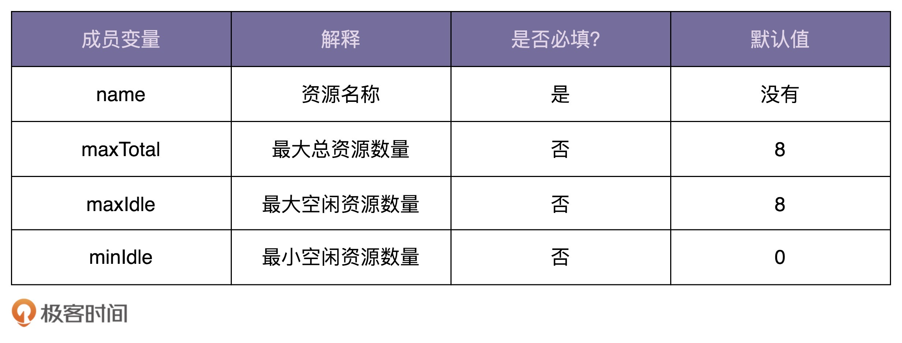

# 创建型模式

[TOC]

## 单例

**单例设计模式**（Singleton Design Pattern）：一个类只允许创建一个对象（或者实例）。

### 如何实现一个单例？

基本思想就是将单例实例声明为静态的，这样就有全局语义了。然后再提供方法来访问它即可。

#### 饿汉式

在类加载的时候，将静态实例初始化。初始化的过程是线程安全的。不过这种方式不支持延迟加载。

~~~java
public class IdGenerator { 
  private AtomicLong id = new AtomicLong(0);
  private static final IdGenerator instance = new IdGenerator();		//饿汉式
    
  private IdGenerator() {}
  public static IdGenerator getInstance() {
    return instance;
  }
  public long getId() { 
    return id.incrementAndGet();
  }
}

~~~

有些人认为当实例占用资源多或者初始化耗时长时，提前初始化实例是一种浪费资源的行为。最好的方法是延迟加载。我个人并不认同这样的观点，原因如下：

- 采用饿汉式实现方式，将耗时的初始化操作，提前到程序启动的时候完成。这样就能避免在程序运行的时候，再去初始化而导致性能问题。比如，在响应客户端接口请求的时候，做这个初始化操作，会导致此请求的响应时间变长，甚至超时。
- 如果实例占用资源多，按照 fail-fast 的设计原则（有问题及早暴露），那应该在程序启动时就初始化实例，如果此时资源不够，那么就会在启动的阶段触发报错。而不是等到程序运行后再触发 OOM，导致系统崩溃，而影响系统的可用性。

#### 懒汉式

~~~java
public class IdGenerator { 
  private AtomicLong id = new AtomicLong(0);
  private static IdGenerator instance;			//懒汉式
  private IdGenerator() {}
    
  //饿汉式
  public static synchronized IdGenerator getInstance() {
    if (instance == null) {
      instance = new IdGenerator();
    }
    return instance;
  }
    
  public long getId() { 
    return id.incrementAndGet();
  }
}

~~~

这把锁是有必要的，但这会导致该方法的并发度很低，存在性能问题。

#### 双重检测

饿汉式不支持延迟加载，懒汉式有性能问题，不支持高并发。而双重检测方式既支持延迟加载、又支持高并发的单例

~~~java
public class IdGenerator { 
  private AtomicLong id = new AtomicLong(0);
  private static IdGenerator instance;		//双重检测
  private IdGenerator() {}
  public static IdGenerator getInstance() {
    if (instance == null) {
      synchronized(IdGenerator.class) { // 此处为类级别的锁
        if (instance == null) {
          instance = new IdGenerator();
        }
      }
    }
    return instance;
  }
  public long getId() { 
    return id.incrementAndGet();
  }
}
~~~

事实上，由于指令重排序，可能会导致一些线程安全的问题（详情见 Java 多线程的笔记）。实际上，只有很低版本的 Java 才会有这个问题。我们现在用的高版本的 Java 已经在 JDK 内部实现中解决了这个问题。解决的方法很简单，只要把对象 new 操作和初始化操作设计为原子操作即可。

#### 静态内部类

还有一种比双重检测更加简单的实现方法，那就是 Java 的静态内部类

~~~java
public class IdGenerator { 
    private IdGenerator() {}

    private static class SingletonHolder {
        private static final IdGenerator instance = new IdGenerator();
    }

    public static IdGenerator getInstance() {
        return SingletonHolder.instance;
    }
}
~~~

由 JVM 来保证创建实例创建的线程安全性和实例的唯一性

#### 枚举

~~~java
public enum IdGenerator {
  INSTANCE;
  private AtomicLong id = new AtomicLong(0);
 
  public long getId() { 
    return id.incrementAndGet();
  }
}
~~~

### 存在的问题

单例存在哪些问题？

*   **对代码的扩展性不友好**

    ~~~java
    public class Order {
      public void create(...) {
        //...
        long id = IdGenerator.getInstance().getId();
        //...
      }
    }
    
    public class User {
      public void create(...) {
        // ...
        long id = IdGenerator.getInstance().getId();
        //...
      }
    }
    ~~~

    IdGenerator 的使用方式违背了基于接口而非实现的设计原则，也就违背了OOP的抽象特性。如果未来需求发生变更，即用不同的 ID 生成算法，那么我们需要修改所有用到IdGenerator 类的地方。这样代码的改动就会比较大，而基于接口编程的改动范围就比较小。

    ~~~java
    public class Order {
      public void create(...) {
        //...
    -    long id = IdGenerator.getInstance().getId();
    +    long id = OrderIdGenerator.getIntance().getId();
        //...
      }
    }
    
    public class User {
      public void create(...) {
        // ...
    -    long id = IdGenerator.getInstance().getId();
    +    long id = UserIdGenerator.getIntance().getId();
      }
    }
    ~~~

    所以，一旦你选择将某个类设计成到单例类，也就意味着放弃了继承和多态这两个强有力的面向对象特性，也就相当于损失了可以应对未来需求变化的扩展性。

    

    而且如果将来需求变更为在代码中创建两个实例或多个实例。那么单例类显然就无法适应这样的需求变更，然后就要大刀阔斧地重构代码。

    

*   **会隐藏类之间的依赖关系**

    在阅读代码的时候，我们希望一眼就能看出类与类之间的依赖关系。通过查看函数定义中的参数列表，就能很容易识别出来依赖关系。但是，单例类不需要不需要依赖参数传递，在函数中直接调用就可以了。如果代码比较复杂，这种调用关系就会非常隐蔽。

    

*   **对代码的可测试性不友好**

    

即使单例类有这么多的问题，但是如果单例类并没有后续扩展的需求，以及不依赖外部系统（可测试性方面），那设计成单例类就没有太大问题。

单例类有以下几个方法，来支持有参数的“构造函数”。

-  init()：

  ~~~java
  public class Singleton {
    private static Singleton instance = null;
    private final int paramA;
    private final int paramB;
  
    private Singleton(int paramA, int paramB) {
      this.paramA = paramA;
      this.paramB = paramB;
    }
  
    public static Singleton getInstance() {
      if (instance == null) {
         throw new RuntimeException("Run init() first.");
      }
      return instance;
    }
  
    public synchronized static Singleton init(int paramA, int paramB) {
      if (instance != null){
         throw new RuntimeException("Singleton has been created!");
      }
      instance = new Singleton(paramA, paramB);
      return instance;
    }
  }
  
  Singleton.init(10, 50); // 先init，再使用
  Singleton singleton = Singleton.getInstance();
  ~~~

- getIntance()

  ~~~java
  public class Singleton {
    private static Singleton instance = null;
    private final int paramA;
    private final int paramB;
  
    private Singleton(int paramA, int paramB) {
      this.paramA = paramA;
      this.paramB = paramB;
    }
  
    public synchronized static Singleton getInstance(int paramA, int paramB) {
      if (instance == null) {
        instance = new Singleton(paramA, paramB);
      }
      return instance;
    }
  }
  
  Singleton singleton = Singleton.getInstance(10, 50);
  ~~~

- 将参数放到另外一个全局变量中

  ~~~java
  public class Config {
    public static final int PARAM_A = 123;
    public static final int PARAM_B = 245;
  }
  
  public class Singleton {
    private static Singleton instance = null;
    private final int paramA;
    private final int paramB;
  
    private Singleton() {
      this.paramA = Config.PARAM_A;
      this.paramB = Config.PARAM_B;
    }
  
    public synchronized static Singleton getInstance() {
      if (instance == null) {
        instance = new Singleton();
      }
      return instance;
    }
  }
  ~~~

上面三个代码实现都是有相同问题的，就以第二种方式来说：

~~~java
Singleton singleton1 = Singleton.getInstance(10, 50);
Singleton singleton2 = Singleton.getInstance(20, 30);
~~~

获取到的 singleton1 和 signleton2 的 paramA 和 paramB 都是 10 和 50。也就是说，第二次的参数（20，30）没有起作用，而构建的过程也没有给与提示，这样就会误导用户。

### 如何实现一个多例模式？

多例模式就是，一个类只能创建N个对象。

~~~java
public class BackendServer {
  private long serverNo;
  private String serverAddress;
    
  private static final Map<Long, BackendServer> serverInstances = new HashMap<>();		//通过 Map 来存储这些对象，而不是一个单独的静态属性

  static {
    serverInstances.put(1L, new BackendServer(1L, "192.134.22.138:8080"));
    serverInstances.put(2L, new BackendServer(2L, "192.134.22.139:8080"));
    serverInstances.put(3L, new BackendServer(3L, "192.134.22.140:8080"));
  }

  private BackendServer(long serverNo, String serverAddress) {
    this.serverNo = serverNo;
    this.serverAddress = serverAddress;
  }

  //要获取对象时，要指定其唯一标识
  public BackendServer getInstance(long serverNo) {
    return serverInstances.get(serverNo);
  }
}
~~~

## 工厂模式

工厂模式分为三种类型：**简单工厂**、**工厂方法**和**抽象工厂**。

工厂模式本质上就是封装了这样一个创建逻辑——根据分类方式，有选择地创建**不同类型的、但又相似的对象**。这样就解耦了对象的创建和使用。

### 简单工厂（Simple Factory）

我们根据配置文件的后缀（json、xml、yaml、properties），选择不同的解析器（JsonRuleConfigParser、XmlRuleConfigParser……），将存储在文件中的配置解析成内存对象RuleConfig。

~~~java
public class RuleConfigSource {
  //读取ruleConfigFilePath指定路径的配置文件，然后返回内存对象RuleConfig
    
  public RuleConfig load(String ruleConfigFilePath) {
    String ruleConfigFileExtension = getFileExtension(ruleConfigFilePath);
    
    //根据文件后缀选择解析器
    IRuleConfigParser parser = null;
    if ("json".equalsIgnoreCase(ruleConfigFileExtension)) {
      parser = new JsonRuleConfigParser();
    } else if ("xml".equalsIgnoreCase(ruleConfigFileExtension)) {
      parser = new XmlRuleConfigParser();
    } else if ("yaml".equalsIgnoreCase(ruleConfigFileExtension)) {
      parser = new YamlRuleConfigParser();
    } else if ("properties".equalsIgnoreCase(ruleConfigFileExtension)) {
      parser = new PropertiesRuleConfigParser();
    } else {
      throw new InvalidRuleConfigException(
             "Rule config file format is not supported: " + ruleConfigFilePath);
    }

    String configText = "";
    //从ruleConfigFilePath文件中读取配置文本到configText中
    RuleConfig ruleConfig = parser.parse(configText);
    return ruleConfig;
  }

  //获取文件后缀
  private String getFileExtension(String filePath) {
    //...解析文件名获取扩展名，比如rule.json，返回json
    return "json";
  }
}

~~~

为了让代码逻辑更加清晰，可读性更好，我们要善于将功能独立的代码块封装成函数。按照这个设计思路，我们可以将代码中涉及 parser 创建的部分逻辑剥离出来，抽象成 createParser() 函数：

~~~java
  public RuleConfig load(String ruleConfigFilePath) {
    String ruleConfigFileExtension = getFileExtension(ruleConfigFilePath);
    IRuleConfigParser parser = createParser(ruleConfigFileExtension);
    if (parser == null) {
      throw new InvalidRuleConfigException(
              "Rule config file format is not supported: " + ruleConfigFilePath);
    }

    String configText = "";
    //从ruleConfigFilePath文件中读取配置文本到configText中
    RuleConfig ruleConfig = parser.parse(configText);
    return ruleConfig;
  }

  private String getFileExtension(String filePath) {
    //...解析文件名获取扩展名，比如rule.json，返回json
    return "json";
  }

 //将创建的逻辑封装到这个函数当中
  private IRuleConfigParser createParser(String configFormat) {
    IRuleConfigParser parser = null;
    if ("json".equalsIgnoreCase(configFormat)) {
      parser = new JsonRuleConfigParser();
    } else if ("xml".equalsIgnoreCase(configFormat)) {
      parser = new XmlRuleConfigParser();
    } else if ("yaml".equalsIgnoreCase(configFormat)) {
      parser = new YamlRuleConfigParser();
    } else if ("properties".equalsIgnoreCase(configFormat)) {
      parser = new PropertiesRuleConfigParser();
    }
    return parser;
  }
~~~

**为了让类的职责更加单一、代码更加清晰**，我们还可以进一步将 createParser() 函数剥离到一个独立的类中，让这个类只负责对象的创建。而这个类就是我们现在要讲的简单工厂模式类。

~~~java
//将创建对象的逻辑进一步抽象为工具类，提供一个静态方法来创建对象
public class RuleConfigParserFactory {

    // 静态方法
    public static IRuleConfigParser createParser(String configFormat) {
        IRuleConfigParser parser = null;
        // 这里if-else结构可以用switch替换
        if ("json".equalsIgnoreCase(configFormat)) {
            parser = new JsonRuleConfigParser();
        } else if ("xml".equalsIgnoreCase(configFormat)) {
            parser = new XmlRuleConfigParser();
        } else if ("yaml".equalsIgnoreCase(configFormat)) {
            parser = new YamlRuleConfigParser();
        } else if ("properties".equalsIgnoreCase(configFormat)) {
            parser = new PropertiesRuleConfigParser();
        }
        return parser;
    }
}

public class RuleConfigSource {
    public RuleConfig load(String ruleConfigFilePath) {
        //...
        IRuleConfigParser parser = RuleConfigParserFactory.createParser(ruleConfigFileExtension);
        //...
    }
}
~~~

大部分工厂类的命名都是以「Factory」为后缀，而创建对象的方法一般以「create」为前缀。

**为了节省内存和对象创建的时间，我们可以将parser事先创建好缓存起来**。

~~~java
public class RuleConfigParserFactory {
    private static final Map<String, RuleConfigParser> cachedParsers = new HashMap<>();

    //缓存了这些要创建的对象，同时if-else结构巧妙地被替换为Map对象
    // 单例创建，可以封住成一个 Lambda 来原型创建
    static {
        cachedParsers.put("json", new JsonRuleConfigParser());
        cachedParsers.put("xml", new XmlRuleConfigParser());
        cachedParsers.put("yaml", new YamlRuleConfigParser());
        cachedParsers.put("properties", new PropertiesRuleConfigParser());
    }

    public static IRuleConfigParser createParser(String configFormat) {
        if (configFormat == null || configFormat.isEmpty()) {
            return null;
        }
        IRuleConfigParser parser = cachedParsers.get(configFormat.toLowerCase());
        return parser;
    }
}
~~~

### 工厂方法（Factory Method）

将更复杂的创建逻辑封装到了方法中。而在简单工厂中，就是直接 new 出来一个对象。**并且简单工厂要求继承同一个父类，而工厂方法要求实现同一个接口。**

工厂方法模式的典型代码实现：

~~~java
// 通过接口，强制要程序员实现它
public interface IRuleConfigParserFactory {
  IRuleConfigParser createParser();
}

public class JsonRuleConfigParserFactory implements IRuleConfigParserFactory {
  @Override
  public IRuleConfigParser createParser() {
    return new JsonRuleConfigParser();
  }
}

public class XmlRuleConfigParserFactory implements IRuleConfigParserFactory {
  @Override
  public IRuleConfigParser createParser() {
    return new XmlRuleConfigParser();
  }
}

public class YamlRuleConfigParserFactory implements IRuleConfigParserFactory {
  @Override
  public IRuleConfigParser createParser() {
    return new YamlRuleConfigParser();
  }
}

public class PropertiesRuleConfigParserFactory implements IRuleConfigParserFactory {
  @Override
  public IRuleConfigParser createParser() {
    return new PropertiesRuleConfigParser();
  }
}

~~~

这样当我们新增一种parser的时候，只需要新增一个实现了`IRuleConfigParserFactory`接口的`Factory`具体类即可。所以，**工厂方法模式比起简单工厂模式更加符合开闭原则。**

但是，在工厂类的使用上有很大问题

~~~java
public class RuleConfigSource {
  public RuleConfig load(String ruleConfigFilePath) {
    String ruleConfigFileExtension = getFileExtension(ruleConfigFilePath);

    IRuleConfigParserFactory parserFactory = null;
    if ("json".equalsIgnoreCase(ruleConfigFileExtension)) {
      parserFactory = new JsonRuleConfigParserFactory();
    } else if ("xml".equalsIgnoreCase(ruleConfigFileExtension)) {
      parserFactory = new XmlRuleConfigParserFactory();
    } else if ("yaml".equalsIgnoreCase(ruleConfigFileExtension)) {
      parserFactory = new YamlRuleConfigParserFactory();
    } else if ("properties".equalsIgnoreCase(ruleConfigFileExtension)) {
      parserFactory = new PropertiesRuleConfigParserFactory();
    } else {
      throw new InvalidRuleConfigException("Rule config file format is not supported: " + ruleConfigFilePath);
    }
    IRuleConfigParser parser = parserFactory.createParser();

    String configText = "";
    //从ruleConfigFilePath文件中读取配置文本到configText中
    RuleConfig ruleConfig = parser.parse(configText);
    return ruleConfig;
  }

  private String getFileExtension(String filePath) {
    //...解析文件名获取扩展名，比如rule.json，返回json
    return "json";
  }
}
~~~

工厂类对象的创建逻辑又耦合进了 load() 函数中，跟我们最初的代码版本非常相似，引入工厂方法非但没有解决问题，反倒让设计变得更加复杂了。

我们可以为工厂类再创建一个简单工厂，来解决这个问题，这里我们使用了缓存版本的工厂类。

~~~java
public class RuleConfigSource {
  public RuleConfig load(String ruleConfigFilePath) {
    String ruleConfigFileExtension = getFileExtension(ruleConfigFilePath);

    IRuleConfigParserFactory parserFactory = RuleConfigParserFactoryMap.getParserFactory(ruleConfigFileExtension);
    if (parserFactory == null) {
      throw new InvalidRuleConfigException("Rule config file format is not supported: " + ruleConfigFilePath);
    }
    IRuleConfigParser parser = parserFactory.createParser();

    String configText = "";
    //从ruleConfigFilePath文件中读取配置文本到configText中
    RuleConfig ruleConfig = parser.parse(configText);
    return ruleConfig;
  }

  private String getFileExtension(String filePath) {
    //...解析文件名获取扩展名，比如rule.json，返回json
    return "json";
  }
}

public class RuleConfigParserFactoryMap { 
  private static final Map<String, IRuleConfigParserFactory> cachedFactories = new HashMap<>();
	
    // 单例创建，可以封住成一个 Lambda 来原型创建
  static {
    cachedFactories.put("json", new JsonRuleConfigParserFactory());
    cachedFactories.put("xml", new XmlRuleConfigParserFactory());
    cachedFactories.put("yaml", new YamlRuleConfigParserFactory());
    cachedFactories.put("properties", new PropertiesRuleConfigParserFactory());
  }

  public static IRuleConfigParserFactory getParserFactory(String type) {
    if (type == null || type.isEmpty()) {
      return null;
    }
    IRuleConfigParserFactory parserFactory = cachedFactories.get(type.toLowerCase());
    return parserFactory;
  }
}
~~~

当我们需要添加新的规则配置解析器的时候，我们只需要创建新的 parser 类和 parser factory 类，并且在 RuleConfigParserFactoryMap 类中，将新的 parser factory 对象添加到 cachedFactories 中即可。基本上符合开闭原则。这样就避免了简单工厂类中大量的 if-else 逻辑判断。

**每个Factory类只是做简单的 new 操作，功能非常单薄**（只有一行代码），换句话说，创建逻辑很简单。故没必要设计成独立的类，**所以，在这个应用场景下，简单工厂比工厂方法更加合适。**

### 抽象工厂（Abstract Factory）

抽象工厂模式的应用场景比较特殊，了解即可。核心思路就是在工厂方法的接口中，声明更多的创建方法。

如果类有两种分类方式，比如，我们既可以按照配置文件格式来分类，也可以按照解析的对象（Rule规则配置还是 System 系统配置）来分类，那就会对应下面这 8 个parser类。

~~~java
针对规则配置的解析器：基于接口IRuleConfigParser
JsonRuleConfigParser
XmlRuleConfigParser
YamlRuleConfigParser
PropertiesRuleConfigParser

针对系统配置的解析器：基于接口ISystemConfigParser
JsonSystemConfigParser
XmlSystemConfigParser
YamlSystemConfigParser
PropertiesSystemConfigParser
~~~

如果还是继续用工厂方法来实现的话，我们要针对每个parser都编写一个工厂类，也就是要编写8个工厂类。过多的类也会让系统难维护。这个问题该怎么解决呢？

定义一个接口`IConfigParserFactory`，负责创建多个不同类型的对象（`IRuleConfigParser`、`ISystemConfigParser`等），而不是只创建一种parser对象。这样就可以有效地减少工厂类的个数。具体的代码实现如下所示：

~~~java
public interface IConfigParserFactory {
  IRuleConfigParser createRuleParser();
  ISystemConfigParser createSystemParser();
  //此处可以扩展新的parser类型，比如IBizConfigParser
}

public class JsonConfigParserFactory implements IConfigParserFactory {
  @Override
  public IRuleConfigParser createRuleParser() {
    return new JsonRuleConfigParser();
  }

  @Override
  public ISystemConfigParser createSystemParser() {
    return new JsonSystemConfigParser();
  }
}

public class XmlConfigParserFactory implements IConfigParserFactory {
  @Override
  public IRuleConfigParser createRuleParser() {
    return new XmlRuleConfigParser();
  }

  @Override
  public ISystemConfigParser createSystemParser() {
    return new XmlSystemConfigParser();
  }
}

// 省略YamlConfigParserFactory和PropertiesConfigParserFactory代码
~~~

## 建造者模式

初始化参数之间有依赖关系，这时

- 定义一个 Builder 类
- Builder 类提供 set 方法，用于设置配置项
- 调用 Builder 的 build 方法，在 build 方法中集中做逻辑检查。
- 返回一个对象

我们先来看一道设计面试题：

~~~java
public class ResourcePoolConfig {
  private String name;
  private int maxTotal;
  private int maxIdle;
  private int minIdle;

  private ResourcePoolConfig(Builder builder) {
    this.name = builder.name;
    this.maxTotal = builder.maxTotal;
    this.maxIdle = builder.maxIdle;
    this.minIdle = builder.minIdle;
  }
  //...省略getter方法...

  //我们将Builder类设计成了ResourcePoolConfig的内部类。
  //我们也可以将Builder类设计成独立的非内部类ResourcePoolConfigBuilder。
  public static class Builder {
    private static final int DEFAULT_MAX_TOTAL = 8;
    private static final int DEFAULT_MAX_IDLE = 8;
    private static final int DEFAULT_MIN_IDLE = 0;

    private String name;
    private int maxTotal = DEFAULT_MAX_TOTAL;
    private int maxIdle = DEFAULT_MAX_IDLE;
    private int minIdle = DEFAULT_MIN_IDLE;

    public ResourcePoolConfig build() {
      // 校验逻辑放到这里来做，包括必填项校验、依赖关系校验、约束条件校验等
      if (StringUtils.isBlank(name)) {
        throw new IllegalArgumentException("...");
      }
      if (maxIdle > maxTotal) {
        throw new IllegalArgumentException("...");
      }
      if (minIdle > maxTotal || minIdle > maxIdle) {
        throw new IllegalArgumentException("...");
      }
      return new ResourcePoolConfig(this);
    }

    public Builder setName(String name) {
      this.name = name;
      return this;
    }

    public Builder setMaxTotal(int maxTotal) {
      this.maxTotal = maxTotal;
      return this;
    }

    public Builder setMaxIdle(int maxIdle) {
      this.maxIdle = maxIdle;
      return this;
    }

    public Builder setMinIdle(int minIdle) {
      this.minIdle = minIdle;
      return this;
    }
  }
}

// 这段代码会抛出IllegalArgumentException，因为minIdle>maxIdle
ResourcePoolConfig config = new ResourcePoolConfig.Builder()
        .setName("dbconnectionpool")
        .setMaxTotal(16)
        .setMaxIdle(10)
        .setMinIdle(12)
        .build();
~~~

## 原型模式

如果对象的创建成本比较大，而同一个类的不同对象的状态相似（大部分字段都相同），在这种情况下，我们可以利用对已有对象（原型）进行复制的方式来创建新对象，以达到节省创建时间的目的。这就是**原型设计模式**（Prototype Design Pattern）

 **那何为“对象的创建成本比较大”？**：

- 对象中的数据需要经过复杂的计算才能得到（比如排序、计算哈希值）
- 从 RPC、网络、数据库、文件系统等非常慢速的 IO 中读取

有两种复制策略：

- 深复制：

  ~~~java
  public Object deepClone() throws IOException,ClassNotFoundException, OptionalDataException{
      //将对象写入流中
      ByteArrayOutputStream bao = new ByteArrayOutputStream();
      ObjectOutputStream oos = new ObjectOutputStream(bao);
      oos.writeObject(this);
  
      //将对象从流中取出
      ByteArrayInputStream bis = new ByteArrayInputStream(bao.toByteArray());
      ObjectInputStream ois = new ObjectInputStream(bis);
      return (ois.readObject());
  }
  ~~~

- 浅复制：

  ~~~java
  @Override
  public Object clone(){
      Email clone = null;
      try {
          clone = (Email)super.clone();
      }catch (CloneNotSupportedException e){
          System.out.println("Clone failure!");
      }
      return clone;
  }
  
  
   copyEmail = (Email) email.clone();
  ~~~

  覆写 clone() 方法时，一定要调用先 super.clone，然后再决定对自己的字段采用深复制还是浅复制。一般调用链如下，先从 Object.Clone() 进行复制，此时，所有字段都浅复制。然后调用祖父类的 clone，如果他要深复制某个字段，那么就实现相应逻辑，否则什么也不做。然后就是自己的复制逻辑了。

