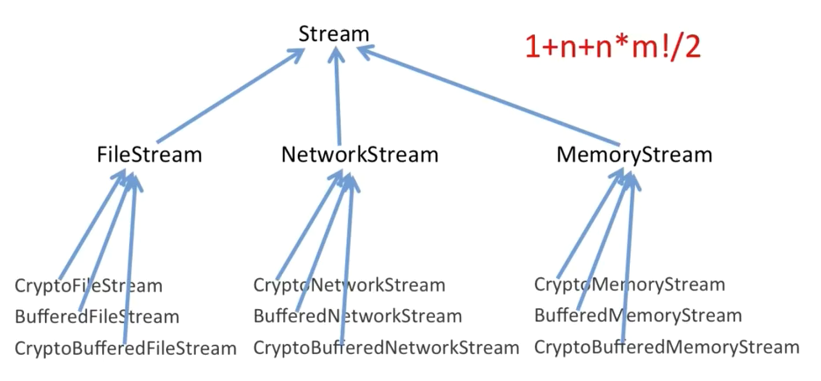
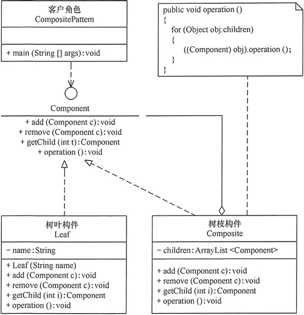

# 结构型模式

结构型模式主要总结了一些类或对象组合在一起的经典结构，以组合优于继承的思想为指导。

[TOC]

代理、桥接、装饰器、适配器，这4种模式是比较常用的结构型设计模式。它们都可以称为Wrapper 模式，也就是通过 Wrapper 类二次封装原始类。它们的代码结构非常相似，但设计意图完全不同：

- **代理模式：**代理模式在不改变原始类接口的条件下，为原始类定义一个代理类，主要目的是控制访问，而非加强功能，这是它跟装饰器模式最大的不同。

- **桥接模式：**桥接模式的目的是将接口部分和实现部分分离，从而让它们可以较为容易、也相对独立地加以改变。

- **装饰器模式：**装饰者模式在不改变原始类接口的情况下，对原始类功能进行增强，并且支持多个装饰器的嵌套使用。

- **适配器模式：**适配器模式是一种事后的补救策略。适配器提供跟原始类不同的接口，而代理模式、装饰器模式提供的都是跟原始类相同的接口。

## 代理模式

**代理模式**（Proxy Design Pattern）在不改变原始类（或叫被代理类）代码的情况下，通过引入代理类来给原始类附加功能。

我们通过一个例子来解释这个概念。在开发性能计数器时，我们设计了 MetricsCollector 类，用来收集接口请求的原始数据，它的使用方式如下：

~~~java
public class UserController {
  //...省略其他属性和方法...
  private MetricsCollector metricsCollector; // 依赖注入

  public UserVo login(String telephone, String password) {
    long startTimestamp = System.currentTimeMillis();

    // ... 省略login逻辑...

    // 实现性能计数器的逻辑
    long endTimeStamp = System.currentTimeMillis();
    long responseTime = endTimeStamp - startTimestamp;
    RequestInfo requestInfo = new RequestInfo("login", responseTime, startTimestamp);
    metricsCollector.recordRequest(requestInfo);

    //...返回UserVo数据...
  }
}

~~~

上面的写法有两个问题：

- 性能计数器框架代码侵入到业务代码中，跟业务代码高度耦合。如果未来需要替换这个框架，那替换的成本会比较大。
- 收集接口请求的代码跟业务代码无关。业务类最好职责更加单一，只聚焦业务处理。

为了将框架代码和业务代码解耦，我们设计代理类UserControllerProxy和原始类UserController实现相同的接口IUserController。UserController类只负责业务功能。代理类UserControllerProxy负责在业务代码执行前后附加其他逻辑代码，并通过委托的方式调用原始类来执行业务代码。

~~~java
public interface IUserController {
  UserVo login(String telephone, String password);
}

public class UserController implements IUserController {
  @Override
  public UserVo login(String telephone, String password) {
	// ...
  }
}

public class UserControllerProxy implements IUserController {
  private UserController userController;

  public UserControllerProxy(UserController userController) {
    this.userController = userController;
  }

  @Override
  public UserVo login(String telephone, String password) {
    //调用前的逻辑
    // 委托
    UserVo userVo = userController.login(telephone, password)
    //调用后的逻辑
    return userVo;
  }
}

IUserController userController = new UserControllerProxy(new UserController());

~~~

但是，如果原始类代码并不是我们开发维护的（比如它来自一个第三方的类库），那么我们也没办法直接修改原始类，给它重新定义一个接口。在这种情况下，我们该如何实现代理模式呢？

对于这种外部类的扩展，我们一般都是采用继承的方式（我更喜欢这种方式）。

~~~java
public class UserControllerProxy extends UserController {
  private MetricsCollector metricsCollector;

  public UserControllerProxy() {
    this.metricsCollector = new MetricsCollector();
  }

  public UserVo login(String telephone, String password) {
    UserVo userVo = super.login(telephone, password);
    return userVo;
  }
}

//UserControllerProxy使用举例
UserController userController = new UserControllerProxy();
~~~

### 动态代理

不过，刚刚的代码实现还是有点问题的：

- 我们需要在代理类中，将原始类中的所有的方法，都重新实现一遍，并且为每个方法都附加相似的代码逻辑。
- 如果要添加的附加功能的类有不止一个，我们需要针对每个类都创建一个代理类。

我们可以使用**动态代理（Dynamic Proxy）**来解决这个问题。我们不事先为每个原始类编写代理类，而是在运行的时候，动态地创建原始类对应的代理类，然后在系统中用代理类替换掉原始类。

在Java的动态代理对象上执行的所有调用，都会被重定向到一个**调用处理器（invocation handler）**上。这个调用处理器的工作就是发现这是什么调用，然后决定如何处理它。

最核心的两段代码

- `Proxy.newProxyInstance`，为目标对象生成代理对象
- `class DynamicProxyHandler implements InvocationHandler`，从中实现代理对象所要增强的功能。

下面我们稍微封装一下上述两段代码

~~~java
public class MetricsCollectorProxy {
    
  // 增强的功能
  private MetricsCollector metricsCollector;
  public MetricsCollectorProxy() {
    this.metricsCollector = new MetricsCollector();
  }

  // 通过这个方法为目标对象附加一些功能
  public Object createProxy(Object proxiedObject) {
      
    // 获取被代理对象的所有直接接口
    Class<?>[] interfaces = proxiedObject.getClass().getInterfaces();
    DynamicProxyHandler handler = new DynamicProxyHandler(proxiedObject);
      
    return Proxy.newProxyInstance(
        proxiedObject.getClass().getClassLoader(), 			// 被代理对象的类加载器
        interfaces, 									 // 代理对象要实现的接口列表
        handler											//  调用处理器，一个实现InvocationHandler接口的对象
    );
  }

  // 调用处理器
  private class DynamicProxyHandler implements InvocationHandler {
    private Object proxiedObject;

    // 接收
    public DynamicProxyHandler(Object proxiedObject) {
      this.proxiedObject = proxiedObject;
    }

    // 关键方法
    @Override
    public Object invoke(Object proxy, Method method, Object[] args) throws Throwable {
       //proxy 代理的对象
       //method 当前调用的方法
       //args 方法参数
      long startTimestamp = System.currentTimeMillis();
        
      //从这里调用原对象的方法
      Object result = method.invoke(proxiedObject, args);
        
      long endTimeStamp = System.currentTimeMillis();
      long responseTime = endTimeStamp - startTimestamp;
      String apiName = proxiedObject.getClass().getName() + ":" + method.getName();
      RequestInfo requestInfo = new RequestInfo(apiName, responseTime, startTimestamp);
      metricsCollector.recordRequest(requestInfo);
      return result;
    }
  }
}

//MetricsCollectorProxy使用举例
MetricsCollectorProxy proxy = new MetricsCollectorProxy();
IUserController userController = (IUserController) proxy.createProxy(new UserController());

~~~

Spring AOP底层的实现原理就是基于动态代理。用户配置好需要给哪些类创建代理，并定义好在执行原始类的业务代码前后执行哪些附加功能。Spring为这些类创建动态代理对象，并在JVM中替代原始类对象。

### 应用场景

代理模式最常用的一个应用场景就是，在业务系统中开发一些非功能性需求，比如：监控、统计、鉴权、限流、事务、幂等、日志、缓存。我们将这些附加功能与业务功能解耦，放到代理类中统一处理，让程序员只需要关注业务方面的开发。

**实际上，RPC框架也可以看作一种代理模式**，GoF的《设计模式》一书中把它称作远程代理。通过远程代理，将网络通信、数据编解码等细节隐藏起来。

## 桥接模式

**桥接模式**，也叫作**桥梁模式**（Bridge Design Pattern）。它是最难理解的、最少应用的设计模式，了解即可。

对于这个模式有两种不同的理解方式:

- **Decouple an abstraction from its implementation so that the two can vary independently**

  **将抽象和实现解耦，让它们可以独立变化**

- **一个类存在两个（或多个）独立变化的维度，我们通过组合的方式，让这两个（或多个）维度可以独立进行扩展。**

也就是组合大于继承

## 装饰器模式

假设我们有一个Stream类，现在我们要支持从File、Network、Memory中获取流，那么我们就会派生出FileStream、NetworkStream、MemoryStream等类。如果我们还要支持缓存、加密的功能，那就要继续派生出BufferedFileStream、CryptoFileStream、CryptoStreamBufferedFile....。并且我们假定加密、缓存的逻辑对于FileStream、NetworkStream、MemoryStream来说都是一样的。

很明显就存在以下两个问题：

- 功能的实现逻辑是一样的，代码冗余
- 如果我们需要附加更多的增强功能，此时组合爆炸，导致类继承结构变得无比复杂

**注意装饰器模式应用的前提：增强功能的逻辑对于所有类来说是相同的。**

针对这个问题，我们可以将继承关系改为组合关系来解决，下面我们看看 Java IO 库中是如何应用装饰器模式的。

~~~java
public abstract class InputStream {
  //...
  public int read(byte b[]) throws IOException {
    return read(b, 0, b.length);
  }
  
  public int read(byte b[], int off, int len) throws IOException {
    //...
  }
  
  public long skip(long n) throws IOException {
    //...
  }

  public int available() throws IOException {
    return 0;
  }
  
  public void close() throws IOException {}

  public synchronized void mark(int readlimit) {}
    
  public synchronized void reset() throws IOException {
    throw new IOException("mark/reset not supported");
  }

  public boolean markSupported() {
    return false;
  }
}

public class BufferedInputStream extends InputStream {
  protected volatile InputStream in;

  protected BufferedInputStream(InputStream in) {
    this.in = in;
  }
  
  //...实现基于缓存的读数据接口...  
}

public class DataInputStream extends InputStream {
  protected volatile InputStream in;

  protected DataInputStream(InputStream in) {
    this.in = in;
  }
  
  //...实现读取基本类型数据的接口
}

~~~

装饰器模式相对于简单的组合关系，有两个差异：

- 装饰器类和原始类继承同样的父类，这样我们可以对原始类“嵌套”多个装饰器类

- 装饰器类是对功能的增强，这也是装饰器模式应用场景的一个重要特点。在代理模式中，代理类附加的是跟原始类无关的功能

  ~~~java
  // 代理模式的代码结构(下面的接口也可以替换成抽象类)
  public interface IA {
    void f();
  }
  
  public class A impelements IA {
    public void f() { //... }
  }
      
  public class AProxy implements IA {
    private IA a;
    public AProxy(IA a) {
      this.a = a;
    }
    
    public void f() {
      // 新添加的代理逻辑
      a.f();
      // 新添加的代理逻辑
    }
  }
  
  // 装饰器模式的代码结构(下面的接口也可以替换成抽象类)
  public interface IA {
    void f();
  }
      
  public class A implements IA {
    public void f() { //... }
  }
      
  public class ADecorator implements IA {
    private IA a;
    public ADecorator(IA a) {
      this.a = a;
    }
    
    public void f() {
      // 功能增强代码
      a.f();
      // 功能增强代码
    }
  }
  ~~~

实际上，BufferedInputStream、DataInputStream继承FilterInputStream的类。为什么BufferedInputStream不直接继承InputStream呢？我们假设它是继承自InputStream，那么代码如下：

~~~java
public class BufferedInputStream extends InputStream {
  protected volatile InputStream in;

  protected BufferedInputStream(InputStream in) {
    this.in = in;
  }
  
  // f()函数不需要增强，只是重新调用一下InputStream in对象的f()
  public void f() {
    in.f();
  }  
}
~~~

问题就在于，即使BufferedInputStream不需要对in的f()方法进行加强，也必须重写f()方法来调用in的f()。如果只有一个增强类还好说。但是还有多个增强类，那么不得不重复写这些模板代码。因此为了避免代码冗余，单独抽象出一个父类，来一次性编写这些模板代码。

~~~java
public class FilterInputStream extends InputStream {
  protected volatile InputStream in;

  protected FilterInputStream(InputStream in) {
    this.in = in;
  }

  public int read() throws IOException {
    return in.read();
  }

  public int read(byte b[]) throws IOException {
    return read(b, 0, b.length);
  }
   
  public int read(byte b[], int off, int len) throws IOException {
    return in.read(b, off, len);
  }

  public long skip(long n) throws IOException {
    return in.skip(n);
  }

  public int available() throws IOException {
    return in.available();
  }

  public void close() throws IOException {
    in.close();
  }

  public synchronized void mark(int readlimit) {
    in.mark(readlimit);
  }

  public synchronized void reset() throws IOException {
    in.reset();
  }

  public boolean markSupported() {
    return in.markSupported();
  }
}

~~~

## 适配器模式

**适配器模式（Adapter Design Pattern）**将不兼容的接口转换为可兼容的接口。两种实现方式有两种：

- **类适配器**：通过继承实现
- **对象适配器**：通过组合实现

~~~java
// Adaptor 将 Adaptee 转化成一组符合 ITarget 接口定义的接口。

// 类适配器: 基于继承
public interface ITarget {
  void f1();
  void f2();
  void fc();
}

public class Adaptee {
  public void fa() { //... }
  public void fb() { //... }
  public void fc() { //... }
}

public class Adaptor extends Adaptee implements ITarget {
  public void f1() {
    super.fa();
  }
  
  public void f2() {
    //...重新实现f2()...
  }
  
  // 这里fc()不需要实现，直接继承自Adaptee，这是跟对象适配器最大的不同点
}

      
      
// 对象适配器：基于组合
public interface ITarget {
  void f1();
  void f2();
  void fc();
}

public class Adaptee {
  public void fa() { //... }
  public void fb() { //... }
  public void fc() { //... }
}

public class Adaptor implements ITarget {
  private Adaptee adaptee;
  
  public Adaptor(Adaptee adaptee) {
    this.adaptee = adaptee;
  }
  
  public void f1() {
    adaptee.fa(); //委托给Adaptee
  }
  
  public void f2() {
    //...重新实现f2()...
  }
  
  public void fc() {
    adaptee.fc();
  }
}
~~~

在实际的开发中，到底该如何选择使用哪一种呢？判断的标准主要有两个：

- Adaptee 接口的个数
- Adaptee和 ITarget 的契合程度

如果 Adaptee 接口并不多，那两种实现方式都可以。如果 Adaptee 接口很多，而且Adaptee和ITarget 接口定义大部分都相同，推荐使用类适配器，否则使用对象适配器。

### 适配器模式的应用场景

- **封装有缺陷的接口设计**：假设我们依赖的外部系统在接口设计方面有缺陷（比如包含大量静态方法），引入之后会影响到我们自身代码的可测试性。为了隔离设计上的缺陷，这个时候就可以使用适配器模式了。

- **统一多个类的接口设计**：某个功能的实现依赖要多个外部系统（或者说类），通过适配器模式，将它们的接口适配为统一的接口定义，然后我们就可以使用多态的特性来复用代码逻辑。

- **替换依赖的外部系统**：当我们把项目中依赖的一个外部系统替换为另一个外部系统的时候，利用适配器模式，可以减少对代码的改动。

- **兼容老版本接口**：在做版本升级的时候，对于一些要废弃的接口，我们不直接删除它，而是将它标注为 deprecated，并将内部实现逻辑委托为新的接口实现。这样做的好处是，让使用它的项目有个过渡期，给修改代码留下一定时间。

- **适配不同格式的数据**

## 门面模式

> Provide a unified interface to a set of interfaces in a subsystem. Facade Pattern defines a higher-level interface that makes the subsystem easier to use.
>
> 门面模式为子系统提供一组统一的接口，定义一组高层接口让子系统更易用。

假设有一个系统 A，提供了 a、b、c、d 四个接口。系统 B 完成某个业务功能，需要调用 A 系统的 a、b、d 接口。利用门面模式，我们提供一个包裹 a、b、d 接口调用的门面接口 x，给系统 B 直接使用。

## 组合模式

> Compose objects into tree structure to represent part-whole hierarchies.Composite lets client treat individual objects and compositions of objects uniformly.
>
> 将一组对象组织（Compose）成树形结构，以表示一种“部分-整体”的层次结构。组合让客户端可以统一单个对象和组合对象的处理逻辑。

这个组合模式更偏向于数据结构和算法的抽象。其中，数据可以表示成树这种数据结构，业务需求可以通过在树上的递归遍历算法来实现。

## 享元模式

享元模式可以复用对象，节省内存。但使用前提是，享元对象是不可变对象。“不可变对象”指的是，一旦通过构造函数初始化完成之后，它的状态就不会再被修改了。

实际上，不仅仅相同对象可以设计成享元，对于相似对象，我们也可以将这些对象中相同的部分（字段）提取出来，设计成享元，让这些大量相似对象引用这些享元。

享元模式对JVM的垃圾回收并不友好。因为享元工厂类一直保存了对享元对象的引用，这就导致享元对象在没有任何代码使用的情况下，也并不会被JVM垃圾回收机制自动回收掉。

享元模式  vs 单例、缓存、对象池

- **跟多例的区别**：应用享元模式是为了对象复用，节省内存，而应用多例模式是为了限制对象的个数。
- **跟缓存的区别**：缓存，主要是为了提高访问效率，而非复用。
- **跟资源池的区别**：池化技术中的“复用”可以理解为“重复使用”，主要目的是节省时间。在任意时刻，每一个对象、连接、线程，并不会被多处使用，而是被一个使用者独占，当使用完成之后，放回到池中，再由其他使用者重复利用。享元模式中的“复用”可以理解为“共享使用”，在整个生命周期中，都是被所有使用者共享的，主要目的是节省空间。

其他包装器类型比如 Long、Short、Byte 等，也都利用了享元模式来缓存 -128 到 127 之间的数据。
