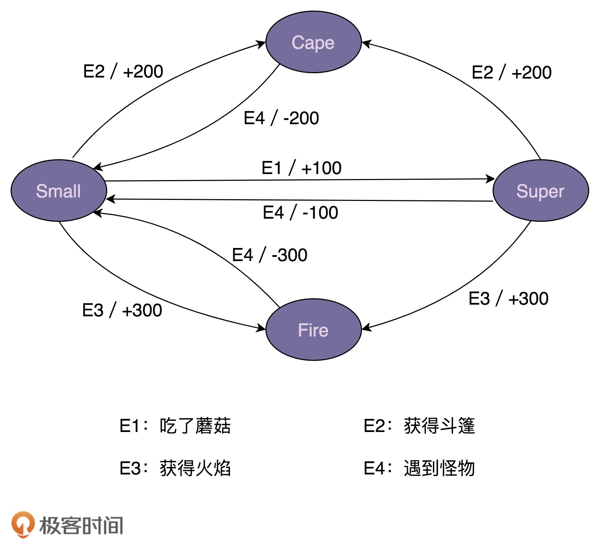
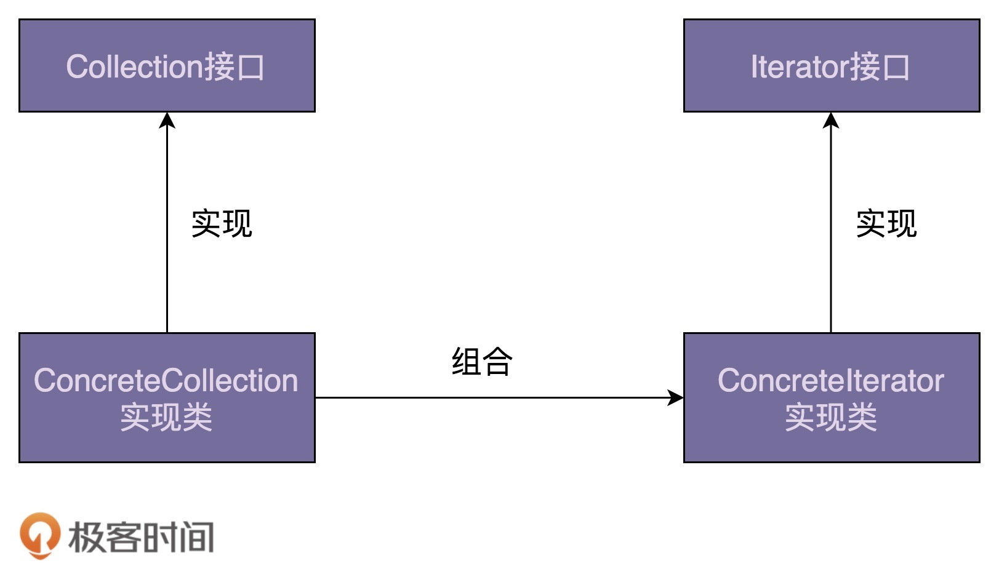
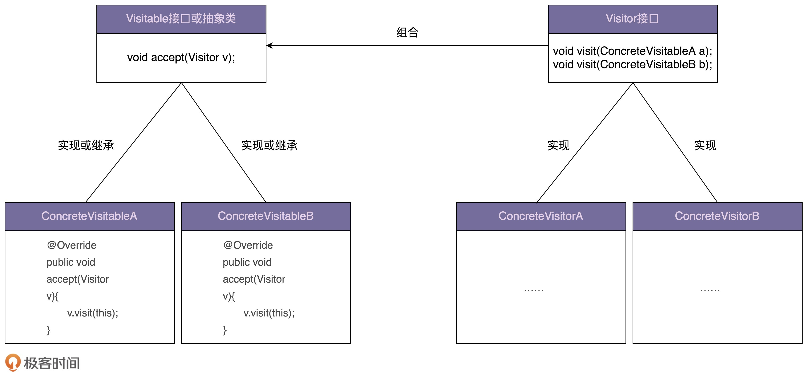
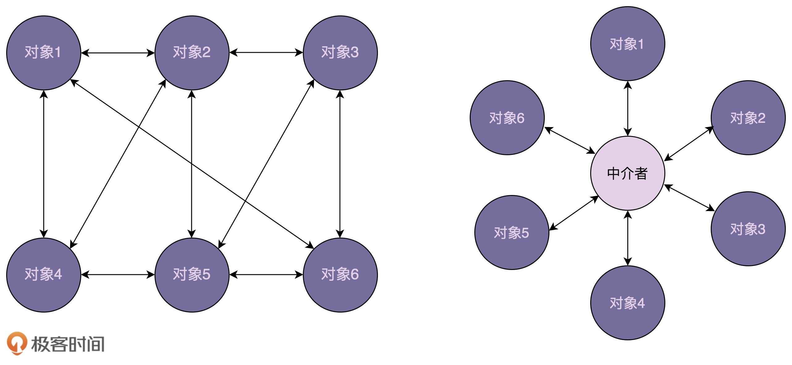

# 行为模式

行为型设计模式主要解决的就是“类或对象之间的交互”问题。

[TOC]

模板模式、策略模式、职责链模式具有相同的作用：复用和扩展。特别是框架开发中，我们可以利用它们来提供框架的扩展点，能够让框架的使用者在不修改框架源码的情况下，基于扩展点定制化框架的功能。

为什么大量框架使用配置文件来提供功能特性？配置文件具有以下两个优势：

- 将修改的逻辑都集中在了一起
- 符合解耦的思想

大量使用配置文件会使代码的内聚性降低，配置起来比较麻烦。为此，基于注解的方式在一些场合下代替配置文件。但是基于注解的方式将修改逻辑分散到各个class文件中，可维护性降低

## 观察者模式

### 原理及应用场景剖析

> Define a one-to-many dependency between objects so that when one object changes state, all its dependents are notified and updated automatically.
>
> 在对象之间定义一个一对多的依赖，当一个对象状态改变的时候，所有依赖的对象都会自动收到通知。

**观察者模式**（Observer Design Pattern）也被称为**发布订阅模式**（Publish-Subscribe Design Pattern）。一般情况下，被依赖的对象叫作**被观察者**（Observable），依赖的对象叫作**观察者**（Observer）。它们还有着其他称谓，例如，Subject-Observer、Publisher-Subscriber、Producer-Consumer、EventEmitter-EventListener、Dispatcher-Listener。

不同的应用场景和需求下，这个模式有截然不同的实现方式。例如，同步阻塞、异步非阻塞、进程内的、进程间的。

我们有更加优雅、更加常用的方式来实现观察者模式，那就是**基于消息队列（Message Queue**）来实现。它不仅仅可以实现进程间的订阅，而且还更加彻底地解耦被观察者和观察者。

## 模板模式

**模板模式（Template Method Design Pattern）**

> Define the skeleton of an algorithm in an operation, deferring some steps to subclasses. Template Method lets subclasses redefine certain steps of an algorithm without changing the algorithm’s structure.
>
> 模板方法模式在一个方法中定义一个算法骨架，并将某些步骤推迟到子类中实现。模板方法模式可以让子类在不改变算法整体结构的情况下，重新定义算法中的某些步骤

这里的「算法」，我们可以理解为「业务逻辑」。

抽象方法、回调函数是模板模式的一种应用。

A 类事先注册某个回调函数 F 到 B 类。在合适的时机，B 类调用这个回调函数，并通过参数暴露自己的一些状态。

Callback 更侧重语法机制的描述，Hook 更加侧重应用场景的描述。还有一种观点认为是这两者的差别在调用时机不同，Callback 在方法中被调用，而 Hook 在方法执行前后被调用。

## 策略模式

> Define a family of algorithms, encapsulate each one, and make them interchangeable. Strategy lets the algorithm vary independently from clients that use it.
>
> 定义一族算法类，将每个算法分别封装起来，让它们可以互相替换。策略模式可以使算法的变化独立于使用它们的客户端（这里的客户端代指使用算法的代码）

**策略模式（Strategy Design Pattern）**解耦的是策略的定义、创建、使用这三部分.

### 定义

策略类的定义包含一个策略接口和一组实现这个接口的策略类。因为所有的策略类都实现相同的接口。因此，客户端代码可以基于接口而非实现编程，从而灵活地替换不同的策略。

~~~java
public interface Strategy {
  void algorithmInterface();
}

public class ConcreteStrategyA implements Strategy {
  @Override
  public void  algorithmInterface() {
    //具体的算法...
  }
}

public class ConcreteStrategyB implements Strategy {
  @Override
  public void  algorithmInterface() {
    //具体的算法...
  }
}
~~~

### 创建

策略模式会包含一组策略，一般在使用的时候，会通过类型（type）来选择性地创建策略类。这是工厂类典型的使用场景：

~~~java
public class StrategyFactory {
  private static final Map<String, Strategy> strategies = new HashMap<>();

  static {
    strategies.put("A", new ConcreteStrategyA());
    strategies.put("B", new ConcreteStrategyB());
  }

  public static Strategy getStrategy(String type) {
    if (type == null || type.isEmpty()) {
      throw new IllegalArgumentException("type should not be empty.");
    }
    return strategies.get(type);
  }
}

~~~

如果策略类是无状态的，那么我们可以使用上述缓存版本的工厂类。如果策略类是有状态的，那么我们就需要按照如下方式来实现策略工厂类。

~~~java
public class StrategyFactory {
  public static Strategy getStrategy(String type) {
    if (type == null || type.isEmpty()) {
      throw new IllegalArgumentException("type should not be empty.");
    }

    if (type.equals("A")) {
      return new ConcreteStrategyA();
    } else if (type.equals("B")) {
      return new ConcreteStrategyB();
    }

    return null;
  }
}

~~~

### 使用

客户端一般在运行时，根据配置文件、用户输入等这些不确定因素，来动态确定使用哪种策略。

~~~java
// 策略接口：EvictionStrategy
// 策略类：LruEvictionStrategy、FifoEvictionStrategy、LfuEvictionStrategy...
// 策略工厂：EvictionStrategyFactory

public class UserCache {
  private Map<String, User> cacheData = new HashMap<>();
  private EvictionStrategy eviction;

  public UserCache(EvictionStrategy eviction) {
    this.eviction = eviction;
  }

  //...
}

// 运行时动态确定，根据配置文件的配置决定使用哪种策略
public class Application {
  public static void main(String[] args) throws Exception {
    EvictionStrategy evictionStrategy = null;
    Properties props = new Properties();
    props.load(new FileInputStream("./config.properties"));
    String type = props.getProperty("eviction_type");
    evictionStrategy = EvictionStrategyFactory.getEvictionStrategy(type);	//动态地选择不同的策略
    UserCache userCache = new UserCache(evictionStrategy);
    //...
  }
}

// 非运行时动态确定，在代码中指定使用哪种策略
public class Application {
  public static void main(String[] args) {
    //...
    EvictionStrategy evictionStrategy = new LruEvictionStrategy();
    UserCache userCache = new UserCache(evictionStrategy);
    //...
  }
}
~~~

在「非运行时动态确定」的场景中，策略模式实际上退化成了“面向对象的多态特性”或“基于接口而非实现编程原则”。

### 如何利用策略模式避免分支判断？

我们先看一个大量使用if-else的例子：

~~~java
public class OrderService {
  public double discount(Order order) {
    double discount = 0.0;
    OrderType type = order.getType();
    if (type.equals(OrderType.NORMAL)) { // 普通订单
      //...省略折扣计算算法代码
    } else if (type.equals(OrderType.GROUPON)) { // 团购订单
      //...省略折扣计算算法代码
    } else if (type.equals(OrderType.PROMOTION)) { // 促销订单
      //...省略折扣计算算法代码
    }
    return discount;
  }
}
~~~

此时我们使用策略模式对上面的代码重构，将不同类型订单的打折策略设计成策略类，并由工厂类来负责创建策略对象。

~~~java
// 策略的定义
public interface DiscountStrategy {
  double calDiscount(Order order);
}
// 省略NormalDiscountStrategy、GrouponDiscountStrategy、PromotionDiscountStrategy类代码...

// 策略的创建
public class DiscountStrategyFactory {
  private static final Map<OrderType, DiscountStrategy> strategies = new HashMap<>();

  static {
    strategies.put(OrderType.NORMAL, new NormalDiscountStrategy());
    strategies.put(OrderType.GROUPON, new GrouponDiscountStrategy());
    strategies.put(OrderType.PROMOTION, new PromotionDiscountStrategy());
  }

  public static DiscountStrategy getDiscountStrategy(OrderType type) {
    return strategies.get(type);
  }
}

// 策略的使用
public class OrderService {
  public double discount(Order order) {
    OrderType type = order.getType();
    DiscountStrategy discountStrategy = DiscountStrategyFactory.getDiscountStrategy(type);
    return discountStrategy.calDiscount(order);
  }
}
~~~

但是，如果业务场景需要每次都创建不同的策略对象（有状态），我们就要用另外一种工厂类的实现方式了。具体的代码如下所示：

~~~java
public class DiscountStrategyFactory {
  public static DiscountStrategy getDiscountStrategy(OrderType type) {
    if (type == null) {
      throw new IllegalArgumentException("Type should not be null.");
    }
    if (type.equals(OrderType.NORMAL)) {
      return new NormalDiscountStrategy();
    } else if (type.equals(OrderType.GROUPON)) {
      return new GrouponDiscountStrategy();
    } else if (type.equals(OrderType.PROMOTION)) {
      return new PromotionDiscountStrategy();
    }
    return null;
  }
}
~~~

### 与工厂模式的区别

我们发现策略模式与工厂模式十分相似。它们的区别在于，策略模式侧重“策略”或“算法”这个特定的应用场景，用来解决根据运行时状态从一组策略中选择不同策略的问题，而工厂模式侧重封装对象的创建过程，这里的对象没有任何业务场景的限定，可以是策略，但也可以是其他东西。从设计意图上来，这两个模式完全是两回事儿。

## 职责链模式

**职责链模式（Chain Of Responsibility Design Pattern）**

> Avoid coupling the sender of a request to its receiver by giving more than one object a chance to handle the request. Chain the receiving objects and pass the request along the chain until an object handles it.
>
> 将请求的发送和接收解耦，让多个接收对象都有机会处理这个请求。将这些接收对象串成一条链，并沿着这条链传递这个请求，直到链上的某个接收对象能够处理它为止。

在职责链模式中，多个处理器依次处理同一个请求。一个请求先经过 A 处理器处理，然后再把请求传递给 B 处理器，B 处理器处理完后再传递给 C 处理器，以此类推，形成一个链条。当然，你也可以决定不继续传播。链条上的每个处理器各自承担各自的处理职责，所以叫作职责链模式。

## 状态模式

状态模式一般用来实现有限状态机，此外，有限状态机还可以用分支逻辑法、查表法来实现。

### 什么是有限状态机？

有限状态机（Finite State Machine）由3个组成部分：

- **状态（State）**
- **事件（Event）**，也称为转移条件（Transition Condition）
- **动作（Action）**：在发生转移时，要执行的行为

### 实现一：分支逻辑法

我们在内部维护一个状态，将转移条件抽象方法，在方法中先根据状态执行不同的动作，然后更新状态。调用者通过这些抽象出来的方法，来驱动有限状态机的运行。

~~~java
private State currentState;

public void obtainCape() {
    if (currentState.equals(State.SMALL) || currentState.equals(State.SUPER) ) {
        this.currentState = State.CAPE;
        this.score += 200;
    }
}
~~~

这种实现方式，充斥着大量的 if-else 或者 switch-case 分支判断逻辑，可读性和可维护性都很差。

### 实现二：查表法

状态机除了用状态转移图来表示之外，还可以用二维表来表示

维护两张表：

~~~java
// 状态转移表
// 行表示了当前处于的状态，列表示触发的行为
private static final State[][] transitionTable = {
    {SUPER, 	CAPE, 	FIRE, 	/},
    {/, 		CAPE, 	FIRE, 	SMALL},
    {/, 		/, 		/, 		SMALL},
    {/, 		/, 		/. 		SMALL}
};

// 动作表
private static final int[][] actionTable = {
    {+100, +200, 	+300, 	+0},
    {+0, 	+200, 	+300, 	-100},
    {+0, 	+0, 	+0, 	-200},
    {+0, 	+0, 	+0, 	-300}
};
~~~

事件触发逻辑如下；

~~~java

public void obtainFireFlower() {
    executeEvent(Event.GOT_FIRE);
}

private void executeEvent(Event event) {
    int stateValue = currentState.getValue();		//获取当前状态对应的枚举值

    int eventValue = event.getValue();			    //获取事件对应的枚举值
    this.currentState = transitionTable[stateValue][eventValue];
    this.score += actionTable[stateValue][eventValue];
}
~~~

相对于分支逻辑的实现方式，查表法的代码实现更加清晰，可读性和可维护性更好。当修改状态机时，我们只需要修改 transitionTable 和 actionTable 两个二维数组即可。

如果们把这两个二维数组存储在配置文件中，那么只需维护配置文件即可，不用修改代码。

### 实现三：状态模式

当事件触发的动作比较复杂时（写数据库、发送消息通知等等），查表法就不再适用了。

状态模式通过将事件触发的状态转移和动作执行，拆分到不同的状态类中，来避免分支判断逻辑。

~~~java
public class MarioStateMachine {
  private IMario currentState; // 不再使用枚举来表示状态

  public MarioStateMachine() {
    this.currentState = new SmallMario(this);
  }

  public void obtainMushRoom() {
    this.currentState.obtainMushRoom();
  }

  public void obtainCape() {
    this.currentState.obtainCape();
  }

  public void setCurrentState(IMario currentState) {
    this.currentState = currentState;
  }
}
~~~

~~~java
// 所有状态类的接口
public interface IMario { 
  State getName();
  //以下是定义的事件
  void obtainMushRoom();
  void obtainCape();
  void obtainFireFlower();
  void meetMonster();
}

// 依赖注入一个状态机，当触发事件时，修改该状态吗，并执行一些动作
public class SmallMario implements IMario {
  private MarioStateMachine stateMachine;

  public SmallMario(MarioStateMachine stateMachine) {
    this.stateMachine = stateMachine;
  }

  @Override
  public State getName() {
    return State.SMALL;
  }

  @Override
  public void obtainMushRoom() {
    stateMachine.setCurrentState(new SuperMario(stateMachine));
    stateMachine.setScore(stateMachine.getScore() + 100);
  }
   // ...
}

public class SuperMario implements IMario {
  private MarioStateMachine stateMachine;

  public SuperMario(MarioStateMachine stateMachine) {
    this.stateMachine = stateMachine;
  }

  @Override
  public State getName() {
    return State.SUPER;
  }

  @Override
  public void obtainMushRoom() {
    // do nothing...
  }

  @Override
  public void obtainCape() {
    stateMachine.setCurrentState(new CapeMario(stateMachine));
    stateMachine.setScore(stateMachine.getScore() + 200);
  }
}
~~~

我们可以把状态类设计成单例，避免状态切换时反复的创建和销毁。

~~~java
@Override
public void obtainMushRoom(MarioStateMachine stateMachine) {
    stateMachine.setCurrentState(SuperMario.getInstance());
    stateMachine.setScore(stateMachine.getScore() + 100);
}
~~~

## 迭代器模式

**迭代器模式（Iterator Design Pattern）**，也叫作**游标模式（Cursor Design Pattern）**。它把遍历操作从集合类中抽离出来，放到迭代器类中，让两者的职责更加单一。迭代器和集合类的关系如下图所示

## 访问者模式

访问者模式难以理解，很少被应用，因此了解即可。

> Allows for one or more operation to be applied to a set of objects at runtime, decoupling the operations from the object structure.
>
> 允许一个或者多个操作应用到一组对象上，解耦操作和对象本身。

它本质上是用 Single Dispatch 来模拟 Double Dispatch 的

现在我们有一个需求，设计一个工具，将 PDF、PPT、Word 文件中的内容抽取出来放在 txt 文件中。这个工具的简易实现如下：

~~~java
public abstract class ResourceFile {
  public abstract void extract2txt();
}

public class PPTFile extends ResourceFile {
  @Override
  public void extract2txt() {
    // TODO
  }
}

public class PdfFile extends ResourceFile {
  @Override
  public void extract2txt() {
    // TODO
  }
}
~~~

如果工具的功能不停地扩展，还要求支持压缩、提取文件元信息、构建索引等一系列的功能。此时，我们继续按照上面的实现思路，就会存在这样几个问题：

- 违背开闭原则，添加一个新的功能，所有类的代码都要修改；
- 功能增多，每个类的代码都不断膨胀，可读性和可维护性都变差了；
- 把所有比较上层的业务逻辑都耦合到 PdfFile、PPTFile、WordFile 类中，导致这些类的职责不够单一；

针对上面的问题，我们把业务操作跟具体的数据结构解耦，设计成独立的类。

~~~java
public abstract class ResourceFile {

}

public class PdfFile extends ResourceFile {

}

//...PPTFile、WordFile代码省略...
public class Extractor {
  public void extract2txt(PPTFile pptFile) {
    // TODO
  }

  public void extract2txt(PdfFile pdfFile) {
    // TODO
  }

  public void extract2txt(WordFile wordFile) {
    // TODO
  }
}

public class ToolApplication {
  public static void main(String[] args) {
    Extractor extractor = new Extractor();
    for (ResourceFile resourceFile : resourceFiles) {
      extractor.extract2txt(resourceFile);
    }
  }
}
~~~

我们把抽取文本内容的操作，设计成了三个重载函数。遗憾的是，这种实现方式会编译报错。在Java中，函数重载是一种静态绑定，在编译时并不能获取对象的实际类型。这是因为Java只支持单分派。所谓的**单分派（Single Dispatch）**就是：执行「哪个对象」的方法，根据对象的运行时类型来决定；执行对象的「哪个方法」，根据**方法参数的编译时类型**来决定。而**双分派（Double Dispatch）**的含义：执行「哪个对象」的方法，根据对象的运行时类型来决定；执行对象的「哪个方法」，根据**方法参数的运行时类型**来决定。Single Dispatch 和 Double Dispatch 跟多态和函数重载直接相关。当前主流的面向对象编程语言（比如，Java、C++、C#）都只支持 Single Dispatch。

**如果Java支持双分派模式，那么就不用实现接下来的访问者模式了。**

~~~java
public abstract class ResourceFile {
  abstract public void accept(Extractor extractor);
}

public class PdfFile extends ResourceFile {
  @Override
  public void accept(Extractor extractor) {
    extractor.extract2txt(this);
  }

  //...
}

//...PPTFile、WordFile跟PdfFile类似，这里就省略了...
//...Extractor代码不变...

public class ToolApplication {
  public static void main(String[] args) {
    Extractor extractor = new Extractor();
    for (ResourceFile resourceFile : resourceFiles) {
      resourceFile.accept(extractor);
    }
  }
}
~~~

在执行`resourceFile.accept(extractor);`时，程序根据多态特性，会调用实际类型的`accept()`方法。以`PdfFile`的`accept`方法为例，执行`extractor.extract2txt(this)`时，`this`的类型在编译期时就确定下来，之后就会调用`extractor`的`extract2txt(PdfFile pdfFile)`这个重载函数。是不是很有技巧性，但还没结束😥。

上面代码还存在一些问题，如果要添加一个新的业务，还是需要修改 `ResourceFile` 接口中的方法，以及各自 XXXFile 实现这些方法，扩展逻辑比较分散，违反开闭原则。针对这个问题，我们抽象出来一个 Visitor 接口，它包含三个方法，分别处理三种不同类型的资源文件。

~~~java
public abstract class ResourceFile {
  abstract public void accept(Visitor vistor);
}

public class PdfFile extends ResourceFile {
  @Override
  public void accept(Visitor visitor) {
    visitor.visit(this);
  }
}

public interface Visitor {
  void visit(PdfFile pdfFile);
  void visit(PPTFile pdfFile);
  void visit(WordFile pdfFile);
}

public class Extractor implements Visitor {
  @Override
  public void visit(PPTFile pptFile) {
    // TODO
  }

  @Override
  public void visit(PdfFile pdfFile) {
    // TODO
  }

  @Override
  public void visit(WordFile wordFile) {
    // TODO
  }
}

public class Compressor implements Visitor {
  @Override
  public void visit(PPTFile pptFile) {
    // TODO
  }

  @Override
  public void visit(PdfFile pdfFile) {
    // TODO
  }

  @Override
  public void visit(WordFile wordFile) {
    // TODO
  }

}

public class ToolApplication {
  public static void main(String[] args) {
    Extractor extractor = new Extractor();
    for (ResourceFile resourceFile : resourceFiles) {
      resourceFile.accept(extractor);		//对象接受这个操作
    }

    Compressor compressor = new Compressor();
    for(ResourceFile resourceFile : resourceFiles) {
      resourceFile.accept(compressor);
    }
  }

}

~~~

这样，当我们新添加一个业务功能的时候，资源文件类不需要做任何修改。

一般来说，访问者模式针对的是一组类型不同的对象（PdfFile、PPTFile、WordFile）。我们需要对这组对象进行一系列不相关的业务操作（抽取文本、压缩等），但为了避免不断添加功能导致类（PdfFile、PPTFile、WordFile）不断膨胀，职责越来越不单一，以及避免频繁地添加功能导致的频繁代码修改，我们使用访问者模式，将对象与操作解耦，将这些业务操作抽离出来，定义在独立细分的访问者类（Extractor、Compressor）中。

实际上，上述的例子我们还有其他的实现方法，例如策略模式（一开始我就想到这种方法了 🤭）。
~~~Java
public abstract class ResourceFile {
  public abstract ResourceFileType getType();
}

public class PdfFile extends ResourceFile {
  @Override
  public ResourceFileType getType() {
    return ResourceFileType.PDF;
  }
}

//将 extract 逻辑抽离到 Extractor 接口中
public interface Extractor {
  void extract2txt(ResourceFile resourceFile);
}

public class PdfExtractor implements Extractor {
  @Override
  public void extract2txt(ResourceFile resourceFile) {
    //...
  }
}

public class ExtractorFactory {
  private static final Map<ResourceFileType, Extractor> extractors = new HashMap<>();
  static {
    extractors.put(ResourceFileType.PDF, new PdfExtractor());
    extractors.put(ResourceFileType.PPT, new PPTExtractor());
    extractors.put(ResourceFileType.WORD, new WordExtractor());
  }

  public static Extractor getExtractor(ResourceFileType type) {
    return extractors.get(type);
  }
}

public class ToolApplication {
  public static void main(String[] args) {
    for (ResourceFile resourceFile : resourceFiles) {
      //根据资源的类型，创建对应的执行逻辑
      Extractor extractor = ExtractorFactory.getExtractor(resourceFile.getType());
      //执行
      extractor.extract2txt(resourceFile);
    }
  }
}
~~~

代码结构相比访问者模式更加简洁、易懂。唯一的缺点就是，当功能增多时，所要创建的类要比访问者模式多。

## 备忘录模式

**备忘录模式（Memento Design Pattern）**，又称为**快照（Snapshot）**模式。

>Captures and externalizes an object’s internal state so that it can be restored later, all without violating encapsulation.
>
>在不违背封装原则的前提下，捕获一个对象的内部状态，并在该对象之外保存这个状态，以便之后恢复对象为先前的状态。

我们要回答以下两个问题：

- 为什么存储和恢复副本会违背封装原则？
- 备忘录模式是如何做到不违背封装原则的？

现在我们要实现这个需求：编写一个小程序，可以接收命令行的输入。用户输入文本时，程序将其追加存储在内存文本中；用户输入“:list”，程序在命令行中输出内存文本的内容；用户输入“:undo”，程序会撤销上一次输入的文本，也就是从内存文本中将上次输入的文本删除掉。

~~~
>hello
>:list
hello
>world
>:list
helloworld
>:undo
>:list
hello
~~~

一个简单的实现如下：

~~~java

public class InputText {
  private StringBuilder text = new StringBuilder();

  public String getText() {
    return text.toString();
  }

  public void append(String input) {
    text.append(input);
  }

  public void setText(String text) {
    this.text.replace(0, this.text.length(), text);
  }
}

// 通过栈来保存历史输入
public class SnapshotHolder {
  private Stack<InputText> snapshots = new Stack<>();

  public InputText popSnapshot() {
    return snapshots.pop();
  }

  public void pushSnapshot(InputText inputText) {
      InputText deepClonedInputText = new InputText();
      deepClonedInputText.setText(inputText.getText());		//深复制
      snapshots.push(deepClonedInputText);
  }
}

public class ApplicationMain {
  public static void main(String[] args) {
    InputText inputText = new InputText();		//表示内存文本
    SnapshotHolder snapshotsHolder = new SnapshotHolder();
    Scanner scanner = new Scanner(System.in);
    while (scanner.hasNext()) {
      String input = scanner.next();
      if (input.equals(":list")) {
        //打印内存文本
        System.out.println(inputText.getText());		
      } else if (input.equals(":undo")) {
        //从栈中弹出一个内存文本
        InputText snapshot = snapshotsHolder.popSnapshot();
        // 从内存文本中将上次输入的文本删除掉
        inputText.setText(snapshot.getText());
      } else {
        //将这个内存文本压入栈中
        //栈是支持深复制的
        snapshotsHolder.pushSnapshot(inputText);
        inputText.append(input);
      }
    }
  }
}

~~~

上面的代码有以下两个问题：

- 违背了封装原则。为了能用快照恢复InputText对象，我们在InputText类中定义了setText()函数，语义很宽泛。这可能会被其他业务使用。
- 理论上讲，快照本身是不可变的。但是“快照“这个业务模型复用了 InputText 类的定义，而 InputText 类本身有修改内部状态的函数。

对此，我们做一下修改：

~~~java
public class InputText {
  private StringBuilder text = new StringBuilder();

  public String getText() {
    return text.toString();
  }

  public void append(String input) {
    text.append(input);
  }

  public Snapshot createSnapshot() {
    return new Snapshot(text.toString());
  }

  //在InputText类中，我们把setText()方法重命名为restoreSnapshot()方法，用意更加明确，只用来恢复对象。
  public void restoreSnapshot(Snapshot snapshot) {
    this.text.replace(0, this.text.length(), snapshot.getText());
  }
}

// 定义一个独立的类（Snapshot类）来表示快照，而不是复用 InputText 类。
public class Snapshot {
  private String text;

  public Snapshot(String text) {
    this.text = text;
  }

  public String getText() {
    return this.text;
  }
}

public class SnapshotHolder {
  private Stack<Snapshot> snapshots = new Stack<>();

  public Snapshot popSnapshot() {
    return snapshots.pop();
  }

  public void pushSnapshot(Snapshot snapshot) {
    snapshots.push(snapshot);
  }
}

public class ApplicationMain {
  public static void main(String[] args) {
    InputText inputText = new InputText();
    SnapshotHolder snapshotsHolder = new SnapshotHolder();
    Scanner scanner = new Scanner(System.in);
    while (scanner.hasNext()) {
      String input = scanner.next();
      if (input.equals(":list")) {
        System.out.println(inputText.toString());
      } else if (input.equals(":undo")) {
        Snapshot snapshot = snapshotsHolder.popSnapshot();
        inputText.restoreSnapshot(snapshot);
      } else {
        snapshotsHolder.pushSnapshot(inputText.createSnapshot());
        inputText.append(input);
      }
    }
  }
}

~~~

上面的代码实现就是典型的备忘录模式的代码实现。核心思路就是将快照单独抽象出一个类，将实际操作对象与对象过去的状态进行解耦。

总结：

- 将对象的某一时刻的状态抽象为一个状态类（快照）
- 使用栈来实现备忘录的功能
- 栈持有状态类，而不是对象被本身

下面我们考虑一下快照的性能问题。如果快照占用的内存比较大，那么备份和恢复的耗时会比较长。不同的应用场景下有不同的解决方法。

- **全量备份**
- **增量备份**

拿上一个例子来说，它仅仅支持顺序撤销，那么我们在快照中记录文本长度，然后结合 InputText 类对象存储的文本来做撤销操作，这就是一个增量备份。

## 命令模式

**命令模式（Command Design Pattern）**

>The command pattern encapsulates a request as an object, thereby letting us parameterize other objects with different requests, queue or log requests, and support undoable operations.
>
>命令模式将请求封装为一个对象，这样可以使用不同的请求参数化其他对象（将不同请求依赖注入到其他对象），并且能够支持请求（命令）的排队执行、记录日志、撤销等（附加控制）功能。

**核心思想就是操作数据化，方便对控制操作的执行**。比如，异步、延迟、排队执行命令、撤销重做命令、存储命令等等。

C/C++语言支持函数指针，所以很方便地将函数表示为数据。但是像 Java 这种语言，只能将函数封装成对象，实现对函数的数据化。现代 Java 可以将函数表达成 Lambda 来方便做到这一点。Go、Dart 语言函数是一等成员，可以定义函数类型的变量。

## 解释器模式

**解释器模式（Interpreter Design Pattern）**

> Interpreter pattern is used to defines a grammatical representation for a language and provides an interpreter to deal with this grammar.
>
> 解释器模式为某个语言定义它的语法（或者叫文法）表示，并定义一个解释器用来处理这个语法。

这里的「语言」是指信息的载体，而「语法」是用来解读语言的一套规则。而「解释器」是根据语法，获取语言所要表达的信息。

## 中介模式

**中介模式（Mediator Design Pattern）**

> Mediator pattern defines a separate (mediator) object that encapsulates the interaction between a set of objects and the objects delegate their interaction to a mediator object instead of interacting with each other directly.
>
> 中介模式定义了一个单独的（中介）对象，来封装一组对象之间的交互。将这组对象之间的交互委派给与中介对象交互，来避免对象之间的直接交互。

中介模式的核心思想，**是通过引入中间层**，将一组对象之间的交互关系（或者说依赖关系）从多对多（网状关系）转换为一对多（星状关系）。

我们以UI控件为例子，来讲解中介模式。

~~~java
public class UIControl {
  private static final String LOGIN_BTN_ID = "login_btn";
  private static final String REG_BTN_ID = "reg_btn";
  private static final String USERNAME_INPUT_ID = "username_input";
  private static final String PASSWORD_INPUT_ID = "pswd_input";
  private static final String REPEATED_PASSWORD_INPUT_ID = "repeated_pswd_input";
  private static final String HINT_TEXT_ID = "hint_text";
  private static final String SELECTION_ID = "selection";

  public static void main(String[] args) {
    Button loginButton = (Button)findViewById(LOGIN_BTN_ID);
    Button regButton = (Button)findViewById(REG_BTN_ID);
    Input usernameInput = (Input)findViewById(USERNAME_INPUT_ID);
    Input passwordInput = (Input)findViewById(PASSWORD_INPUT_ID);
    Input repeatedPswdInput = (Input)findViewById(REPEATED_PASSWORD_INPUT_ID);
    Text hintText = (Text)findViewById(HINT_TEXT_ID);
    Selection selection = (Selection)findViewById(SELECTION_ID);
	
    // 下面就是问题所在了
    loginButton.setOnClickListener(new OnClickListener() {
      @Override
      public void onClick(View v) {
        String username = usernameInput.text();
        String password = passwordInput.text();
        //校验数据...
        //做业务处理...
      }
    });

    regButton.setOnClickListener(new OnClickListener() {
      @Override
      public void onClick(View v) {
      //获取usernameInput、passwordInput、repeatedPswdInput数据...
      //校验数据...
      //做业务处理...
      }
    });

    //...省略selection下拉选择框相关代码....
  }
}
~~~

在这种实现方式中，控件和控件之间互相操作、互相依赖。我们再按照中介模式，将上面的代码重新实现一下。

~~~java
public interface Mediator {
  void handleEvent(Component component, String event);
}

public class LandingPageDialog implements Mediator {
  private Button loginButton;
  private Button regButton;
  private Selection selection;
  private Input usernameInput;
  private Input passwordInput;
  private Input repeatedPswdInput;
  private Text hintText;

  @Override
  public void handleEvent(Component component, String event) {
    //这里可以使用工厂类来代替
    if (component.equals(loginButton)) {
      String username = usernameInput.text();
      String password = passwordInput.text();
      //校验数据...
      //做业务处理...
    } else if (component.equals(regButton)) {
      //获取usernameInput、passwordInput、repeatedPswdInput数据...
      //校验数据...
      //做业务处理...
    } else if (component.equals(selection)) {
      String selectedItem = selection.select();
      if (selectedItem.equals("login")) {
        usernameInput.show();
        passwordInput.show();
        repeatedPswdInput.hide();
        hintText.hide();
        //...省略其他代码
      } else if (selectedItem.equals("register")) {
        //....
      }
    }
  }
}

public class UIControl {
  private static final String LOGIN_BTN_ID = "login_btn";
  private static final String REG_BTN_ID = "reg_btn";
  private static final String USERNAME_INPUT_ID = "username_input";
  private static final String PASSWORD_INPUT_ID = "pswd_input";
  private static final String REPEATED_PASSWORD_INPUT_ID = "repeated_pswd_input";
  private static final String HINT_TEXT_ID = "hint_text";
  private static final String SELECTION_ID = "selection";

  public static void main(String[] args) {
    Button loginButton = (Button)findViewById(LOGIN_BTN_ID);
    Button regButton = (Button)findViewById(REG_BTN_ID);
    Input usernameInput = (Input)findViewById(USERNAME_INPUT_ID);
    Input passwordInput = (Input)findViewById(PASSWORD_INPUT_ID);
    Input repeatedPswdInput = (Input)findViewById(REPEATED_PASSWORD_INPUT_ID);
    Text hintText = (Text)findViewById(HINT_TEXT_ID);
    Selection selection = (Selection)findViewById(SELECTION_ID);

    //中介类
    Mediator dialog = new LandingPageDialog();
    dialog.setLoginButton(loginButton);
    dialog.setRegButton(regButton);
    dialog.setUsernameInput(usernameInput);
    dialog.setPasswordInput(passwordInput);
    dialog.setRepeatedPswdInput(repeatedPswdInput);
    dialog.setHintText(hintText);
    dialog.setSelection(selection);

    loginButton.setOnClickListener(new OnClickListener() {
      @Override
      public void onClick(View v) {
        //将实现逻辑转移到中介类中
        dialog.handleEvent(loginButton, "click");
      }
    });

    regButton.setOnClickListener(new OnClickListener() {
      @Override
      public void onClick(View v) {
        dialog.handleEvent(regButton, "click");
      }
    });

    //....
  }
}

~~~

在使用中介模式的时候，我们要根据实际的情况，平衡对象之间交互的复杂度和中介类本身的复杂度。避免中介类变成大而复杂的**“上帝类”（God Class）**。

中介模式与观察者模式是相似的，但观察者模式往往处理一对多的关系，而中介模式可以处理多对多的关系。

