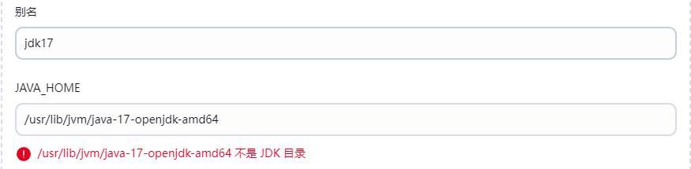

# Jenkins

[TOC]


Jenkins 是一个 CI/CD工具，它的作用主要包括自动化构建、测试和部署软件项目，并且支持分布式构建与测试。

## 安装

在 Docker 中部署 Jenkins

~~~shell
mkdir -p /usr/docker/jenkins_data && chown -R  1000:1000 /usr/docker/jenkins_data

docker run -d -p 8082:8080 -p 50000:50000 \
-v  /usr/docker/jenkins_data:/var/jenkins_home \
-v /etc/localtime:/etc/localtime \
-v /usr/bin/docker:/usr/bin/docker  \ 
-v /var/run/docker.sock:/var/run/docker.sock \
# 通过 mvn -v 来查看 maven 的 bin路径
-v /usr/lib/jvm/java-11-openjdk-amd64:/usr/local/java \
-v /usr/share/maven:/usr/local/maven \
--dns=8.8.8.8 \
--name myjenkins jenkins/jenkins:latest
~~~

注意，容器中 jenkins user 的 uid 为1000，我们要保证本地数据卷的权限与之匹配：

~~~shell
sudo chown -R 1000:1000 /usr/docker/jenkins_data
~~~

在 Manage Jenkins -> Tools 下配置 JDK 、 Maven 环境变量、Git，之前我们将本地的 JDK 挂载到 `/usr/local/java` 了，这里我们仅需填入这个路径即可。 Maven 同理。对于 Git，我们在容器中执行 `which git` 来获取 Git 的可执行路径。


使用容器部署看似方便，但是做大量配置时就捉襟见肘了，而且许多命令使用不了。所以，我们再介绍通过 apt 来安装 Jenkins：

> 下面链接有可能过时，请到官网上获取最新链接
>
> 如果更换了清华下载源，那么就直接执行 apt，不用执行前三步

1. 导入 Jenkins 存储库的 GPG 密钥：

   ~~~
   $ sudo wget -O /usr/share/keyrings/jenkins-keyring.asc \
       https://pkg.jenkins.io/debian/jenkins.io-2023.key

2. 将 Jenkins 存储库添加到 APT 源列表中：

   ~~~shell
   echo "deb [signed-by=/usr/share/keyrings/jenkins-keyring.asc]" \
       https://pkg.jenkins.io/debian binary/ | sudo tee \
       /etc/apt/sources.list.d/jenkins.list > /dev/null
   ~~~

3. 更新 APT 源

   ~~~shell
   apt-get update
   ~~~

4. 安装

   ~~~shell
   apt-get install fontconfig openjdk-17-jre
   apt-get install jenkins
   ~~~

启动 Jenkins 服务：`systemctl start jenkins`。它的 service 文件在  `/lib/systemd/system/jenkins.service`，将端口修改为 8888，否则将导致 Gitlab 502。修改完成后，使用 `systemctl daemon-reload` 来重新加载配置。

在`systemctl start jenkins`时，可能报`Job for jenkins.service failed because a timeout was exceeded.`错误，此时我们修改  `UpdateCenter.xml`文件即可：

~~~shell
$ sudo find / -name *.UpdateCenter.xml
$ sudo vim /var/lib/jenkins/hudson.model.UpdateCenter.xml
 
# 修改后
<?xml version='1.1' encoding='UTF-8'?>
<sites>
  <site>
    <id>default</id>   <url>https://mirrors.tuna.tsinghua.edu.cn/jenkins/updates/update-center.json</url>
  </site>
</sites>
~~~


访问 `http://localhost:port`，并安装推荐插件（一定记得修改容器的 DNS）。如果插件下载失败，就先跳过该步骤，然后进入「插件管理」来手动安装插件。按照如下命令来获取初始密码：

~~~shell
docker exec -it myjenkins bash
cat /var/jenkins_home/secrets/initialAdminPassword
~~~


安装两个插件 `Role-based Authorization Strategy`、`Authorize Project`，然后在 Manage Jenkins -> Security -> 授权策略中使用 Role-Based Strategy。然后在 Manage Jenkins -> Manage and Assign Roles 中设置权限。然后在 Assign Roles 中给角色分配这些权限。

其中 Global Roles 赋予角色基本操作的权力，而 Item Role 赋予角色与项目相关（支持通配符等）的权力。Agent Role 赋予角色与节点相关的权力。


凭据可用来存储的数据库密码、Gitlab 密码信息、Docker 私有仓库密码等，以便和这些第三方的应用进行交互。


下面我们配置 Jenkins 的构建环境，在 Mangage Jenkins -> Gloal Toole Config 下配置 JDK、Git、Maven。




然后在 Confiure System 中配置 Jenkins 环境变量，即在 Jenkins 构建过程中可以使用的预定义变量。**在 pipeline 执行时，Jenkins 通过一个名为 env 的全局变量，将 Jenkins 环境变量暴露出来**


## Jenkins 构建 

Jenkins 中自动构建项目的类型有很多，常用的有以下三种：

- 自由风格软件项目（FreeStyle Project）：支持非 Maven 项目的构建
- Maven 项目（Maven Project）
- 流水线项目（Pipeline Project）

### 自由风格

在 Item 里的 Configure 中的 Build Steps，编写「构建阶段」的动作，这里我们的动作为执行 shell。如果有任意一条命令返回错误码，那么就构建失败。


构建成功后，可以在 `/var/lib/jenkins/workspace/${item}` 下见到打包好的 War 包。


同样，我们也可以在源码管理中，配置 Git 仓库。这样当构建时，就会从仓库中拉取源码进行编译。


### 流水线

Jenkins Pipeline 是一套插件，将持续交付的实现集成到 Jenkins 中。Pipeline 语法是基于 Groovy 语言的，支持「声明式」和「脚本式」语法。


声明式的例子：

~~~groovy
pipeline {
    agent any # 配置环境

    stages {
        stage('Hello') {
            steps {
                echo 'Hello World'
            }
        }
    }
}
~~~

脚本式的例子：

~~~groovy
node {
    def mvnHome
    stage('Preparation') { // for display purposes
        git 'https://github.com/jglick/simple-maven-project-with-tests.git'
        mvnHome = tool 'M3'
    }
    stage('Build') {
        withEnv(["MVN_HOME=$mvnHome"]) {
            if (isUnix()) {
                sh '"$MVN_HOME/bin/mvn" -Dmaven.test.failure.ignore clean package'
            } else {
                bat(/"%MVN_HOME%\bin\mvn" -Dmaven.test.failure.ignore clean package/)
            }
        }
    }
    stage('Results') {
        junit '**/target/surefire-reports/TEST-*.xml'
        archiveArtifacts 'target/*.jar'
    }
}
~~~

推荐使用在 Item 页面中的「流水线语法」工具，来根据参数快速生成 Pipeline 语句。


如何创建 Jenkins Pipeline ？

- 在项目的源代码控制库中，添加名为 `Jenkinsfile` 的文件。然后为 Item 指定流水线时，选择 Pipeline script from SCM
- 以直接在 Jenkins 的 Web UI 界面中输入脚本

### 触发器

Jenkins 内置 4 种构建触发器：

- 远程构建：为流水线定义一个 TOKEN_NAME，然后访问 `JENKINS_URL/job/${ITEM_URL}/build?token=TOKEN_NAME`来触发构建，可以在查询参数`cause`中说明触发的原因
- Build after other projects are build
- Build periodically
- Poll SCM

下面介绍通过 Git Hook 来触发构建：

1. 首先安装 `Gitlab`插件

2. 在流水线中设置自动构建

   

3. 在 GitLab 中做如下配置：Admin Area -> Settings -> Network

   

4. 给 Project 设置 webhook：项目->Settings->Integrations

   

   

### 参数化构建

可以在 Jenkins Web 上配置参数化 Pipeline，在手动构建时，可以指定这些值。


此时 Pipeline 中，可以直接通过 `${}` 语法来获取手动构建时的参数：

~~~groovy
steps {
    git branch: "${branch}",
}
~~~


我们也可以在 Jenkinsfile 中使用 parameters 指令来定义参数，这些参数会同步到 Jenkins Web 上。注意，目前只支持在声明式中使用参数。

~~~groovy
pipeline {
    agent any
    parameters {
        string(name: 'Greeting', defaultValue: 'Hello', description: 'How should I greet the world?')
    }
    stages {
        stage('Example') {
            steps {
                // 这里要使用双引号
                echo "${params.Greeting} World!"
            }
        }
    }
}
~~~


一定要区分脚本参数和流水线参数的区别，下面给出一个脚本参数的使用示例：

~~~shell
def git_auth = "da26df95-74ce-4022-a398-e4c8e0f597ca"
def git_url = "http://localhost:82/itheima_group/tensquare_back.git"

node {
    stage('拉取代码') {
        checkout scmGit(branches: [[name: "*/{branch}"]], extensions: [], userRemoteConfigs: [[credentialsId: "${git_auth}", url: "${git_url}"]])
    }
}
~~~


### 邮箱服务器

下载插件 Email Extension Template，然后在 Config System 中配置 Email 服务，包括：

1. 系统管理员邮件地址
2. 邮件通知
3. Extended E-mail Notification

所使用的凭证中的密码是授权码。启用 SSL，端口为 465。


下面是自动发送邮箱的模板

~~~groovy

stages {

}
post {
    always {
        emailext(
            subject: "构建通知：${env.PROJECT_NAME} - Build # ${env.BUILD_NUMBER} - ${env.BUILD_STATUS}!'",
            body: '${FILE, path="email.html"}',
            to: "${params.mailTo}"
        )
    }
}
~~~


## 代码审查

### 安装

先从官网上下载安装包 https://www.sonarqube.org/downloads/

~~~shell
apt install unzip
unzip sonarqub.zip 
~~~

由于 Sonar 8.0 后不再支持 MySQL，所以这里我们要安装 postgresql

~~~shell
apt install postgresql postgresql-contrib
systemctl enable postgresql

# 修改用户 postgres 的默认密码. 所有的数据库命令行必须通过这个用户执行.
sudo passwd postgres

su - postgres        # 切换用户，并赋予 root 权限
createuser sonar	# 给 postgresql 数据库添加 sonar 用户 
psql
ALTER USER sonar WITH ENCRYPTED password 'sonar';
CREATE DATABASE sonar WITH ENCODING 'UTF8' OWNER sonar TEMPLATE=template0;
\q
exit
~~~

修改配置文件 `conf/sonar.properties`中有关数据库的部分。注意 8.0 版本后就不再支持 MySQL 了。推荐使用 Oracle

~~~properties
sonar.jdbc.username=sonar
sonar.jdbc.password=sonar
sonar.jdbc.url=jdbc:postgresql://localhost/sonar
sonar.web.port=9000
~~~

Setup Systemd service：

~~~shell
 $ sudo nano /etc/systemd/system/sonar.service
  [Unit]
 Description=SonarQube service
 After=syslog.target network.target

 [Service]
 Type=forking

 ExecStart=/opt/sonarqube/bin/linux-x86-64/sonar.sh start
 ExecStop=/opt/sonarqube/bin/linux-x86-64/sonar.sh stop

 User=${username}
 Group=${usergroup}
 Restart=always

 LimitNOFILE=65536
 LimitNPROC=4096

 [Install]
 WantedBy=multi-user.target
~~~

官方推荐添加一个 sonar 用户来执行该脚本。为了避免棘手的问题，这里就将 User 设置为自己的账户，但不能是 Root 账户。下面就启动 sonar

~~~shell
$ sudo systemctl enable sonar
$ sudo systemctl start sonar
$ sudo systemctl status sonar

tail -f ${sonar_home}/logs/sonar.logs  # 查看日志
~~~

可能会报错 max virtual memory areas vm.max_map_count [65530] is too low, increase to at least [262144]; 我们在 `/etc/sysctl.conf` 文件中添加 `vm.max_map_count = 262144` 即可，然后执行 `sysctl -p`。

访问 sonar http://192.168.66.101:9000。默认账户密码都是 admin。


### 与 Jenkins 集成

在用户头像 -> My Account -> Security 中生成 User Token，以供 Jenkins 使用。

> ```
> squ_d4d3d95a11989874759d5505224911bd340b2427
> ```

1. 安装 SonarQube Scanner 插件。
2. 在 Global Tool Config 中自动安装 Sonar-Scanner
3. 添加一个新的凭证，类型为 Secret text，内容正是上述生成的 Token
4. 在 Config Tool 中配置 SonarQube Server 


在项目根目录下添加 sonar-project.properties：

~~~properties
# must be unique in a given SonarQube instance
sonar.projectKey=web_demo_pipeline
# this is the name and version displayed in the SonarQube UI. Was mandatory prior to SonarQube 6.1.
sonar.projectName=web_demo_pipeline
sonar.projectVersion=1.0
# Path is relative to the sonar-project.properties file. Replace "\" by "/" on Windows.
# This property is optional if sonar.modules is set.
sonar.sources=.
sonar.java.binaries=./target/classes
sonar.exclusions=**/test/**,**/target/**
sonar.java.source=17
sonar.java.target=17
# Encoding of the source code. Default is default system encoding
sonar.sourceEncoding=UTF-8
~~~

流水线代码如下：

~~~groovy
stage('Pull code') {}
stage('code checking') {
    steps {
        script {
            // 这里的 'sonar-scanner' 正是在 Global Tool Config 中自动安装的 sonar 的名字
            scannerHome = tool 'sonar-scanner'
        }
        // 这里的 'sonarqube' 正是在 Config Tool 中配置的 SonarQube Server 的名字
        // 引入 SonarQube 的服务器环境
        withSonarQubeEnv('sonarqube') {
            sh  "${scannerHome}/bin/sonar-scanner"
        }
    }
}
stage('build project') {}
~~~

## 微服务的流水线

~~~groovy
// project_name 是流水线参数，类型为 options，每个选项为各自的微服务名
// branch 也为流水线参数
// git_auth 与 git_url 为脚本参数
// 其中 git_auth 是在 Jenkins 上的 Gitlab 凭证的 ID
// 这种方式只能手动打包一个个微服务，可以用 for 循环来优化。
stage('拉取代码') {}

stage('代码审查') {}

stage("编译，安装公共子工程") {
    sh "mvn -f tensquare_common clean install"
}

stage("编译，安装父工程") {
    sh "mvn install:install-file -Dfile=pom.xml -DgroupId=com.tensquare -DartifactId=tensquare_parent -Dversion=1.0-SNAPSHOT -Dpackaging=pom"
}

stage("编译，打包指定工程") {
    sh "mvn -f ${project_name} clean package"
}
~~~

此外，还需要 docker-maven-plugin Maven 插件：

~~~xml
<build>
    <plugins>
        <plugin>
            <groupId>org.springframework.boot</groupId>
            <artifactId>spring-boot-maven-plugin</artifactId>
        </plugin>
        <plugin>
            <groupId>com.spotify</groupId>
            <artifactId>dockerfile-maven-plugin</artifactId>
            <version>1.3.6</version>
            <configuration>
                <repository>${project.artifactId}</repository>
                <buildArgs>
                    <JAR_FILE>target/${project.build.finalName}.jar</JAR_FILE>
                </buildArgs>
            </configuration>
        </plugin>
    </plugins>
</build>
~~~


## 容器化 CI

首先在每个微服务项目下加入 Dockerfile 文件：

~~~Dockerfile
FROM openjdk:8-jdk-alpine
ARG JAR_FILE
COPY ${JAR_FILE} app.jar
EXPOSE 10086
ENTRYPOINT ["java","-jar","/app.jar"]
~~~

然后在 pom.xml 加入 dockerfile-maven-plugin 插件：

~~~xml
<plugin>
    <groupId>com.spotify</groupId>
    <artifactId>dockerfile-maven-plugin</artifactId>
    <version>1.3.6</version>
    <configuration>
        <repository>${project.artifactId}</repository>
        <buildArgs>
            <!--将 JAR_FILE 标签下的值，传递给在 Dockerfile 中在 ARG 指令中定义的、名为 JAR_FILE 参数-->
            <JAR_FILE>target/${project.build.finalName}.jar</JAR_FILE>
        </buildArgs>
    </configuration>
</plugin>
~~~

在流水线中制作镜像并推送到 Harbor 中

~~~groovy
def image_version = "latest"
def harbor_url = "harbor.snow.com:20014"
def harbor_project = "tensquare"

stage('编译，构建镜像') {
    //编译，构建本地镜像
    sh "mvn -f ${project_name} clean package dockerfile:build"
    //定义镜像名称
    def imageName = "${project_name}:${image_version}"
    sh "docker tag ${imageName} ${harbor_url}/${harbor_project}/${imageName}"
    withCredentials([usernamePassword(credentialsId: "${harbor_auth}",passwordVariable: 'password', usernameVariable: 'username')]) {
        // 将 credentialsID 指定的凭证中的账户绑定到 username 变量，密码绑定在 password 变量里。

        //登录
        sh "docker login -u ${username} -p ${password} ${harbor_url}"
        //上传镜像
        sh "docker push ${harbor_url}/${harbor_project}/${imageName}"

        sh "echo 镜像上传成功"
        //删除本地镜像
        sh "docker rmi -f ${imageName}"
        sh "docker rmi -f ${harbor_url}/${harbor_project_name}/${imageName}"
    }
}
~~~

在构建镜像过程中可能报权限错误，解决方案如下：

~~~shell
sudo groupadd docker  #增加docker组，如果存在，跳过
sudo usermod -aG docker jenkins  #将jenkins用户添加到docker组
sudo chown root:docker /var/run/docker.sock  #docker.sock的权限修改
sudo chown -R root:docker /var/run/docker
chmod 666 /var/run/docker.sock
~~~


下面我们安装 Publish Over SSH 插件，来向生产服务器发送 Shell 命令来执行脚本，让其主动从 Harbor 私有镜像仓库中拉取镜像。

1. 首先在本地中指定 ssh-keygen 来生成公钥与私钥文件

2. 使用 ssh-copy-id 将公玥文件发送到对端

   ~~~shell
   ssh-copy-id -i ~/.ssh/id_rsa.pub YOUR_USER_NAME@IP_ADDRESS_OF_THE_SERVER
   ~~~

3. 在 Config System 中来配置 SSH

   

   

4. 在生产服务器中跑 `deploy.sh` 脚本：

   ~~~shell
   harbor_url=$1
   harbor_project=$2
   project_name=$3
   tag=$4
   port=$5
   
   imageName = $harbor_url/$harbor_project_name/$project_name:$tag
   
   echo "$imageName"
   
   continaerId = `docker ps -a | grep -w ${project_name}:${tag} | awk '{print $1}'`
   if ["$containerId" != ""]; then
   	docekr stop $containerId
   	docker rmr $containerId
   	echo "成功删除容器"
   fi
   
   image=`docker images | grep -w $project_name | awk '{print $3}'`
   
   if [ "$imageId" !=  "" ] ; then
         
       #删除镜像
       docker rmi -f $imageId
   	
   	echo "成功删除镜像"
   fi
   
   # 登录Harbor
   docker login -u admin -p Harbor12345 $harbor_url
   
   # 下载镜像
   docker pull $imageName
   
   # 启动容器
   docker run -di -p $port:$port $imageName
   
   echo "容器启动成功"
   ~~~

5. 最后在 Jenkins 中编写推送命令

   ~~~shell
   sshPublisher(publishers: [sshPublisherDesc(configName: 'production_server', transfers: [sshTransfer(cleanRemote: false, excludes: '', execCommand: "cd /opt/jenkins && ./deploy.sh $harbor_url $harbor_project $project_name $image_version $port", execTimeout: 120000, flatten: false, makeEmptyDirs: false, noDefaultExcludes: false, patternSeparator: '[, ]+', remoteDirectory: '', remoteDirectorySDF: false, removePrefix: '', sourceFiles: '')], usePromotionTimestamp: false, useWorkspaceInPromotion: false, verbose: false)])
   ~~~

   

## 主从架构

在 Manage Jenkins->Configure Gloabl Security 界面配置 TCP 端口：勾选「随机选取」

在主节点的 Mange Jenkins 下的 Node 添加节点：


- of excutors：允许在这个节点上并发执行任务的数量
- Remote root directory：用来放 Jenkins 数据的文件夹
- Lables：标签，用于 Job 的调度策略中
- Launch method：一律选择 Java Web Start


然后在从节点的管理页面中获取代理命令，并在从节点上执行该命令即可


在流水线中，我们通过 node （填写节点的标签）来指定该 stage 在哪个节点上执行：

~~~groovy
node('slave1') {
    stage('check out') {
        checkout([$class: 'GitSCM', branches: [[name: '*/master']],
                  doGenerateSubmoduleConfigurations: false, extensions: [], submoduleCfg: [],
                  userRemoteConfigs: [[credentialsId: '68f2087f-a034-4d39-a9ff-1f776dd3dfa8', url:
                                       'git@192.168.66.100:itheima_group/tensquare_back_cluster.git']]])
    }
}
~~~


## 集成到 K8S

传统 Jenkins 的 Master-Slave 方案的缺陷：

- Master 节点的单点故障
- Slave 工作负载不均衡，导致资源浪费

这些问题我们可以引入 k8s 来解决


首先通过 Deployment 来部署 Master 节点。并且每次运行 Job 时，会自动创建一个 Jenkins Slave。Job 完成后，Slave 主动删除容器，让资源释放。而且 Kubernetes 会根据每个资源的使用情况，动态分配 Slave 到空闲的节点上创建。

此外，我们还要安装 NFS（Network File System），这样我们可以在不同节点上公用一套配置（Maven、Java），避免每个节点因主节点故障转移都要做相同的配置。下面我们在 NFS 服务端做如下配置

~~~shell
sudo apt install nfs-kernel-server
sudo mkdir /nfsroot
~~~

打开 nfs 服务器配置文件/etc/exports，指定 nfs 服务器共享目录及其属性

~~~shell
/nfsroot  *(rw,sync,no_root_squash)
~~~

可以执行 `showmount -e localhost` 命令来查看`nfs`服务器的共享目录：


客户端需要做如下配置：

~~~shell
sudo apt install nfs-common
mount -t nfs -o nolock 192.168.2.183:/nfsroot /nfsroot
# umount /nfsroot
~~~

nfs 的主备架构需要 NFS（文件共享）、rsync（文件推送）、Sersync（监控目录并执行 rsync 命令）、Keepalived（高可用）这些工具，以及编写脚本


