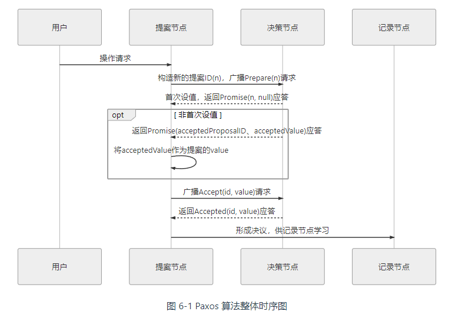
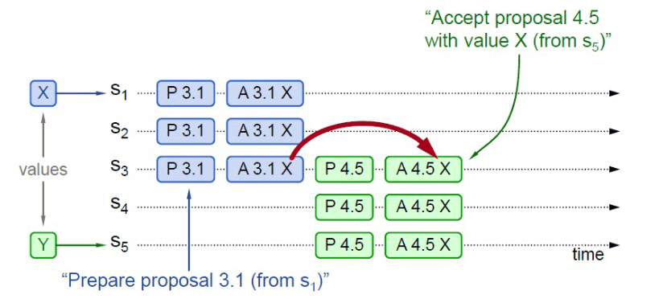
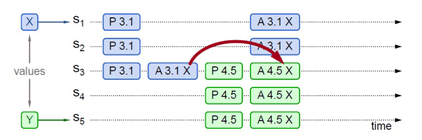
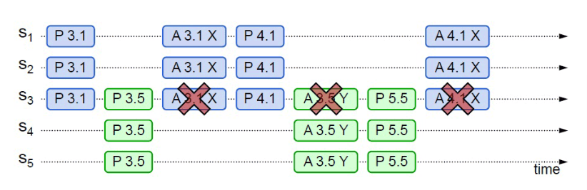
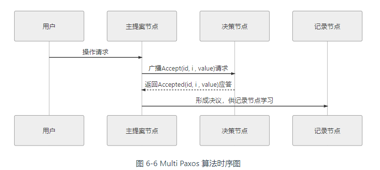
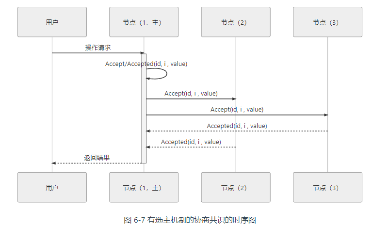
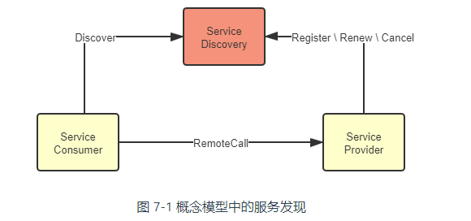

# 分布式基石

[TOC]

## 分布式共识算法

以同步为代表的数据复制方法，被称为**状态转移**（State Transfer）。尽管可以确保 Master 节点和 Slave 节点中的数据是绝对一致的，但任何一个 Slave 节点因为任何原因未响应均会阻塞整个事务，每增加一个 Slave 节点，都导致造成整个系统可用性风险增加一分。

可靠性与可用性的矛盾造成了增加机器数量反而带来可用性的降低，为缓解这个矛盾，在分布式系统里主流的数据复制方法是以**操作转移**（Operation Transfer）为基础的。我们想要改变数据的状态，除了直接将目标状态赋予它之外，还有另一种常用的方法是通过某种操作，令源状态转换为目标状态。

[状态机](https://en.wikipedia.org/wiki/Finite-state_machine)有一个特性：任何初始状态一样的状态机，如果执行的命令序列一样，则最终达到的状态也一样。根据状态机的特性，要让多台机器的最终状态一致，只要确保它们的初始状态是一致的，并且接收到的操作指令序列也是一致的即可。广播指令与指令执行期间，允许系统内部状态存在不一致的情况，即并不要求所有节点的每一条指令都是同时开始、同步完成的，**只要求在此期间的内部状态不能被外部观察到，且当操作指令序列执行完毕时，所有节点的最终的状态是一致的**，这种模型就被称为**状态机复制**（State Machine Replication）。

考虑到分布式环境下网络分区现象是不可能消除的，所以采取「少数服从多数」的原则，一旦系统中过半数的节点中完成了状态的转换，就认为数据的变化已经被正确地存储在系统当中，这样就可以容忍少数（通常是不超过半数）的节点失联，使得增加机器数量对系统整体的可用性变成是有益的，这种思想在分布式中被称为“[Quorum 机制](https://en.wikipedia.org/wiki/Quorum_(distributed_computing))”。

根据上述讨论，我们需要设计出一种算法，能够让分布式系统内部暂时容忍存在不同的状态，但最终能够保证大多数节点的状态达成一致；同时，能够让分布式系统在外部看来始终表现出整体一致的结果。这个让系统各节点不受局部的网络分区、机器崩溃、执行性能或者其他因素影响，都能最终表现出整体一致的过程，就被称为各个节点的**协商共识**（Consensus）。

共识（Consensus）与一致性（Consistency）的区别：一致性是指数据不同副本之间的差异，而共识是指达成一致性的方法与过程。

### Paxos

Paxos 是一种基于消息传递的协商共识算法。该算法并不考虑[拜占庭将军](https://en.wikipedia.org/wiki/Byzantine_fault)问题，也就是说，算法假设信息可能丢失也可能延迟，但不会被错误传递。

Paxos 算法将分布式系统中的节点分为三类：

1. **提案节点**：称为 Proposer，提出对某个值进行设置操作的节点。Paxos 是典型的基于操作转移模型而非状态转移模型来设计的算法，这里的「设置值」不要类比成程序中变量赋值操作，应该类比成日志记录操作
2. **决策节点**：称为 Acceptor，是应答提案的节点。提案一旦得到过**半数决策节点**的接受，即称该提案被**批准**（Accept），提案被批准即意味着该值不能再被更改，也不会丢失，且最终所有节点都会接受该它。
3. **记录节点**：被称为 Learner，不参与提案，也不参与决策，只是单纯地从提案、决策节点中学习已经达成共识的提案

所有的节点都是平等的，它们都可以承担以上某一种或者多种的角色。但是，决策节点的数量应该被设定为奇数个，且在系统初始化时，网络中每个节点都知道整个网络所有决策节点的数量、地址等信息。

Paxos 算法包括两个阶段。其中，第一阶段**「准备」（Prepare）**。如果某个提案节点准备发起提案，必须先向所有的决策节点广播一个许可申请（称为 Prepare 请求）。提案节点的 Prepare 请求中会附带一个全局唯一的数字 n 作为提案 ID。决策节点收到后，将会给予提案节点两个承诺与一个应答。

两个承诺是指：

- 承诺不会再接受提案 ID 小于或等于 n 的 Prepare 请求。
- 承诺不会再接受提案 ID 小于 n 的 Accept 请求。

一个应答是指：

- 不违背以前作出的承诺的前提下，回复已经批准过的提案中 ID 最大的那个提案所设定的值和提案 ID。如果该值从来没有被任何提案设定过，则返回空值（表明它是第一个设置值的节点）。
- 如果违反此前做出的承诺，即收到的提案 ID 并不是决策节点收到过的最大的，那允许直接对此 Prepare 请求不予理会。

当提案节点收到了多数派决策节点的应答（称为 Promise 应答）后，可以开始第二阶段**「批准」（Accept）**

- 如果提案节点发现所有响应的决策节点此前都没有批准过该值（即为空），那说明它是第一个设置值的节点，可以随意地决定要设定的值，将自己选定的值与提案 ID，构成一个二元组 (id, value)，再次广播给全部的决策节点（称为 Accept 请求）
- 如果提案节点发现响应的决策节点中，已经有至少一个节点的应答中包含有值了（已经有节点批准了）。那它就不能够随意取值了，必须无条件地从应答中提案 ID 最大的那个值并接受，构成一个二元组 (id, maxAcceptValue)，再次广播给全部的决策节点（称为 Accept 请求）

当每一个决策节点收到 Accept 请求时，都会在不违背以前作出的承诺的前提下，接收并持久化对当前提案 ID 和提案附带的值。如果违反此前做出的承诺，即收到的提案 ID 并不是决策节点收到过的最大的，那允许直接对此 Accept 请求不予理会。

当提案节点收到了多数派决策节点的应答（称为 Accepted 应答）后，协商结束，共识决议形成，将形成的决议发送给所有记录节点进行学习。

下面通过一个例子来说明 Paxos 的运作过程：

假设一个分布式系统有五个节点，分别命名为 S1、S2、S3、S4、S5。此时，有两个并发的请求分别希望将同一个值分别设定为 X（由 S1作为提案节点提出）和 Y（由 S5作为提案节点提出），以 P 代表准备阶段，以 A 代表批准阶段，这时候可能发生以下情况：

- S1选定的提案 ID 是 3.1（全局唯一 ID 加上节点编号），先取得了多数派决策节点的 Promise 和 Accepted 应答，此时 S5选定提案 ID 是 4.5，发起 Prepare 请求。收到的应答中至少会包含 1 个此前应答过 S1的决策节点（S3），那么 S3提供的 Promise 中必将包含 S1已设定好的值 X，S5就必须无条件地用 X 代替 Y 作为自己提案的值，由此整个系统对“取值为 X”这个事实达成一致

  

- 

- S5提案时 Promise 应答中并未包含批准过 X 的决策节点，譬如应答 S5提案时，节点 S1已经批准了 X，节点 S2、S3未批准但返回了 Promise 应答，此时 S5以更大的提案 ID 获得了 S3、S4、S5的 Promise，这三个节点均未批准过任何值，那么 S3将不会再接收来自 S1的 Accept 请求，因为它的提案 ID 已经不是最大的了，这三个节点将批准 Y 的取值，整个系统最终会对“取值为 Y”达成一致

- 从情况三可以推导出另一种极端的情况，如果两个提案节点交替使用更大的提案 ID 使得准备阶段成功，但是批准阶段失败的话，这个过程理论上可以无限持续下去，形成活锁（Live Lock）

  

Basic Paxos 只能对单个值形成决议，并且决议的形成至少需要两次网络请求和应答（准备和批准阶段各一次），高并发情况下将产生较大的网络开销，极端情况下甚至可能形成活锁。总之，Basic Paxos 是一种很学术化但对工业化并不友好的算法.

### Multi Paxos

可以将「分布式系统中如何对某个值达成一致」（共识问题）分解为三个子问题来考虑：

- 如何选主（Leader Election）
- 如何把数据复制到各个节点上（Entity Replication）
- 如何保证过程是安全的（Safety）

#### 选主

Multi Paxos 对 Basic Paxos 的核心改进是增加了**「选主」**的过程，提案节点会通过定时轮询 （心跳），确定当前网络中的所有节点里是否存在有一个主提案节点，一旦没有发现主节点存在，节点就会在心跳超时后使用 Basic Paxos，向所有其他节点广播自己希望竞选主节点的请求。

当选主完成之后，除非主节点失联之后发起重新竞选，否则从此往后，就只有主节点本身才能够提出提案。此时，无论哪个提案节点接收到客户端的操作请求，都会将请求转发给主节点来完成提案，而主节点提案的时候，也就无需再次经过准备过程。也可以通俗理解为选主过后，就不会再有其他节点与它竞争，所以此时系统中要对某个值达成一致，只需要进行一次批准的交互即可

二元组(id, value)已经变成了三元组(id, i, value)，这是因为需要给主节点增加一个“任期编号”（纪元），这个编号必须是严格单调递增的，以应付主节点陷入网络分区后重新恢复，但另外一部分节点仍然有多数派，且已经完成了重新选主的情况，此时必须以任期编号大的主节点为准。

#### 复制

在正常情况下：

1. 当客户端向主节点发起一个操作请求，譬如提出“将某个值设置为 X”，
2. 主节点将 X 写入自己的变更日志，但先不提交
3. 接着把变更 X 的信息在下一次心跳包中广播给所有的从节点，并要求从节点回复确认收到的消息
4. 从节点收到信息后，将操作写入自己的变更日志，然后给主节点发送确认签收的消息
5. 主节点收到过半数的签收消息后，提交自己的变更、应答客户端并且给从节点广播可以提交的消息
6. 从节点收到提交消息后提交自己的变更，数据在节点间的复制宣告完成。

在异常情况下，网络出现了分区，部分节点失联，但只要仍能正常工作的节点的数量能够满足多数派（过半数）的要求，分布式系统就仍然可以正常工作。假设有 S1、S2、S3、S4、S5五个节点，S1是主节点，由于网络故障，导致 S1（主节点）、S2和 S3（主节点）、S4、S5之间彼此无法通信，形成网络分区。而现在故障恢复，分区解除，此时：

1. S1 和 S3 都向所有节点发送心跳包，从各自的心跳中可以得知两个主节点里 S3 的任期编号更大，它是最新的，此时五个节点均只承认 S3 是唯一的主节点。
2. S1、S2 回滚它们所有未被提交的变更
3. S1、S2 从主节点发送的心跳包中获得它们失联期间发生的所有变更，将变更提交写入本地磁盘

### 安全

- 协定性（Safety）：所有的坏事都不会发生（something "bad" will never happen）。
- 终止性（Liveness）：所有的好事都终将发生，但不知道是啥时候（something "good" will must happen, but we don't know when）

以选主问题为例，Safety 保证了选主的结果一定是有且只有唯一的一个主节点，不可能同时出现两个主节点；而 Liveness 则要保证选主过程是一定可以在某个时刻能够结束的。

### Gossip 协议

Paxos、Raft、ZAB 等分布式算法经常会被称作是「强一致性」的分布式共识协议。尽管系统内部节点可以存在不一致的状态，但从系统外部看来，不一致的情况并不会被观察到，所以整体上看系统是强一致性的。与它们相对的，还有另一类被冠以「最终一致性」的分布式共识协议，这表明系统中不一致的状态有可能会在一定时间内被外部直接观察到。典型的最终一致的分布式系统就是 DNS 系统

这里介绍的 Gossip 协议是一种最终一致性的分布式共识协议。它可以看作是以下两个步骤的简单循环：

- 如果有某一项信息需要在整个网络中所有节点中传播，那从信息源开始，选择一个固定的传播周期（譬如 1 秒），随机选择它相连接的 k 个节点（称为 Fan-Out）来传播消息。
- 每一个节点收到消息后，如果这个消息是它之前没有收到过的，将在下一个周期内，选择相邻 k 个节点发送相同的消息，除了发送消息给它的那个节点外。
- 直到最终网络中所有节点都收到了消息

Gossip 有两个明显的缺点：

1. 网络传播中消息冗余量
2. 尽管可以在整体上测算出统计学意义上的传播速率，但对于个体消息来说，无法准确地预计到需要多长时间才能达成全网一致

## 服务

微服务架构其中一个重要设计原则是「通过服务来实现独立自治的组件」（Componentization via Services），强调应采用「服务」（Service）而不再是「类库」（Library）来构建组件化的程序，这两者的差别在于类库是在编译期静态链接到程序中的，而服务是进程外组件，通过调用远程方法来使用其中的功能。

### 服务发现

所有的远程服务调用都是使用**全限定名**（网络中某台主机的位置）、**端口号**（主机上某一个提供了 TCP/UDP 网络服务的程序）与**服务标识**（该程序所提供的某个具体的方法入口）所构成的三元组来确定一个远程服务的精确坐标的。

服务发现的技术发展：

1. DNS + 负载均衡器
2. ZooKeeper 
3. Eureka
4. 云原生

服务发现必须包含以下三个过程：

1. **服务的注册**（Service Registration）：当服务启动的时候，它应该通过某些形式（如调用 API、产生事件消息、在 ZooKeeper/Etcd 的指定位置记录、存入数据库，等等），将自己的坐标信息通知到服务注册中心。
2. **服务的维护**（Service Maintaining）：监控服务是否健康存活，将不健康的服务自动从服务注册表中剔除。
3. **服务的发现**（Service Discovery）：把一个符号转换为服务实际坐标的过程

下面我们以 Netflix Eureka 和 Hashicorp Consul 为例，说明 CAP 矛盾。

Eureka 选择了高可用性，而牺牲一致性。Eureka 的各个节点间采用异步复制来交换服务注册信息，当有新服务注册进来时，并不需要等待信息在其他节点复制完成，而是马上宣告服务可见。同时，当有服务发生变动，譬如下线或者断网，变动信息不会实时的同步给所有服务端与客户端。这样的设计使得不论是 Eureka 的服务端还是客户端，都能够持有自己的服务注册表缓存，并以 TTL（Time to Live）机制来进行更新，哪怕服务注册中心完全崩溃，客户端在仍然可以维持最低限度的可用。以较小的同步代价换取了最高的可用性；Eureka 能够选择这种模型的底气在于，与它相配合的 Ribbon 和 Hystrix 模块可以兜底，故障转移（Failover）或者快速失败（Failfast）。

Consul 的选择一致性，牺牲可用性。Consul 采用[Raft 算法](https://icyfenix.cn/distribution/consensus/raft.html)，要求多数派节点写入成功后服务的注册或变动才算完成。它没有其他组件为它兜底了。

### 网关路由

### 客户端负载均衡

## 流量治理

### 服务容错

### 流量控制

## 可靠通讯

### 零信任网络

### 服务安全

## 可观测性

### 事件日志

### 链路追踪

### 聚合度量

