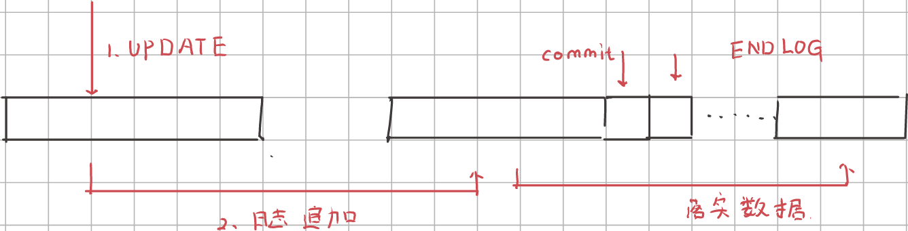
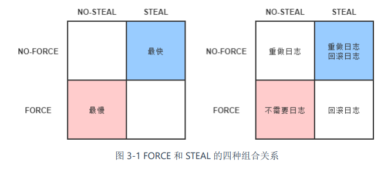
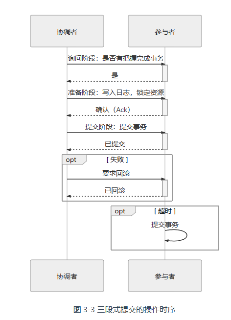
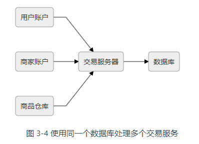

# 架构师的视角

[TOC]

## 远程服务

远程服务将计算机程序的工作范围从单机扩展到网络，是构建分布式系统的首要基础。

[远程服务调用](https://en.wikipedia.org/wiki/Remote_procedure_call)（Remote Procedure Call，RPC）的最初目的，就是**为了让计算机能够跟调用本地方法一样去调用远程方法**。

计算机科学家们的最初想法是，就是将 RPC 作为 “[进程间通信](https://en.wikipedia.org/wiki/Inter-process_communication)”（Inter-Process Communication，IPC）的一种特例来看待的，其中IPC包括：

- **管道**（Pipe）或者**具名管道**（Named Pipe）
- **信号**（Signal）
- **信号量**（Semaphore）
- **消息队列**（Message Queue）
- **共享内存**（Shared Memory）
- **套接字接口**（Socket）：当在本机进程间通信时，套接字接口是被优化过的，即不会经过网络协议栈，不需要打包拆包、计算校验和等操作，只是简单地将应用层数据从一个进程拷贝到另一个进程，这种进程间通信方式有个专名的名称：UNIX Domain Socket，又叫做 IPC Socket。

RPC的调用形式是透明的，这反而让程序员误以为**通信是无成本的**。对此， ACM 和 Sun 院士[Peter Deutsch](https://en.wikipedia.org/wiki/L._Peter_Deutsch)、套接字接口发明者[Bill Joy](https://en.wikipedia.org/wiki/Bill_Joy)、Java 之父[James Gosling](https://en.wikipedia.org/wiki/James_Gosling)等一众共同总结了[通过网络进行分布式运算的八宗罪](https://en.wikipedia.org/wiki/Fallacies_of_distributed_computing)（8 Fallacies of Distributed Computing）：

1. The network is reliable —— 网络是可靠的。
2. Latency is zero —— 延迟是不存在的。
3. Bandwidth is infinite —— 带宽是无限的。
4. The network is secure —— 网络是安全的。
5. Topology doesn't change —— 拓扑结构是一成不变的。
6. There is one administrator —— 总会有一个管理员。
7. Transport cost is zero —— 不必考虑传输成本。
8. The network is homogeneous —— 网络是同质化的。

如果远程服务调用要弄透明化的话，就必须为这些罪过买单


各种RPC 协议都不外乎使用各种手段，来解决以下三个基本问题：

- **如何表示数据**，序列化协议
- **如何传递数据**，传输层协议。“[Wire Protocol](https://en.wikipedia.org/wiki/Wire_protocol)”来用于表示这种两个 Endpoint 之间交换有关异常、安全、认证、授权、事务等等数据的行为。
- **如何确定方法**：使用编号来代替方法名。DCE 实现了与语言无关的[接口描述语言](https://en.wikipedia.org/wiki/Interface_description_language)（Interface Description Language，IDL），此外还有唯一的绝不重复的编码方案[UUID](https://en.wikipedia.org/wiki/Universally_unique_identifier)（Universally Unique Identifier）


RPC框架很难同时做到简单、普适、高性能这三点，因此有众多的RPC框架： RMI（Sun/Oracle）、Thrift（Facebook/Apache）、Dubbo（阿里巴巴/Apache）、gRPC（Google）、Motan1/2（新浪）、Finagle（Twitter）、brpc（百度/Apache）、.NET Remoting（微软）、Arvo（Hadoop）、JSON-RPC 2.0（公开规范，JSON-RPC 工作组）……

每一个框架都有一个主要的发展方向

- 朝着**面向对象**发展，
- 朝着**性能**发展：代表为 gRPC 和 Thrift。决定 RPC 性能的主要就两个因素：序列化效率和信息密度。其中，信息密度取决于协议中有效荷载（Payload）所占总传输数据的比例大小。SOAP 使用 XML 作为信息载体就是一个很好的失败例子。gRPC 是基于 HTTP/2 的，支持多路复用和 Header 压缩，Thrift 则直接基于传输层的 TCP 协议来实现，省去了额外应用层协议的开销。
- 朝着**简化、通用**发展：代表为 JSON-RPC


## REST设计风格

REST （Representational State Transfer）在Roy Thomas Fielding 在 2000 年发表的博士论文《[Architectural Styles and the Design of Network-based Software Architectures](https://www.ics.uci.edu/~fielding/pubs/dissertation/top.htm)》中提出，其中的关键概念有：

- **资源**（Resource）：例如，一篇文章
- **表征**（Representation）：资源的表示形式。例如文章的PDF格式、HTML格式、JSON
- **状态**（State），有关资源的上下文信息。如果状态在客户端维护，那么就是无状态。例如，用户正在阅读的文章。
- **转移**（Transfer）：无论状态是由服务端还是客户端来提供的，状态转移这个行为逻辑必然只能由服务端来实现，因为只有服务端拥有该资源及其表征形式。例如，将“用户当前阅读的文章”转变成“下一篇文章”
- **统一接口**（Uniform Interface）：URI 是统一资源标识符，是一个名词。而 HTTP 中的请求方法，是一个动词，同时这也是一套统一接口，它包括GET、HEAD、POST、PUT、DELETE、TRACE、OPTIONS 七种基本操作。任何一个支持 HTTP 协议的服务器都会遵守这套规定，对特定的 URI 采取这些操作，服务器就会触发相应的表征状态转移。
- **超文本驱动**（Hypertext Driven）：页面的导航行为都不可能是预置于浏览器代码之中，而是由服务器所发出的请求响应信息（超文本）来驱动的。这与有专门的页面控制器的客户端软件，有着十分本质的区别。
- **自描述消息**（Self-Descriptive Messages）：由于资源的表征可能存在多种不同形态，在消息中应当有明确的信息，来告知客户端该消息的类型以及应如何处理这条消息。一种被广泛采用的自描述方法是在名为“Content-Type”的 HTTP Header 中，标识出[互联网媒体类型](https://en.wikipedia.org/wiki/Media_type)（MIME type）。譬如“Content-Type : application/json; charset=utf-8”，则说明该资源会以 JSON 的格式来返回，请使用 UTF-8 字符集进行处理。

> 术语上的细节
>
> - “REST”（**Re**presentational **S**tate **T**ransfer）实际上是“HTT”（**H**yper**t**ext **T**ransfer）的进一步抽象，两者就如同接口与实现类的关系一般。
>
> - 同时Fielding 提出 REST 时所谈论的范围是“架构风格与网络的软件架构设计”（Architectural Styles and Design of Network-based Software Architectures），而不是现在被人们所狭义理解的一种“远程服务设计风格”，前者包括后者。
>
> - REST 只能说是风格，而不是规范、协议。

### RESTful

Fielding 认为完全满足 REST 风格的系统应该满足以下六大原则：

- **服务端与客户端分离**（Client-Server）

- **无状态**（Stateless）：每一次从客户端发送的请求中，应包括所有的必要的上下文信息，会话信息也由客户端负责保存维护，服务端依据客户端传递的状态来执行业务处理逻辑，驱动整个应用的状态变迁。但在大型系统中，请求中所携带的上下文数量完全有可能膨胀到不切实际的程度。

- **可缓存**（Cacheability）：无状态服务虽然提升了系统的可见性、可靠性和可伸缩性，但降低了系统的网络性，即需要多次请求来完成功能。为了缓解这个问题，REST 允许客户端或者代理将服务端的应答缓存起来。

- **分层系统**（Layered System）：客户端无需知道是否直接到服务器，还是连接到代理。代理服务器可以通过负载均衡和共享缓存的机制提高系统的可扩展性

- **统一接口**（Uniform Interface）：系统设计的重点放在抽象系统该有哪些资源上，而不是抽象系统该有哪些行为（服务）上。

  像login、logout这样的服务，我们可以抽象出Session资源，那么login就对应 PUT Session，而logout对应 DELETE Session

- **按需代码**（[Code-On-Demand](https://en.wikipedia.org/wiki/Code_on_demand)）：这是一条可选原则。它是指按照客户端的请求，将可执行的软件程序从服务器发送到客户端的技术。[Java Applet](https://en.wikipedia.org/wiki/Java_applet)与[WebAssembly](https://en.wikipedia.org/wiki/WebAssembly)都是典型代表


### RMM成熟度


0. The Swamp of [Plain Old XML](https://en.wikipedia.org/wiki/Plain_Old_XML)
1. Resources：开始引入资源的概念
2. HTTP Verbs：引入统一接口，映射到 HTTP 协议的方法上。
3. Hypermedia Controls：也就是之前介绍的「超文本驱动」。在 Fielding 论文里的说法是“Hypertext As The Engine Of Application State，HATEOAS”，其实都是指同一件事情。


### 不足与争议

问题一：**面向资源的编程思想只适合做 CRUD，面向过程、面向对象编程才能处理真正复杂的业务逻辑**

见解：HTTP 的四个最基础的命令 POST、GET、PUT 和 DELETE 很容易让人直接联想到 CRUD 操作。而且我们还可以去扩展方法，按 Google 推荐的 REST API 风格，[自定义方法](https://cloud.google.com/apis/design/custom_methods)应该放在资源路径末尾，嵌入冒号加自定义动词的后缀

~~~http
POST /user/user_id/cart/book_id:undelete

~~~


问题二：**REST 与 HTTP 完全绑定，不适合应用于要求高性能传输的场景中**

见解：这是有一定的道理的


问题三：**REST 不利于事务支持**

见解：这要看你要支持哪种事务了，如果只追求最终一致性，那么REST就足够了


问题四：**REST 没有传输可靠性支持**

见解：这是正确的，最简单的解决方式就是把消息再重发一遍，但这样做的前提是服务应具有[幂等性](https://zh.wikipedia.org/wiki/冪等)（Idempotency）


问题五：**REST 缺乏对资源进行“部分”和“批量”的处理能力**

见解：这也是正确的。HTTP协议完全没有对请求资源的结构化描述能力（但有非结构化的部分内容获取能力，即用于断点续传的[Range Header](https://developer.mozilla.org/zh-CN/docs/Web/HTTP/Range_requests)），我们必须专门设计一些抽象资源才能去应对这种问题。

### 与RPC的关系

**REST 的基本思想是面向资源来抽象问题；而 RPC 的是面向过程来抽象问题**。REST 与 RPC 作为主流的两种远程调用方式，在使用上的确是有部分重合的。面向资源的编程思想与另外两种主流编程思想，只是在抽象问题时所处的立场不同，并没有高下之分。人们以面向方法的思想来设计 RPC API，随着时间推移，接口与方法越来越多却又各不相同，开发人员必须了解每一个方法才能正确使用它们，这样既耗时又容易出错。但 REST 可以缓解这种问题：

- 降低服务接口的学习成本。统一接口（Uniform Interface）将对资源的标准操作都映射到了标准的 HTTP 方法上去。

- 资源天然具有集合与层次结构。以方法为中心抽象的接口，由于方法是动词，逻辑上决定了每个接口都是互相独立的；但以资源为中心抽象的接口，由于资源是名词，天然就可以产生集合与层次结构。

  ~~~xml
  GET /posts - 获取所有文章
  GET /posts/{postId} - 获取特定文章
  POST /posts - 创建一篇文章
  PUT /posts/{postId} - 更新特定文章
  DELETE /posts/{postId} - 删除特定文章
  GET /posts/{postId}/comments - 获取特定文章的所有评论
  GET /posts/{postId}/comments/{commentId} - 获取特定文章的特定评论
  POST /posts/{postId}/comments - 创建一条评论
  PUT /posts/{postId}/comments/{commentId} - 更新特定评论
  DELETE /posts/{postId}/comments/{commentId} - 删除特定评论
  ~~~

  注意，虽然两个资源在URL上表现为嵌套关系，但是它们却对应不同的微服务。


## 事务

事务是指一组读写操作的逻辑单元。**事务往往会被赋予AID属性**，来保证数据的一致性（**C**onsistency）：

- **原子性**（**A**tomic）：，事务保证了在同一项业务处理过程中，对多个数据的修改，要么同时成功，要么同时被撤销。
- **隔离性**（**I**solation）：事务保证了在不同的业务处理过程中，各自业务正在读、写的数据互相独立，不会彼此影响。
- **持久性**（**D**urability）：事务应当保证所有成功被提交的数据修改都能够正确地被持久化，不丢失数据。

**可见，A、I、D 是手段，C 是目的**。

- 内部一致性：一个服务只使用一个数据源时的事务间一致性。

  通过 A、I、D 来获得一致性是最经典的做法。此时，多个并发事务所读写的数据能够**由数据源感知是否存在冲突**，并发事务的读写在时间线上的最终顺序是由数据源来确定的。

- 外部一致性：一个服务使用到多个不同的数据源时的事务间一致性

  外部一致性问题通常很难再使用 A、I、D 来解决，但是外部一致性是分布式系统中必然会遇到的问题。为此，我们要转变观念，即从「是或否」的二元属性转变为可以按不同强度分开讨论的多元属性。在确保代价可承受的前提下，获得强度尽可能高的一致性保障。

**数据源是指提供数据的逻辑设备**

### 本地事务

**本地事务（Local Transaction）**是指仅操作单一事务资源的、不需要全局事务管理器进行协调的事务。它只适用于单个服务使用单个数据源的场景。从应用角度看，它是直接依赖于数据源本身提供的事务能力来工作的（事务的开启、终止、提交、回滚、嵌套、设置隔离级别、事务传播方式），在程序代码层面，最多 只能对事务接口做一层标准化的包装（如 `JDBC` 接口），并不能深入参与到事务的运作过程当中。

> 
>
> 如今要研究事务的实现原理，必定会追溯到**ARIES 理论（Algorithms for Recovery and Isola tion Exploiting Semantics，ARIES，基于语义的恢复与隔离算法）**。
>
> 在 20 世纪 90 年代，[IBM Almaden 研究院](http://www.research.ibm.com/labs/almaden/)总结了研发原型数据库系统“IBM System R”的经验，发表了 ARIES 理论中最主要的三篇论文，其中《[ARIES: A Transaction Recovery Method Supporting Fine-Granularity Locking and Partial Rollbacks Using Write-Ahead Logging](https://cs.stanford.edu/people/chrismre/cs345/rl/aries.pdf)》着重解决了 ACID 的其中两个属性：原子性（A）和持久性（D）在算法层面上应当如何实现。而另一篇《[ARIES/KVL: A Key-Value Locking Method for Concurrency Control of Multiaction Transactions Operating on B-Tree Indexes](http://vldb.org/conf/1990/P392.PDF)》则是现代数据库隔离性（I）奠基式的文章

#### 原子性和持久性

由于写入中间状态与崩溃都是无法避免的，为了保证原子性和持久性，就只能在崩溃后采取恢复的补救措施——「崩溃恢复」。

通过「Commit Logging」（提交日志）来实现事务的原子性和持久性是当今的主流方案，基本思路是

1. 将修改数据这个操作所需的全部信息，包括修改什么数据、数据物理上位于哪个内存页和磁盘块中、从什么值改成什么值，等等，以日志的形式（在文件末尾顺序追加）记录到磁盘中
2. 写入完成后，会追加“提交记录”（Commit Record），表示事务成功提交。
3. 然后根据日志上的信息对真正的数据进行修改
4. 修改完成后，再往日志中加入一条“结束记录”（End Record），表示事务已完成持久化。

日志一旦成功写入 Commit Record，那整个事务就是成功的，即使真正修改数据时崩溃了，重启后根据已经写入磁盘的日志信息恢复现场即可，这保证了持久性；其次，如果日志没有成功写入 Commit Record 就发生崩溃，那整个事务就是失败的，系统重启后会看到一部分没有 Commit Record 的日志，那将这部分日志标记为回滚状态即可，这保证了原子性。

> 除了Commit Logging，还有另外一种称为“[Shadow Paging](https://en.wikipedia.org/wiki/Shadow_paging)”的事务实现机制。大体思路是当写入数据时，先复制一份副本，保留原数据，修改副本数据。当事务成功提交后，去修改引用数据的指针，现代磁盘的写操作可以保证这个修改指针的操作是原子性的。
>
> Shadow Paging 实现事务要比 Commit Logging 更加简单，但涉及隔离性与并发锁时，Shadow Paging 实现的事务并发能力就相对有限，因此在高性能的数据库中应用不多。

Commit Logging 存在一个先天缺陷，所有对数据的真实修改都必须发生在事务提交以后，即日志写入了 Commit Record 之后，即使之前你的磁盘 I/O 足够空闲。如果某个事务修改的数据量非常庞大，那么会占用大量的内存缓冲区。

ARIES 提出了「Write-Ahead Logging」的日志改进方案，它将写入数据的时机，按照事务提交时点为界，划分为 FORCE 和 STEAL 两类情况

- **FORCE**：当事务提交后，要求变动数据必须同时完成写入则称为 FORCE
- **STEAL**：在事务提交前，允许变动数据提前写入则称为 STEAL




- 对于 No-Force 来说，它是先 Commit 然后再落实数据
- 对于 STEAL 来说， 它是先落实数据然后再 Commit

显然，Commit Logging 是 NO-FORCE，NO-STEAL 的；而 Write-Ahead Logging 是 NO-FORCE，STEAL 的。

它给出的解决办法是，增加了一种 Undo Log 日志类型（回滚日志）。当更新数据写入磁盘前，必须先记录 Undo Log，注明修改了哪个位置的数据、从什么值改成什么值，等等。以便在事务回滚或者崩溃恢复时根据 Undo Log 对提前写入的数据变动进行擦除。之前在 Commit Logging 的日志被称为 Redo Log

Write-Ahead Logging 在崩溃恢复时会执行以下操作：

- **分析阶段**（Analysis）：该阶段从最后一次检查点（Checkpoint）开始扫描日志，找出所有没有 End Record 的事务，组成待恢复的事务集合。
- **重做阶段**（Redo）：从待恢复的事务集合中找出所有包含 Commit Record 的日志，将这些日志修改的数据写入磁盘，写入完成后在日志中增加一条 End Record，然后移除出待恢复事务集合。
- **回滚阶段**（Undo）：此时集合中剩下的都是需要回滚的事务，它们被称为 Loser，根据 Undo Log 中的信息，将已经提前写入磁盘的信息重新改写回去，以达到回滚这些 Loser 事务的目的。

重做阶段和回滚阶段的操作都应该设计为幂等的。从优化磁盘 I/O 的角度看，NO-FORCE 加 STEAL 组合的 性能无疑是最高的，但复杂度无疑也是最高的




#### 隔离性

数据库通过锁机制来实现隔离性：

- **写锁**（Write Lock，也叫作排他锁，eXclusive Lock，简写为 X-Lock）：如果数据被加上写锁，就只有持有写锁的事务才能对数据进行写入操作，而其他事务不能写入数据，也不能施加读锁或者写锁。写锁禁止其他事务施加读锁，而并不禁止其他事务读取数据。

- **读锁**（Read Lock，也叫作共享锁，Shared Lock，简写为 S-Lock）：多个事务可以对同一个数据添加多个读锁，数据被加上读锁后就不能再被加上写锁，所以其他事务不能对该数据进行写入，但仍然可以读取。

  对于持有读锁的事务，如果该数据只有它自己一个事务加了读锁，允许直接将其升级为写锁，然后写入数据。但是不允许反向降级。

- **范围锁**（Range Lock）：加了范围锁后，不仅无法修改该范围内已有的数据，也不能在该范围内新增或删除任何数据，这是排他锁无法做到的

  
  
  

下面是不同级别的隔离性，依次从强到弱：

- **可串行化**：对事务所有读、写的数据全都加上写锁和范围锁，或者读锁和范围锁，一直持续到事务结束。串行化访问提供了强度最高的隔离性。但是[并发控制理论](https://en.wikipedia.org/wiki/Concurrency_control)（Concurrency Control）阐述了隔离程度与并发能力是负相关的，即隔离程度越高，并发访问时的吞吐量就越低。

- **可重复读（Repeatable Read）**：对事务所涉及的数据加读锁或者写锁，一直持续到事务结束。

  它存在[幻读问题](https://en.wikipedia.org/wiki/Isolation_(database_systems)#Phantom_reads)（Phantom Reads），例如：

  ~~~sql
  SELECT count(1) FROM books WHERE price < 100					/* 时间顺序：1，事务： T1  暂不提交*/
  INSERT INTO books(name,price) VALUES ('深入理解Java虚拟机',90)	/* 时间顺序：2，事务： T2  提交*/
  SELECT count(1) FROM books WHERE price < 100					/* 时间顺序：3，事务： T1 提交*/
  ~~~

  两次相同的查询就会得到不一样的结果，原因是可重复读没有范围锁，来禁止在该范围内插入新的数据。

- **读已提交（Read Committed）**：对事务涉及的数据加的写锁，一直持续到事务结束，但加在查询操作上的读锁，在查询完成后就马上会释放。

  它存在[不可重复读问题](https://en.wikipedia.org/wiki/Isolation_(database_systems)#Non-repeatable_reads)（Non-Repeatable Reads），例如：

  ~~~sql
  SELECT * FROM books WHERE id = 1;   						/* 时间顺序：1，事务： T1 */
  UPDATE books SET price = 110 WHERE id = 1; COMMIT;			/* 时间顺序：2，事务： T2 提交*/
  SELECT * FROM books WHERE id = 1; COMMIT;   				/* 时间顺序：3，事务： T1 提交*/
  ~~~

  这两次重复执行的查询结果就会不一样，原因是读已提交的隔离级别缺乏贯穿整个事务周期的读锁，无法禁止读取过的数据发生变化。

- **读未提交（Read Uncommitted）**：只对事务涉及的数据加上写锁，会一直持续到事务结束，但完全不加读锁。

  它存在[脏读问题](https://en.wikipedia.org/wiki/Isolation_(database_systems)#Dirty_reads)（Dirty Reads），例如：

  ```sql
  SELECT * FROM books WHERE id = 1;   						/* 时间顺序：1，事务： T1 */
  
  UPDATE books SET price = 90 WHERE id = 1;					/* 时间顺序：2，事务： T2 暂不提交*/
  
  SELECT * FROM books WHERE id = 1;		
  /* 时间顺序：3，事务： T1 */
  
  ROLLBACK;			  										/* 时间顺序：4，事务： T2 */
  ```

  


脏写问题（Dirty Write），即一个事务的没提交之前的修改，可以被另外一个事务的修改覆盖掉。脏写已经不单纯是隔离性上的问题了，它连事务的原子性都无法实现，所以在谈论隔离级别时，不会将它纳入讨论范围内。

除了都以锁来实现外，以上四种隔离级别还有另一个共同特点，就是幻读、不可重复读、脏读等问题都是由于一个事务在读数据过程中，受另外一个写数据的事务影响，而破坏了隔离性。针对这种「一个事务读+另一个事务写」的隔离问题，近年来有一种名为**[多版本并发控制](https://en.wikipedia.org/wiki/Multiversion_concurrency_control)（Multi-Version Concurrency Control，MVCC）**的无锁优化方案被业界广泛采用。**它的「无锁」是特指读取时不需要加锁。**

MVCC 的基本思路是对数据库的任何修改都不会直接覆盖之前的数据，而是产生一个新版副本与老版本共存，以此达到读取时可以完全不加锁的目的。其中版本可以理解为每一行记录都存在两个不可见的字段：`CREATE_VERSION` 和 `DELETE_VERSION`，这两个字段记录的值都是事务 ID，事务 ID 是一个全局严格递增的数值，然后根据以下规则写入数据：

- 插入数据时：CREATE_VERSION 记录插入数据的事务 ID，DELETE_VERSION 为空。
- 删除数据时：DELETE_VERSION 记录删除数据的事务 ID，CREATE_VERSION 为空。
- 修改数据时：将修改数据视为“删除旧数据，插入新数据”的组合，即先将原有数据复制一份，原有数据的 DELETE_VERSION 记录修改数据的事务 ID，CREATE_VERSION 为空。复制出来的新数据的 CREATE_VERSION 记录修改数据的事务 ID，DELETE_VERSION 为空。

此时，如有另外一个事务要读取这些发生了变化的数据，将根据隔离级别来决定到底应该读取哪个版本的数据

- 隔离级别是可重复读：总是读取 CREATE_VERSION 小于或等于当前事务 ID 的记录，在这个前提下，如果数据仍有多个版本，则取最新（事务 ID 最大）的。
- 隔离级别是读已提交：总是取最新的 CREATE_VERSION 即可，即最近被 Commit 的那个版本的数据记录。

另外两个隔离级别都没有必要用到 MVCC，因为读未提交直接修改原始数据即可，其他事务查看数据的时候立刻可以看到，根本无须版本字段。可串行化本来的语义就是要阻塞其他事务的读取操作，而 MVCC 是做读取时无锁优化的，自然就不会放到一起用。MVCC 是只针对“读+写”场景的优化，如果是两个事务同时修改数据，即“写+写”的情况，那就没有多少优化的空间了，此时加锁几乎是唯一可行的解决方案。

此外，加锁的策略可以分为

- **“乐观加锁”（Optimistic Locking）**：认为事务之间数据存在竞争是偶然情况，没有竞争才是普遍情况，这样就不应该在一开始就加锁，而是应当在出现竞争时再找补救措施。
- **“悲观加锁”（Pessimistic Locking）**：认为不先做加锁再访问数据，就肯定会出现问题。

如果竞争剧烈的话，乐观锁反而更慢。

### 全局事务

在工程实现中，**全局事务是指单个服务使用多个数据源的事务处理机制**。理论上的全局事务并没有「单个服务」的约束，它本来就是 DTP（[Distributed Transaction Processing](https://en.wikipedia.org/wiki/Distributed_transaction)）模型中的概念。但本节所讨论的内容是一种在分布式环境中，追求强一致性的事务处理方案，对于多节点而且互相调用彼此服务的场合（微服务系统）是极不合适的。

1991 年，为了解决分布式事务的一致性问题，[X/Open](https://en.wikipedia.org/wiki/X/Open)组织提出了一套名为[X/Open XA](https://en.wikipedia.org/wiki/X/Open_XA)（XA 是 eXtended Architecture 的缩写）的处理事务架构，其核心内容是定义了**全局的事务管理器**（Transaction Manager，用于协调事务，可以理解为主节点）和**局部的资源管理器**（Resource Manager，用于驱动本地事务，可以理解为从节点）之间的通信接口。XA 接口是双向的。

XA 是一套语言无关的通用规范， Java 中专门定义了 [JSR 907 Java Transaction API](https://www.jcp.org/en/jsr/detail?id=907) 来实现 XA 规范。JTA  最主要的两个接口是：

- 事务管理器的接口：
  - `javax.transaction.TransactionManager`接口：是给 Java EE 服务器提供容器事务（由容器自动负责事务管理）使用的
  - `javax.transaction.UserTransaction`接口：用于通过程序代码手动开启、提交和回滚事务
- `javax.transaction.xa.XAResource`。任何资源（JDBC、JMS 等等）如果想要支持 JTA，只要实现 XAResource 接口中的方法即可。


假如你平时以声明式事务来编码，不过就是标个`@Transactional`注解而已，但如果以编程式事务来实现的话，伪代码如下所示：

```java
public void buyBook(PaymentBill bill) {
    userTransaction.begin();
    warehouseTransaction.begin();
    businessTransaction.begin();
	try {
        userAccountService.pay(bill.getMoney());
        warehouseService.deliver(bill.getItems());
        businessAccountService.receipt(bill.getMoney());
        userTransaction.commit();
        warehouseTransaction.commit();
        businessTransaction.commit();
	} catch(Exception e) {
        userTransaction.rollback();
        warehouseTransaction.rollback();
        businessTransaction.rollback();
	}
}
```

从代码上可看出，程序的目的是要做三次事务提交，但实际上代码并不能这样写，试想一下，如果在`businessTransaction.commit()`中出现错误，代码转到`catch`块中执行，此时`userTransaction`和`warehouseTransaction`已经完成提交，再去调用`rollback()`方法已经无济于事，这将导致一部分数据被提交，另一部分被回滚，整个事务的一致性也就无法保证了。


为了解决这个问题（一个事务跨多节点），XA 将事务提交拆分成为两阶段过程：

- **准备阶段**（投票阶段）：在这一阶段，协调者询问事务的所有参与者是否准备好提交。参与者如果已经准备好提交则回复 Prepared，否则回复 Non-Prepared。

- **提交阶段**（执行阶段）：
  - 如果所有参与者回复Prepared，那么协调者向参与者发起 Commit 指令，所有参与者立即执行提交操作
  - 任意一个参与者回复了 Non-Prepared 消息，或任意一个参与者超时未回复，那么协调协调者向参与者发起 Abort 指令，所有参与者立即执回滚操作


以上这两个过程被称为“[两段式提交](https://zh.wikipedia.org/wiki/二阶段提交)”（2 Phase Commit，2PC）协议，而它能够成功保证一致性还需要一些其他前提条件：

- 在提交阶段网络是可靠的
- 节点的失联必须是短暂的

它有以下缺点：

- **单点问题**：协调者在两段提交中具有举足轻重的作用，协调者等待参与者回复时可以有超时机制，但参与者等待协调者指令时无法做超时处理。一旦协调者宕机，那所有参与者都会受到影响
- **性能问题**：准备阶段的时间取决于响应最慢的从节点
- **一致性风险**：协调者会先持久化事务状态，并提交自己的事务。如果这时候网络忽然被断开，无法再通过网络向所有参与者发出 Commit 指令，这就会导致协调者的已提交，但参与者的既未提交，也没有办法回滚，从而产生了数据不一致的问题。


为了缓解 2PC 协议的一部分缺陷，后续又发展出了“[三段式提交](https://zh.wikipedia.org/wiki/三阶段提交)”（3 Phase Commit，3PC）协议。三段式提交把原本 的两段式提交的准备阶段再细分为两个阶段，分别称为 CanCommit、PreCommit，把提交阶段改称为 DoCommit 阶段。其中，新增的 CanCommit 是一个询问阶段，协调者让每个参与者根据自身状态，评估该事务是否有可能顺利完成。

将准备阶段一分为二的理由是这个阶段是重负载的操作。在 2PC 中，一旦协调者发出开始准备的消息，每个参与者都将马上开始写 Redo Log，它们所涉及的数据资源即被锁住，如果此时某一个参与者宣告无法完成提交，相当于大家都白做了一轮无用功。而 3PC 中的 CanCommit 减少是由于事务失败而回滚的概率

此外，如果在 PreCommit 阶段 后，协调者发生了宕机，即参与者没有能等到 DoCommit 的消息的话，默认的操作策略将是提交事务，而不是 2PC 中的持续等待。



### 共享事务

共享事务（Share Transaction）是指多个服务共用同一个数据源。一种**理论可行**的方案是直接让各个服务共享数据库连接。这些服务在同一个进程内的话，就轻而易举地实现。但是这些服务在不同的服务器实例上，因此我们必须通过一个数据库代理来为多个服务提供同一份连接，即一个独立于各个服务的远程数据库连接池。



但是这种方案是与实际生产环境相悖的。在一个服务集群中，数据库才是压力最大，而又最不容易伸缩拓展的重灾区。已经有对多个数据库实例做负载均衡的数据库代理，但几乎没有为多个服务共用同一个数据源的数据库代理。所以，**共享事务更有可能是个伪需求。**为了叙述逻辑的完备，这里就介绍了共享事务。


### 分布式事务

**「分布式事务」（Distributed Transaction**）特指业务上关联的多个服务同时访问多个数据源的事务处理机制。

1985 年 Fischer、Lynch、Paterson 提出了“[FLP 不可能原理](https://en.wikipedia.org/wiki/Consensus_(computer_science)#Solvability_results_for_some_agreement_problems)”，证明了如果宕机最后不能恢复，那就不存在任何一种分布式协议可以正确地达成强一致性结果。

CAP 定理（Consistency、Availability、Partition Tolerance Theorem），也称为 Brewer 定理。这个定理描述了：在网络分区时，以下三个特性最多只能同时满足其中两个：

- **一致性**（**C**onsistency）：代表数据在任何时刻、任何分布式节点中所看到的都是符合预期的。

- **可用性**（**A**vailability）：代表系统不间断地提供服务的能力，这里有两个与其密切的概念：

  - 可靠性，使用平均无故障时间（Mean Time Between Failure，MTBF）来度量
  - 可维护性，使用平均可修复时间（Mean Time To Repair，MTTR）来度量。

  可用性的表征如下：
  $$
  A=MTBF/（MTBF+MTTR）
  $$
  譬如 99.9999%可用，即代表平均年故障修复时间为 32 秒。

- **分区容忍性**（**P**artition Tolerance）：部分节点因网络原因而失联后，系统仍能正确地提供服务的能力。

  

下面分析分别舍弃 C、A、P 时所带来的不同影响：

- **放弃分区容忍性**（CA without P）：意味着我们将假设节点之间通信永远是可靠的。但是分区问题就会始终存在。
- **放弃可用性**（CP without A）：意味着我们将假设一旦网络发生分区，节点之间的信息同步时间可以无限制地延长。在现实中，选择放弃可用性的 CP 系统情况一般用于对数据质量要求很高的场合中。
- **放弃一致性**（AP without C）：意味着我们将假设一旦发生分区，节点之间所提供的数据可能不一致。

 AP 系统目前是设计分布式系统的主流选择。 因为 P 是分布式网络的天然属性，这是无法放弃的；而 A 通常是建设分布式的目的，如果可用性随着节点数量增加反而降低的话，很多分布式系统可能就失去了存在的价值。

虽然我们放弃了强一致性，但是我们可以追求「弱一致性」中的「最终一致性」—— 如果数据在一段时间之内没有被另外的操作所更改，那它最终将会达到与强一致性过程相同的结果

> 最终一致性的概念是 eBay 的系统架构师 Dan Pritchett 在 2008 年在 ACM 发表的论文《[Base: An Acid Alternative](https://queue.acm.org/detail.cfm?id=1394128)》中提出的。最终一致性的概念是 eBay 的系统架构师 Dan Pritchett 在 2008 年在 ACM 发表的论文《[Base: An Acid Alternative](https://queue.acm.org/detail.cfm?id=1394128)》中提出的。其中，BASE 是基本可用性（**B**asically **A**vailable）、柔性事务（**S**oft State）和最终一致性（**E**ventually Consistent）的缩写

此时「事务」一词的含义其实也同样被拓展了，人们把具有 ACID属性 （强一致性）的事务称为“刚性事务”，而把保证最终一致性的事务统称为「柔性事务」。


#### 可靠事件队列


以上这种靠着持续重试来保证可靠性的解决方案，称为“[最大努力交付](https://en.wikipedia.org/wiki/Best-effort_delivery)。


#### TCC 事务

TCC 是一种业务侵入式较强的事务方案，要求业务处理过程必须拆分为「预留业务资源」和「确认/释放消费资源」两个子过程，并分为以下三个阶段：

- **Try**：尝试执行阶段，完成所有业务可执行性的检查（保障一致性），并且预留好全部需用到的业务资源（保障隔离性）。如果第三方接口并不支持「预留资源」特性，那么 TCC 方案就无法实施。 
- **Confirm**：确认执行阶段，不进行任何业务检查，直接使用 Try 阶段准备的资源来完成业务处理。Confirm 阶段可能会重复执行，因此本阶段所执行的操作需要具备幂等性。
- **Cancel**：取消执行阶段，释放 Try 阶段预留的业务资源。Cancel 阶段可能会重复执行，也需要满足幂等性。


TCC 其实有点类似 2PC 的准备阶段和提交阶段，但 TCC 是位于用户代码层面，而不是在基础设施层面，这为它的实现带来了较高的灵活性，可以根据需要设计资源锁定的粒度。

#### SAGA 事务

SAGA 的思路是把一个大事务分解为可以交错运行的一系列子事务集合，避免避免大事务长时间锁定数据库的资源。SAGA 由两部分操作组成：

- 大事务拆分若干个小事务，将整个分布式事务 T 分解为 n 个子事务，命名为 T1，T2，…，Ti，…，Tn。每个子事务都应该是原子的
- 为每一个子事务设计对应的补偿动作，命名为 C1，C2，…，Ci，…，Cn。 Ti与 Ci必须满足以下条件：
  - Ti与 Ci都具备幂等性。
  - Ti与 Ci满足交换律（Commutative），即先执行 Ti还是先执行 Ci，其效果都是一样的。
  - Ci必须能成功提交，即不考虑 Ci本身提交失败被回滚的情形，如出现就必须持续重试直至成功，或者要人工介入。

如果 T1 到 Tn 均成功提交，那事务顺利完成，否则，要采取以下两种恢复策略之一：

- **正向恢复**（Forward Recovery）：如果 Ti事务提交失败，则一直对 Ti进行重试，直至成功为止（最大努力交付）。这种恢复方式不需要补偿。正向恢复的执行模式为：T1，T2，…，Ti（失败），Ti（重试）…，Ti+1，…，Tn。
- **反向恢复**（Backward Recovery）：如果 Ti事务提交失败，则一直执行 Ci对 Ti进行补偿，直至成功为止（最大努力交付）。反向恢复的执行模式为：T1，T2，…，Ti（失败），Ci（补偿），…，C2，C1。

与 TCC 相比，SAGA 不需要为资源设计冻结状态和撤销冻结的操作。而且，补偿操作往往要比冻结操作容易实现得多。
