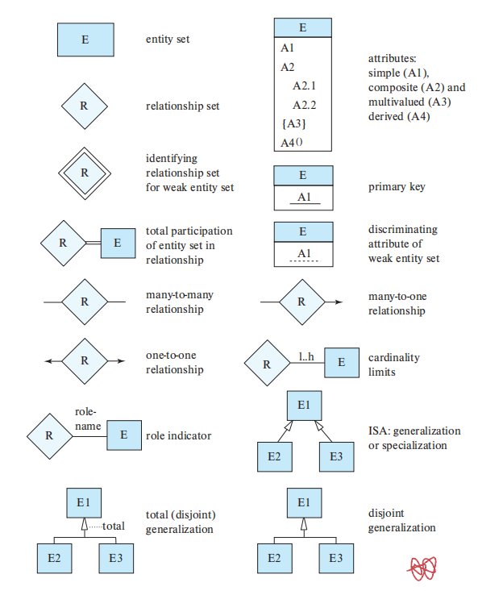
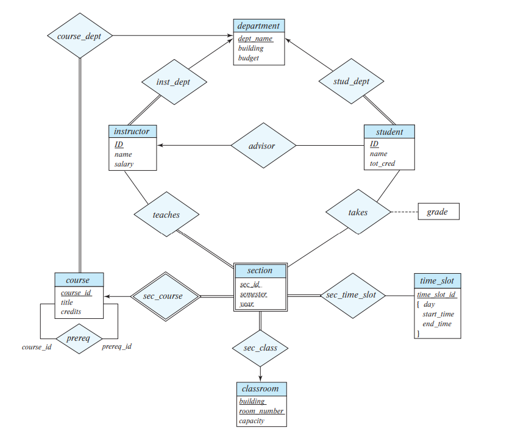
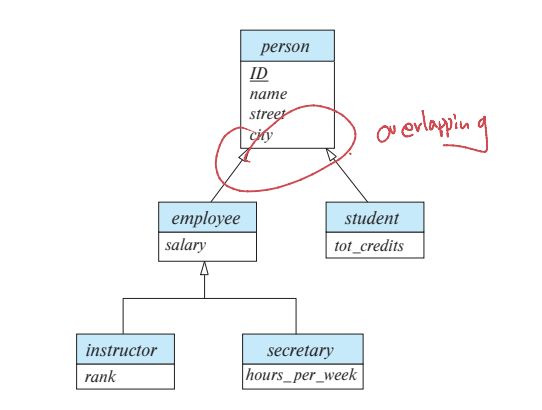
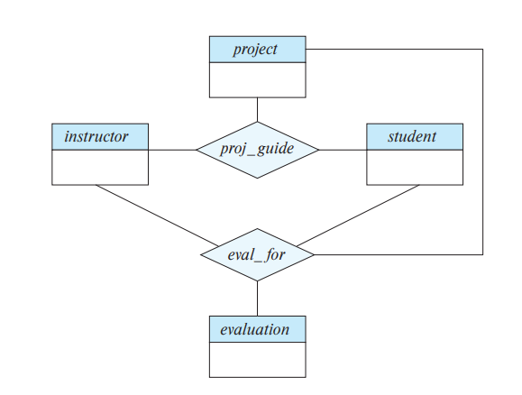
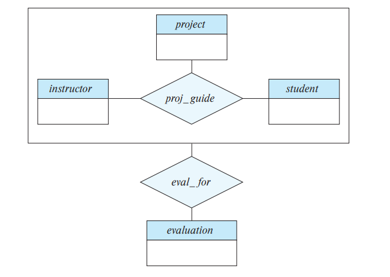

# The Entity-Relationship Model

The participation of an entity set *E* in a relationship set *R* is said to be **total** if every entity in *E* must participate in at least one relationship in *R*. We indicate total participation of an entity in a relationship set using double lines.

Let *R* be a relationship set involving entity sets $E_1,...,E_n$. If the relationship set R has attributes $a_1, ... a_m$ associated with it, then the set of attributes $primaryKey(E_1) \cup ... \cup primaryKey(E_n) \cup \{a_1, a_2,...a_m\}$

The choice of the primary key for a binary relationship set depends on the mapping cardinality of the relationship set

- For many-to-many relationships, the preceding union of the primary keys is  chosen as the primary key
- For one-to-many and many-to-one relationships, the primary key of the “many” side is used as the primary key.
- For one-to-one relationships, the primary key of either one of the participating entity sets forms a minimal superkey

 an E-R diagram with two or more arrows out of a nonbinary relationship set can be interpreted in the two ways we describe below. Suppose there is a relationship set R between entity sets E1, E2, E3, E4, and the only arrows are on the edges to entity sets E3 and E4. Then, the two possible interpretations are:

- A particular combination of entities from E1, E2 can be associated with at most one combination of entities from E3, E4. Thus, the primary key for the relationship R can be constructed by the union of the primary keys of E1 and E2.
- A particular combination of entities from E1, E2, E3 can be associated with at most one combination of entities from E4, Then the union of the primary keys of E1, E2, and E3 forms a candidate key,

Thus, to avoid confusion, we permit only one arrow out of a nonbinary relationship set. In order to represent a situation where one of the multiple-arrow situations holds, the E-R design can be modified by replacing the non-binary relationship set with an entity set

A **weak entity set** is one whose existence is dependent on another entity set, called its **identifying entity set**; instead of associating a primary key with a weak entity, we use the primary key of the identifying entity, along with extra attributes, called **discriminator attributes** to uniquely identify a weak entity. An entity set that is not a weak entity set is termed a **strong entity set**. The relationship associating the weak entity set with the identifying entity set is called the **identifying relationship**

The identifying relationship is many-to-one from the weak entity set to the identifying entity set, and the participation of the weak entity set in the relationship is total.

The primary key of the weak entity set would consist of the union of the primary keys of the identifying entity sets, plus the discriminator of the weak entity set.

The way we depict specialization in an E-R diagram depends on whether an entity may belong to multiple specialized entity sets or if it must belong to at most one specialized entity set. The former case (multiple sets permitted) is called **overlapping specialization**, while the latter case (at most one permitted) is called **disjoint specialization**

top-down 表示差异化（特化）

bottom-up 表示共性（泛化）

聚合

## Reducing E-R Diagrams to Relational Schemas

###  Representation of Strong Entity Sets

Let E be a strong entity set with only simple descriptive attributes a1, a2, …, a  We represent this entity with a schema called E with n distinct attributes. Each tuple in a relation on this schema corresponds to one entity of the entity set E. the primary key of the entity set serves as the primary key of the resulting schema

We handle composite attributes by creating a separate attribute for each of the component attributes;

Derived attributes are not explicitly represented in the relational data model. 

For a multivalued attribute M, we create a relation schema R with an attribute A that corresponds to M and attributes corresponding to the primary key of the entity set. In addition, we create a foreign-key constraint on the relation schema created from the multivalued attribute

### Representation of Weak Entity Sets

Let A be a weak entity set with attributes a1, a2, …, am. Let B be the strong entity set on which A depends. Let the primary key of B consist of attributes b1, b2, …, bn. We represent the entity set A by a relation schema called A with one attribute for each member of the set: $\{a_1... a_m\}\cup \{b_1...b_n\}$

For schemas derived from a weak entity set, the combination of the primary key of the strong entity set and the discriminator of the weak entity set serves as the primary key of the schema

we also create a foreign-key constraint on the relation A, specifying that the attributes b1, b2, …, bn reference the primary key of the relation B

### Representation of Relationship Sets

Let R be a relationship set, let a1, a2, …, am be the set of attributes formed by the union of the primary keys of each of the entity sets participating in R, and let the descriptive attributes (if any) of R be b1, b2, …, bn. We represent this relationship set by a relation schema called R with one attribute for each member of the set:$\{a_1... a_m\}\cup \{b_1...b_n\}$

The primary key attributes of the relationship set are also used as the primary key attributes of the relational schema R.

We also create foreign-key constraints on the relation schema R as follows: For each entity set Ei related by relationship set R, we create a foreign-key constraint from relation schema R, with the attributes of R that were derived from primary-key attributes of Ei referencing the primary key of the relation schema representing Ei .

### Representation of Generalization

There are two different methods of designing relation schemas for an E-R diagram that includes generalization：

1. Create a schema for the higher-level entity set. For each lower-level entity set, create a schema that includes an attribute for each of the attributes of that entity set plus one for each attribute of the primary key of the higher-level entity set. In addition, we create foreign-key constraints on the lower-level entity sets,
2. 略

### Combination of Schemas

Consider a many-to-one relationship set AB from entity set A to entity set B. Suppose further that the participation of A in the relationship is total;  Then we can combine the schemas A and AB to form a single schema consisting of the union of attributes of both schemas. 

We can combine schemas even if the participation is partial by using null values.

In the case of one-to-one relationships, the relation schema for the relationship set can be combined with the schemas for either of the entity sets.

