# 网络

[TOC]

## HTTP 1.0

HTTP 1.0 协议的特点是：

1. 只能由客户端主动发起请求
2. HTTP Request 与 HTTP Reponse 是一一对应的
3. 发送 Request 前，先建立 TCP 连接。接收 Reponse 后，再断开 TCP 连接

这有以下问题：

1. 服务器无法主动推送消息
2. 频繁创建销毁 TCP 连接会有性能问题

对于问题（2），使用 `Connection:Keep-Alive` 来解决。即多个 Request & Reponse 可以复用同一条 TCP 连接。注意，只有接收到 Reponse 后，才能发送下一个 Request。为了避免空连接占用系统资源，还提供了 `Keep-Alive timeout` 参数。

以前客户端通过 TCP 连接的关闭来获知请求已结束。而现在 TCP 连接复用，客户端无法再通过此方法来判断请求是否结束。因此，引入了 `Content-Length: xxx` 字段，表明 HTTP Response 的 Body 中共有多少个字节，从而可以推断请求是否结束。

对于问题（1），有以下解决方案：

1. 客户端定期轮询（短轮询）
2. WebSocket
3. HTTP 长轮询。服务器不会关闭连接，而是保持连接打开，直到有数据供服务器发送

## HTTP 1.1

HTTP 1.1 之后，连接复用是一个默认特性，即使不添加 `Connection:Keep-Alive` 。如果想要关闭此特性，要添加 `Connection:Close`

如果服务器返回的数据是动态生成的，那么要计算`Content-Length: xxx` ，必须要等待服务器数据全部生成，这是十分耗时的。因此，在 HTTP1.1 中，引入了 Chunk 机制（Http Streaming）。添加  Transfer-Encoding:chunked 字段来启用该机制：

~~~http
HTTP/1.1 200 OK
Content-Type: text/plain
Transfer-Encoding: chunked

7\r\n
Mozilla\r\n
9\r\n
Developer\r\n
7\r\n
Network\r\n
0\r\n
\r\n
~~~

同一条 TCP 连接上的 HTTP Request/Reponse 是串行的，连接利用率并不高。因此，入了 Pipeline 机制。

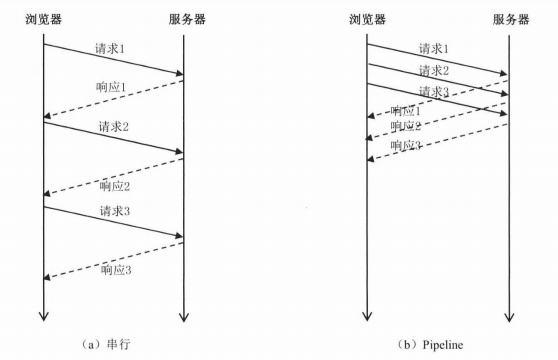

但 Pipeline 机制仍有问题，即 Head-of-Line Blocking。客户端发送的请求顺序是 1、2、3，那么接收响应的顺序也必须是 1、2、3。假如响应 1 迟迟未接收到，而响应 2、3 已接收，那么响应 2、3 会被一直阻塞，直到响应 1 被接收到。

此外，HTTP 1.1 支持断点续传特性，即在 Request 上添加 `Range: first offset -last offset` 字段，这样服务器就可以只返回 `(first offset, last offset)` 之间的数据。

## HTTP/2

HTTP/2 协议能完美兼容 HTTP 1.1 。

「二进制分帧」是 HTTP/2 为了解决 HTTP1.1 的 Head-of-Line Blocking 问题所设计的核心特性，即将 HTTP 报文拆分成多个二进制帧。每个 Request 和 Reponse 是逻辑上的一条流，为每条流分配一个流 ID，把这个 ID 作为标签，打到每一个帧上。这样就可以把帧组装起来。

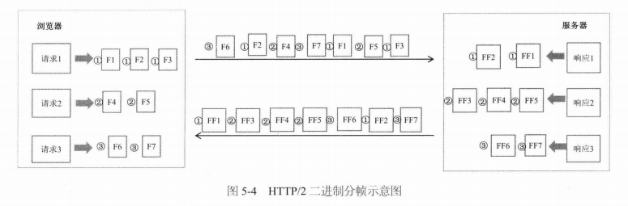

事实上，二进制分帧并没有完全解决该问题，只是将问题细化到「帧」粒度。以上图为例，如果 F6 丢失，那么即使接收到了 F7，F7 也会被一直阻塞，直到接收到 F6。

此外，HTTP/2 还支持对 HTTP 头部的压缩。

## SSL/TLS

SSL 对 TCP 进行了安全增强，而 TLS 只是 SSL 的升级版。

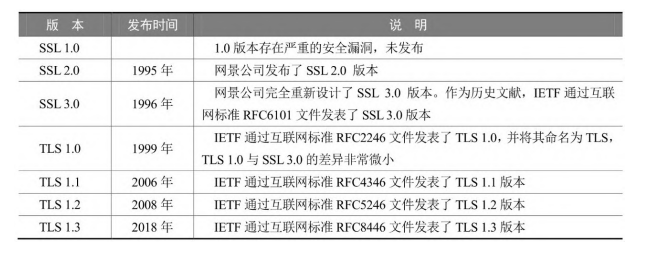

从理论上说，SSL/TSL 协议属于传输层，而在实现上属于应用层。

### 四次握手

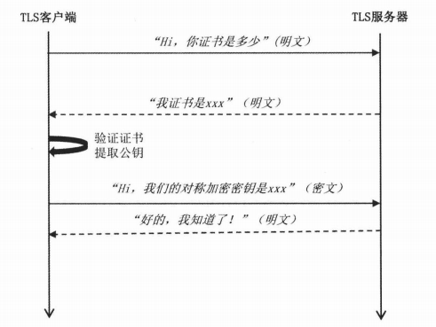

1. 客户端向服务器发起请求，请求中包含使用的协议版本号、生成的一个随机数、以及客户端支持的加密方法。
2. 服务器端接收到请求后，确认双方使用的加密方法、并给出服务器的证书、以及一个服务器生成的随机数。
3. 客户端确认服务器证书有效后，生成一个新的随机数，并使用数字证书中的公钥，加密这个随机数，然后发给服务器
4. 第四步，服务器使用自己的私钥，来解密客户端发送过来的随机数
5. 第五步，客户端和服务器端根据约定的加密方法使用前面的三个随机数，生成对话秘钥。

## HTTPS

HTTPS = HTTP+SSL/TLS

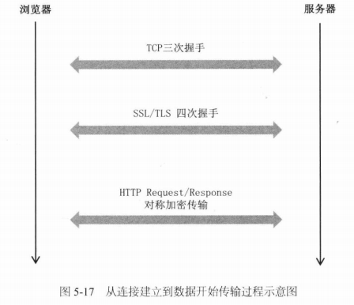

## TCP/UDP

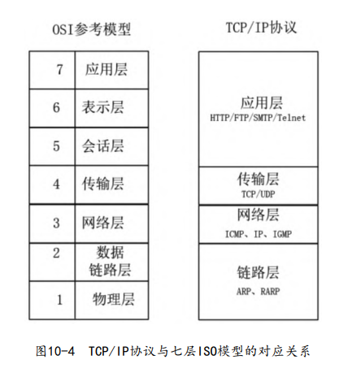

在网络中进行数据传输所遇到的问题：

1. 丢失
2. 乱序
3. 重复

TCP提供了一种面向连接的、可靠的字节流服务，其数据帧格式大致如图

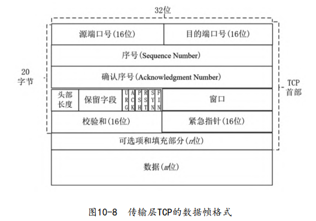

- 序号的语义与SYN控制标志（Control Bits）有关

  - 当 SYN = 1 时，当前为连接建立阶段，序号为初始序号 ISN（Initial Sequence Number）。ISN 是由算法随机生成的序号。
  - 当 SYN = 0 时，第一个报文的序号为 ISN + 1，后面的报文序号为前一个报文的SN值 + TCP 报文的净荷字节数（不包含TCP头）

- 头部长度：单位为 4 byte

- 控制标志

  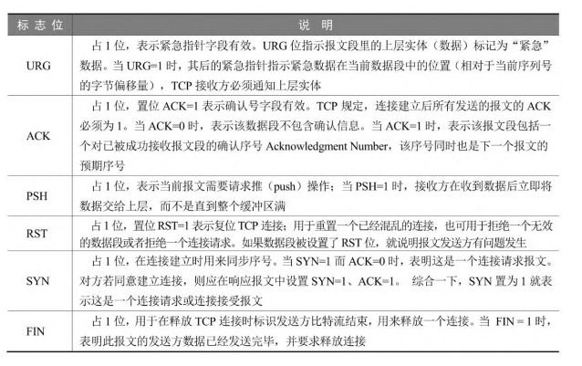

- 窗口

- 校验和

- 紧急指针

- 可选项和填充部分，最常见的选项为 MSS

TCP 连接建立时，双方需要经过三次握手，具体过程如下：

1. Client 进入 SYN_SENT 状态，发送一个 SYN 帧（SYN = 1）来主动打开传输通道。
2. Server 在收到 SYN 帧之后，会进入 SYN_RCVD 状态，返回 SYN+ACK 帧（ACK = 1，AN = SN + 1）给 Client。
3. Client 在收到 Server 的第二次握手 SYN+ACK 确认帧之后，首先将自己的状态从SYN_SENT 变成 ESTABLISHED。然后，Client 发 ACK 帧（ACK = 1）给 Server。此时 Client 可能会将 ACK 帧和第一帧要发送的数据，合并到一起发送给Server。
4. Server 在收到 Client 的 ACK 帧之后会从 SYN_RCVD 状态进入 ESTABLISHED 状态

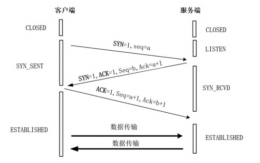

连接断开的过程需要经历四次握手：

1. 主动方（可以是客户端，也可以是服务端），向对方发送一个 FIN 结束请求报文（FIN = 1）。发送完成后，主动方进入 FIN_WAIT_1 状态，表示没有数据再要发送给对方了。

2. 在收到了主动方发送的 FIN 断开请求报文后，被动方会发送一个 ACK 响应报文。之后，被动方就进入了 CLOSE-WAIT（关闭等待）状态，但是仍可以继续向主动方发送数据。

3. 主动方在收到了 ACK 报文后，由 FIN_WAIT_1 转换成 FIN_WAIT_2 状态。被动方在发送完数据后，会向主动方发送一个 FIN+ACK 结束响应报文，然后被动方进入 LAST_ACK 状态。

4. 主动方收到 FIN+ACK 后，向被动方发送一个 ACK 确认报文，然后自己就进入TIME_WAIT 状态，等待超时并且在等待时无其他数据到达，那么最终关闭连接（2MSL）。

   MSL（Maximum Segment Lifetime）指的是一个 TCP 报文片段在网络中的最大存活时间。在 RFC1122 协议中，推荐 MSL 为 2 分钟。

5. 被动方在收到主动断开方的最后 ACK 报文以后，最终关闭连接。

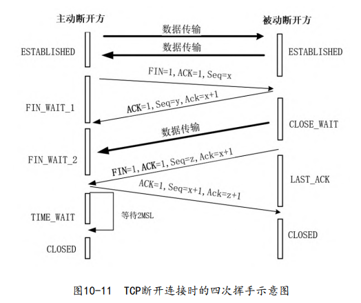

如果把三次握手改成两次握手，可能发生死锁。两次握手的示例：

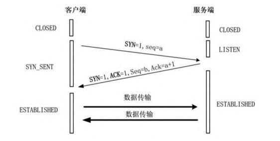

假设服务端发送的 ACK 丢失了，按照两次握手的协定，此时，服务端会认为连接已经建立，就开始发送数据，而客户端还在等待 ACK 帧，这样客户端会忽略服务端发送过来的数据，而服务端接收不到数据的 ACK 响应，那么会一直重发数据。

为什么 TIME-WAIT 状态必须等待 2MSL 才进入 CLOSE 状态

1. 假设主动方发送的 ACK 报文丢失了，那么处于 LAST-ACK 状态的被动方就不能进入 CLOSED 状态。如果主动方在 2MSL 时间内收到了重传的 FIN+ACK 报文，那么就会重传一次 ACK 报文。然后再等待 2MSL，这样就能确保被动方能收到 ACK 报文，从而能确保被动方顺利进入 CLOSED 状态。
2. 防止旧连接中已失效的数据报文出现在新连接中

如果频繁地创建连接，最后可能导致大量的连接处于 TIME_WAIT 状态，占用大量系统资源。为了避免出现这种问题，可以采取如下措施：

1. 不要让服务器主动关闭连接
2. 客户端做连接池，复用连接

TCP还维护一个 Keep-Alive 计时器，计时器的超时时间一般设置为 2 小时，若 2 小时还没有收到 Client 的任何数据帧，Server 就会发送一个探测报文段，以后每隔 75 秒发送一次。若一连发送 10 个探测报文仍然没有反应，Server 就认为 Client 出了故障，接着关闭连接。

## QUIC

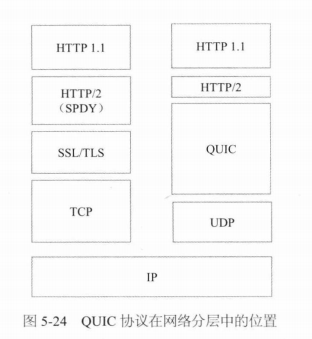

TCP 丢包重传的效率并不高，比如服务器收到了数据包 1、2、3，之后收到数据包 5、6、7，其中数据包 4 一直没有收到，客户端会把数据包 4、5、6、7 全部重传一遍。

QUIC 使用 Raid5 算法来解决丢包问题。即每发送 5 个数据包，就发送 1 个冗余包。冗余包是对 5 个数据包做异或运算得到的。这样一来，服务器收到 6 个包，如果 5 个当中，有一个丢失了，可以通过其他几个包计算出来。不过 Raid5 要求，每 5 个当中只能丢失 1 个。

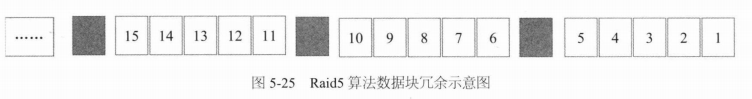

在 Raid5 基础上，把可靠性向上提一个级别，生成 2 个冗余块，就是 Raid6。这样这就允许每 5 个块当中丢失 2 个。数据恢复的过程，相当于解一个二元一次方程组：
$$
A+B+C+D+E=R1\\
A-B+C-D+E=R2
$$
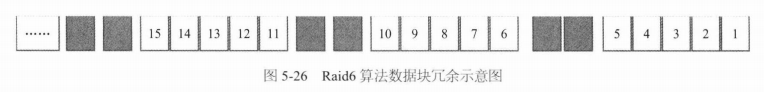

如此，还可以把冗余块增加到 3 个、4 个，就会变成两个矩阵的乘法，此处不再继续展开。对于 QUIC 来说，它采用了 RAID5，目前是每发送 10 个数据包，构建 1 个冗余包。如果丢失超过 2 个包，那么就使用 TCP 重传机制。

TCP 使用四元组（源IP、源Port、目的IP、目的Port）来标识一个连接，但 QUIC 使用一个 64 位整数来标识一个连接。

## WebSocket

WebSocket 协议中大致包含了 5 种类型的数据帧

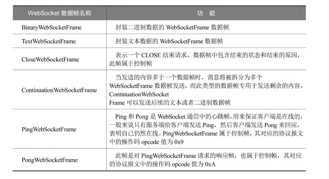

创建 WebSocket 连接的握手请求是 HTTP1.1（或者更高）的 GET 请求。如果响应报文的状态码为 101，表示服务端同意客户端协议升级请求

WebSocket报文格式a

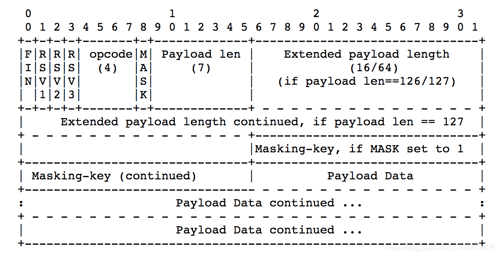

- FIN：表示该帧是否为消息的最后一个数据帧。

- Opcode：决定如何解析后续的数据载荷

  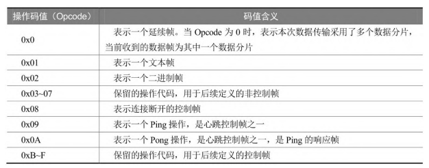

- Mask：表示是否要对数据载荷进行掩码操作。

- Masking-Key：掩码键，如果 Mask 值为1，就需要用这个掩码来对数据进行解码，以获取到真实的通信数据。客户端必须为每一个数据帧选择新的不同掩码值，并要求这个掩码值是随机的，然后利用这个掩码做编码。

- Payload Length：单个帧的最大大小限制为 **18,446,744,073,709,551,615 字节**（64 位无符号值的最大值）

- Payload

## 远程服务

远程服务将计算机程序的工作范围从单机扩展到网络，是构建分布式系统的首要基础。

[远程服务调用](https://en.wikipedia.org/wiki/Remote_procedure_call)（Remote Procedure Call，RPC）的最初目的，就是**为了让计算机能够跟调用本地方法一样去调用远程方法**。

 “[进程间通信](https://en.wikipedia.org/wiki/Inter-process_communication)”（Inter-Process Communication，IPC）包括：

- **管道**（Pipe）或者**具名管道**（Named Pipe）
- **信号**（Signal）
- **信号量**（Semaphore）
- **消息队列**（Message Queue）
- **共享内存**（Shared Memory）
- **套接字接口**（Socket）：当在本机进程间通信时，套接字接口是被优化过的，即不会经过网络协议栈，不需要打包拆包、计算校验和等操作，只是简单地将应用层数据从一个进程拷贝到另一个进程，这种进程间通信方式有个专名的名称：UNIX Domain Socket，又叫做 IPC Socket。

RPC 的调用形式是透明的，这反而让程序员误以为**通信是无成本的**。对此， ACM 和 Sun 院士[Peter Deutsch](https://en.wikipedia.org/wiki/L._Peter_Deutsch)、套接字接口发明者[Bill Joy](https://en.wikipedia.org/wiki/Bill_Joy)、Java 之父[James Gosling](https://en.wikipedia.org/wiki/James_Gosling)等一众共同总结了[通过网络进行分布式运算的八宗罪](https://en.wikipedia.org/wiki/Fallacies_of_distributed_computing)（8 Fallacies of Distributed Computing）：

1. The network is reliable —— 网络是可靠的。
2. Latency is zero —— 延迟是不存在的。
3. Bandwidth is infinite —— 带宽是无限的。
4. The network is secure —— 网络是安全的。
5. Topology doesn't change —— 拓扑结构是一成不变的。
6. There is one administrator —— 总会有一个管理员。
7. Transport cost is zero —— 不必考虑传输成本。
8. The network is homogeneous —— 网络是同质化的。

如果远程服务调用要弄透明化的话，就必须为这些罪过买单

各种 RPC 协议都不外乎使用各种手段，来解决以下三个基本问题：

- **如何表示数据**，序列化协议
- **如何传递数据**，传输层协议。“[Wire Protocol](https://en.wikipedia.org/wiki/Wire_protocol)”来用于表示这种两个 Endpoint 之间交换有关异常、安全、认证、授权、事务等等数据的行为。
- **如何确定方法**：使用编号来代替方法名。DCE 实现了与语言无关的[接口描述语言](https://en.wikipedia.org/wiki/Interface_description_language)（Interface Description Language，IDL），此外还有唯一的绝不重复的编码方案[UUID](https://en.wikipedia.org/wiki/Universally_unique_identifier)（Universally Unique Identifier）

RPC 框架很难同时做到简单、普适、高性能这三点，因此有众多的RPC框架： RMI（Sun/Oracle）、Thrift（Facebook/Apache）、Dubbo（阿里巴巴/Apache）、gRPC（Google）、Motan1/2（新浪）、Finagle（Twitter）、brpc（百度/Apache）、.NET Remoting（微软）、Arvo（Hadoop）、JSON-RPC 2.0（公开规范，JSON-RPC 工作组）……

每一个框架都有一个主要的发展方向

- 朝着**面向对象**发展，
- 朝着**性能**发展：代表为 gRPC 和 Thrift。决定 RPC 性能的主要就两个因素：序列化效率和信息密度。其中，信息密度取决于协议中有效荷载（Payload）所占总传输数据的比例大小。SOAP 使用 XML 作为信息载体就是一个很好的失败例子。gRPC 是基于 HTTP/2 的，支持多路复用和 Header 压缩，Thrift 则直接基于传输层的 TCP 协议来实现，省去了额外应用层协议的开销。
- 朝着**简化、通用**发展：代表为 JSON-RPC

## DASH

**HTTP 的动态适应性流（Dynamic AdaptiveStreaming over HTTP, DASH）**

在 DASH 中，将视频编码为几个具有不同比特率的版本，每个版本具有不同的 URL。HTTP 服务器存储一个 Manifest file，来描述了每个版本的 URL。客户端首先获取 Manifest file 文件，然后不断测量带宽情况，来动态选择从哪个 URL 获取下一个请求块。

## CDN

**内容分发网（Content Distribution Network, CDN）** 

CDN 通常采用两种不同的服务器安置策略：

- **深入**：在 接入 ISP 中部署服务器集群，其目标是靠近端用户
- **邀请做客**：通常将服务器集群放置在因特网交换点（IXP），这样有着较低的维护和管理开销

大多数 CDN 利用 DNS 来截获和重定向请求。下面通过一个例子来说明，假定一个内容提供商 NetCinema 雇佣了第三方 CDN 公司 KingCDN 来向其客户分发视频。

1. 用户访问位于 NetCinema 的 Web 网页
2. 当用户点击链接`http://video.netcinema.com/6Y7B23V`时，发送一个 DNS 请求
3. 用户的本地 DNS 服务器将该 DNS 请求中继到一台用于 NetCinema 的权威 DNS 服务器。该服务器向 LDNS 返回一个 KingCDN 域的主机名，如 `al105.kingcdn.com`
4. LDNS 发送第二个 DNS 请求
5. KingCDN 的 DNS 系统最终向 LDNS 返回**合适的** KingCDN 内容服务器的 IP 地址

## DNS

The DNS is (1) a distributed database implemented in a hierarchy of DNS servers, and (2) an application-layer protocol that allows hosts to query the distributed database

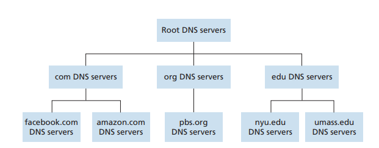

- **Root DNS servers**：provide the IP addresses of the TLD servers.
- **Top-level domain (TLD) servers**：top-level domains such as com, org, net, edu, and gov, and all of the country top-level domains such as uk, fr, ca, and jp. TLD servers provide the IP addresses for authoritative DNS servers
- **Authoritative DNS servers**：Every organization with publicly accessible hosts (such as Web servers and mail servers) on the Internet must provide publicly accessible DNS records that map the names of those hosts to IP addresses
- LDNS ： DNS 缓存，由 ISP 提供商部署。

DNS 查询有两种方式：**递归查询（recursive query）**、**迭代查询（iterative query）**。

下面我们通过例子来说明这两种方式，假设主机 `cse.nyu.edu` 想知道主机 `gaia.cs.umass.edu`的 IP 地址。对于迭代查询，流程是这样的

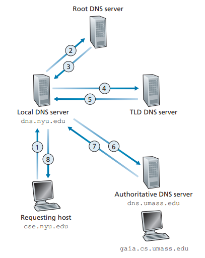

1. 主机首先向本地 DNS 服务器发送一个 DNS 查询报文
2. 本地 DNS 服务器将该报文转发到根 DNS 服务器。
3. 该根 DNS 服务器注意到其 edu 前缀，并向本地 DNS 服务器返回负责 edu 的 TLD 的 IP 地址列表
4. 该本地DNS服务器则再次向这些 TLD 服务器之一发送查询报文。
5. 该 TLD 服务器注意到 umass. edu 前缀，并用权威 DNS 服务器的 IP 地址进行响应，该权威 DNS 服务器是负责马萨诸塞大学的 `dns. umass. edu`
6. 本地DNS服务器直接向`dns. umass. edu`重发查询报文
7. `dns.umass.edu`权威服务器用`gaia.cs umass.edu`的 IP 地址进行响应。

这是递归查询的流程：

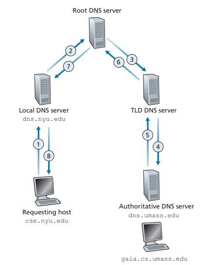

The DNS servers store resource records (RRs)  that provide hostname-to-IP address mappings. A resource record is a four-tuple that contains the following fields:
$$
(Name, Value, Type, TTL)
$$

- **TTL** is the time to live of the resource record. 注意，如果某个域名改变了 IP 地址，DNS 服务器并没有任何机制去通知缓存了该地址的机器去更新缓存，只能依靠 TTL 来保证一致性。

- The meaning of **Name** and **Value** depend on **Type**:

  | Type  |   Name   |                            Value                             |                Example                 |
  | :---: | :------: | :----------------------------------------------------------: | :------------------------------------: |
  |   A   | hostname |                 IP address for the hostname                  | (relay1.bar.foo.com, 145.37.93.126, A) |
  |  NS   |  domain  | hostname of an authoritative DNS server that knows how to obtain the IP addresses for hosts in the domain |       (foo.com, dns.foo.com, NS)       |
  | CNAME | hostname |        canonical hostname for the alias hostname Name        |  (foo.com, relay1.bar.foo.com, CNAME)  |
  |  MX   |          | hostnamee canonical name of a mail server that has an alias hostname Name |    (foo.com, mail.bar.foo.com, MX)     |

  

## ARP

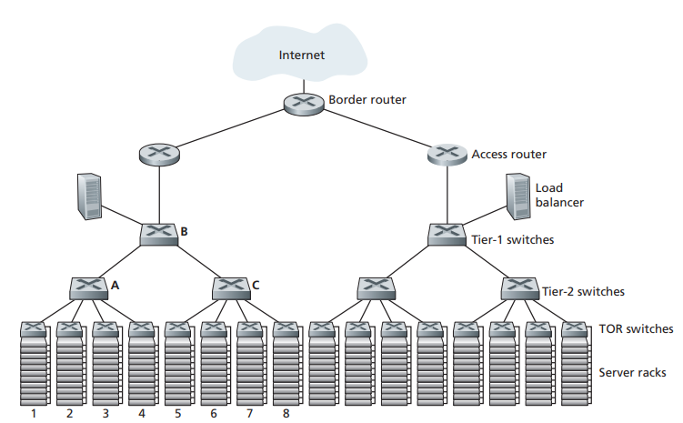

每台主机或路由器在其内存中，具有一个 ARP 表（ARP table），这张表包含 IP 地址到 MAC 地址的映射关系。

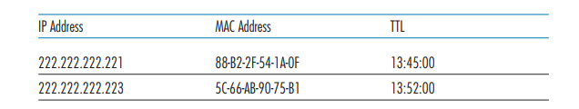

我们先来考虑相同子网上的 ARP 工作流程：当主机 A 发送 IP 报文时，它先查询 ARP Table。如果 ARP Table 中并不存在，那么它就会广播一个帧（FF-FF-FF-FF-FF-FF）。其他主机检查这个帧包含的 IP 地址与自己是否匹配，如果是的话，那么就单播给主机 A，主机 A 会将其保存在 ARP Table 中。

注意，交换机有自学习功能，在接收帧的同时，会保存接口与 MAC 帧之间的映射关系。

在不同子网上的 ARP 工作流程就一个核心点，就是主机广播 ARP 后，如果路由器发现不是该网段的，但是它在路由表中匹配到目标网段，那么就单播路由器自己的 MAC 地址。然后主机就把数据包发送路由器，剩下的就交给网络层了。如果路由器并没有目标 IP 与 MAC 地址的映射关系，那么就在在其他网段上执行 ARP 协议，再把数据包转发出去。

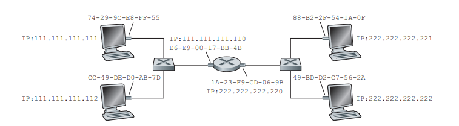

## 互联网结构

接入 ISP 以DSL、FTTH、Wi-Fi、cellular 等技术，向用户提供接入网络的服务。隶属于不同接入 ISP 的客户想要通信的话，必须要求这些接入 ISP 之间是相互连接的。而这种连接形式就形成了**网络的网络（network of networks）**，这就是当前互联网的核心设计理念。

网络结构的演化并不是出于技术的考量，而是受到经济、政策的影响。下面就介绍下当前互联网的结构：

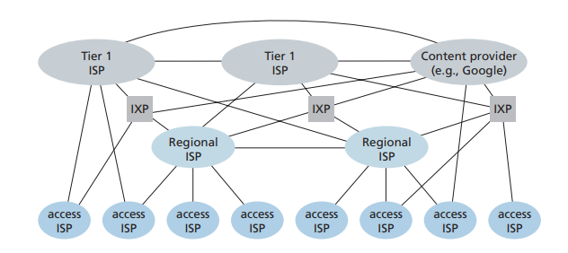

由于资本市场的自由竞争，有多个顶级（Tier 1） ISP 提供商，它负责在全球范围内建立自己的 ISP 网络。每个 Tier1 出于合作目的，又将它们的 ISP 网络互联。处于生态链下游的 ISP 提供商（Regional ISP、Access ISP），一方面搭建区域性 ISP 网络，另一方面又**付费租用**上级 ISP，为其用户提供大范围的网络通信。

此外，还有 PoP、多宿、对等和交换点等设施，下面一一介绍：

- PoP：ISP 提供商为其下流 ISP 提供服务的地方
- 多宿（multi-home）：连接多个提供商 ISP 
- 对等（peer）：某些 ISP 厂商出于合作目的，将它们网络连到一起，使得它们流量直接相互传输，从而避免了因通过上游 ISP 传输而导致的费用结算。
- 因特网交换点（Internet Exchange Point, IXP） ：IXP是一个汇合点，多个 ISP 能够在这里一起对等

## VPN

**虚拟专用网 VPN（Virtual Private Network）**利用公共互联网作为私有网之间的通信载体

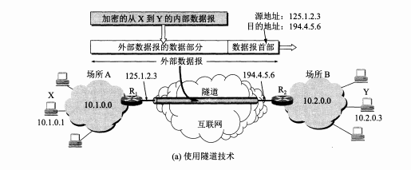

位于私有网 10.1.0.0/16 的主机 X，向另一个私有网 10.2.0.0/16 的主机 Y 发送 IP 数据包，当路由器 R1 收到内部数据包后，就把整个数据包进行加密，然后重新加上数据包首部。源地址是路由器 R1 的地址，而目的地址是路由器 R2 的地址。R2 收到数据包后，将其数据部分取出进行解码，然后交付给主机 Y。

## NAT

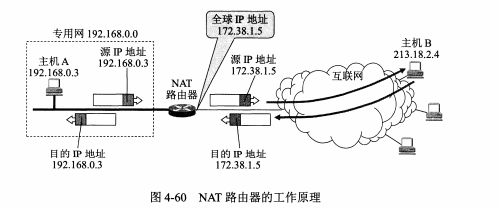

**网络地址转换（Network Address Translation ,NAT）**。在本地网络中使用私有地址，在连接互联网时转而使用全局 IP 地址的技术。NAT实际上是为解决IPv4地址短缺而开发的技术。也可以用于隐藏内部网络的结构
