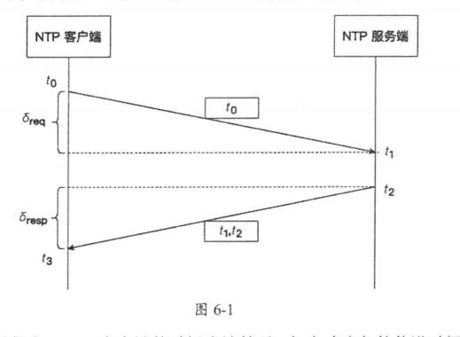

# 分布式理论

[TOC]

## 分布式共识

### 基本概念

**共识（Consensus）不等于一致性（Consistency）**

共识问题可以用数学语言来准确描述：一个分布式系统包含 n 个进程。每个进程都有一个初始值，进程之间互相通信，设计一种共识算法使得尽管出现故障，但进程之间仍能协商出某个不可撤销的最终决定值，且每次执行都满足以下三个性质：

- **终止性（Termination）**：一致的结果在有限时间内能完成
- **协定性（Agreement）**：不同节点最终完成决策的结果是相同的
- **完整性（Integrity）**：决策的结果必须是某个节点提出的提案

由 Fischer，Lynch 和 Patterson 三位科学家发表的《Impossibility of Distributed Consensus with One Faulty Process》论文中提出，在网络可靠，但允许节点失效（即便只有一个）的最小化异步模型系统中，不存在一个可以解决一致性问题的确定性共识算法。因此，我们主要研究同步系统中的分布式共识问题。

共识算法是有代价的：**在达成一致性决议之前，节点投票的过程是一个同步复制过程**。性能较低

## 分布式事务

见「 Seata 事务」笔记

## 时间和时间顺序

开发者在设计软件时，默认状态和流程的演进是随着时间流动方向进行的。

UTC 是最主要的世界时间标准，通过不规则地加上正或负闰秒来抵消地球自转变化的影响。

NTP 是目前主流的时钟同步协议，它是一个典型的 C/S 架构。

显然，往返延迟 $\delta = (t_3 - t_0) - (t_2 - t_1)$。 那么， NTP 把 NTP 客户端应该设置的时间称为时间偏移，用 $\theta$ 来表示
$$
\theta = t_2 + \frac{\delta}{2}
$$
具体的算法会更复杂一些。 NTP 客户端通常会定期轮询一个或更多服务器，然后使用一个统计算法得到一个最优时间偏移。然后调整时钟频率以逐渐减小时间误差。