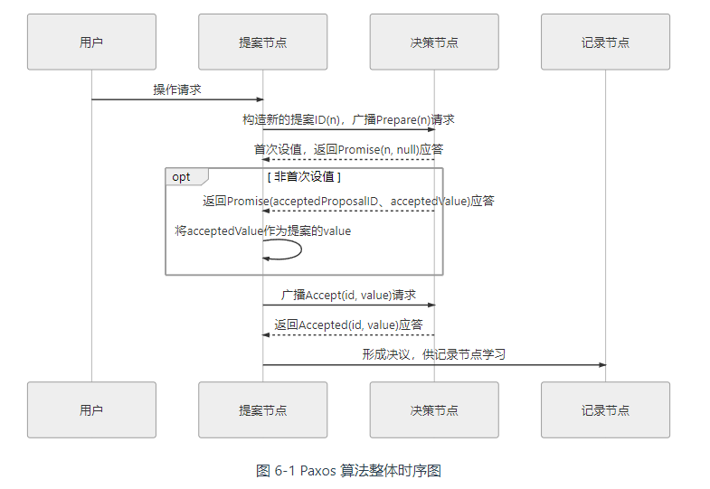
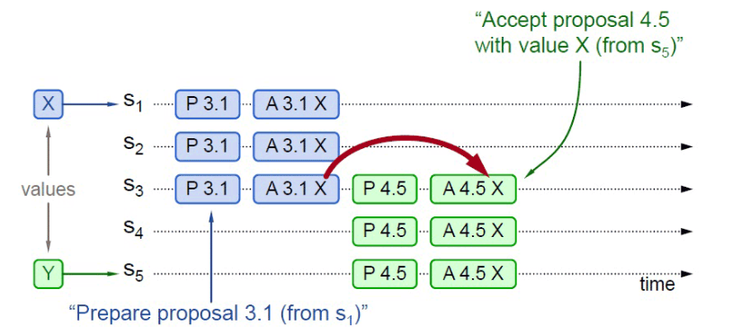
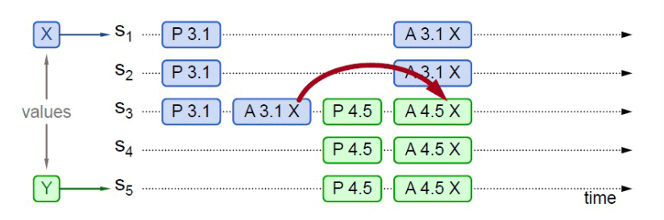
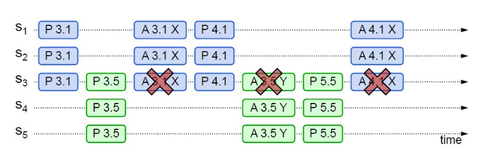
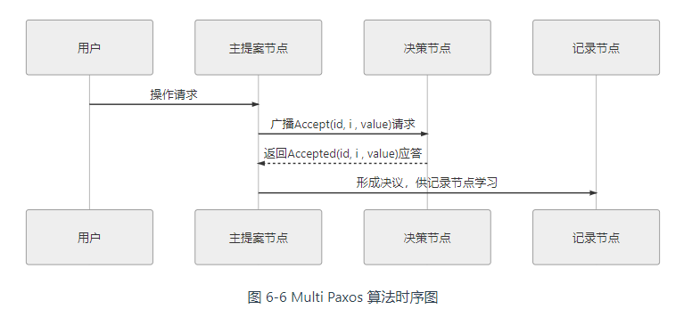
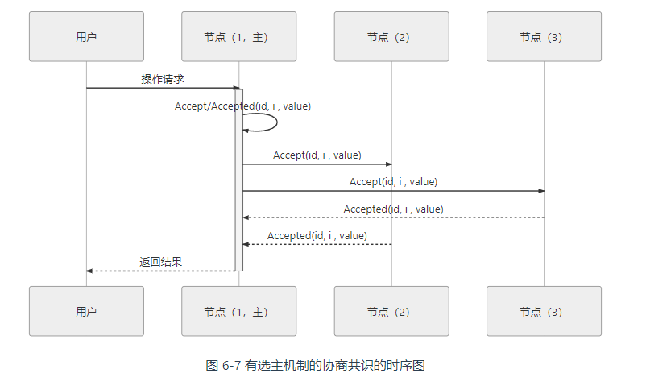

# 分布式理论

[TOC]

## 分布式共识

### 基本概念

**共识（Consensus）不等于一致性（Consistency）**

共识问题可以用数学语言来准确描述：一个分布式系统包含 n 个进程。每个进程都有一个初始值，进程之间互相通信，设计一种共识算法使得尽管出现故障，但进程之间仍能协商出某个不可撤销的最终决定值，且每次执行都满足以下三个性质：

- **终止性（Termination）**：一致的结果在有限时间内能完成
- **协定性（Agreement）**：不同节点最终完成决策的结果是相同的
- **完整性（Integrity）**：决策的结果必须是某个节点提出的提案

由 Fischer，Lynch 和 Patterson 三位科学家发表的《Impossibility of Distributed Consensus with One Faulty Process》论文中提出，在网络可靠，但允许节点失效（即便只有一个）的最小化异步模型系统中，不存在一个可以解决一致性问题的确定性共识算法。因此，我们主要研究同步系统中的分布式共识问题。

### Paxos

Paxos 是一种基于消息传递的协商共识算法。该算法并不考虑[拜占庭将军](https://en.wikipedia.org/wiki/Byzantine_fault)问题，也就是说，算法假设信息可能丢失也可能延迟，但不会被错误传递。

Paxos 算法将分布式系统中的节点分为三类：

1. **提案节点**：称为 Proposer，提出对某个值进行设置操作的节点。Paxos 是典型的基于操作转移模型而非状态转移模型来设计的算法，这里的「设置值」不要类比成程序中变量赋值操作，应该类比成日志记录操作
2. **决策节点**：称为 Acceptor，是应答提案的节点。提案一旦得到过**半数决策节点**的接受，即称该提案被**批准**（Accept），提案被批准即意味着该值不能再被更改，也不会丢失，且最终所有节点都会接受该它。
3. **记录节点**：被称为 Learner，不参与提案，也不参与决策，只是单纯地从提案、决策节点中学习已经达成共识的提案

所有的节点都是平等的，它们都可以承担以上某一种或者多种的角色。但是，决策节点的数量应该被设定为奇数个，且在系统初始化时，网络中每个节点都知道整个网络所有决策节点的数量、地址等信息。

Paxos 算法包括两个阶段。其中，第一阶段**「准备」（Prepare）**。如果某个提案节点准备发起提案，必须先向所有的决策节点广播一个许可申请（称为 Prepare 请求）。提案节点的 Prepare 请求中会附带一个全局唯一的数字 n 作为提案 ID。决策节点收到后，将会给予提案节点两个承诺与一个应答。

两个承诺是指：

- 承诺不会再接受提案 ID 小于或等于 n 的 Prepare 请求。
- 承诺不会再接受提案 ID 小于 n 的 Accept 请求。

一个应答是指：

- 不违背以前作出的承诺的前提下，回复已经批准过的提案中 ID 最大的那个提案所设定的值和提案 ID。如果该值从来没有被任何提案设定过，则返回空值（表明它是第一个设置值的节点）。
- 如果违反此前做出的承诺，即收到的提案 ID 并不是决策节点收到过的最大的，那允许直接对此 Prepare 请求不予理会。

当提案节点收到了多数派决策节点的应答（称为 Promise 应答）后，可以开始第二阶段**「批准」（Accept）**

- 如果提案节点发现所有响应的决策节点此前都没有批准过该值（即为空），那说明它是第一个设置值的节点，可以随意地决定要设定的值，将自己选定的值与提案 ID，构成一个二元组 (id, value)，再次广播给全部的决策节点（称为 Accept 请求）
- 如果提案节点发现响应的决策节点中，已经有至少一个节点的应答中包含有值了（已经有节点批准了）。那它就不能够随意取值了，必须无条件地从应答中提案 ID 最大的那个值并接受，构成一个二元组 (id, maxAcceptValue)，再次广播给全部的决策节点（称为 Accept 请求）

当每一个决策节点收到 Accept 请求时，都会在不违背以前作出的承诺的前提下，接收并持久化对当前提案 ID 和提案附带的值。如果违反此前做出的承诺，即收到的提案 ID 并不是决策节点收到过的最大的，那允许直接对此 Accept 请求不予理会。

当提案节点收到了多数派决策节点的应答（称为 Accepted 应答）后，协商结束，共识决议形成，将形成的决议发送给所有记录节点进行学习。

下面通过一个例子来说明 Paxos 的运作过程：

假设一个分布式系统有五个节点，分别命名为 S1、S2、S3、S4、S5。此时，有两个并发的请求分别希望将同一个值分别设定为 X（由 S1作为提案节点提出）和 Y（由 S5作为提案节点提出），以 P 代表准备阶段，以 A 代表批准阶段，这时候可能发生以下情况：

- S1选定的提案 ID 是 3.1（全局唯一 ID 加上节点编号），先取得了多数派决策节点的 Promise 和 Accepted 应答，此时 S5选定提案 ID 是 4.5，发起 Prepare 请求。收到的应答中至少会包含 1 个此前应答过 S1的决策节点（S3），那么 S3提供的 Promise 中必将包含 S1已设定好的值 X，S5就必须无条件地用 X 代替 Y 作为自己提案的值，由此整个系统对“取值为 X”这个事实达成一致

  

- 

- S5提案时 Promise 应答中并未包含批准过 X 的决策节点，譬如应答 S5 提案时，节点 S1已经批准了 X，节点 S2、S3未批准但返回了 Promise 应答，此时 S5以更大的提案 ID 获得了 S3、S4、S5的 Promise，这三个节点均未批准过任何值，那么 S3将不会再接收来自 S1的 Accept 请求，因为它的提案 ID 已经不是最大的了，这三个节点将批准 Y 的取值，整个系统最终会对“取值为 Y”达成一致

- 从情况三可以推导出另一种极端的情况，如果两个提案节点交替使用更大的提案 ID 使得准备阶段成功，但是批准阶段失败的话，这个过程理论上可以无限持续下去，形成活锁（Live Lock）

  

Basic Paxos 只能对单个值形成决议，并且决议的形成至少需要两次网络请求和应答（准备和批准阶段各一次），高并发情况下将产生较大的网络开销，极端情况下甚至可能形成活锁。总之，Basic Paxos 是一种很学术化但对工业化并不友好的算法.

### Multi Paxos

可以将「分布式系统中如何对某个值达成一致」（共识问题）分解为三个子问题来考虑：

- 如何选主（Leader Election）
- 如何把数据复制到各个节点上（Entity Replication）
- 如何保证过程是安全的（Safety）

#### 选主

Multi Paxos 对 Basic Paxos 的核心改进是增加了**「选主」**的过程，提案节点会通过定时轮询 （心跳），确定当前网络中的所有节点里是否存在有一个主提案节点，一旦没有发现主节点存在，节点就会在心跳超时后使用 Basic Paxos，向所有其他节点广播自己希望竞选主节点的请求。

当选主完成之后，除非主节点失联之后发起重新竞选，否则从此往后，就只有主节点本身才能够提出提案。此时，无论哪个提案节点接收到客户端的操作请求，都会将请求转发给主节点来完成提案，而主节点提案的时候，也就无需再次经过准备过程。也可以通俗理解为选主过后，就不会再有其他节点与它竞争，所以此时系统中要对某个值达成一致，只需要进行一次批准的交互即可

二元组(id, value)已经变成了三元组(id, i, value)，这是因为需要给主节点增加一个“任期编号”（纪元），这个编号必须是严格单调递增的，以应付主节点陷入网络分区后重新恢复，但另外一部分节点仍然有多数派，且已经完成了重新选主的情况，此时必须以任期编号大的主节点为准。

#### 复制

在正常情况下：

1. 当客户端向主节点发起一个操作请求，譬如提出“将某个值设置为 X”，
2. 主节点将 X 写入自己的变更日志，但先不提交
3. 接着把变更 X 的信息在下一次心跳包中广播给所有的从节点，并要求从节点回复确认收到的消息
4. 从节点收到信息后，将操作写入自己的变更日志，然后给主节点发送确认签收的消息
5. 主节点收到过半数的签收消息后，提交自己的变更、应答客户端并且给从节点广播可以提交的消息
6. 从节点收到提交消息后提交自己的变更，数据在节点间的复制宣告完成。

在异常情况下，网络出现了分区，部分节点失联，但只要仍能正常工作的节点的数量能够满足多数派（过半数）的要求，分布式系统就仍然可以正常工作。假设有 S1、S2、S3、S4、S5五个节点，S1是主节点，由于网络故障，导致 S1（主节点）、S2和 S3（主节点）、S4、S5之间彼此无法通信，形成网络分区。而现在故障恢复，分区解除，此时：

1. S1 和 S3 都向所有节点发送心跳包，从各自的心跳中可以得知两个主节点里 S3 的任期编号更大，它是最新的，此时五个节点均只承认 S3 是唯一的主节点。
2. S1、S2 回滚它们所有未被提交的变更
3. S1、S2 从主节点发送的心跳包中获得它们失联期间发生的所有变更，将变更提交写入本地磁盘

### Gossip 协议

Paxos、Raft、ZAB 等分布式算法经常会被称作是「强一致性」的分布式共识协议。尽管系统内部节点可以存在不一致的状态，但从系统外部看来，不一致的情况并不会被观察到，所以整体上看系统是强一致性的。与它们相对的，还有另一类被冠以「最终一致性」的分布式共识协议，这表明系统中不一致的状态有可能会在一定时间内被外部直接观察到。典型的最终一致的分布式系统就是 DNS 系统

这里介绍的 Gossip 协议是一种最终一致性的分布式共识协议。它可以看作是以下两个步骤的简单循环：

- 如果有某一项信息需要在整个网络中所有节点中传播，那从信息源开始，选择一个固定的传播周期（譬如 1 秒），随机选择它相连接的 k 个节点（称为 Fan-Out）来传播消息。
- 每一个节点收到消息后，如果这个消息是它之前没有收到过的，将在下一个周期内，选择相邻 k 个节点发送相同的消息，除了发送消息给它的那个节点外。
- 直到最终网络中所有节点都收到了消息

Gossip 有两个明显的缺点：

1. 网络传播中消息冗余量
2. 尽管可以在整体上测算出统计学意义上的传播速率，但对于个体消息来说，无法准确地预计到需要多长时间才能达成全网一致

## 分布式事务

见「 Seata 事务」笔记

## 时间和时间顺序

开发者在设计软件时，默认状态和流程的演进是随着时间流动方向进行的。

UTC 是最主要的世界时间标准，通过不规则地加上正或负闰秒来抵消地球自转变化的影响。

NTP 是目前主流的时钟同步协议，它是一个典型的 C/S 架构。

显然，往返延迟 $\delta = (t_3 - t_0) - (t_2 - t_1)$。 那么， NTP 把 NTP 客户端应该设置的时间称为时间偏移，用 $\theta$ 来表示
$$
\theta = t_2 + \frac{\delta}{2}
$$
具体的算法会更复杂一些。 NTP 客户端通常会定期轮询一个或更多服务器，然后使用一个统计算法得到一个最优时间偏移。然后调整时钟频率以逐渐减小时间误差。