# 透明多级分流系统

[TOC]


系统中的不同设施：

1. **本地缓存、内容分发网络、反向代理**：能够迅速响应用户的请求，避免给后方的 I/O 与 CPU 带来压力。一般位于位于客户端或网络的边缘
2. **集群中能够自动扩缩的服务节点**：能够线性拓展，易于伸缩，可以使用较小的代价堆叠机器来获得与用户数量相匹配的并发性能，通常作为业务逻辑的主要载体
3. **服务注册中心、配置中心**：对系统运行有全局性的影响，要时刻保持着容错备份，维护着高可用性
4. **系统入口的路由、网关或者负载均衡器**：是天生的单点部件，只能依靠升级机器本身的网络、存储和运算性能来提升处理能力

对系统进行流量规划时，我们应该充分理解这些设施的价值差异，有两条简单、普适的原则能指导我们进行设计：

- 尽可能减少单点部件，如果某些单点是无可避免的，则应尽最大限度减少到达单点部件的流量
- 在能满足需求的前提下，**最简单的系统就是最好的系统**。

## 客户端缓存

HTTP 协议是无状态协议，每次请求是独立的。这简化了 HTTP 服务器的设计，但是由于服务端不保存此前请求的状态，所以也不可避免地导致其携带有重复的数据，而造成网络性能降低。

根据约定，强制缓存在浏览器的地址输入、页面链接跳转、新开窗口、前进和后退中均可生效，但在用户主动刷新页面时应当自动失效。HTTP 协议中的两个 Header 可以实现强制缓存：

- **Expires**：当服务器返回某个资源时带有该 Header 的话，意味着服务器承诺截止时间之前资源不会发生变动，浏览器可直接缓存该数据，不再重新发请求。但客户端修改了本地时间，将时间前后调整几分钟，就可能会造成缓存提前失效或超期持有。

  ~~~htpp
  HTTP/1.1 200 OK
  Expires: Wed, 8 Apr 2020 07:28:00 GMT
  ~~~

- **Cache-Control**：它的语义比起 Expires 来说就丰富了很多，如果 Cache-Control 和 Expires 同时存在，并且语义存在冲突（譬如 Expires 与 `max-age` / `s-maxage` 冲突）的话，那么以 Cache-Control 为准

  - `max-age` 和 `s-maxage`：`max-age` 后面跟随一个以秒为单位的数字，表明相对于请求 时间（在 Date Header 中会注明请求时间）多少秒以内缓存是有效的，资源不需要重新从服务器中获取。相对时间避免了 Expires 中采用的绝对时间可能受客户端时钟影 响的问题。`s-maxage` 中的“s”是“Share”的缩写，意味“共享缓存”的有效时间，即允许被 CDN、代理等持有的缓存有效时间，用于提示 CDN 这类服务器应在何时让缓存失效。
  - `public` 和 `private`：指明是否涉及到用户身份的私有资源，如果是 `public`，则可以被代理、CDN 等缓存，如果是 `private`，则只能由用户的客户端进行私有缓存。
  - `no-cache` 和 `no-store`
  - `no-transform`：禁止资源被任何形式地修改。譬如，某些 CDN、透明代理支持自动 GZip 压缩图片或文本，以提升网络性能
  - `min-fresh` 和 `only-if-cached`
  - `must-revalidate` 和 `proxy-revalidate`


在多数情况下，都并没有什么把握去承诺某项资源多久不会发生变化。协商缓存是一种基于变化检测的缓存机制，在一致性上会有比强制缓存更好的表现，但需要一次变化检测的交互开销，性能上就会略差一些。根据约定，协商缓存不仅在浏览器的地址输入、页面链接跳转、新开窗口、前进、后退中生效，而且在用户主动刷新页面（F5）时也同样是生效的。只有用户强制刷新（Ctrl+F5） 或者明确禁用缓存（譬如在 DevTools 中设定）时才会失效，此时客户端向服务端发出的请求会自动携带“Cache-Control: no-cache”。

协商缓存有两种变动检查机制：

- `Last-Modified` 和 `If-Modified-Since`：`Last-Modified` 是服务器的响应 Header，用于告诉客户端这个资源的最后修改时间。当客户端需要再次请求时，会通过 `If-Modified-Since` 把之前收到的最后修改时间发送回服务端。 
- `Etag` 和 `If-None-Match`：Etag 是服务器的响应 Header，用于告诉客户端这个资源的唯一标识。HTTP 服务器可以自行决定如何生成这个标识。当客户端需要再次请求时，会通过 `If-None-Match` 把之前收到的资源唯一标识发送回服务端。

服务器对于客户端 `If-Modified-Since` 或者 `If-None-Match` 的响应：

- 如果服务端发现资源没有变动，就只要返回一个 `304/Not Modified` 的响应即可，无须附带消息体。
- 否则，就会返回 200/OK 的完整响应，在消息体中包含最新的资源


Etag 是 HTTP 中一致性最强的缓存机制，而 Last-Modified 只能支持到秒级。Etag 却又是 HTTP 中性能最差的缓存机制。因为每次请求时，服务端都必须对资源进行哈希计算，这比起简单获取一下修改时间，开销要大了很多。

Etag 和 Last-Modified 是允许一起使用的，服务器会优先验证 Etag，在 Etag 一致的情况下，再去对比 `Last-Modifie d`。这是为了防止有一些 HTTP 服务器没有将文件修改日期纳入到哈希计算策略中。


为了支持一个URL获取多份不同版本的资源（一段文字的不同语言版本，一个文件的不同编码格式版本等），HTTP 协议设计了内容协商机制，该机制包括以下 Headers：

- 以 Accept*（Accept、Accept-Language、Accept-Charset、Accept-Encoding）请求 Header 
- 对应的以 Content-*（Content-Language、Content-Type、Content-Encoding）响应 Header


缓存机制通过 Vary Header，来获知根据什么内容，对同一个 URL 返回给用户正确的资源：

~~~http
HTTP/1.1 200 OK
Vary: Accept, User-Agent
~~~

以上响应的含义是，应该根据 MIME 类型和浏览器类型来缓存资源

## 域名解析

 DNS 本身就堪称是示范性的透明多级分流系统，它是全世界最大、使用最频繁的信息查询系统。但多级分流的设计有个明显的缺点就是响应速度。

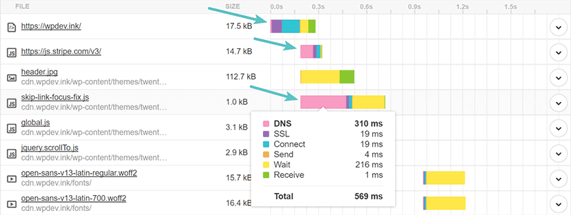

可以通过「DNS 预取」（DNS Prefetching）的前端优化手段用来避免这类问题。即在网页加载时生成一个 link 请求，使得浏览器提前对该域名进行解析：

~~~html
<link rel="dns-prefetch" href="//domain.not-icyfenx.cn">
~~~

## 传输链路

HTTP 所传输对象的主要特征是数量多、时间短、资源小、切换快。而 TCP 协议本身是面向于长时间、大数据传输来设计的，在长时间尺度下，它连接建立的高昂成本才不至于成为瓶颈，它的稳定性和可靠性的优势才能展现出来。因此，可以说 HTTP over TCP 这种搭配在目标上的确是有矛盾的。以至于 HTTP/1.x 时代，开发出了各种奇技淫巧（ CSS Sprites、媒体内嵌、合并异步请求等），来解决这种矛盾。只有在协议本身上做出突破，才能更好地优化传输链路。这里我们介绍三种基本优化手段。

### 连接数优化

HTTP 通过**「持久连接」（Persistent Connection）**，即 Keep-Alive 机制，来尽可能地在各种资源间复用 TCP 连接。但是它有个明显的问题—— **「队首阻塞」（Head-of-Line Blocking）**。

在 HTTP/1.x 中，HTTP 请求就是最小粒度的信息单位了。而在 HTTP/2 中，帧（Frame）才是最小粒度的信息单位，每个帧都附带一个流 ID 以标识这个帧属于哪个流，这样方便将帧重新组装成请求/响应报文。这被称为 **HTTP/2 多路复用（HTTP/2 Multiplexing）**技术

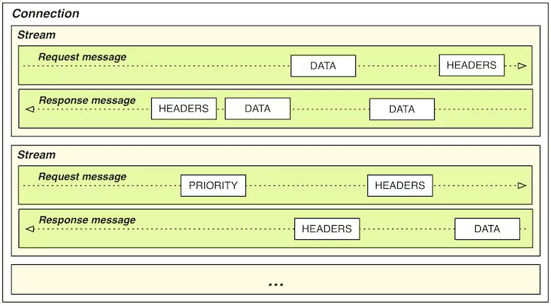

有了多路复用的支持，HTTP/2 就可以对每个域名只维持一个 TCP 连接（One Connection Per Origin），然后以任意顺序传输任意数量的资源，避免了 HTTP/1.x 中的队首阻塞问题。与 HTTP/1.x 相反，HTTP/2 本身反而变得更适合传输小资源了，譬如传输 1000 张 10K 的小图，HTTP/2 要比 HTTP/1.x 快，但传输 10 张 1000K 的大图，则应该 HTTP/1.x 会更快。这一方面是 TCP 连接数量（相当于多点下载）的影响，更多的是由于 TCP 协议可靠传输机制导致的，一个错误的 TCP 包会导致所有的流都必须等待这个包重传成功。因此，把小文件合并成大文件，在 HTTP/2 下是毫无好处的。

### 传输压缩

有两种压缩方式：

- **静态预压缩**：资源提前在服务器中压缩好，当客户端可以接受压缩版本的资源时（请求的 Header 中包含 Accept-Encoding: gzip）就返回压缩后的版本，否则就返回未压缩的原版。

- **即时压缩**：现在服务器都采用即时压缩方式，这样以显著提高**「首字节时间」（Time To First Byte，TTFB）**，改善 Web 性能体验。但是此时没有办法给出 `Content-Length`，这与 HTTP/1.0 中持久连接相冲突，因为它需要 `Content-Length` 来判断资源是否传输完毕。在 HTTP/1.1 版本中修复了这个缺陷，增加了**「分块传输编码」**（Chunked Transfer Encoding）特性，即在响应 Header 中加入**「Transfer-Encoding: chunked」**，然后报文中的 Body 需要使用一系列分块来传输：

  ~~~html
  HTTP/1.1 200 OK
  Date: Sat, 11 Apr 2020 04:44:00 GMT
  Transfer-Encoding: chunked
  Connection: keep-alive
  
  25
  This is the data in the first chunk
  
  1C
  and this is the second one
  
  3
  con
  
  8
  sequence
  
  0
  ~~~

### 快速 UDP 网络连接

要从根本上改进 HTTP，必须直接替换掉 HTTP over TCP 的根基，即 TCP 传输协议，这便最新一代 HTTP/3（HTTP over QUIC） 协议的设计重点。QUIC的特性如下：

1.  QUIC 的可靠传输能力并不是由底层协议提供，而是完全由自己来实现。这样能对每个流能做单独的控制。
2. 面向移动设备：QUIC 提出了连接标识符的概念，该标识符可以唯一地标识客户端与服务器之间的连接，而无须依靠 IP 地址。避免了因 IP 切换而造成 TCP 连接重新建立。

无论是 TCP 协议还是 HTTP 协议，都已经存在了数十年时间。它们积累了大量用户的同时，也承载了很重的技术惯性。互联网基础设施中的许多中间设备，都只面向 TCP 协议去建造，仅对 UDP 提供很基础的支持，有的甚至完全阻止 UDP 的流量。因此，Google 在 Chromium 的网络协议栈中同时启用了 QUIC 和传统 TCP 连接，并在 QUIC 连接失败时以零延迟回退到 TCP 连接。

## 内容分发网络

仅从网络传输的角度看，一个互联网系统的速度取决于以下四点因素：

1. 网站服务器接入网络运营商的链路所能提供的出口带宽
2. 用户客户端接入网络运营商的链路所能提供的入口带宽
3. 从网站到用户之间经过的不同运营商之间互联节点的带宽，一般来说两个运营商之间只有固定的若干个点是互通的，所有跨运营商之间的交互都要经过这些点
4. 从网站到用户之间的物理链路传输时延

内容分发网络，能为互联网系统解决跨运营商、跨地域物理距离所导致的时延问题，能为网站流量带宽起到分流、减负的作用。因此可以解决上述 1、3、4 问题

CDN的**路由解析**：

1. 在架好“`icyfenix.cn`”的服务器后，将服务器的 IP 地址在 CDN 服务商上注册，注册后会得到一个 CNAME。
2. 将得到的 CNAME 在 DNS 服务商上注册为一条 CNAME 记录

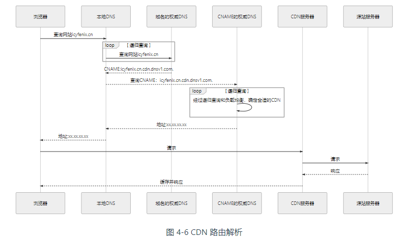


**内容分发**：CDN 获取源站资源的过程被称为「内容分发」，目前主要有两种内容分发方式：

1. **主动分发**（Push）：由源站主动发起，将内容推送到各个 CDN 缓存节点上。主动分发一般用于网站要预载大量资源的场景，它只对用户一侧单向透明
2. **被动回源**（Pull）：当某个资源首次被用户请求的时候，CDN 缓存节点发现自己没有该资源，就会实时从源站中获取。显然，被动回源的首次访问通常是比较慢的，它的优点是可以做到完全的双向透明

这里还需要考虑如何管理（更新）资源，现在最常见的做法是：

1. **超时失效**：给予缓存资源一定的生存期，超过了生存期就在下次请求时重新被动回源一次
2. **手工失效**： CDN 服务商一般会提供给程序调用来失效缓存的接口

## 负载均衡

负载均衡器，对外暴露统一的接口以提供服务，对内调度后方的多台机器。

从 DNS 解析开始，通过域名 → CNAME → 负载调度服务 → 就近的数据中心入口的路径，根据 IP 地址将用户请求分配到一个合适的数据中心中。然后我们探讨数据中心内部的负载均衡。它可以分为两种，四层负载均衡（传输层）七层负载均衡（应用层）

- 四层负载均衡的优势是性能高，七层负载均衡的优势是功能强
- 做多级混合负载均衡，通常应是低层的负载均衡在前，高层的负载均衡在后

四层负载均衡实际上是多种均衡器工作模式的统称，这些工作模式的共同特点是维持着同一个 TCP 连接，而不是说负载均衡在第四层工作。事实上，这些模式是在二层（数据链路层，改写 MAC 地址）和三层（网络层，改写 IP 地址）上工作


数据链路层负载均衡修改请求的数据帧中的 MAC 目标地址。使用这种负载均衡模式时，需要把真实物理服务器集群所有机器的**虚拟 IP 地址（Virtual IP Address，VIP）**，配置成负载均衡器的虚拟 IP 。这种负载均衡模式也常被很形象地称为**「三角传输模式」（Direct Server Return，DSR）**，也有叫**「直接路由」（Direct Routing）**。

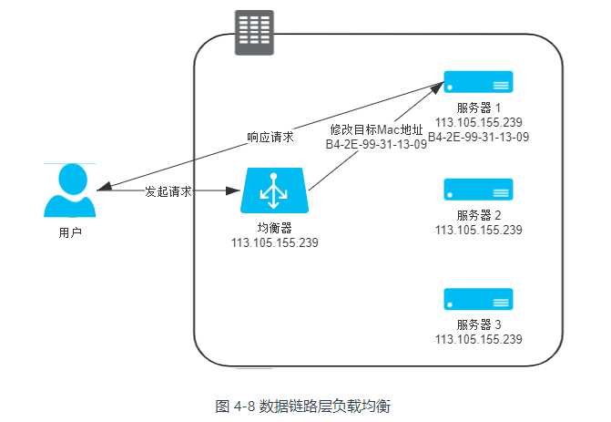


网络层负载均衡修改请求的数据帧中的 IP 目标地址。有两种修改方式：

- 均衡器在原本数据包的基础上，添加额外的 Header，其中目标地址写入真实服务器的 IP。服务器接收到该新数据包后，将负载均衡器自动添加的那层 Headers 扔掉

  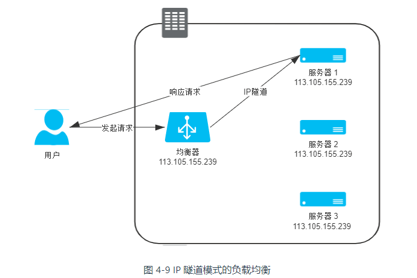

  这种模式要求：

  - 服务器集群中的所有机器的虚拟 IP 地址，配置成负载均衡器的虚拟 IP 。因为回复该数据包时，需要使用这个虚拟 IP 作为响应数据包的源地址，这样客户端收到这个数据包时才能正确解析。
  - 服务器必须支持 IP 隧道协议（IP Encapsulation）

- 均衡器需要分别修改用户请求中的目标地址，以及服务器响应中的源地址：

  

  在流量压力比较大的时候，NAT 模式的负载均衡会带来较大的性能损失
  


  工作在四层之后的负载均衡模式就无法再进行转发了，只能进行代理。此时真实服务器、负载均衡器、客户端三者之间由两条独立的 TCP 通道来维持通信

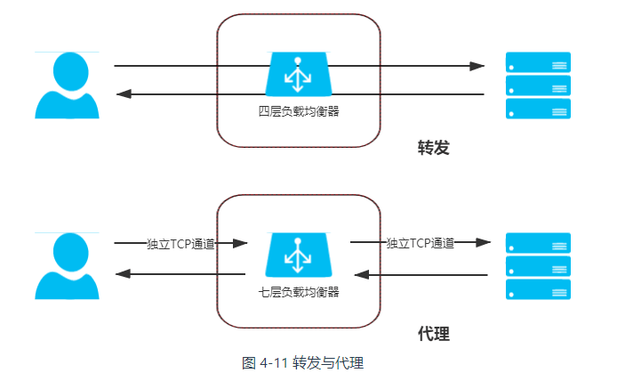

  代理根据哪一方能感知到，可以分为

- 正向代理：在客户端设置的、代表客户端与服务器通信的代理服务，它是客户端可知，而对服务器透明的
- 反向代理：客户端来说是透明的
- 透明代理：对于双方是透明的

很显然，七层负载均衡器就属于反向代理中的一种。只论网络性能，七层均衡器肯定是无论如何比不过四层均衡器的，它比四层均衡器至少多一轮 TCP 握手，有着跟 NAT 转发模式一样的带宽问题。但可用的解析规则远比四层丰富，更加灵活


均衡策略与实现：

- **轮循均衡**（Round Robin）：每一次来自网络的请求轮流分配给内部中的服务器。
- **权重轮循均衡**（Weighted Round Robin）：根据服务器的不同处理能力，给每个服务器分配不同的权值，使其能够接受相应权值数的服务请求
- **随机均衡**（Random）：把来自客户端的请求随机分配给内部中的多个服务器
- **一致性哈希均衡**（Consistency Hash）：根据请求中某一些数据（可以是 MAC、IP 地址，也可以是更上层协议中的某些参数信息）作为特征值来计算需要落在的节点上
- **响应速度均衡**（Response Time）：负载均衡设备对内部各服务器发出一个探测请求（例如 Ping），然后根据内部中各服务器对探测请求的最快响应时间来决定哪一台服务器来响应客户端的服务请求。
- **最少连接数均衡**（Least Connection）
- ...

负载均衡器的实现分为：

- 软件均衡器
  - 操作系统内核的均衡器：LVS（Linux Virtual Server）
  - 应用程序形式的均衡器：Nginx、HAProxy、KeepAlived 等


## 服务端缓存

服务端缓存设计的出发点是缓解 CPU 和 I/O 资源在峰值流量下的压力，顺带而非专门地提升响应性能。

- 为缓解 CPU 压力而做缓存：譬如把方法运行结果存储起来
- 为缓解 I/O 压力而做缓存：譬如把原本对网络、磁盘等较慢介质的读写访问，变为对内存等较快介质的访问


我们设计或者选择缓存至少会考虑以下四个维度的属性：

- **吞吐量**
- **命中率**
- **扩展功能**：例如失效时间、统计信息等等
- **分布式支持**


相比起内存中读写的速度，网络传输、数据复制、序列化和反序列化等操作所导致的延迟要比其高得多。所以对分布式缓存来说，处理与网络有相关的操作是对吞吐量影响更大的因素。有两种分布式缓存形式：

- **复制式缓存**：数据在分布式集群的每个节点里面都存在有一份副本，读取数据时无须网络访问，直接从当前节点的进程内存中返回。当数据发生变化时，就必须遵循复制协议，将变更同步到集群的每个节点中。只适合甚少更新但频繁读取的数据
- **集中式缓存**：集中式缓存的读、写都需要网络访问。典型代表是 Redis。集中式缓存与使用缓存的应用分处在独立的进程空间中，其好处是它能够为异构语言提供服务。

如有需要，完全可以同时把进程内缓存和分布式缓存互相搭配，构成多级缓存（Transparent Multilevel Cache，TMC），即使用进程内缓存做一级缓存，分布式缓存做二级缓存

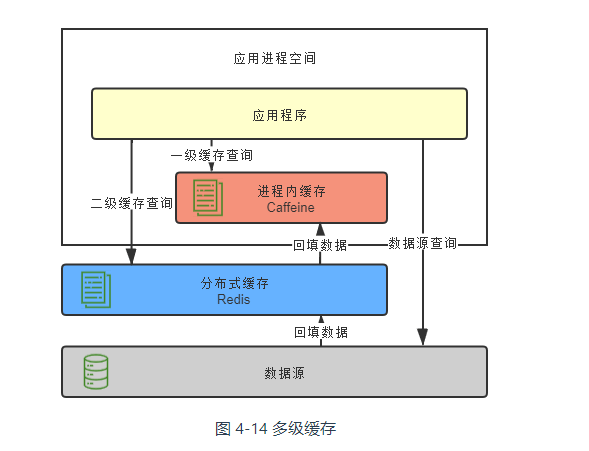

如何做到透明呢？一种常见的设计原则是**变更以分布式缓存中的数据为准**。大致做法是当数据发生变动时，在集群内发送推送通知（简单点的话可采用 Redis 的 PUB/SUB，求严谨的话引入 ZooKeeper 或 Etcd 来处理），让各个节点的一级缓存自动失效掉相应数据。当访问缓存时，提供统一封装好的一、二级缓存联合查询接口，接口外部是只查询一次，接口内部自动实现优先查询一级缓存，未获取到数据再自动查询二级缓存的逻辑。

实际上，分布式缓存集群通常设计为 AP，并不追求数据一致性。

缓存风险：

- **缓存穿透**：每次请求缓存都未命中。查询的数据在数据库中根本不存在的话，缓存里自然也不会有。解决方案：

  - 对于恶意攻击导致的缓存穿透，在缓存之前设置一个布隆过滤器。布隆过滤器是用最小的代价来判断某个元素是否存在于集合的数据结构
  - 对于业务逻辑本身就不能避免的缓存穿透，可以正常查询结果为空的 Key 值依然进行缓存，使得在一段时间内缓存最多被穿透一次。如果后续业务在数据库中对该 Key 值插入了新记录，那应当在插入之后主动清理掉缓存的 Key 值。

- **缓存击穿**：缓存中某些热点数据忽然因某种原因（譬如超期而失效）失效了，此时又有多个针对该数据的请求同时发送过来，这些请求将全部未能命中缓存，都到达真实数据源中去，导致其压力剧增，这种现象被称为缓存击穿。要避免缓存击穿问题，通常会采取下面的两种办法：

  - 加锁同步，以请求该数据的 Key 值为锁，使得只有第一个请求可以流入到真实的数据源中，其他线程采取阻塞或重试策略。如果是进程内缓存出现问题，施加普通互斥锁即可，如果是分布式缓存中出现的问题，就施加分布式锁
  - 热点数据由代码来手动管理

  由于大批不同的数据在短时间内一起失效，导致了这些数据的请求都击穿了缓存到达数据源，同样令数据源在短时间内压力剧增。而缓存击穿是针对单个热点数据失效。原因分析：

  - 系统有专门的缓存预热功能，这样都可能出现由此载入缓存的大批数据具有相同的过期时间
  - 缓存服务由于某些原因崩溃后重启，此时也会造成大量数据同时失效

  解决方案：

  - 提升缓存系统可用性，建设分布式缓存的集群
  - 启用透明多级缓存
  - 将缓存的生存期从固定时间改为一个时间段内的随机时间

- **缓存雪崩**：缓存雪崩的英文原意是 stampeding herd（奔逃的野牛），指的是缓存层宕掉后，流量会像奔逃的野牛一样，打向后端存储。可以从以下三方面入手

  - 保证缓存层服务高可用性
  - 依赖隔离组件，为后端限流并降级。

- 缓存污染：缓存中的数据与真实数据源中的数据不一致的现象。缓存污染多数是由开发者更新缓存不规范而造成，现在业界总结了一些设计模式，譬如  Cache Aside、Read/Write Through、Write Behind Caching 等。这些设计模式仍会出现数据不一致的情况，但概率是很低的

## 缓存设计

加入缓存是为了获得高性能、高吞吐。如果要设计 CP 系统，就不适合用缓存。如果要为 CP 系统强行引入缓存，那么就需要引入分布式锁。这是个低性能方案，与缓存的设计目标相违背。

由于引入 Redis 框架作为缓存层的解决方案，那么必须处理持久化层与缓存层写同步的问题，否则有丢失数据的风险，即数据一致性问题。有三种实现缓存更新的方案，但是它们都不能完美地解决一致性问题，但是出现问题的概率在不同场景下是有所不同的。

**旁路缓存（Cache-Aside Pattern）模式**：读取缓存、更新缓存的操作都在应用程序中完成

- 读操作流程
  1. 应用程序优先从缓存中查找数据
  2. 如果缓存命中，则从缓存中直接查询出来
  3. 如果缓存未命中，则从数据库中查询数据，并写入到缓存中。
- 写操作流程
  1. 先写入数据库
  2. 然后直接删除 cache 

对于写操作流程，还有其他的双写策略，这些双写策略都不能完全避免不一致问题。但是它们在各个场景下出现不一致问题的概率是有所不同的。不一致性问题主要由两方面原因：

- 高并发环境
- 第一个操作成功，第二个操作失败


- **先更新缓存，再更新数据库**：

  如果更新缓存成功，而更新数据库失败，此时会发生回滚，但是缓存操作无法回滚，因此出现不一致问题。

- **先更新数据库，再更新缓存**。

  如果更新数据库成功，而更新缓存失败，造成数据库回滚，保证了一致性。

  但是由于更新缓存超时（504），但实际上已经更新完成了，那么仍会有不一致性问题。但是这种情况发生的概率极小。

  考虑这样一个操作序列：微服务 A、B 同时更新数据，具体过程见下图：

  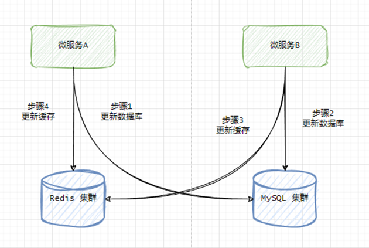

  这样当操作序列执行完毕后，在数据库中的数据是 Provider B 的，而在缓存中的数据是 Provider A 的。

- **先删除缓存，再更新数据库**。

  考虑这样一个操作序列，微服务 A 更新数据，而微服务B 读取数据，具体过程见下图：

  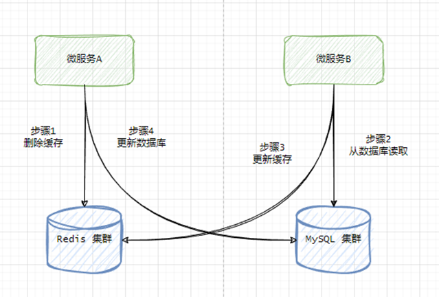

  这样当操作序列执行完毕后，缓存中是旧的数据，而数据库中是新的数据。

- **先更新数据库，再删除缓存**。考虑这样一个操作序列，微服务A更新数据，而微服务B 读取数据，具体过程见下图：

  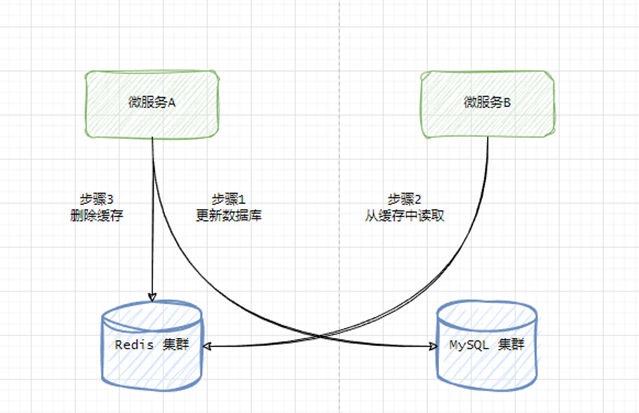

  微服务 B 在读取缓存时，有极小概率，也就是在 A 更新数据与删除缓存这个短暂的时间窗口中，读取到不一致的数据。但是如果 B 在 A 更新完缓存后再去读取，一定能读取到最新的数据。

  此外，如果是微服务 B 先查询缓存，发现没有数据，于是要从数据库中读取出数据。但是此时微服务 A 更新了数据库，并删除缓存。最后微服务 B 将旧值写入到了缓存中。

  

特别注意，如果缓存的是一个集合，那么向其中添加元素是一个追加操作，而不是一个覆盖操作，在绝大场景下，直接添加元素即可。如果考虑到下游服务不可用的情况下，那么不推荐「先更新缓存，再更新数据库」的策略，但其他策略都可以使用。

我们可以通过「延迟双删」策略来保证双写策略的最终一致性。

~~~java
// 删除缓存
redisTemplate.delete(key);

// 更新数据库...
updateDatabase(key, value);

// 延迟执行第二次删除
taskScheduler.schedule(() -> {
    redisTemplate.delete(key);
}, new CronTrigger("0/1 * * * * ?")); // 假设 1 秒后执行，实际应根据需求设置定时表达式
~~~


**读/写穿透（Read/Write Through）模式**：它实际只是在缓存旁路模式（Cache-Aside）之上，抽象出来了一层 Cache Provider，将缓存逻辑从业务逻辑中剥离出来，使得应用程序无需关心数据是从缓存还是数据库中获取

- 读流程：
  1. 从 cache 中读取数据，读取到就直接返回 。
  2. 读取不到的话，先从 db 加载，写入到 cache 后返回响应。
  
- 写流程
  1. **同步更新 cache 和 db**。
  
  


**异步回写（Write Behind）模式**：异步回写模式和读/写穿透模式很相似，但它在写入时，只更新缓存，不同步更新数据库，而改为异步批量的方式来写入数据库，而读/写穿透模式是同步更新缓存和数据库的。该模式是弱一致性方案，且有丢数据的风险（持久化失败）

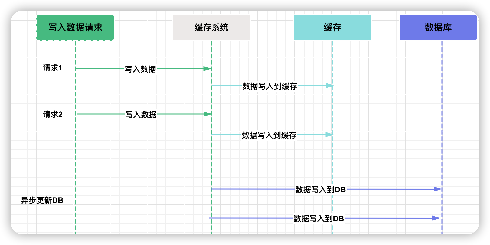


写入缓存的时机有两种：

1. **懒汉模式**，使用时加载缓存。具体来说，当需要使用数据时，从数据库中把它查询出来，然后写入缓存
2. **饿汉模式**，提前预加载缓存。具体来说，在项目启动时，预加载数据到缓存


##  Big keys & Hotkeys

Big Keys：

- 对于 String 类型的 Value 值，值超过 10MB（数据值太大）。
- 对于 Set 类型的 Value 值，含有的成员数量为 10000 个（成员数量多）。
-  对于 Hash 格式的 Value 值，所有成员变量的总 Value 值大小为 1000MB（成员总的体积过大）。数量不再关心

Big Keys 可能导致：

- 内存使用不均匀
- Redis 是单线程架构，操作大 Key 耗时较长，可能造成请求阻塞。


Hot Keys：

- 一段时间内某个 Key 的访问量远远超过其他的 Key，导致大量访问流量集中在某一个 Redis 实例中的特定 Key 上

Hot Keys 可能导致：

- 请求分配不均
- 流量高度集中，超出 Redis 的承受能力，从而引发系统雪崩。

处理方法：

- 读写分离架构
- 二级缓存 HotKeys 
- 如果 HotKeys 是集合结构，那么可以做进一步拆分

## 限流

其原理是将时间划分为固定大小的窗口，在每个窗口内限制请求的数量或速率

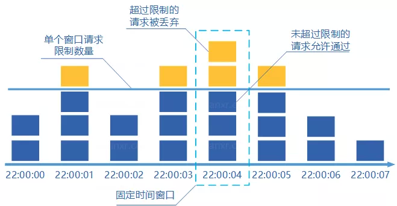

缺点：

- **限流不够平滑**。例如，我们限制某个接口每分钟只能访问 30 次，假设前 30 秒就有 30 个请求到达的话，那后续 30 秒将无法处理请求
- **无法保证限流速率，因而无法应对突然激增的流量**。例如，我们限制某个接口 1 分钟只能访问 1000 次，该接口的 QPS 为 500，前 55s 这个接口 1 个请求没有接收，后 1s 突然接收了 1000 个请求。


滑动窗口算法：同样也时间划分为固定大小的窗口，但是考虑一段时间内的所有窗口。这样还需要记录每个请求到达的时间点，因此对内存的占用会比较多。


我们往桶中以任意速率流入水，以一定速率流出水。当水超过桶流量则丢弃，因为桶容量是不变的，保证了整体的速率。


- 只能以固定的速率处理请求，对系统资源利用不够友好
- 桶流入水（发请求）的速率如果一直大于桶流出水（处理请求）的速率的话，那么桶会一直是满的，一部分新的请求会被丢弃，导致服务质量下降。


令牌桶算法是对漏斗算法的一种改进，除了能够起到限流的作用外，还允许一定程度的流量突发。

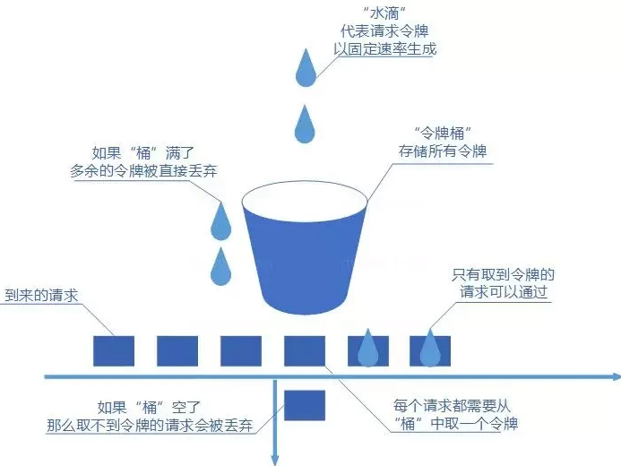

- 可以限制平均速率和应对突然激增的流量。
- 可以动态调整生成令牌的速率。

可以通过 Redisson 的 RRateLimiter 对象来实现分布式限流逻辑。

~~~java
RRateLimiter rateLimiter = redissonClient.getRateLimiter("LIMITER_NAME");
// 每 10 秒钟生成 5 个令牌
rateLimiter.trySetRate(RateType.OVERALL, 5, 10, RateIntervalUnit.SECONDS);

// 请求 num 个令牌。当请求不到时阻塞，最大阻塞时间为1分钟。
rateLimiter.tryAcquire(num,1,TimeUnit.MINUTES);
~~~

## Redis 限流原理

使用 Redis 也可以实现简单的限流，常见的限流方法有：

1. **基于计数器和过期时间实现的计数器算法**：使用一个计数器存储当前请求量（每次使用 incr 方法相加），并设置一个过期时间，让计数器在过一段时间自动清零。计数器未到达限流值就可以继续运行

   ~~~java
   public class RedisRateLimiter {
   	private static final String REDIS_KEY = "request_counter";
       private static final int REQUEST_LIMIT = 100; // 限流阈值
       private static final int EXPIRE_TIME = 60; // 过期时间（秒）
       public boolean allowRequest() {
           Jedis jedis = new Jedis("localhost");
           
           try {
               Long counter = jedis.incr(REDIS_KEY);
               // 这里未考虑线程安全问题
               if (counter == 1) {
                   // 第一次设置过期时间
                   jedis.expire(REDIS_KEY, EXPIRE_TIME);
               }
               
               if (counter <= REQUEST_LIMIT) {
                   return true; // 允许请求通过
               } else {
                   return false; // 请求达到限流阈值，拒绝请求
               }
           } finally {
               jedis.close();
           }
       }
   }
   ~~~

2. **基于有序集合（ZSet）实现的滑动窗口算法**：将请求都存入到 ZSet 集合中，在分数（score）中存储当前请求时间。然后再使用 ZSet 提供的 range 方法轻易的获取到 2 个时间戳内的所有请求，通过获取的请求数和限流数进行比较并判断，从而实现限流。

   ~~~java
   private static final String ZSET_KEY = "request_timestamps";
   private static final int WINDOW_SIZE = 60; // 时间窗口大小（单位：秒）
   private static final int REQUEST_LIMIT = 100; // 限流阈值
   
   public boolean allowRequest() {
       Jedis jedis = new Jedis("localhost");
       long currentTimestamp = System.currentTimeMillis() / 1000;
   
       // 添加当前请求的时间戳到有序集合
       jedis.zadd(ZSET_KEY, currentTimestamp, String.valueOf(currentTimestamp));
   
       // 移除过期的请求时间戳，保持时间窗口内的请求
       long start = currentTimestamp - WINDOW_SIZE;
       long end = currentTimestamp;
       jedis.zremrangeByScore(ZSET_KEY, 0, start);
   
       // 查询当前时间窗口内的请求数量
       Set<Tuple> requestTimestamps = jedis.zrangeByScoreWithScores(ZSET_KEY, start, end);
       long requestCount = requestTimestamps.size();
   
       jedis.close();
   
       // 判断请求数量是否超过限流阈值
       return requestCount <= REQUEST_LIMIT;
   }
   ~~~

   

3. **基于列表（List）实现的令牌桶算法**：在程序中使用定时任务给 Redis 中的 List 添加令牌，程序通过 List 提供的 leftPop 来获取令牌，得到令牌继续执行，否则就是限流不能继续运行。

   ~~~java
   @Configuration      // 1.注入到 IoC 中，启动程序时加载
   @EnableScheduling   // 2.开启定时任务
   public class SaticScheduleTask {
       @Autowired
       private RedisTemplate redisTemplate;
       // 3.添加定时任务
       @Scheduled(fixedRate = 1000)
       private void configureTasks() {
           redisTemplate.opsForList().rightPush("limit_list",UUID.randomUUID().toString());
       }
   }
   ~~~

   ~~~java
   public boolean allowRequest(){
       Object result = redisTemplate.opsForList().leftPop("limit_list");
       if(result == null){
           return false;
       }
       return true; 
   }
   ~~~


## 分布式 ID 设计

分布式 ID 需要满足下面这些要求：

- **全局唯一**

- **有序递增**

- **信息安全**：如果 ID 是连续的，恶意用户的扒取工作就非常容易做了。例如，按照顺序下载指定 URL 即可，或者可以根据订单 ID 的递增规律就能推算出每天的订单量。

  

分布式 ID 常见的解决方案：

1. 数据库主键自增

   ~~~sql
   CREATE TABLE `sequence_id` (
     `id` bigint(20) unsigned NOT NULL AUTO_INCREMENT,
     `stub` char(10) NOT NULL DEFAULT '',	-- stub 字段无意义，只是为了占位
     PRIMARY KEY (`id`),
     UNIQUE KEY `stub` (`stub`)
   ) ENGINE=InnoDB DEFAULT CHARSET=utf8mb4;
   ~~~

   ~~~sql
   BEGIN;
   REPLACE INTO sequence_id (stub) VALUES ('stub'); -- replace into 语句会根据唯一键/主键删除原有的一条记录， 并且插入一条新的记录来替换原记录。
   SELECT LAST_INSERT_ID();
   COMMIT;
   ~~~

   这种方式性能极差，可以使用 Redis 来稍微改善一下性能问题。

2. 数据库号段模式：先批量获取，然后存在在内存里面。当号用完了，再从数据库中获取新的号段。

3. UUID，并不推荐，对于索引并不友好，性能差。

4. Snowflake 算法：

   

   - **timestamp（41 bits）**：一共 41 位，用来表示时间戳，单位是毫秒，可以支撑约 69 年
   - **datacenter id + worker id （10 bits）**：一般来说，前 5 位表示机房 ID，后 5 位表示机器 ID
   - **sequence （12 bits）**：一共 12 位，用来表示序列号。每毫秒最多生成 4096 个唯一 ID

   该算法有时钟回拨的问题


## 如何保证幂等性

接口幂等性问题通常由以下多种原因引起：

- 用户快速重复点击
- 网络波动：网络通信中延迟等情况，可能导致客户端未收到服务端的响应，或服务端未收到客户端的请求。此时客户端可能会重试发送请求，导致接口被重复调用。
- 定时任务或异步处理：定时任务的调度逻辑设计不当，可能会导致同一任务被执行多次。或者在消息队列中，消息可能会因为异常等原因被重复消费。
- 并发控制

可以使用 RPG （POST/Redirect/GET）模式来解决，它是一种前端交互策略，具体的交互流程如下：

1. 并通过 POST 请求将其发送至服务器
2. 服务器通过 HTTP 响应码 302 或 303 实现重定向
3. 当用户在此后刷新页面时，浏览器只会按照常规方式重新发起 GET 请求，而非重新提交 POST 数据

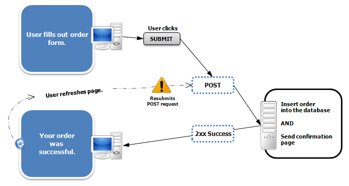


Token 机制具体流程如下：

1. 当用户开始执行一个需要确保幂等性的操作（如支付、下单、更新用户信息等）时。客户端向服务端申请一个 Token。
2. 服务端会生成一个唯一的、有时效性的 token。生成的 token 会被存储在服务端的一个临时存储介质中
3. 将生成的 token 返回给客户端，客户端在进行 API 调用时，需将此 token 作为请求参数中一并发送给服务端。
4. 服务端在接收到带有 token 的请求时，首先检查 token 是否存在并且有效。检查未通过则不放行此次请求


## 布隆过滤器

它实际上是一个很长的二进制向量和一系列随机映射函数。布隆过滤器可以用于检索一个元素是否在一个集合中，存在着一定误识别率。


添加的 key 需要根据 k 个无偏 hash 函数，计算得到多个 hash 值。然后分别取模 hash 得到数组下标。最后将对应的 bit 设置为 1。

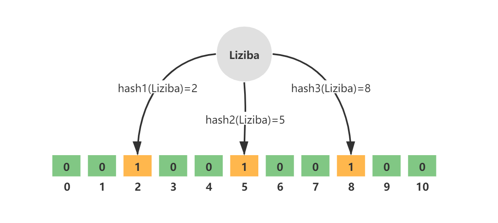

当查询元素时，根据 k 个无偏 hash 函数，计算得到多个 hash 值。然后分别取模 hash 得到数组下标。如果对应 bit 全都为 1，那么元素就存在，否则不存在。

布隆过滤器对元素的删除不太支持

实际上，可以通过提升误判率来减少布隆过滤器的空间占用。公式 4.6. 1给出了误判率、空间占用等参数之间的关系式。假设有以下参数：

- n：过滤器中有多少个元素
- p：误判率
- m：过滤器需要占用的空间（单位为Bit）
- k：要使用的哈希函数的个数

$$
m = -\frac{n * ln(p)}{(ln2)^2}
$$

$$
k = \frac{m}{n} * ln2
$$

这里取 n = 2,0000,0000 以及p = 0.1 。计算出 k = 3.32 以及m = 958505838 bits (117005.10 KB)

**布隆过滤器在线计算的网址**：https://krisives.github.io/bloom-calculator/

下面介绍 Redis 如何集成布隆过滤器：

1. https://github.com/RedisLabsModules/rebloom/archive/v2.2.6.tar.gz

2. 编译插件：

   ~~~shell
   cd RedisBloom-2.2.6/
   make
   ~~~

   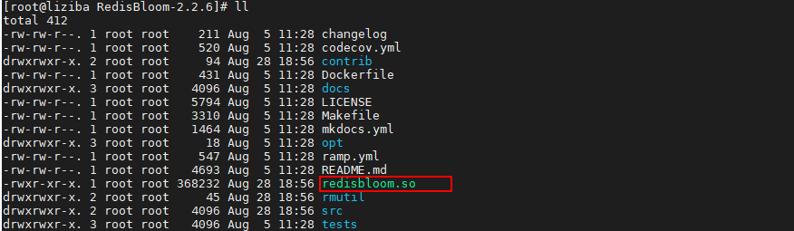

3. 在 redis.conf 配置文件中，加入如 RedisBloom 的 redisbloom.so 文件的地址

   ~~~conf
   loadmodule /usr/local/soft/RedisBloom-2.2.6/redisbloom.so
   ~~~

4. 重启 Redis 


布隆过滤器的主要指令如下：

- bf.add 添加一个元素
- bf.exists 判断一个元素是否存在
- bf.madd 添加多个元素
- bf.mexists 判断多个元素是否存在

通过`BF.RESERVE`命令手动创建布隆过滤器：

~~~shell
# BF.RESERVE {key} {error_rate} {capacity} [EXPANSION {expansion}] [NONSCALING]
BF.RESERVE orders 0.1 10000000
~~~

- key：filter 的名字；
- error_rate：期望的错误率，默认 0.1，值越低，需要的空间越大；
- capacity：初始容量，默认 100，当实际元素的数量超过这个初始化容量时，误判率上升。

如果不使用`BF.RESERVE`命令创建，而是使用 Redis 自动创建的布隆过滤器，默认的 `error_rate` 是 `0.01`，`capacity`是 100。


添加 Redission 依赖：

```xml
<dependency>
  <groupId>org.redisson</groupId>
  <artifactId>redisson-spring-boot-starter</artifactId>
  <version>3.16.7</version>
</dependency>
```

创建布隆过滤器

```java
@Service
public class BloomFilterService {

    @Autowired
    private RedissonClient redissonClient;

    /**
     * 创建布隆过滤器
     * @param filterName 过滤器名称
     * @param expectedInsertions 预测插入数量
     * @param falseProbability 误判率
     * @param <T>
     * @return
     */
    public <T> RBloomFilter<T> create(String filterName, long expectedInsertions, double falseProbability) {
        RBloomFilter<T> bloomFilter = redissonClient.getBloomFilter(filterName);
        bloomFilter.tryInit(expectedInsertions, falseProbability);
        return bloomFilter;
    }

}
```

单元测试如下：

```java
@Autowired
private BloomFilterService bloomFilterService;

@Test
public void testBloomFilter() {
    // 预期插入数量
    long expectedInsertions = 10000L;
    // 错误比率
    double falseProbability = 0.01;
    RBloomFilter<Long> bloomFilter = bloomFilterService.create("ipBlackList", expectedInsertions, falseProbability);

    // 布隆过滤器增加元素
    for (long i = 0; i < expectedInsertions; i++) {
        bloomFilter.add(i);
    }
    long elementCount = bloomFilter.count();
    log.info("elementCount = {}.", elementCount);

    // 统计误判次数
    int count = 0;
    for (long i = expectedInsertions; i < expectedInsertions * 2; i++) {
        if (bloomFilter.contains(i)) {
            count++;
        }
    }
    log.info("误判次数 = {}.", count);
    bloomFilter.delete();
}
```

## 事务与锁

下面我们来看一个例子：

~~~java
@Transactional(rollbackFor = Exception.class)
public Result func(seckillId, long userId) {
    lock.lock();
    lock.unlock();
}
~~~

这样事务的提交在解锁之后，在这段时间，很可能产生线程安全问题。因此我们要这样写，把整个事务放在锁的工作范围之内：

~~~java
public void lockProduct() {
    try {
        lock.lock();
        sellProduct();
    } finally {
        lock.unlock();
    }
}

@Transactional(rollbackFor = Exception.class)
public Result sellProduct() {
    
}
~~~

## 异地多活

- 冷备：**定期**将主数据中心的数据库文件被分到其他数据中心。冷备不提供实时服务。
- 热备：通过数据库中从复制，对主数据中心进行实时**备份**。热备提供实时服务


「高可用」这个概念通常用 2 个指标来衡量：

- 平均故障间隔 MTBF（Mean Time Between Failure）：表示两次故障的间隔时间，也就是系统「正常运行」的平均时间，这个时间越长，说明系统稳定性越高
- 故障恢复时间 MTTR（Mean Time To Repair）：表示系统发生故障后「恢复的时间」，这个值越小，故障对用户的影响越小

可用性（Availability）= MTBF / (MTBF + MTTR) * 100%。提升高可用的核心是「冗余」


故障分类：

|   类别   |               出现原因               | 概率 | 影响面 |
| :------: | :----------------------------------: | :--: | :----: |
| 主机故障 |             主机硬件故障             |  大  |   小   |
| 机房故障 | 机房网络故障、电力故障、制冷系统故障 |  小  |   大   |
| 地域故障 |              强自然灾害              | 极小 |  极大  |


同城多活架构（活的意思就是机房承载业务流量）

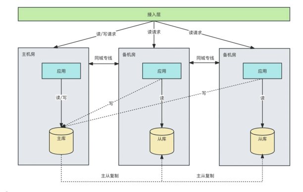

- 应用要做读写分离，因为备机房不支持写操作。
- 无法抵御地域故障
- 当主机房发生故障时，备机房提升为主机房
  - 接入层流量的切换
  - 数据库的 HA


我们介绍异地双活，这里我们仅考虑要求最终一致性的数据。它的核心思想为：

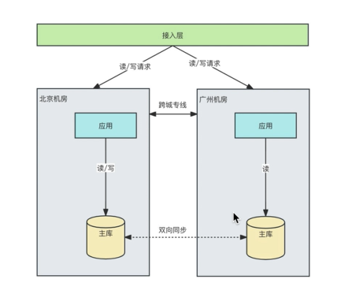

- 请求按照一定的路由规则打到不同的机房中，并且让同一个用户的相关请求，只在一个机房内完成所有业务「闭环」，不再出现「跨机房」访问。这样避免因相关多个请求打到不同机房，而造成的多主复制下数据冲突的问题。（单元化，Set）

- 不排除程序 Bug 导致用户会在两个机房「漂移」的情况。安全起见，每个机房在写存储时，还需要有一套机制，能够检测「数据归属」，避免本不应该写入本机房的情况发生。

- 机房之间的底层存储保持「双向」同步，每个机房都拥有全量数据，当任意机房故障时，另一个机房就可以「接管」全部流量，实现快速切换。

  **要求数据同步中间件具有合并数据，解决冲突的能力。**从根本上来说，要彻底解决这个问题，就要避免同时修改一个数据行的情况发生，这正是上述单元化的体现。

- 但这里还有一个小问题，随着扩展的机房越来越多，当一个机房写入数据后，需要同步的机房也越来越多。主流的优化方案是把「网状」架构升级为「星状」：即设立一个「中心机房」，任意机房写入数据后，都只同步到中心机房，再由中心机房同步至其它机房。

  | 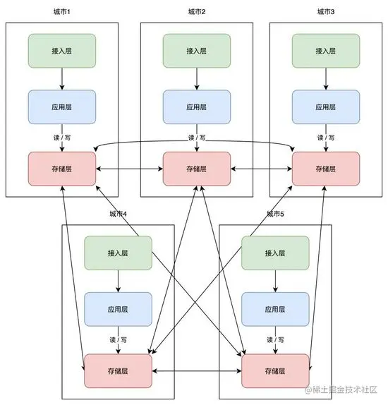 |  |
  | ------------------------------------------------------------ | ------------------------------------------------------------ |


对于强一致性数据的读写请求，例如配置信息，商品库存，一律路由到中心机房中。或者采用 CP 架构的方案，这样保证了读请求的高可用性。

库存要实现单元化部署有两种方案：

- 按照商品维护进行划分，即一部分商品在一个机房进行交易，而库存和商品所在的机房绑定。
- 把商品的库存数拆成多份，每个机房分一部分数量，分别在每个机房扣减，总数等于库存数。

这里我们采用第二种方案：把一个商品的总库存行按照单元机房拆分成多个单元库存行，每个单元机房的交易下单只减自己本单元的库存行，用户交易订单和库存扣减单据在同一个单元内，不需要跨单元调用。每个单元库存行库存数相加等于总库存行的库存数。卖家编辑库存时只编辑中心单元的库存行值，再按照一定的规则分配到其他单元库存行。

当某个单元库存行库存数扣完后，再到中心库存行去调拨。中心单元保存出库数据。

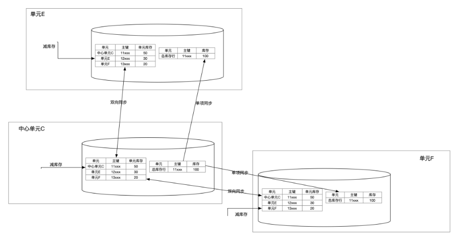

表是双向同步的含义为：

1. 「单元库存行」是「单元」向「中心单元」单向同步的，因为要保证单行的数据只能在一个单元写，例如单元 E 的行数据只能在单元 E 写，这行的数据会单向同步到中心单元 C 的单元 E 行。
2. 「总库存行」是「中心单元」向「其他单元」单向同步的


## 系统设计

这些设计都是微服务架构里经常提到的 **CQRS（Command QueryResponsibility Separation）**。在 C 端，当同时面临读和写的高并发压力时，把系统分成读和写两个视角来设计，各自设计适合高并发读和写的数据结构或数据模型。**这种设计读比写一定有延迟，它保证了最终一致性。**

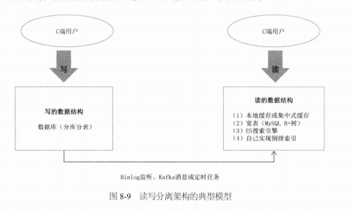


### 高并发读的策略

- 缓存机制

  - 本地缓存或 Memcached/Redis 集中式缓存
  - MySQL 的主从复制。
  - CDN 静态文件加速（动静分离）

- 并发读

  - 异步 RPC

    如果需要调用 3 个 RPC 接口，则耗时分别是 T1、T2、T3。如果是同步调用，则所消耗的总时间 T=T1+T2+T3; 如果是异步调用，则所消耗的总时间 T=Max(T1,T2,T3)。

  - Google的「冗余请求」

    我们来看这样一个案例，假设一个用户的请求需要 100 台服务器同时联合处理，每台服务器有 1% 概率发生调用延迟（假设定义响应时间大于 1s 为延迟），那么对于 C 端用户来说，响应时间大于 1s 的概率是 63%

    解决方案就是客户端同时向多台服务器发送请求，哪个返回得快就用哪个，其他的丢弃，但这会让整个系统的调用量翻倍。

    经 Google 公司测试，采用这种方法，可以仅用 2% 额外请求将系统 99.9% 请求响应时间从1800ms 降低到 74ms。

- 重写轻读


我们通过 Twitter 的 Feeds 流来认识「重写轻读」的策略。假设：用户关注了 n 个人，每个人都在不断地发帖子，然后系统需要把这 n 个人的帖子按时间排序成一个列表，也就是 Feeds 流并展示给用户。先考虑最原始的方案，如果这个数据存在数据库里面，大概如下表所示：

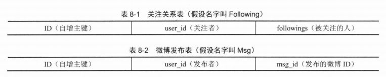

假设这里只存储帖子 ID，而帖子的内容、发布时间等信息保存在 NoSQL 数据库中。假设要查询 user_id=1 用户的 Feeds 流，则需要下面 SQL 语句：

~~~sql
select followings from Following where user_id= 1; # 获取用户的关注列表
select msg_ids from Msg where user_id in(followings) limit offset, count
~~~

显然，这种**实时聚合的拉取**方案无法满足高并发的查询请求。再来看下面**推送**方案

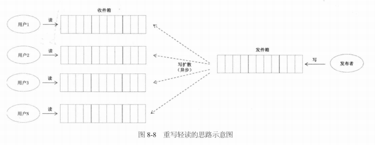

每个用户都有一个发件箱和收件箱。假设某个用户有 1000 个粉丝，发布 1 条帖子后，只写入自己的发件箱就返回成功。然后后台异步地把这条帖子推送到 1000 个粉丝的收件箱，也就是「写扩散」。这样，每个用户读取 Feeds 流的时，不需要再实时地聚合了，直接读取各自的收件箱即可。这也就是「重写轻读」，把计算逻辑从“读”的一端移到了“写”的一端。

但是，这又有一个新的问题，假设一个用户的粉丝很多，给每个粉丝的收件箱都复制一份，计算量和延迟都很大。这时候，我们要回到最初的方案，即 SQL 实时聚合。

综上，Feeds 流中的帖子，有的是推给他的（粉丝数少于 5000），有的人是需要他去拉的（粉丝数大于5000），需要把两者聚合起来，再按时间排序，然后分页显示，这就是「推拉结合」。

我们再来看一个案例，如果数据分库，那么执行 Join 或者排序操作的代价很大。此时，我们可以提前将计算结果存放在一张宽表中。这也是重写轻读的方案

### 高并发写的策略

- 数据分片
  - 数据库的分库分表
  - Kafka 的 partition
  - JDK 的 ConcurrentHashMap 实现
  - ES 的分布式索引
- 任务分片
  - CPU 的指令流水线
  - Map/Reduce
  - Tomcat 的 1+N+M 网络模型
- 异步化
- 批量化

### 复制与分区

单主复制技术常用于缓解在数据中心内部的读操作负担，而多主复制并不推荐在数据中心内部使用。在单主复制下，强烈不推荐让复制节点承担写入工作。复制技术的示例图

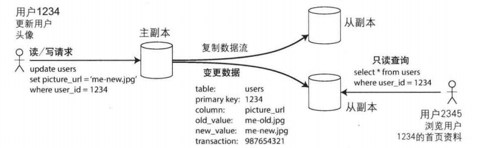

分区技术常用于缓解写操作的负担。下面是结合复制与分区技术的示意图

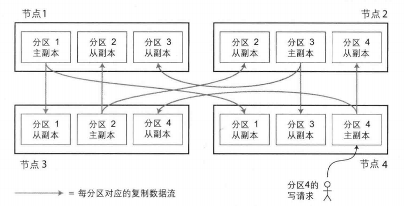
