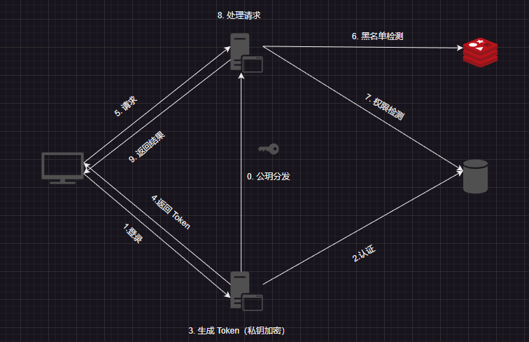
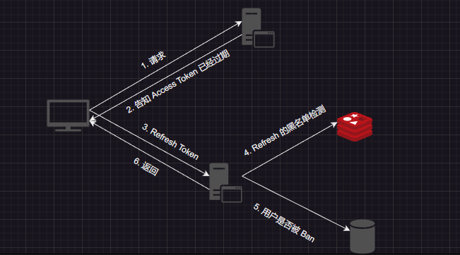

# 系统设计

[TOC]

## 错误码一览

~~~java
public class ErrorCodeConfig {
    public static final int UNKNOWN_ERROR = 0x00000000;
    public static final int USER_NOT_FOUND = 0x00000001;
    public static final int PASSWORD_NOT_CORRECTED = 0x00000002;
    public static final int USER_BANNED = 0x000000003;
    public static final int DUPLICATED_USER = 0x00000004;
    public static final int REG_MATCH_ERROR = 0x00000005;
}
~~~

## 单点登录系统

注：如果权限检测的逻辑简单而且权限几乎无变化，那么可以硬编码在过滤器中，否则就要动态获取数据库中的权限数据来做检测。

Access Token 的 Payload 格式如下：

1. UserID：用户
2. Role：用户所属的角色，用 bitmap 来表示
3. Client：客户端
4. Version：版本
5. Batch：批次
6. ExpireTime：过期时间

Refresh Toekn 的 Payload 格式如下：

1. UserID：用户
2. Client：客户端
3. Version：版本
4. Batch：批次
5. ExpireTime：过期时间

引入 Version 字段的意义在于实现同种类型设备互踢的逻辑。而 Batch 字段的意义在于让所有设备都下线，用于密码修改重新登录、权限变更的场景。

在 Redis 中，用 `UserID:Client:Version` 来存储失效的版本 ，以及用`UserId:Batch` 存储失效的 Batch，使用 Hash 来存储黑名单令牌。如果内存比较紧张，可以使用 MySQL 来代替 Redis。

~~~shell
accessTokenVersion: {
	"user1:client1" : "0"
	"user2:client1" : "0"
}

accessTokenBatch {
	"user1" : "0"
	"user2" : "1"
}

refreshTokenVersion {
	"user1:client1" : "0"
	"user2:client1" : "0"
}

refreshTokenBatch {
	"user1" : "0"
	"user2" : "1"
}

~~~

这种方案无法为单独的 fields 设置过期时间，只能给整个 hash 设置过期时间。 因此，我们可以采用以下方案：

~~~java
"access:user1:client1" : "0"
"access:user1": "1"
"refresh:user1:client1": "0"
"refresh:user1": "1"
~~~

同时在 MySQL 中，维护一张 Token Version 表来记录 Token 的最新版本，有三个字段 UserID、Client、Version。再维护 Token Batch 表来记录 Token 的最新批次。这里我们看到，多个客户端可以持有不同 Batch 的 RefreshToken，这无关紧要，因为我们只关心最新 Batch 的处理逻辑。

黑名单校验逻辑如下：先对比 `Batch`，再对比 `Version`。

Access Token 刷新的逻辑：

RefreshToken 刷新的逻辑：当授权服务器发现 RefreshToken 已经过期或者未通过检验，则要求客户端重新登录，获取新的 RefreshToken 以及 AccessToken。

我们依次考察以下场景中 Token 的验证逻辑

1. 设备主动下线
2. 用户注销
3. 用户修改密码
4. 用户账户遭到封禁
5. 用户的权限发生变化

设备主动下线的实现思路：

1. 如果用户在线，那么可以通过 Websocket 连接通知用户下线。
2. 如果用户不在线，那么根据 Version 将该设备的 Access & Refresh Token 加入到黑名单中。在发送请求时，由于 Token 在黑名单中，就强制用户下线重新登录。

如果允许用户同时登录到多台设备，那么 Client 的含义为设备 ID。如果要求用户最多登录到同种类型设备（Android、Chrome、Edge、Windows）中的一台，那么 Client 的含义变为设备类型。

用户注销的场景：

1. 客户端不再持有 Access 与 Refresh，并要求用户重新登录。

用户修改密码的场景：

1. 然后根据当前的 Batch 来封禁 Refresh & Access
2. 将 Batch 自增，然后构建出新的 Refresh & Access Token 给修改密码的客户端。
3. 其他客户端在验证 Token 时，由于Refresh & Access  Batch 版号太小被封禁，因此要求用户重新登录。

用户的权限发生变化：

1. 然后根据当前的 Batch 来封禁  Access
2. Batch 自增
3. 其他客户端在验证 Access Token 时，由于 Batch 版号太小被封禁，因此会拿着 Reresh Token 重新构建出新的 Access Token

用户封禁的场景：

1. 用户登录时，授权服务器发现用户已经被封禁，则告知客户端用户状态非法
2. 用户遭到封禁时，根据当前的 Batch 来封禁 Refresh & Access

如果用户在 Token 过期后才发起请求。此时 Access Token 被黑名单放行，而且被判定为过期。客户端拿着 Refresh Token 重新获取 Access Token。授权服务器发现 Refresh 已经过期，要求用户重新登录。之后就走 (1) 的逻辑

密码的要求：

1. 密码长度 6 - 16 位。 

2. 只能包含字母和数字，以及特殊字符（`@`、`#`、`$`、`&`、`.`）。

   

账户名要求：

1. 账户名 4 - 16 位
2. 只能包含字母和数字
3. 账户名不准重复

昵称要求：

1. 昵称 4 - 16 位
2. 只能包含中文、英文、数字
3. 不能是纯数字

## Feed 流系统

~~~sql
select followings from Following where user_id= 1; # 获取用户的关注列表
select msg_ids from Msg where user_id in(followings) limit offset, count 	# 读发件箱
~~~

显然，这种**实时聚合的拉取**方案无法满足高并发的查询请求。

每个用户都有一个发件箱和收件箱。假设某个用户有 1000 个粉丝，发布 1 条帖子后，只写入自己的发件箱就返回成功。然后后台异步地把这条帖子推送到 1000 个粉丝的收件箱，也就是「写扩散」。这样，每个用户读取 Feeds 流的时，**不需要再实时地聚合**了，直接读取各自的收件箱即可。这也就是「重写轻读」，把计算逻辑从「读」的一端移到了「写」的一端。

但是，这又有一个新的问题，假设一个用户的粉丝很多，给每个粉丝的收件箱都复制一份，计算量和延迟都很大。这时候，我们要回到最初的方案，即 SQL 实时聚合。

综上，Feeds 流中的帖子，有的是推给他的（粉丝数少于 5000），有的人是需要他去拉的（粉丝数大于5000），需要把两者聚合起来，再按时间排序，然后分页显示，这就是「推拉结合」。

这里有一个优化的点，对于大 V 用户，可以将帖子推送「写扩散」给那些活跃用户。对于非活跃用户，按照原先「读扩散」策略获取内容即可。

这里我们可以使用 Redis 中的 ZSet 来缓存聚合后的结果，其中 Score 作为时间戳，而 value 作为内容 ID。为了避免缓存穿透，我们缓存特殊的帖子 `NoMore`。当分页拉取时，不推荐使用偏移量，而是使用时间戳来获取，这样可以避免新发表的帖子对偏移量的影响。

