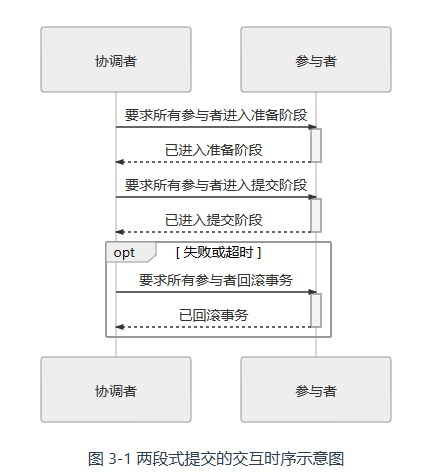
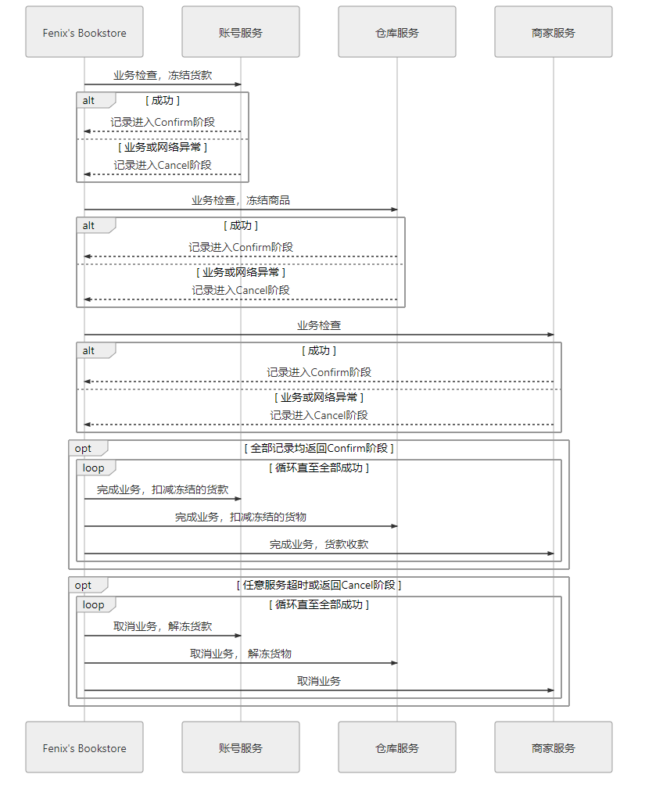

# 事务

[TOC]


## 本地事务

**本地事务（Local Transaction）**是指仅操作单一事务资源的、不需要全局事务管理器进行协调的事务。它只适用于单个服务使用单个数据源的场景。从应用角度看，它是直接依赖于数据源本身提供的事务能力来工作的（事务的开启、终止、提交、回滚、嵌套、设置隔离级别、事务传播方式），在程序代码层面，最多只能对事务接口做一层标准化的包装（如 `JDBC` 接口），并不能深入参与到事务的运作过程当中。


### 隔离性

数据库通过锁机制来实现隔离性：

- **写锁**（Write Lock，也叫作排他锁，eXclusive Lock，简写为 X-Lock）：如果数据被加上写锁，就只有持有写锁的事务才能对数据进行写入操作，而其他事务不能写入数据，也不能施加读锁或者写锁。写锁禁止其他事务施加读锁，而并不禁止其他事务读取数据。

- **读锁**（Read Lock，也叫作共享锁，Shared Lock，简写为 S-Lock）：多个事务可以对同一个数据添加多个读锁，数据被加上读锁后就不能再被加上写锁，而且其他事务不能对该数据进行写入，但仍然可以读取。

  对于持有读锁的事务，如果该数据只有它自己一个事务加了读锁，允许直接将其升级为写锁，然后写入数据。但是不允许反向降级。

- **范围锁**（Range Lock）：加了范围锁后，不仅无法修改该范围内已有的数据，也不能在该范围内新增或删除任何数据，这是排他锁无法做到的

  
  
  

下面是不同级别的隔离性，依次从强到弱：

- **可串行化**：对事务所有读、写的数据全都加上写锁和范围锁，或者读锁和范围锁，一直持续到事务结束。串行化访问提供了强度最高的隔离性。但是[并发控制理论](https://en.wikipedia.org/wiki/Concurrency_control)（Concurrency Control）阐述了隔离程度与并发能力是负相关的，即隔离程度越高，并发访问时的吞吐量就越低。

- **可重复读（Repeatable Read）**：对事务所涉及的数据加读锁或者写锁，一直持续到事务结束。

  它存在[幻读问题](https://en.wikipedia.org/wiki/Isolation_(database_systems)#Phantom_reads)（Phantom Reads），例如：

  ~~~sql
  SELECT count(1) FROM books WHERE price < 100					/* 时间顺序：1，事务： T1  暂不提交*/
  INSERT INTO books(name,price) VALUES ('深入理解Java虚拟机',90)	/* 时间顺序：2，事务： T2  提交*/
  SELECT count(1) FROM books WHERE price < 100					/* 时间顺序：3，事务： T1 提交*/
  ~~~

  两次相同的查询就会得到不一样的结果，原因是可重复读没有范围锁，来禁止在该范围内插入新的数据。

- **读已提交（Read Committed）**：对事务涉及的数据加的写锁，一直持续到事务结束，但加在查询操作上的读锁，在查询完成后就马上会释放。

  它存在[不可重复读问题](https://en.wikipedia.org/wiki/Isolation_(database_systems)#Non-repeatable_reads)（Non-Repeatable Reads），例如：

  ~~~sql
  SELECT * FROM books WHERE id = 1;   						/* 时间顺序：1，事务： T1 */
  UPDATE books SET price = 110 WHERE id = 1; COMMIT;			/* 时间顺序：2，事务： T2 提交*/
  SELECT * FROM books WHERE id = 1; COMMIT;   				/* 时间顺序：3，事务： T1 提交*/
  ~~~

  这两次重复执行的查询结果就会不一样，原因是读已提交的隔离级别缺乏贯穿整个事务周期的读锁，无法禁止读取过的数据发生变化。

- **读未提交（Read Uncommitted）**：只对事务涉及的数据加上写锁，会一直持续到事务结束，但完全不加读锁。

  它存在[脏读问题](https://en.wikipedia.org/wiki/Isolation_(database_systems)#Dirty_reads)（Dirty Reads），例如：

  ```sql
  SELECT * FROM books WHERE id = 1;   						/* 时间顺序：1，事务： T1 */
  
  UPDATE books SET price = 90 WHERE id = 1;					/* 时间顺序：2，事务： T2 暂不提交*/
  
  SELECT * FROM books WHERE id = 1;		
  /* 时间顺序：3，事务： T1 */
  /* 如果这里是读已提交，那么 T1 因要施加读锁而一直被阻塞，直到 T2 提交了事务 */
  
  ROLLBACK;			  										/* 时间顺序：4，事务： T2 */
  ```
  
  


## 全局事务

在工程实现中，**全局事务是指单个服务使用多个数据源的事务处理机制**。理论上的全局事务并没有「单个服务」的约束，它本来就是 DTP（[Distributed Transaction Processing](https://en.wikipedia.org/wiki/Distributed_transaction)）模型中的概念。但本节所讨论的内容是一种在分布式环境中，追求强一致性的事务处理方案，对于多节点而且互相调用彼此服务的场合（微服务系统）是极不合适的。

1991 年，为了解决分布式事务的一致性问题，[X/Open](https://en.wikipedia.org/wiki/X/Open)组织提出了一套名为[X/Open XA](https://en.wikipedia.org/wiki/X/Open_XA)（XA 是 eXtended Architecture 的缩写）的处理事务架构，其核心内容是定义了**全局的事务管理器**（Transaction Manager，用于协调事务，可以理解为主节点）和**局部的资源管理器**（Resource Manager，用于驱动本地事务，可以理解为从节点）之间的通信接口。XA 接口是双向的。

XA 是一套语言无关的通用规范， Java 中专门定义了 [JSR 907 Java Transaction API](https://www.jcp.org/en/jsr/detail?id=907) 来实现 XA 规范。JTA  最主要的两个接口是：

- 事务管理器的接口：
  - `javax.transaction.TransactionManager`接口：是给 Java EE 服务器提供容器事务（由容器自动负责事务管理）使用的
  - `javax.transaction.UserTransaction`接口：用于通过程序代码手动开启、提交和回滚事务
- `javax.transaction.xa.XAResource`。任何资源（JDBC、JMS 等等）如果想要支持 JTA，只要实现 XAResource 接口中的方法即可。


假如你平时以声明式事务来编码，不过就是标个`@Transactional`注解而已，但如果以编程式事务来实现的话，伪代码如下所示：

```java
public void buyBook(PaymentBill bill) {
    userTransaction.begin();
    warehouseTransaction.begin();
    businessTransaction.begin();
	try {
        userAccountService.pay(bill.getMoney());
        warehouseService.deliver(bill.getItems());
        businessAccountService.receipt(bill.getMoney());
        userTransaction.commit();
        warehouseTransaction.commit();
        businessTransaction.commit();
	} catch(Exception e) {
        userTransaction.rollback();
        warehouseTransaction.rollback();
        businessTransaction.rollback();
	}
}
```

从代码上可看出，程序的目的是要做三次事务提交，但实际上代码并不能这样写，试想一下，如果在`businessTransaction.commit()`中出现错误，代码转到`catch`块中执行，此时`userTransaction`和`warehouseTransaction`已经完成提交，再去调用`rollback()`方法已经无济于事，这将导致一部分数据被提交，另一部分被回滚，整个事务的一致性也就无法保证了。


为了解决这个问题（一个事务跨多节点），XA 将事务提交拆分成为两阶段过程：

- **准备阶段**（投票阶段）：在这一阶段，协调者询问事务的所有参与者是否准备好提交。参与者如果已经准备好提交则回复 Prepared，否则回复 Non-Prepared。

- **提交阶段**（执行阶段）：
  - 如果所有参与者回复Prepared，那么协调者向参与者发起 Commit 指令，所有参与者立即执行提交操作
  - 任意一个参与者回复了 Non-Prepared 消息，或任意一个参与者超时未回复，那么协调协调者向参与者发起 Abort 指令，所有参与者立即执回滚操作



以上这两个过程被称为“[两段式提交](https://zh.wikipedia.org/wiki/二阶段提交)”（2 Phase Commit，2PC）协议，而它能够成功保证一致性还需要一些其他前提条件：

- 在提交阶段网络是可靠的
- 节点的失联必须是短暂的

它有以下缺点：

- **单点问题**：协调者在两段提交中具有举足轻重的作用，协调者等待参与者回复时可以有超时机制，但参与者等待协调者指令时无法做超时处理。一旦协调者宕机，那所有参与者都会受到影响
- **性能问题**：准备阶段的时间取决于响应最慢的从节点
- **一致性风险**：协调者会先持久化事务状态，并提交自己的事务。如果这时候网络忽然被断开，无法再通过网络向所有参与者发出 Commit 指令，这就会导致协调者的已提交，但参与者的既未提交，也没有办法回滚，从而产生了数据不一致的问题。


为了缓解 2PC 协议的一部分缺陷，后续又发展出了“[三段式提交](https://zh.wikipedia.org/wiki/三阶段提交)”（3 Phase Commit，3PC）协议。三段式提交把原本 的两段式提交的准备阶段再细分为两个阶段，分别称为 CanCommit、PreCommit，把提交阶段改称为 DoCommit 阶段。其中，新增的 CanCommit 是一个询问阶段，协调者让每个参与者根据自身状态，评估该事务是否有可能顺利完成。

将准备阶段一分为二的理由是这个阶段是重负载的操作。在 2PC 中，一旦协调者发出开始准备的消息，每个参与者都将马上开始写 Redo Log，它们所涉及的数据资源即被锁住，如果此时某一个参与者宣告无法完成提交，相当于大家都白做了一轮无用功。而 3PC 中的 CanCommit 减少是由于事务失败而回滚的概率

此外，如果在 PreCommit 阶段 后，协调者发生了宕机，即参与者没有能等到 DoCommit 的消息的话，默认的操作策略将是提交事务，而不是 2PC 中的持续等待。


## 分布式事务

**「分布式事务」（Distributed Transaction**）特指业务上关联的多个服务同时访问多个数据源的事务处理机制。

1985 年 Fischer、Lynch、Paterson 提出了“[FLP 不可能原理](https://en.wikipedia.org/wiki/Consensus_(computer_science)#Solvability_results_for_some_agreement_problems)”，证明了如果宕机最后不能恢复，那就不存在任何一种分布式协议可以正确地达成强一致性结果。

CAP 定理（Consistency、Availability、Partition Tolerance Theorem），也称为 Brewer 定理。这个定理描述了：在网络分区时，以下三个特性最多只能同时满足其中两个：

- **一致性**（**C**onsistency）：代表数据在任何时刻、任何分布式节点中所看到的都是符合预期的。

- **可用性**（**A**vailability）：代表系统不间断地提供服务的能力，这里有两个与其密切的概念：

  - 可靠性，使用平均无故障时间（Mean Time Between Failure，MTBF）来度量
  - 可维护性，使用平均可修复时间（Mean Time To Repair，MTTR）来度量。

  可用性的表征如下：
  $$
  A=MTBF/（MTBF+MTTR）
  $$
  譬如 99.9999%可用，即代表平均年故障修复时间为 32 秒。

- **分区容忍性**（**P**artition Tolerance）：部分节点因网络原因而失联后，系统仍能正确地提供服务的能力。

  

下面分析分别舍弃 C、A、P 时所带来的不同影响：

- **放弃分区容忍性**（CA without P）：意味着我们将假设节点之间通信永远是可靠的。但是分区问题就会始终存在。
- **放弃可用性**（CP without A）：意味着我们将假设一旦网络发生分区，节点之间的信息同步时间可以无限制地延长。在现实中，选择放弃可用性的 CP 系统情况一般用于对数据质量要求很高的场合中。
- **放弃一致性**（AP without C）：意味着我们将假设一旦发生分区，节点之间所提供的数据可能不一致。

 AP 系统目前是设计分布式系统的主流选择。 因为 P 是分布式网络的天然属性，这是无法放弃的；而 A 通常是建设分布式的目的，如果可用性随着节点数量增加反而降低的话，很多分布式系统可能就失去了存在的价值。

虽然我们放弃了强一致性，但是我们可以追求「弱一致性」中的「最终一致性」—— 如果数据在一段时间之内没有被另外的操作所更改，那它最终将会达到与强一致性过程相同的结果

> 最终一致性的概念是 eBay 的系统架构师 Dan Pritchett 在 2008 年在 ACM 发表的论文《[Base: An Acid Alternative](https://queue.acm.org/detail.cfm?id=1394128)》中提出的。最终一致性的概念是 eBay 的系统架构师 Dan Pritchett 在 2008 年在 ACM 发表的论文《[Base: An Acid Alternative](https://queue.acm.org/detail.cfm?id=1394128)》中提出的。其中，BASE 是基本可用性（**B**asically **A**vailable）、柔性事务（**S**oft State）和最终一致性（**E**ventually Consistent）的缩写

此时「事务」一词的含义其实也同样被拓展了，人们把具有 ACID属性 （强一致性）的事务称为“刚性事务”，而把保证最终一致性的事务统称为「柔性事务」。


### 可靠事件队列


以上这种靠着持续重试来保证可靠性的解决方案，称为“[最大努力交付](https://en.wikipedia.org/wiki/Best-effort_delivery)。


### TCC 事务

TCC 是一种业务侵入式较强的事务方案，要求业务处理过程必须拆分为「预留业务资源」和「确认/释放消费资源」两个子过程，并分为以下三个阶段：

- **Try**：尝试执行阶段，完成所有业务可执行性的检查（保障一致性），并且预留好全部需用到的业务资源（保障隔离性）。如果第三方接口并不支持「预留资源」特性，那么 TCC 方案就无法实施。 
- **Confirm**：确认执行阶段，不进行任何业务检查，直接使用 Try 阶段准备的资源来完成业务处理。Confirm 阶段可能会重复执行，因此本阶段所执行的操作需要具备幂等性。
- **Cancel**：取消执行阶段，释放 Try 阶段预留的业务资源。Cancel 阶段可能会重复执行，也需要满足幂等性。



TCC 其实有点类似 2PC 的准备阶段和提交阶段，但 TCC 是位于用户代码层面，而不是在基础设施层面，这为它的实现带来了较高的灵活性，可以根据需要设计资源锁定的粒度。

### SAGA 事务

SAGA 的思路是把一个大事务分解为可以交错运行的一系列子事务集合，避免避免大事务长时间锁定数据库的资源。SAGA 由两部分操作组成：

- 大事务拆分若干个小事务，将整个分布式事务 T 分解为 n 个子事务，命名为 T1，T2，…，Ti，…，Tn。每个子事务都应该是原子的
- 为每一个子事务设计对应的补偿动作，命名为 C1，C2，…，Ci，…，Cn。 Ti与 Ci必须满足以下条件：
  - Ti与 Ci都具备幂等性。
  - Ti与 Ci满足交换律（Commutative），即先执行 Ti还是先执行 Ci，其效果都是一样的。
  - Ci必须能成功提交，即不考虑 Ci本身提交失败被回滚的情形，如出现就必须持续重试直至成功，或者要人工介入。

如果 T1 到 Tn 均成功提交，那事务顺利完成，否则，要采取以下两种恢复策略之一：

- **正向恢复**（Forward Recovery）：如果 Ti事务提交失败，则一直对 Ti进行重试，直至成功为止（最大努力交付）。这种恢复方式不需要补偿。正向恢复的执行模式为：T1，T2，…，Ti（失败），Ti（重试）…，Ti+1，…，Tn。
- **反向恢复**（Backward Recovery）：如果 Ti事务提交失败，则一直执行 Ci对 Ti进行补偿，直至成功为止（最大努力交付）。反向恢复的执行模式为：T1，T2，…，Ti（失败），Ci（补偿），…，C2，C1。

与 TCC 相比，SAGA 不需要为资源设计冻结状态和撤销冻结的操作。而且，补偿操作往往要比冻结操作容易实现得多。
