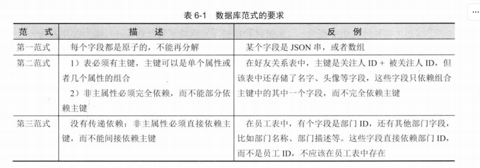
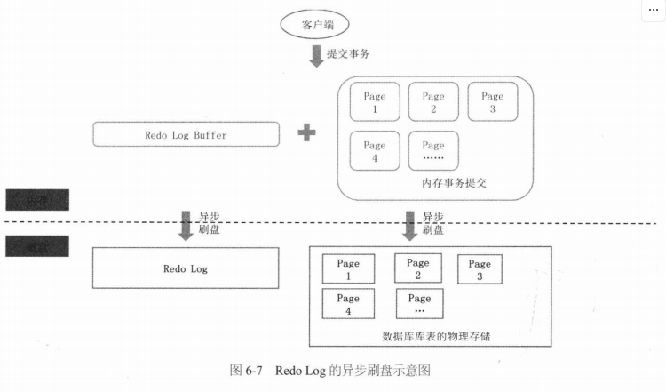
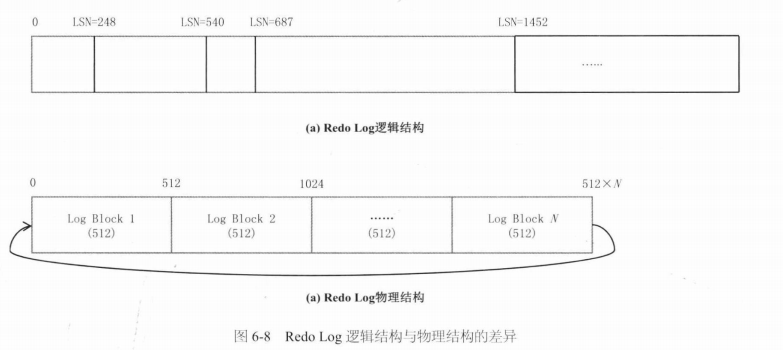
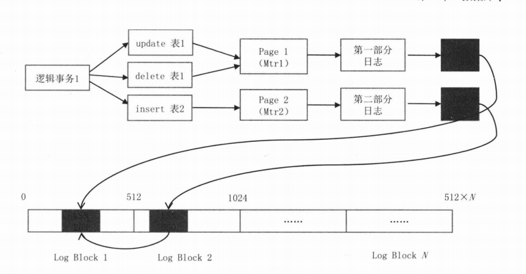
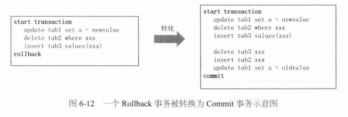
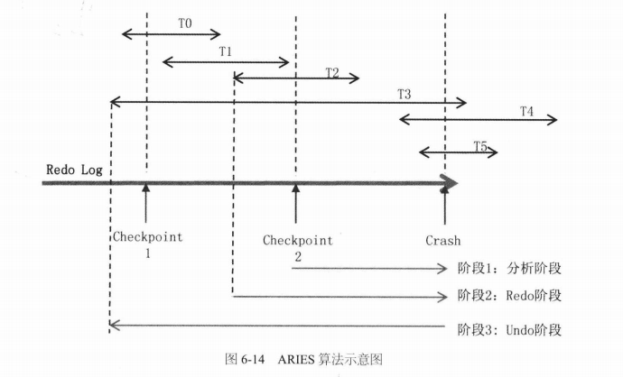
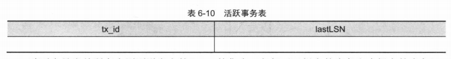
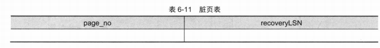
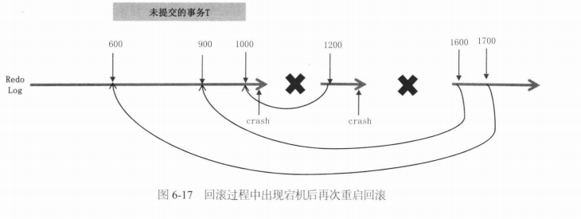

# 数据库

[TOC]

## 范式



最好保证数据库的设计达到第三范式的要求

## 分库分表

分库分表的必然性：

1. 业务拆分的必然性
2. 写入性能达到瓶颈
3. 数据隔离


分库分表后，我们会遇到以下问题：

- **查询维度问题**。假设我们有一张表，它有两个查询维度 A、B。现在我们按 A 维度进行拆分。按 A 进行查询，很容易定位到拆分后的某张表上，但是按照 B 进行查询，则异常困难。对于在分库分表之后其他维度的查询，一般有以下几个方法：
  1. 建立从 B 到 A 的映射表，在按 B 查询时，从映射表中获取对应的 A ID，然后再根据 A ID 从表中获取数据
  2. 业务双写：同一份数据，按 A、B 分别进行拆表，维护两套表。
  3. 异步双写：也是维护两套表，但通过监听 Binlog，将变更同步到另外一套表上。从而实现业务单写。
  4. 两个维度统一到一个维度，即 A ID 与 B ID 某几位是相同的，用这几位作为分库维度。
-  Join 查询问题：
  1. 把 Join 拆成多个单表查询，在代码层对结果进行拼装
  2. 先提前做 Join 操作，将结果存放在一张表中，这就是「空间换时间」的思路。
  3. 将数据放在 ES 中，在搜索引擎中进行查询。
- 事务问题：单独说明


## B+ Tree

关系型数据库在查询方面有一些重要特性：

1. 范围查询
2. 前缀匹配模糊查询
3. 排序和分页

这得益于  B+ 树这种数据结构，它的逻辑结构如下：


- 在叶子节点一层，所有记录的主键按照从小到大的顺序排列，并且形成了一个双向链表。
- 非叶子节点取的是叶子节点里面 Key 的最小值。

以上图为例，我们说明如何实现上述特性：

- 范围查询。比如要查主键在`[1,17]`之间的记录。二次查询，先查找 1 所在的叶子节点的记录位置，再查找 17 所在的叶子节点记录的位置（就是16所处的位置），然后顺序地从 1 遍历链表直到 16 所在的位置。
- 前缀匹配模糊查询。假设主键是一个字符串类型，要查询 `where Key like abc%` 其实可以转化成一个范围查询 `Key in [abc,abcz]`。当然，如果是后缀匹配模糊查询，或者诸如 where Key like %c% 这样的中间匹配，则没有办法转化成范围查询，只能挨个遍历。
- 叶子节点天然是排序好的，支持排序和分页。

对于 `select xxxwhere xxx limit 1000,10`，需要遍历前面 1000 个叶子节点，才能获取数据。我们将 `offset=1000` 的位置换算成某个`max_id`，然后可以使用 `select xxx where xxx and id>max_id limit 10`，这样就可以利用 B+  树的特性，快速定位到 `max_id` 所在的位置，即是 `offset=1000` 所在的位置。

在 InnoDB 的实践里面，其中一个建议是按主键的自增顺序插入记录，就是为了避免节点分裂现象。

## 索引

索引的类型有：

1. 普通索引（由关键字 KEY 或 INDEX 定义），值可以重复
2. 唯一索引（由关键字 UNIQUE 定义）要求值必须唯一，但允许有空值
3. 主键索引（由关键字 PRIMARY 定义）


每个索引都有一颗 B+ 树。按叶子节点如何存储数据，索引可以分为：

- 聚簇索引：叶子节点存放的是实际数据，所有完整的用户记录都存放在聚簇索引的叶子节点；
- 二级索引的叶子节点存放的是主键值，而不是实际数据。

InnoDB 在创建聚簇索引时，会根据不同的场景选择不同的列作为索引：

- 如果有主键，默认会使用主键作为聚簇索引的索引键；
- 如果没有主键，就选择第一个不包含 NULL 值的唯一列作为聚簇索引的索引键；
- 在上面两个都没有的情况下，InnoDB 将自动生成一个隐式自增 id 列作为聚簇索引的索引键；

注意：一张表只能有一个聚簇索引。


如果某个查询语句使用了二级索引，但是查询的数据不是主键值，这时在二级索引找到主键值后，需要去聚簇索引中获得数据行，这个过程就叫作「回表」

在 MySQL 的 InnoDB 存储引擎中，每个索引项的最大长度是 767 字节，如果查询需要返回的字段长度超过了该限制，同样会触发回表操作。

**覆盖索引**是指直接从非主键索引中就能查到的记录，而不需要查询主键索引中的记录，避免了回表的产生减少了树的搜索次数，显著提升性能。如果查询的字段都在某个索引上，并且没有超过最大索引长度限制，MySQL可以直接从索引中获取所需数据，而无需回表。


下面几种情况会导致索引失效，从而走了全表扫描：

- 对索引使用左或者左右模糊匹配，`like %xx` 或者 `like %xx%`
- 对索引使用函数
- 对索引进行表达式计算
- 对索引隐式类型转换
- 联合索引非最左匹配


只包含一个字段的索引叫做**单列索引**，包含两个或以上字段的索引叫做**复合索引**（或组合索引）。在 MySQL 建立联合索引时，会遵守最左前缀匹配原则，下面这个 SQL 语句在 列 X，列 Y，列 Z 上建立了一个复合索引。

```mysql
CREATE INDEX 索引名 ON 表名(列名X, 列名Y, 列名Z);
```

其实这相当于建立了三个索引，分别是：

1. 单列索引（列 X）
2. 复合索引（列 X, 列 Y）：索引结构是先按 X 排序，再按 Y 排序。
3. 复合索引（列 X，列 Y，列 Z）

推荐在检索数据时遵循索引的最左前缀匹配原则，否则索引会失效

~~~sql
SELECT * FROM XXX WHERE X = 1 AND Y = 2	-- 使用了索引
SELECT * FROM XXX WHERE Y = 2 		    -- 未使用索引
~~~

## 事务

事务是指一组读写操作的逻辑单元。**事务往往会被赋予AID属性**，来保证数据的一致性（**C**onsistency）：

- **原子性**（**A**tomic）：，事务保证了在同一项业务处理过程中，对多个数据的修改，要么同时成功，要么同时被撤销。
- **隔离性**（**I**solation）：事务保证了在不同的业务处理过程中，各自业务正在读、写的数据互相独立，不会彼此影响。
- **持久性**（**D**urability）：事务应当保证所有成功被提交的数据修改都能够正确地被持久化，不丢失数据。
- **一致性**（**C**onsistency）：数据库完整性约束

**可见，A、I、D 是手段，C 是目的**。

- **内部一致性**：一个服务只使用一个数据源时的事务间一致性。

  通过 A、I、D 来获得一致性是最经典的做法。此时，多个并发事务所读写的数据能够**由数据源感知是否存在冲突**，并发事务的读写在时间线上的最终顺序是由数据源来确定的。

- **外部一致性**：一个服务使用到多个不同的数据源时的事务间一致性

  外部一致性问题通常很难再使用 A、I、D 来解决，但是外部一致性是分布式系统中必然会遇到的问题。为此，我们要转变观念，即从「是或否」的二元属性转变为可以按不同强度分开讨论的多元属性。在确保代价可承受的前提下，获得强度尽可能高的一致性保障。

**数据源是指提供数据的逻辑设备**

>如今要研究事务的实现原理，必定会追溯到**ARIES 理论（Algorithms for Recovery and Isola tion Exploiting Semantics，ARIES，基于语义的恢复与隔离算法）**。
>
>在 20 世纪 90 年代，[IBM Almaden 研究院](http://www.research.ibm.com/labs/almaden/)总结了研发原型数据库系统“IBM System R”的经验，发表了 ARIES 理论中最主要的三篇论文，其中《[ARIES: A Transaction Recovery Method Supporting Fine-Granularity Locking and Partial Rollbacks Using Write-Ahead Logging](https://cs.stanford.edu/people/chrismre/cs345/rl/aries.pdf)》着重解决了 ACID 的其中两个属性：原子性（A）和持久性（D）在算法层面上应当如何实现。而另一篇《[ARIES/KVL: A Key-Value Locking Method for Concurrency Control of Multiaction Transactions Operating on B-Tree Indexes](http://vldb.org/conf/1990/P392.PDF)》则是现代数据库隔离性（I）奠基式的文章

## 隔离性

数据库通过锁机制来实现隔离性：

- **写锁**（Write Lock，也叫作排他锁，eXclusive Lock，简写为 X-Lock）：如果数据被加上写锁，就只有持有写锁的事务才能对数据进行写入操作，而其他事务不能写入数据，也不能施加读锁或者写锁。写锁禁止其他事务施加读锁，而并不禁止其他事务读取数据。

- **读锁**（Read Lock，也叫作共享锁，Shared Lock，简写为 S-Lock）：多个事务可以对同一个数据添加多个读锁，数据被加上读锁后就不能再被加上写锁，而且其他事务不能对该数据进行写入，但仍然可以读取。

  对于持有读锁的事务，如果该数据只有它自己一个事务加了读锁，允许直接将其升级为写锁，然后写入数据。但是不允许反向降级。

- **范围锁**（Range Lock）：加了范围锁后，不仅无法修改该范围内已有的数据，也不能在该范围内新增或删除任何数据，这是排他锁无法做到的

  

  

下面是不同级别的隔离性，依次从强到弱：

- **可串行化**：对事务所有读、写的数据全都加上写锁和范围锁，或者读锁和范围锁，一直持续到事务结束。串行化访问提供了强度最高的隔离性。但是[并发控制理论](https://en.wikipedia.org/wiki/Concurrency_control)（Concurrency Control）阐述了隔离程度与并发能力是负相关的，即隔离程度越高，并发访问时的吞吐量就越低。

- **可重复读（Repeatable Read）**：对事务所涉及的数据加读锁或者写锁，一直持续到事务结束。

  它存在[幻读问题](https://en.wikipedia.org/wiki/Isolation_(database_systems)#Phantom_reads)（Phantom Reads），例如：

  ~~~sql
  SELECT count(1) FROM books WHERE price < 100					/* 时间顺序：1，事务： T1  暂不提交*/
  INSERT INTO books(name,price) VALUES ('深入理解Java虚拟机',90)	/* 时间顺序：2，事务： T2  提交*/
  SELECT count(1) FROM books WHERE price < 100					/* 时间顺序：3，事务： T1 提交*/
  ~~~

  两次相同的查询就会得到不一样的结果，原因是可重复读没有范围锁，来禁止在该范围内插入新的数据。

- **读已提交（Read Committed）**：对事务涉及的数据加的写锁，一直持续到事务结束，但加在查询操作上的读锁，在查询完成后就马上会释放。

  它存在[不可重复读问题](https://en.wikipedia.org/wiki/Isolation_(database_systems)#Non-repeatable_reads)（Non-Repeatable Reads），例如：

  ~~~sql
  SELECT * FROM books WHERE id = 1;   						/* 时间顺序：1，事务： T1 */
  UPDATE books SET price = 110 WHERE id = 1; COMMIT;			/* 时间顺序：2，事务： T2 提交*/
  SELECT * FROM books WHERE id = 1; COMMIT;   				/* 时间顺序：3，事务： T1 提交*/
  ~~~

  这两次重复执行的查询结果就会不一样，原因是读已提交的隔离级别缺乏贯穿整个事务周期的读锁，无法禁止读取过的数据发生变化。

- **读未提交（Read Uncommitted）**：只对事务涉及的数据加上写锁，会一直持续到事务结束，但完全不加读锁。

  它存在[脏读问题](https://en.wikipedia.org/wiki/Isolation_(database_systems)#Dirty_reads)（Dirty Reads），例如：

  ```sql
  SELECT * FROM books WHERE id = 1;   						/* 时间顺序：1，事务： T1 */
  
  UPDATE books SET price = 90 WHERE id = 1;					/* 时间顺序：2，事务： T2 暂不提交*/
  
  SELECT * FROM books WHERE id = 1;		
  /* 时间顺序：3，事务： T1 */
  /* 如果这里是读已提交，那么 T1 因要施加读锁而一直被阻塞，直到 T2 提交了事务 */
  
  ROLLBACK;			  										/* 时间顺序：4，事务： T2 */
  ```

脏写问题（Dirty Write），即一个事务的没提交之前的修改，可以被另外一个事务的修改覆盖掉。脏写已经不单纯是隔离性上的问题了，它连事务的原子性都无法实现，所以在谈论隔离级别时，不会将它纳入讨论范围内。

除了都以锁来实现外，以上四种隔离级别还有另一个共同特点，就是幻读、不可重复读、脏读等问题都是由于一个事务在读数据过程中，受另外一个写数据的事务影响，而破坏了隔离性。针对这种「一个事务读 + 另一个事务写」的隔离问题，近年来有一种名为**[多版本并发控制](https://en.wikipedia.org/wiki/Multiversion_concurrency_control)（Multi-Version Concurrency Control，MVCC）**的无锁优化方案被业界广泛采用。**它的「无锁」是特指读取时不需要加锁。**  

 **MVCC 是典型的 CopyOnWrite 方案。**基本思路是对数据库的任何修改，都不会直接覆盖之前的数据，而是产生一个新版副本与老版本共存，以此达到读取时可以完全不加锁的目的。其中版本可以理解为每一行记录都存在两个不可见的字段：`CREATE_VERSION` 和 `DELETE_VERSION`，这两个字段记录的值都是事务 ID，事务 ID 是一个全局严格递增的数值，然后根据以下规则写入数据：

- 插入数据时：CREATE_VERSION 记录插入数据的事务 ID，DELETE_VERSION 为空。
- 删除数据时：DELETE_VERSION 记录删除数据的事务 ID，CREATE_VERSION 为空。
- 修改数据时：将修改数据视为「删除旧数据，插入新数据」的组合，即先将原有数据复制一份，原有数据的 DELETE_VERSION 记录修改数据的事务 ID，CREATE_VERSION 为空。复制出来的新数据的 CREATE_VERSION 记录修改数据的事务 ID，DELETE_VERSION 为空。

此时，如有另外一个事务要读取这些发生了变化的数据，将根据隔离级别来决定到底应该读取哪个版本的数据

- 可重复读：总是读取 CREATE_VERSION 小于或等于当前事务 ID 的记录，在这个前提下，如果数据仍有多个版本，则取最新（事务 ID 最大）的。
- 读已提交：总是取最新的 CREATE_VERSION 即可，即最近被 Commit 的那个版本的数据记录。

另外两个隔离级别都没有必要用到 MVCC，因为读未提交直接修改原始数据即可，其他事务查看数据的时候立刻可以看到，根本无须版本字段。可串行化本来的语义就是要阻塞其他事务的读取操作，而 MVCC 是做读取时无锁优化的，自然就不会放到一起用。MVCC 是只针对“读+写”场景的优化，如果是两个事务同时修改数据，即“写+写”的情况，那就没有多少优化的空间了，此时加锁几乎是唯一可行的解决方案。


此外，加锁的策略可以分为

- **“乐观加锁”（Optimistic Locking）**：认为事务之间数据存在竞争是偶然情况，没有竞争才是普遍情况，这样就不应该在一开始就加锁，而是应当在出现竞争时再找补救措施。
- **“悲观加锁”（Pessimistic Locking）**：认为不先做加锁再访问数据，就肯定会出现问题。

如果竞争剧烈的话，乐观锁反而更慢。


死锁检测就是发现有向图中存在着环。


检测到死锁后，数据库可以强制让其中某个事务回滚，释放掉锁，把环断开，死锁就解除了。

## MySQL 锁

MySQL 中的锁可以按照粒度分为**锁定整个表的表级锁**（table-level locking）和**锁定数据行的行级锁**（row-level locking）。InnoDB 存储引擎默认情况下采用行级锁。

InnoDB 实现了以下两种类型的 **行锁**：

- **共享锁**（S）：阻止其他事务取得该数据行上的排他锁。允许多个共享锁同时存在
- **排他锁**（X）：阻止其他事务取得该数据行上的共享锁和排他锁。

**持有锁的对象是当前事务**。**在同一个事务中，各种共享行级锁、排他共享锁之间是相互兼容的**。


下面我们通过一个例子来说明 MySQL 中的锁机制。首先创建一个表：

~~~sql
create table t(
  id int auto_increment primary key,
  c1 int,
  c2 int,
  c3 int
);
create unique index idx_t_c1 on t(c1);
create index idx_t_c2 on t(c2);
~~~

在默认隔离级别下 Repeatable read，对于 Update、Delete、Insert 语句，会自动加锁，而对于 Select，需要手动加锁。

- 设置共享锁：

  ~~~sql
  select * from t where id = 1 for share;
  ~~~

- 设置排他锁：

  ~~~sql
  select * from t where id = 1 for update;
  ~~~

`rollback` 或者 `commit` 会释放这些行锁（包括下面的表锁）。

注意 InnoDB 中的自动提交 autocommit 默认设置为 ON，即每个查询都被当做一个单独的事务自动执行。要使用事务特性，那么就要将 autocommit 设置为 OFF。

实际上，InnoDB 表存在两种表级锁，一种是`LOCK TABLES`语句手动指定的表级锁，另一种是由 InnoDB 自动添加的意向锁。

~~~sql
lock tables t read; 		-- 为表 t 加上表级共享锁
lock tables ... write; 		-- 为表 t 加上表级排他锁
unlock tables;				-- 释放锁
~~~

如果一个表要添加表级锁，出于并发安全性考虑，那么它必须遍历每行，查看是否添加了行级锁，这种方式效率很低。因此，MySQL 引入了意向锁。**意向锁属于表级锁**，由 InnoDB 自动添加

- **意向共享锁**（IS）：事务在添加行级共享锁之前，必须先取得该表的 IS 锁。
- **意向排他锁**（IX）：事务在添加行级排他锁之前，必须先取得该表的 IX 锁。

这样，当事务申请表级排他锁时，如果发现该表上存在意向共享锁，说明表中某些数据行上存在共享锁，事务申请的表级排他锁会被阻塞。这样就避免了遍历整张表。

以下是两个不同事务之间的**表级锁**（不是行级锁）和**意向锁**的兼容性：


简单来说，**意向锁和表锁之间只有共享锁兼容，意向锁和意向锁之间都可以兼容**。

注意：在本事务的表级锁加锁过程中，如果发现表上**只有本事务的意向锁**，那么就无视上述兼容性规则，并且在获取到表级锁后，会尝试释放本事务的所有行级锁。但在之后有表级锁的话，本事务的意向锁与表级锁仍遵循上述兼容性规则。

具体来说，InnoDB 实现了四种行级锁（暂不考虑）：

- 记录锁（Record Lock）：锁住某个记录行
- 间隙锁（Gap Lock）：当隔离级别为`Repeatable Read`和`Serializable`时，才会启用间隙锁。锁定一个左开右开的区间，这可以避免幻读问题。
- Next-key 锁（Next-key Lock）：锁定一个左开右闭的区间。假如一个索引有 2、4、5、9、12 五个值，那该索引的邻键锁范围为：(-∞ , 2]，(2 , 4]，(4 , 5]，(5 , 9]，(9 , 12]，(12 , +∞)
- **插入意向锁**：它并非是意向锁，而是一种特殊的间隙锁。它表示一种插入的意图，如果插入到相同间隙中的多个事务没有插入相同记录行，则不需要互相等待。假设存在索引记录 4 和 7。两个事务分别尝试插入 5 和 6，它们在获取行排他行锁之前，分别使用插入意向锁来锁定 4 到 7 之间的间隙；但是不会相互阻塞，因为插入的是不同的行。

实际上，Next-Key 才是基本的加锁单位，只有在满足特定情况下，才退化为间隙锁或者记录锁。注意，对于普通索引的加锁，除了在普通索引项本身上加锁外，还会在对应的主键索引项上加锁。

实际在 Innodb 存储引擎中，会用特殊的记录来标识最小以及最大一条记录，该特殊的记录的名字叫 infimum record、supremum pseudo-record，分别代表 -∞、∞

下面通过一个案例来总结一下加锁规则：

|  ID  | age  | name |
| :--: | :--: | :--: |
|  1   |  19  |      |
|  5   |  21  |      |
|  10  |  22  |      |
|  15  |  20  |      |
|  20  |  39  |      |

id 是主键索引（唯一索引），age 是普通索引（非唯一索引），name 是普通的列。


对于唯一索引的等值查询

- 若记录存在，那么索引中的 next-key lock 会退化成「记录锁」

  

- 若记录不存在，那么索引中的 next-key lock 会退化成「间隙锁」

  

在唯一索引范围查询中，在范围内的记录都会加上一个 Next-Key，

1. 但是如果条件值正好是一个记录，且是 `<` 或者 `>`，那么该条件值对应的 Next-key 将退化为间隙锁
2. 但是如果条件值正好是一个记录，且是 `>=`，那么条件值对应的 Next-key 将退化为记录锁
3. 如果条件值并不是一个记录，那么再加上一个包括条件值的间隙锁

1、2 确保了加锁的粒度尽可能小，下面是各个查询条件对应的锁：


- `<5`：(-∞, 1)、(1,5)
- `<=5`：(-∞, 1)、(1,5]
- `<6`：(-∞, 1)、(1,5]、(5, 10)
- `>15`：(15,20]、(20, +∞)
- `>=15`：15、(15,20]、(20, +∞)


普通索引等值查询：

- 若记录不存在，那么只会加 next-key lock，然后会退化为间隙锁

  以上面例子来说，如果查询 age = 25，那么就加上  (22, 39) 这个间隙锁。

  二级索引树是按 age列的顺序存放，在相同的二级索引值情况下， 再按主键 id 的顺序存放。所以在这个例子中，插入一条 age = 22，id = 3 的记录，该位置的下一条是 id = 10、age = 22 的记录，该记录的二级索引并没有加锁，所以这条插入语句可以执行成功。

  但是当其他事务插入一条 age = 22，id = 12 的记录的时候，该位置的下一条是 id = 20、age = 39 的记录，正好该记录的二级索引上有间隙锁  (22, 39) ，所以这条插入语句会被阻塞，无法插入成功。

- 若记录存在，除了会加 next-key lock 外，还额外加间隙锁。

  以上面例子来说，如果查询 age = 22，那么加上(21, 22] 的 next-key 锁以及  (22, 39)这个间隙锁


普通索引的范围查询，在范围内的记录都会加上一个 Next-Key，如果条件值并不是一个记录，那么再加上一个包括条件值的 Next-Key。可见它与唯一索引的范围查询的差别是，它并不会退化。下面是各个查询条件对应的锁：

- `>=22`：(21,22]、(22,39], (39, +∞)


没有使用索引列作为查询条件，或者查询语句没有走索引查询，从而导致全表扫描。那么，每一条记录的索引上都会加 next-key 锁，这样就相当于锁住的全表，这时如果其他事务对该表进行增、删、改操作的时候，都会被阻塞。解决方案：

- 如果发现即使在 where 条件中带上了列索引列，优化器走的还是全标扫描，这时我们就要使用 `force index([index_name])` 可以告诉优化器使用哪个索引。

- 我们可以启动 MySQL sql_safe_updates 参数，这样可以预防 update 操作时 where 条件没有带上索引列。

  


需要补充的是：

- **间隙锁与间隙锁之间是兼容的**，间隙锁的意义只在于阻止区间被插入，因此是兼容的。
- **插入意向锁与间隙锁是冲突的**
-  **next-key 锁之间并不是兼容的**


上面会导致死锁，这是因为 time1 的 update 与 time2 的 update 都获取了在 (20, 30) 的间隙锁。然后事务 A 在 time3 执行 insert 时，会被事务 B 的间隙锁阻塞。而然后事务 B 在 time4 执行 insert 时，会被事务 A 的间隙锁阻塞。

## 原子性和持久性

由于写入中间状态与崩溃都是无法避免的，为了保证原子性和持久性，就只能在崩溃后采取恢复的补救措施——「崩溃恢复」。

### Commit Logging

通过「Commit Logging」（提交日志）来实现事务的原子性和持久性是当今的主流方案，基本思路是

1. 将修改数据这个操作所需的全部信息，包括修改什么数据、数据位于哪个磁盘块中、从什么值改成什么值，等等，以日志的形式（在文件末尾顺序追加）记录到磁盘中
2. 写入完成后，会追加「提交记录」（Commit Record），表示事务成功提交。
3. 然后根据日志上的信息对真正的数据进行修改
4. 修改完成后，再往日志中加入一条「结束记录」（End Record），表示事务已完成持久化。

日志一旦成功写入 Commit Record，那整个事务就是成功的，即使真正修改数据时崩溃了，重启后根据已经写入磁盘的日志信息恢复现场即可（持久化的双写策略），这保证了持久性；其次，如果日志没有成功写入 Commit Record 就发生崩溃，那整个事务就是失败的，系统重启后会看到没有 Commit Record 的日志，那将这部分日志标记为回滚状态即可，这保证了原子性。

> 除了Commit Logging，还有另外一种称为“[Shadow Paging](https://en.wikipedia.org/wiki/Shadow_paging)”的事务实现机制。大体思路是当写入数据时，先复制一份副本，保留原数据，修改副本数据。当事务成功提交后，去修改引用数据的指针，现代磁盘的写操作可以保证这个修改指针的操作是原子性的。
>
> Shadow Paging 实现事务要比 Commit Logging 更加简单，但涉及隔离性与并发锁时，Shadow Paging 实现的事务并发能力就相对有限，因此在高性能的数据库中应用不多。

Commit Logging 存在一个先天缺陷，所有对数据的真实修改都必须发生在事务提交以后，即日志写入了 Commit Record 之后，即使之前你的磁盘 I/O 足够空闲。如果某个事务修改的数据量非常庞大，那么会占用大量的内存缓冲区。

### Write-Ahead Logging

> FORCE/STEAL 留在最后再看
>
> 部分内容与 Commit Logging 重复
>
> 

ARIES 提出了「Write-Ahead Logging」的日志改进方案，它将写入数据的时机，按照事务提交时点为界，划分为 FORCE 和 STEAL 两类情况

- **FORCE**：已经提交的事务必须强制写入磁盘。注：这里的事务指的是数据本身，而不是日志。
- **NO FORCE**：已经提交的事务可以保留在内存里。
- **STEAL**：未提交的事务也能写入，如果事务需要回滚，再更改磁盘上的数据。
- **NO STEAL**：未提交的事务不能写入磁盘，只能在内存中操作，等到事务提交完，再把数据一次性写入

可以两两组合出四种情况：


从优化磁盘 I/O 的角度看，NO-FORCE 加 STEAL 组合的 性能无疑是最高的，但复杂度无疑也是最高的。这也是业界的主流方案。显然Commit Logging 是 NO-FORCE，NO-STEAL 的；而 Write-Ahead Logging 是 NO-FORCE，STEAL 


Write-Ahead 算法：

1. 先在内存中提交事务
2. 将日志（Write-aheadLog）写入到磁盘上
3. 后台任务把内存中的数据异步刷到磁盘

这里有个重要前提，即日志中的信息是可以等价描述原数据的。

「内存操作数据 + Write-Ahead Log」这种思想非常普遍。具体到 InnoDB 中，Write-Ahead Log 是 Redo Log，而且连 Redo Log 的写入也是异步的。参数 `innodb_flush_log_at_trx_commit` 决定 Redo Log 的刷盘策略：

- 0（默认值）：每秒刷一次磁盘，把 RedoLog Buffer 中的数据刷到 Redo Log
- 1：每提交一个事务，就刷一次磁盘
- 2：不刷盘。然后根据参数 `innodb_flush_log_at_timeout` 设置的值决定刷盘频率。

 


Redo Log 可以理解为一个固定大小的文件（实际上是一组文件），循环使用，写到尾部之后，回到头部覆写。之所以能覆写，是因为一旦 Page 数据刷到磁盘上，对应的日志数据就没有存在的必要了。



其中，**LSN（Log Sequence Number）**是逻辑上日志按照时间顺序从小到大的编号。

下面考虑如何记录修改，有以下三种方案：

1. 记录原始的 SQL 语句
2. 记录每张表的每条记录中的修改前的值、修改后的值，类似（表，行，修改前的值，修改后的值）四元组。
3. 记录 Page 中每个被修改的字节数据，类似（Page ID,offsetl,lenl,改之前的值，改之后的值）四元组

前两种是逻辑记法，而后两种是物理记法。逻辑日志在宕机后不好恢复；物理日志又太大，这是因为一条逻辑日志就可能对应多条物理日志。

因此 MySQL 采用 Physiological Logging，类似于（Page ID，Record Offset，(Filed 1, Value 1) … (Filed i, Value i) … ) 。其中，Page ID、Record Offset 的设计源于物理日志。(Field1,Value1) 的设计来源于逻辑日志，含义是需要修改的字段以及对应的值。注意，一个事务若涉及多个 Page，那么每一个 Page 都唯一地对应一段日志。


如果将 Block 写入磁盘过程中宕机了，那么写入成功的字节数是多少呢？这取决于操作系统以及硬件给出的原子性保障。如果没有提供原子性，那么写入的字节数是任意的。可以通过 checksum 来判断一个 Log Block 是否完整。

如果在写入 16KB Data Page 时，系统宕机了。即使有 Physiological Logging，也无法恢复 Page。这是因为该 Logging 仅记录了逻辑修改。好在有两个解决办法：

- 让硬件支持 16KB 写入的原子性。
- Double write。把16KB写入到一个临时的磁盘位置，写入成功后再拷贝到目标磁盘位置。这样，即使目标磁盘位置的16KB因为宕机被损坏了，还可以用备份去恢复。

RedoLog Block 的详细结构如下：


- Block No：每个 Block 的唯一编号，可以由 LSN 换算得到。
- Date Len：该 Block 中实际日志数据的大小
- First Rec Group：该 Block 中第一条日志的起始位置，可能因为上一条日志很大，上一个 Block 没有存下，日志的部分数据到了当前的 Block。极端情况 First Rec Group = Data Len
- Checkpoint No：当前 Block 进行 Check point 时对应的 LSN


下面我们通过一个示例来说明事务和对应的 Redo Log 之间的关系：

~~~sql
start transaction
    update 表1某行记录
    delete 表1某行记录
    insert 表2某行记录
commit
~~~



可以看出，由于异步写入，同一个事务所涉及要修改的 Page 下的多个日志部分可能是不连续的。

注意到，已提交事务的日志和未提交事务的日志是混在一起的。当恢复时，会把 Redo Log **全部**重放一遍。完成后，把未完成的事务找出来后，逐一利用 Undo Log 回滚。

回滚思路用这个例子来说明。如下图所示，客户端提交了 Rollback，数据库直接执行三个相反效果的 SQL 语句，然后 Commit，即将 Rollback 转换为 Commit。这是逻辑层面上的回滚，而不是物理层面上的直接回滚。



对应到 Redo Log 的回滚，就是重新添加日志。这种逆向操作的 SQL 语句对应到RedoLog 里面，叫作 Compensation Log Record，会和正常操作的 SQL的 Log 区分开来。


下面介绍 ARIES 恢复算法。如下图所示，有 T0～T5 共 6 个事务，每个事务所在的线段代表了在 Redo Log 中的起始和终止位置。发生宕机时，T0、T1、T2 已经完成，T3、T4、T5 还在进行中，所以回滚的时候，要回滚 T3、T4、T5。




ARIES 算法首先是分析阶段，它要解决两个核心问题：

1. 确定哪些数据页是脏页，即如何找出从 Checkpoint 到 Crash 之前，所有未刷盘的Page
2. 确定哪些事务未提交

**Sharp Checkpoint** 是每隔一段时间对内存中的数据拍一个快照，然后「一次性」刷到磁盘上。但它的应用场景很苛刻，因为数据库还在不断地接受客户端的请求，这些脏页一直在更新，除非阻塞客户端的请求。在工业实践中，更多使用 **Fuzzy Checkpoint**。它在内存中维护了两张表：

1. 活跃事务表：当前所有未提交事务的集合

   

   这里 lastLSN 是该事务所产生的最后一个日志的 LSN。

2. 脏页表：当前所有未刷到磁盘上的 Page 的集合（包括了已提交的事务和未提交的事务）

   

   这里 recoveryLSN 是最早导致该 Page 为脏页的日志的 LSN

而 Fuzzy Checkpoint 就是对这两个表做了一个 Checkpoint，这相对于备份 Redo Log 轻量很多，所等待的备份时间是可以接受的。

基于这两张表以及上例，我们来说明如何解决问题（2）

1. 在最近的一次 Checkpoint2时候，未提交事务集合是{T2,T3}，从此处开始，遍历Redo Log 到末尾。
2. 在遍历的过程中，首先遇到了 T2 的结束标识，把 T2 从集合中移除，剩下{T3}
3. 之后遇到了事务T4的开始标识，把 T4 加入集合，集合变为{T3,T4}
4. 之后遇到了事务T5的开始标识，把 T5 加入集合，集合变为{T3,T4,T5}
5. 最终直到末尾，没有遇到 {T3,T4,T5} 的结束标识，所以未提交事务是{T3,T4,T5}

解决问题（1）。假设在 Checkpoint2 的时候，脏页的集合是 {P1,P2} 。从 Checkpoint 开始，一直遍历到 Redo Log 末尾，一旦遇到不在当前集合中的 Page，就把它加入脏页集合。


接着进入 Redo 阶段，假设最后求出来的脏页集合是 {P1,P2,P3,P4,P5}。取集合中所有脏页的 recoveryLSN 的最小值，得到 firstLSN。从 firstLSN 遍历 Redo Log 到末尾，把每条 Redo Log 对应的 Page 全部重刷一次磁盘。

通过 pageLSN 保证重放时的幂等。这个 LSN 记录的是这个 Page 刷盘时最后一次修改它的日志对应的 LSN，它直接存放在 Page 中。如果重放日志的时候，日志的 LSN <= pag eLSN，则过此条日志。

Redo 完成后，就保证了所有的脏页都成功地写入到了磁盘，干净页也可能重新写入了一次。


最后就是 Undo 阶段。在分析阶段，我们已经找出了未提交事务集合{T3,T4,T5}。从最后一条日志逆向遍历，因为每条日志都有一个 prevLSN 字段，所以可以沿着 T3、T4、T5 各自的日志链一直回溯。每遇到一条属于 T3、T4、T5 的 Log，就生成一条逆向的 SQL 语句来执行，其执行对应的 Redo Log 是 Compensation Log Record。

在进行 Undo 操作的时候，还可能会遇到「嵌套回滚」问题，回滚到一半，宕机，重启，再回滚。通过 CLR 中的 UndoNxtLSN 字段来解决这个问题，它记录对应被回滚日志的前一条日志的 LSN。如下图所示，假设要回滚一个未提交的事务T，其有三条日志 LSN 分别为600、900、1000。第一次宕机重启，首先对 LSN=1000 进行回滚，生成对应的 LSN=1200 的日志，它的 UndoNxtLSN=900。这样当再一次宕机重启时，遇到 LSN=1200 的 CLR时，会忽略这条日志，直接定位到 LSN=900 的日志，为其生成对应的 CLR 日志 LSN=1600，然后继续回滚



## Binlog 

Redo Log 记录日志， Binlog 也记录日志。但 Redo Log 和 Undo Log 是 InnoDB 引擎层面的概念，而 Binlog 是 MySQL 层面的，其主要作用用于主从复制，或者实现数据监听。

Binlog 全局只有一份，每个事务都要串行地写入，这就要求每个事务在写 Binlog 之前要拿一把锁。这在性能上存在很大问题。MySQL 5.6 中引入了 Group Commit 来解决这个问题，思想就是 HTTP 1.1 中的 pipeline 机制。  

一个事务的提交既要写 Binlog，也要写 Redo Log，通过内部分布式事务管理器 XA 来解决它们两的数据一致性问题。


MySQL的三种主从复制方式


另外，还有一个参数 `rpl_semi_sync_master_wait_slave_count`可以设置在半同步复制模式下，需要等待几个（默认是 1 个） Slave 的 ACK，才认为事务提交成功。


## MySQL 为什么要用 B+ Tree 

红黑树：任一节点左、右子树的高度，相差不得超过两倍。在某些场景下，IO 性能较差。

B 树中每个节点（包括叶节点和非叶节点）都存储真实的数据，B+ 树中只有叶子节点存储真实的数据，非叶节点只存储键。并且B+树的叶节点之间通过双向链表链接。这就导致：

- **更少的IO次数：** B+树的非叶节点只包含键，而不包含真实数据，因此每个节点存储的记录个数比 B 数多很多（即阶 m 更大），因此B+树的高度更低，访问时所需要的IO次数更少
- **更适于范围查询：** 在 B 树中进行范围查询时，首先找到要查找的下限，然后对 B 树进行中序遍历，直到找到查找的上限；而 B+ 树的范围查询，只需要对链表进行遍历即可。
