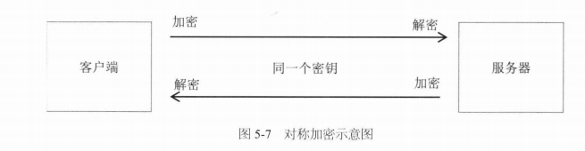
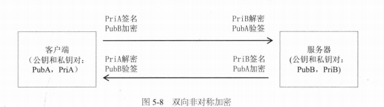
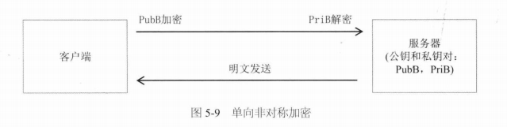
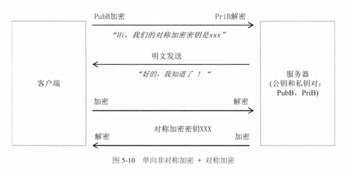
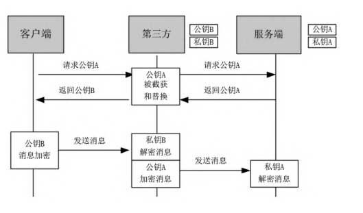
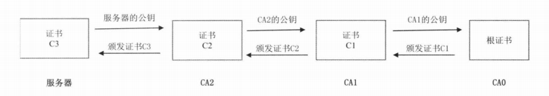

# 网络

[TOC]

## HTTP 1.0

HTTP 1.0 协议的特点是：

1. 只能由客户端主动发起请求
2. HTTP Request 与 HTTP Reponse 是一一对应的
3. 发送 Request 前，先建立 TCP 连接。接收 Reponse 后，再断开 TCP 连接

这有以下问题：

1. 服务器无法主动推送消息
2. 频繁创建销毁 TCP 连接会有性能问题

对于问题（2），使用 `Connection:Keep-Alive` 来解决。即多个 Request & Reponse 可以复用同一条 TCP 连接。注意，只有接收到 Reponse 后，才能发送下一个 Request。为了避免空连接占用系统资源，还提供了 `Keep-Alive timeout` 参数。

以前客户端通过 TCP 连接的关闭来获知请求已结束。而现在 TCP 连接复用，客户端无法再通过此方法来判断请求是否结束。因此，引入了 `Content-Length: xxx` 字段，表明 HTTP Response 的 Body 中共有多少个字节，从而可以推断请求是否结束。

对于问题（1），有以下解决方案：

1. 客户端定期轮询（短轮询）
2. WebSocket
3. HTTP 长轮询。服务器不会关闭连接，而是保持连接打开，直到有数据供服务器发送

## HTTP 1.1

HTTP 1.1 之后，连接复用是一个默认特性，即使不添加 `Connection:Keep-Alive` 。如果想要关闭此特性，要添加 `Connection:Close`

如果服务器返回的数据是动态生成的，那么要计算`Content-Length: xxx` ，必须要等待服务器数据全部生成，这是十分耗时的。因此，在 HTTP1.1 中，引入了 Chunk 机制(Http Streaming)。添加  Transfer-Encoding:chunked 字段来启用该机制：

~~~http
HTTP/1.1 200 OK
Content-Type: text/plain
Transfer-Encoding: chunked

7\r\n
Mozilla\r\n
9\r\n
Developer\r\n
7\r\n
Network\r\n
0\r\n
\r\n
~~~

同一条 TCP 连接上的 HTTP Request/Reponse 是串行的，连接利用率并不高。因此，入了 Pipeline 机制。

但 Pipeline 机制仍有问题，即 Head-of-Line Blocking。客户端发送的请求顺序是 1、2、3，那么接收响应的顺序也必须是 1、2、3。假如响应 1 迟迟未接收到，而响应 2、3 已接收，那么响应 2、3 会被一直阻塞，直到响应 1 被接收到。

此外，HTTP 1.1 支持断点续传特性，即在 Request 上添加 `Range: first offset -last offset` 字段，这样服务器就可以只返回 `(first offset, last offset)` 之间的数据。

## HTTP/2

HTTP/2 协议能完美兼容 HTTP 1.1 。

「二进制分帧」是 HTTP/2 为了解决 HTTP1.1 的 Head-of-Line Blocking 问题所设计的核心特性，即将 HTTP 报文拆分成多个二进制帧。每个 Request 和 Reponse 是逻辑上的一条流，为每条流分配一个流 ID，把这个 ID 作为标签，打到每一个帧上。这样就可以把帧组装起来。

事实上，二进制分帧并没有完全解决该问题，只是将问题细化到「帧」粒度。以上图为例，如果 F6 丢失，那么即使接收到了 F7，F7 也会被一直阻塞，直到接收到 F6。

此外，HTTP/2 还支持对 HTTP 头部的压缩。

## SSL/TLS

SSL 对 TCP 进行了安全增强，而 TLS 只是 SSL 的升级版。

从理论上说，SSL/TSL 协议属于传输层，而在实现上属于应用层。

### 对称加密

对称加密（Symmetric Cryptography）是客户端使用密钥对信息加密，并把密钥和信息发送给服务端，服务端使用密钥进行解密。常见的对称加密算法有DES、AES等。

密钥如何安全地传输呢？在非对称加密中将给出答案

### 非对称加密

非对称加密算法（Asymmetric Cryptography）需要两个密钥：一个称为公开密钥（公钥）；另一个称为私有密钥（私钥）。通过公玥加密的数据只有私玥可以解开，而通过私玥加密的数据只有公玥可以解开。典型的非对称加密算法有 RSA、DSA 等。

哈希算法（Hash）将信息生成一个固定大小的字符串摘要。常用的哈希算法有 MD5、SHA1、SHA-512等。哈希算法是单向的。

数字签名（Digital Signature）是防止消息被篡改的方案，可用于用户身份的识别。它的流程如下：

- 通过哈希函数为待发数据生成消息摘要
- 利用 A 的私钥加密该摘要，得到数字签名
- A 利用 B 的公玥加密数据和数字签名，再发送给 B
- B 利用 B 的私玥解密，再利用 A 的公玥获取数字签名（y）
- B 使用相同的哈希算法，生成 A 发送过来的数据消息摘要（x）
- 如果 x 与 y 相同，那么就确信消息并未被篡改

双向非对称加密技术（使用了数字签名）

单向非对称加密技术

通过单向非对称加密技术，我们可以安全地传输对称加密算法中的密钥

这便是 SSL/TLS 的基本原理。

### 中间人攻击 & 数字证书

无论在单向还是双向非对称加密算法中，公玥如何安全地传输是一个问题。如果处理不好，那么就面临着「中间人攻击」问题。

SSL/TLS 中的中间人攻击

双向非对称加密中的中间人攻击

我们引入一个可信的中间机构 CA，来避免中间人攻击，服务器把公钥发给客户端时，不是直接发送公钥，而是发送公钥对应的证书。证书的颁发过程如下：

1. 用户首先产生自己的密钥对，并将公钥及身份信息提供给CA机构（认证中心）
2. CA在核实用户信息后，将发给用户一个数字证书，它包括三个部分：
   1. 证书内容，包括公钥及身份信息
   2. 哈希算法
   3. 加密密文，CA机构通过哈希算法对证书内容生成内容摘要后，然后使用CA自己的密钥对该摘要进行加密，这相当于生成数字签名。

客户端通过在操作系统中内置的 CA 公玥来解密证书内容。对服务端的证书的数字签名（加密密文）进行解密，获取内容摘要，同时将解密后的证书内容使用相同的哈希算法获取摘要， 对比两个摘要，防止证书被篡改。

但这又有一个问题，如何确保 CA 是可信的。答案是更加可信的 CA 给当前 CA 颁发证书，这样就形成一个 CA 信任链：

以上图为例，客户端要验证需要以下步骤：

1. 客户端得到服务端返回的证书，通过读取得到 **服务端证书的发布机构（Issuer）**
2. 客户端去操作系统查找这个发布机构的的证书，如果是不是根证书就继续递归下去 **直到拿到根证书**。
3. 用 **根证书的公钥** 去 **解密验证** 上一层证书的**合法性**（公玥解密后又对证书内容哈希的消息摘要与公玥解密出的消息摘要相同），再拿上一层证书的公钥去验证更上层证书的合法性；递归回溯。
4. 最后验证服务器端的证书是 **可信任** 的。

CA0 作为 Root CA，必须无条件信任。Root CA 机构都是世界上公认的可信机构，在用户的操作系统、浏览器发布的时候，里面就已经嵌入了这些机构的Root 证书。你信任这个操作系统，信任这个浏览器，也就信任了这些 Root 证书。

这样，CA 的密钥和公玥都不在网络上传输，避免了被盗用的可能性。

### 四次握手

为了协商出对称加密的密钥，SSL/TLS协议引入了几个随机数，具体细节不再展开

## HTTPS

HTTPS = HTTP+SSL/TLS

## TCP/UDP

在网络中进行数据传输所遇到的问题：

1. 丢失
2. 乱序
3. 重复

TCP提供了一种面向连接的、可靠的字节流服务，其数据帧格式大致如图

- 序号的语义与SYN控制标志（Control Bits）有关

  - 当SYN = 1时，当前为连接建立阶段，序号为初始序号 ISN（Initial Sequence Number）。ISN是由算法随机生成的序号。
  - 当SYN = 0时，第一个报文的序号为 ISN + 1，后面的报文序号为前一个报文的SN值 + TCP报文的净荷字节数（不包含TCP头）

- 头部长度：单位为4byte

- 控制标志

  

- 窗口

- 校验和

- 紧急指针

- 可选项和填充部分，最常见的选项为MSS

TCP连接建立时，双方需要经过三次握手，具体过程如下：

1. Client进入SYN_SENT状态，发送一个SYN帧（SYN = 1）来主动打开传输通道。除此之外，SYN帧还会带一个MSS（最大报文段长度）可选项
2. Server在收到SYN帧之后，会进入SYN_RCVD状态，返回SYN+ACK帧（ACK = 1，AN = SN + 1）给Client。同时也会返回服务器的MSS
3. Client在收到Server的第二次握手SYN+ACK确 认帧之后，首先将自己的状态从SYN_SENT变成ESTABLISHED。然后，Client发ACK帧（ACK = 1）给Server。此时Client可能会将ACK帧和第一帧要发送的数据，合并到一起发送给Server。
4. Server在收到Client的ACK帧之后会从SYN_RCVD状态进入 ESTABLISHED状态

连接断开的过程需要经历四次握手：

1. 主动方（可以是客户端，也可以是服务 端），向对方发送一个FIN结束请求报文（FIN = 1）。发送完成后，主动方进入FIN_WAIT_1状态，表示没有数据再要发送给对方了。

2. 在收到了主动方发送的FIN 断开请求报文后，被动方会发送一个ACK响应报文。之后，被动方就进入了CLOSE-WAIT（关闭等待）状态，但是仍可以继续向主动方发送数据。

3. 主动方在收到了ACK报文后，由FIN_WAIT_1转换成FIN_WAIT_2 状态。被动方在发送完数据后，会向主动方发送一个FIN+ACK结束响应报文，然后被动方进入LAST_ACK状态。

4. 主动方收到FIN+ACK断开响应报文后，向被动方发送一个ACK确认报文，然后自己就进入TIME_WAIT状态，等待超时并且在等待时无其他数据到达，那么最终关闭连接（2MSL）。

   MSL（Maximum Segment Lifetime）指的是一个TCP报文片段在网络中的最大存活时间。在RFC1122协议中，推荐MSL为2分钟。

5. 被动方在收到主动断开方的最后ACK报文以后，最终关闭连接。

如果把三次握手改成两次握手，可能发生死锁。两次握手的示例：

假设服务端发送的ACK丢失了，按照两次握手的协定，此时，服务端会认为连接已经建立，就开始发送数据，而客户端还在等待ACK帧，这样客户端会忽略服务端发送过来的数据，而服务端接收不到数据的ACK响应，那么会一直重发数据。

为什么TIME-WAIT状态必须等待2MSL？

1. 假设主动方发送的ACK报文丢失了，那么处于LAST-ACK状态的被动方就不能进入CLOSED状态。如果主动方在2MSL时间内收到了重传的FIN+ACK报文，那么就会重传一次ACK报文。然后再等待2MSL，这样就能确保被动方能收到 ACK报文，从而能确保被动方顺利进入CLOSED状态。
2. 防止旧连接中已失效的数据报文出现在新连接中

TCP还维护一个Keep-Alive计时器，计时器的超时时间一般设置为2小时，若2小时还没有收到Client的任何数据帧，Server就会发送一个探测报文段，以后每隔75秒发送一次。若一连发送10个探测报文仍然没有反应，Server就认为Client出了故障，接着关闭连接。

## QUIC

## WebSocket

WebSocket 协议中大致包含了 5 种类型的数据帧

创建 WebSocket 连接的握手请求是 HTTP1.1（或者更高）的 GET 请求。如果响应报文的状态码为 101，表示服务端同意客户端协议升级请求

WebSocket报文格式

- FIN：表示该帧是否为消息的最后一个数据帧。

- Opcode：决定如何解析后续的数据载荷

  

- Mask：表示是否要对数据载荷进行掩码操作。

- Masking-Key：掩码键，如果 Mask 值为1，就需要用这个掩码 、键来对数据进行反掩码，以获取到真实的通信数据。客户端必须为每一个数据帧选择新的不同掩码值，并要求这个掩码值是随机的。

- Payload Length

- Payload