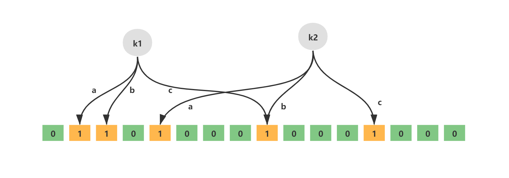
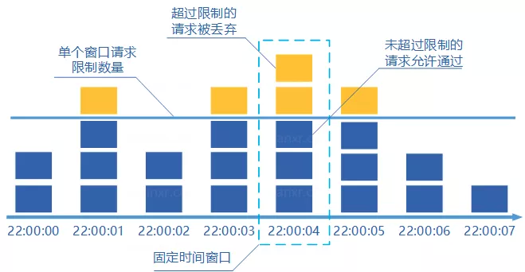
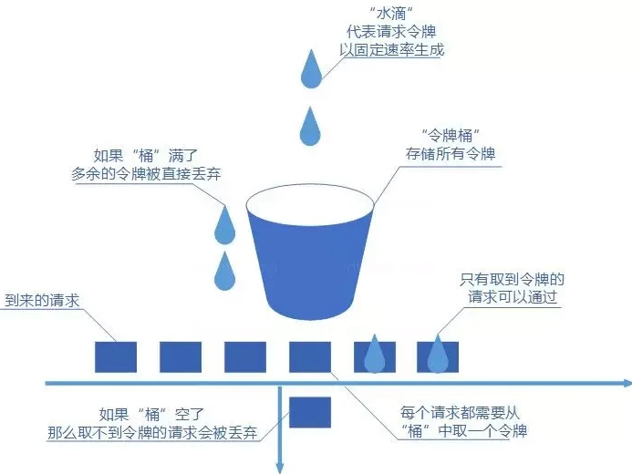

# 面试题

[TOC]

## 布隆过滤器

它实际上是一个很长的二进制向量和一系列随机映射函数。布隆过滤器可以用于检索一个元素是否在一个集合中，存在着一定误识别率。



添加的 key 需要根据 k 个无偏 hash 函数，计算得到多个 hash 值。然后分别取模 hash 得到数组下标。最后将对应的 bit 设置为 1。


当查询元素时，根据 k 个无偏 hash 函数，计算得到多个 hash 值。然后分别取模 hash 得到数组下标。如果对应 bit 全都为 1，那么元素就存在，否则不存在。

布隆过滤器对元素的删除不太支持

实际上，可以通过提升误判率来减少布隆过滤器的空间占用。公式 4.6. 1给出了误判率、空间占用等参数之间的关系式。假设有以下参数：

- n：过滤器中有多少个元素
- p：误判率
- m：过滤器需要占用的空间（单位为Bit）
- k：要使用的哈希函数的个数

$$
m = -\frac{n * ln(p)}{(ln2)^2}
$$

$$
k = \frac{m}{n} * ln2
$$

这里取 n = 2,0000,0000 以及p = 0.1 。计算出 k = 3.32 以及m = 958505838 bits (117005.10 KB)

**布隆过滤器在线计算的网址**：https://krisives.github.io/bloom-calculator/

下面介绍 Redis 如何集成布隆过滤器：

1. https://github.com/RedisLabsModules/rebloom/archive/v2.2.6.tar.gz

2. 编译插件：

   ~~~shell
   cd RedisBloom-2.2.6/
   make
   ~~~

   

3. 在 redis.conf 配置文件中，加入如 RedisBloom 的 redisbloom.so 文件的地址

   ~~~conf
   loadmodule /usr/local/soft/RedisBloom-2.2.6/redisbloom.so
   ~~~

4. 重启 Redis 


布隆过滤器的主要指令如下：

- bf.add 添加一个元素
- bf.exists 判断一个元素是否存在
- bf.madd 添加多个元素
- bf.mexists 判断多个元素是否存在

通过`BF.RESERVE`命令手动创建布隆过滤器：

~~~shell
# BF.RESERVE {key} {error_rate} {capacity} [EXPANSION {expansion}] [NONSCALING]
BF.RESERVE orders 0.1 10000000
~~~

- key：filter 的名字；
- error_rate：期望的错误率，默认 0.1，值越低，需要的空间越大；
- capacity：初始容量，默认 100，当实际元素的数量超过这个初始化容量时，误判率上升。

如果不使用`BF.RESERVE`命令创建，而是使用 Redis 自动创建的布隆过滤器，默认的 `error_rate` 是 `0.01`，`capacity`是 100。


添加 Redission 依赖：

```xml
<dependency>
  <groupId>org.redisson</groupId>
  <artifactId>redisson-spring-boot-starter</artifactId>
  <version>3.16.7</version>
</dependency>
```

创建布隆过滤器

```java
@Service
public class BloomFilterService {

    @Autowired
    private RedissonClient redissonClient;

    /**
     * 创建布隆过滤器
     * @param filterName 过滤器名称
     * @param expectedInsertions 预测插入数量
     * @param falseProbability 误判率
     * @param <T>
     * @return
     */
    public <T> RBloomFilter<T> create(String filterName, long expectedInsertions, double falseProbability) {
        RBloomFilter<T> bloomFilter = redissonClient.getBloomFilter(filterName);
        bloomFilter.tryInit(expectedInsertions, falseProbability);
        return bloomFilter;
    }

}
```

单元测试如下：

```java
@Autowired
private BloomFilterService bloomFilterService;

@Test
public void testBloomFilter() {
    // 预期插入数量
    long expectedInsertions = 10000L;
    // 错误比率
    double falseProbability = 0.01;
    RBloomFilter<Long> bloomFilter = bloomFilterService.create("ipBlackList", expectedInsertions, falseProbability);

    // 布隆过滤器增加元素
    for (long i = 0; i < expectedInsertions; i++) {
        bloomFilter.add(i);
    }
    long elementCount = bloomFilter.count();
    log.info("elementCount = {}.", elementCount);

    // 统计误判次数
    int count = 0;
    for (long i = expectedInsertions; i < expectedInsertions * 2; i++) {
        if (bloomFilter.contains(i)) {
            count++;
        }
    }
    log.info("误判次数 = {}.", count);
    bloomFilter.delete();
}
```


## 事务与锁

下面我们来看一个例子：

~~~java
@Transactional(rollbackFor = Exception.class)
public Result func(seckillId, long userId) {
    lock.lock();
    lock.unlock();
}
~~~

这样事务的提交在解锁之后，在这段时间，很可能产生线程安全问题。因此我们要这样写，把整个事务放在锁的工作范围之内：

~~~java
public void lockProduct() {
    try {
        lock.lock();
        sellProduct();
    } finally {
        lock.unlock();
    }
}
@Transactional(rollbackFor = Exception.class)
public Result sellProduct() {
    
}
~~~

## JVM Dump

获取 JVM 的 dump 文件的两种方式：

-  JVM 启动时增加两个参数：

  ~~~shell
  #出现 OOME 时生成堆 dump: 
  -XX:+HeapDumpOnOutOfMemoryError
  
  #生成堆文件地址：
  -XX:HeapDumpPath=/opt/jvmlogs/
  ~~~

- 直接生成当前 JVM 的 dump 文件

  ~~~java
  jmap -dump:format=b,file=/var/logs/heap.hprof 1234
  // 1234是指JVM的进程号
  ~~~


## 限流

其原理是将时间划分为固定大小的窗口，在每个窗口内限制请求的数量或速率



缺点：

- **限流不够平滑**。例如，我们限制某个接口每分钟只能访问 30 次，假设前 30 秒就有 30 个请求到达的话，那后续 30 秒将无法处理请求
- **无法保证限流速率，因而无法应对突然激增的流量**。例如，我们限制某个接口 1 分钟只能访问 1000 次，该接口的 QPS 为 500，前 55s 这个接口 1 个请求没有接收，后 1s 突然接收了 1000 个请求。


滑动窗口算法：同样也时间划分为固定大小的窗口，但是考虑一段时间内的所有窗口。这样还需要记录每个请求到达的时间点，因此对内存的占用会比较多。


我们往桶中以任意速率流入水，以一定速率流出水。当水超过桶流量则丢弃，因为桶容量是不变的，保证了整体的速率。


- 只能以固定的速率处理请求，对系统资源利用不够友好
- 桶流入水（发请求）的速率如果一直大于桶流出水（处理请求）的速率的话，那么桶会一直是满的，一部分新的请求会被丢弃，导致服务质量下降。


令牌桶算法是对漏斗算法的一种改进，除了能够起到限流的作用外，还允许一定程度的流量突发。



- 可以限制平均速率和应对突然激增的流量。
- 可以动态调整生成令牌的速率。


可以通过 Redisson 的 RRateLimiter 对象来实现分布式限流逻辑。

~~~java
RRateLimiter rateLimiter = redissonClient.getRateLimiter("LIMITER_NAME");
// 每 10 秒钟生成 5 个令牌
rateLimiter.trySetRate(RateType.OVERALL, 5, 10, RateIntervalUnit.SECONDS);

// 请求 num 个令牌。当请求不到时阻塞，最大阻塞时间为1分钟。
rateLimiter.tryAcquire(num,1,TimeUnit.MINUTES);
~~~


