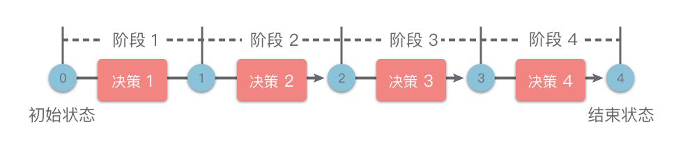

# 动态规划

[TOC]

## 原理

「动态规划（Dynamic Programming）」这里的 Programming 并不是编程的意思，而是指一种「表格处理方法」，即将每一步计算的结果存储在表格中，供随后的计算查询使用。

在动态规划中会将原问题分解为若干子问题，将每个子问题的求解过程都作为一个阶段，在完成前一阶段后，根据前一阶段的结果，求解后一阶段。

动态规划的求解原理：

- **最优子结构**：原问题的最优解包含子问题的最优解。
- **子问题重叠**：子问题重叠指求解过程中每次产生的子问题并不总是新问题，有大量子问题是重复的（子问题结构的一致性）
- **无后效性**。若某阶段的状态一旦确定，则此后的决策不再受该状态的影响。以「矩阵路径的方案数」问题为例：
  - 无后效性：每次只能向下或向右走
  - 后效性：可以往前后左右走，但是不能走重复的格子
  
  如果发现当前策略是有后效性的，那么考虑添加一个额外的维度，并将其解释为最后所作的决策。

动态规划的基本思路如下：

- **划分阶段**：将原问题按顺序（时间顺序、空间顺序或其他顺序）分解为若干个相互联系的「阶段」。划分后的阶段⼀定是有序或可排序的，否则问题⽆法求解。

- **定义状态**：将和子问题相关的某些变量（位置、数量、体积、空间等等）作为一个「状态」表示出来，即 `dp[i][j][k]`，这里 dp 就是一个状态，而 i、j、k 就是某些变量。状态的选择要满⾜⽆后效性。

- **状态转移**：根据「本阶段的状态」和「该状态下所能做出的决策」，推导出「下一阶段的状态」，即**「状态转移方程」**

- **初始条件和边界条件**：根据问题描述、状态定义和状态转移方程，确定初始条件和边界条件。

- **最终结果**：确定问题的求解目标，然后按照一定顺序求解每一个阶段的问题。最后根据状态转移方程的递推结果，确定最终结果。

## 记忆化搜索

**记忆化搜索**：「自顶向下」的解决问题，采用自然的递归方式编写过程（DFS），**在过程中会保存每个子问题的解（通常保存在一个数组或哈希表中）来避免重复计算。**

**递推**：「自底向上」的解决问题，采用循环的方式编写过程，在过程中通过保存每个子问题的解（通常保存在一个数组或哈希表中）来避免重复计算。

记忆化搜索并不是回溯、DFS，它还是脱离不了 DP，即每个参数就是状态，而返回值就是状态转移方程的结果值。

### 矩阵中的最长递增路径

给定一个 `m x n` 整数矩阵 `matrix` ，找出其中 **最长递增路径** 的长度。

~~~go
func longestIncreasingPath(matrix [][]int) int {
	h, w := len(matrix), len(matrix[0])
	cache := make([][]int, h)
	for i, _ := range cache {
		cache[i] = make([]int, w)
	}

	type Pair struct{ x, y int }
	directions := []Pair{
		{0, -1},
		{0, 1},
		{1, 0},
		{-1, 0},
	}
	var dfs func(i, j int) int
	dfs = func(i, j int) int {
		// 这个 DFS 更加明显，与经典的 DFS 相比有一种异味
		// 本质上它还是一种 DP
		if cache[i][j] != 0 {
			return cache[i][j]
		}

		ans := 1
		for _, d := range directions {
			if nx, ny := d.x+i, d.y+j; 0 <= nx &&
				nx < h && 0 <= ny && ny < w && matrix[nx][ny] > matrix[i][j] {
				ans = max(ans, dfs(nx, ny)+1)
			}
		}
		cache[i][j] = ans
		return ans
	}

	ans := 0
	for i := 0; i < h; i++ {
		for j := 0; j < w; j++ {
			if cache[i][j] != 0 {
				ans = max(ans, cache[i][j])
			}
			ans = max(ans, dfs(i, j))
		}
	}
	return ans
}
~~~

### 学生出勤记录

可以用字符串表示一个学生的出勤记录，其中的每个字符用来标记当天的出勤情况（缺勤、迟到、到场）。记录中只含下面三种字符：

- `'A'`：Absent，缺勤
- `'L'`：Late，迟到
- `'P'`：Present，到场

如果学生能够 **同时** 满足下面两个条件，则可以获得出勤奖励：

- 按 **总出勤** 计，学生缺勤（`'A'`）**严格** 少于两天。
- 学生 **不会** 存在 **连续** 3 天或 **连续** 3 天以上的迟到（`'L'`）记录。

给你一个整数 `n` ，表示出勤记录的长度（次数）。请你返回记录长度为 `n` 时，可能获得出勤奖励的记录情况 **数量** 。答案可能很大，所以返回对 `109 + 7` **取余** 的结果。

~~~go
func checkRecord(n int) int {
	const MODULO int = 1e9 + 7
	cache := make([][][]int, n+1)
	for i, _ := range cache {
		cache[i] = make([][]int, 2)
		for j, _ := range cache[i] {
			cache[i][j] = make([]int, 3)
			for k, _ := range cache[i][j] {
				cache[i][j][k] = -1
			}
		}
	}

	var dfs func(bits, absent, late int) int
    // 这个和回溯不一样
    // 它的思考方式是 DP
	dfs = func(bits int, absent int, late int) int {
		if absent == 2 || late == 3 {
			return 0
		}
		if bits == 0 {
			return 1
		}
		if cache[bits][absent][late] != -1 {
			return cache[bits][absent][late]
		}

		ans := (dfs(bits-1, absent+1, 0)) % MODULO
		ans = (ans + dfs(bits-1, absent, late+1)) % MODULO
		ans = (ans + dfs(bits-1, absent, 0)) % MODULO
		cache[bits][absent][late] = ans
		return ans
	}

	return dfs(n, 0, 0)
}
~~~

### 扰乱字符串

使用下面描述的算法可以扰乱字符串 `s` 得到字符串 `t` ：

1. 如果字符串的长度为 1 ，算法停止
2. 如果字符串的长度 > 1 ，执行下述步骤：
   - 在一个随机下标处将字符串分割成两个非空的子字符串。即，如果已知字符串 `s` ，则可以将其分成两个子字符串 `x` 和 `y` ，且满足 `s = x + y` 。
   - **随机** 决定是要「交换两个子字符串」还是要「保持这两个子字符串的顺序不变」。即，在执行这一步骤之后，`s` 可能是 `s = x + y` 或者 `s = y + x` 。
   - 在 `x` 和 `y` 这两个子字符串上继续从步骤 1 开始递归执行此算法。

给你两个 **长度相等** 的字符串 `s1` 和 `s2`，判断 `s2` 是否是 `s1` 的扰乱字符串。如果是，返回 `true` ；否则，返回 `false` 。

~~~go
// 统计词频的
func check(s1, s2 string) bool {
	if len(s1) != len(s2) {
		return false
	}

	s1Table := map[byte]int{}
	s2Table := map[byte]int{}
	n := len(s1)
	for i := 0; i < n; i++ {
		s1Table[s1[i]-'a']++
		s2Table[s2[i]-'a']++
	}
	for i := byte(0); i < 26; i++ {
		if s1Table[i] != s2Table[i] {
			return false
		}
	}
	return true
}

func isScramble2(s1 string, s2 string) bool {
	if s1 == s2 {
		return true
	}
	if len(s1) != len(s2) {
		return false
	}
	n := len(s1)
    
	cache := make([][][]int, n)
	for i := 0; i < n; i++ {
		cache[i] = make([][]int, n)
		for j := 0; j < n; j++ {
			cache[i][j] = make([]int, n+1)
		}
	}

	var dfs func(i, j, len int) bool
    // s1从i开始，s2从j开始，比较len个字符
	dfs = func(i int, j int, len int) bool {
		if cache[i][j][len] == 1 {
			return cache[i][j][len] == 1
		}
		a, b := s1[i:i+len], s2[j:j+len]
		if a == b {
			cache[i][j][len] = 1
			return true
		}
		if !check(a, b) {
			cache[i][j][len] = -1
			return false
		}

		for k := 1; k < len; k++ {
            // 这和回溯中决策的思考不一样
			if dfs(i, j, k) && dfs(i+k, j+k, len-k) {
				cache[i][j][len] = 1
				return true
			}
			if dfs(i, j+len-k, k) && dfs(i+k, j, len-k) {
				cache[i][j][len] = 1
				return true
			}
		}
		cache[i][j][len] = 0
		return false
	}
	return dfs(0, 0, n)
}
~~~

任何记忆化搜索都可以转换为常规的 DP 形式，参数作为 DP 的维度，而计算部分转化为状态转移方程

~~~go
func isScramble(s1 string, s2 string) bool {
	if s1 == s2 {
		return true
	}

	if len(s1) != len(s2) {
		return false
	}

	n := len(s1)
	dp := make([][][]bool, n)
	for i := 0; i < n; i++ {
		dp[i] = make([][]bool, n)
		for j := 0; j < n; j++ {
			dp[i][j] = make([]bool, n+1)
		}
	}

	for i := 0; i < n; i++ {
		for j := 0; j < n; j++ {
			dp[i][j][1] = s1[i] == s2[j]
		}
	}

	for l := 2; l <= n; l++ {
		for i := 0; i <= n-l; i++ {
			for j := 0; j <= n-l; j++ {
				for k := 1; k < l; k++ {
					a := dp[i][j][k] && dp[i+k][j+k][l-k]
					b := dp[i][j+l-k][k] && dp[i+k][j][l-k]
					if a || b {
						dp[i][j][l] = true
					}
				}
			}
		}
	}

	return dp[0][0][n]
}
~~~

## 线性 DP

具有「线性」阶段划分的动态规划方法统称为线性动态规划（简称为「线性 DP」），如下图所示。

- 如果按照「状态的维度数」进行分类，我们可以将线性 DP 问题分为：一维线性 DP 问题、二维线性 DP 问题，以及多维线性 DP 问题。
- 如果按照「问题的输入格式」进行分类，我们可以将线性 DP 问题分为：单串线性 DP 问题、双串线性 DP 问题、矩阵线性 DP 问题，以及无串线性 DP 问题。

### 单串线性 DP

问题的输入为单个数组或单个字符串的线性 DP 问题。状态一般可定义为 𝑑𝑝[𝑖]，表示为：

- 「以数组中第 𝑖 个位置元素 𝑛𝑢𝑚𝑠[𝑖] 为结尾的子数组（𝑛𝑢𝑚𝑠[0]...𝑛𝑢𝑚𝑠[𝑖]）」的相关解
- 「以数组中前 𝑖 个元素为子数组（𝑛𝑢𝑚𝑠[0]...𝑛𝑢𝑚𝑠[𝑖−1]）」的相关解。

#### 最长上升子序列（LIS）

给你一个整数数组 `nums` ，找到其中最长严格递增子序列的长度。

- 划分阶段：按照子序列的结尾位置进行阶段划分。
- 定义状态：状态 𝑑𝑝[𝑖] 表示为：以 𝑛𝑢𝑚𝑠[𝑖] 结尾的最长递增子序列长度。
- 状态转移方程：𝑑𝑝[𝑖]=𝑚𝑎𝑥(𝑑𝑝[𝑖],𝑑𝑝[𝑗]+1), 0≤𝑗<𝑖
- 初始条件：`dp[0] = 1`
- 最终结果：再遍历一遍 𝑑𝑝 数组，求出最大值即为最终结果

~~~go
func lengthOfLIS(nums []int) int {
	n := len(nums)
	if n == 0 {
		return 0
	}
	
	dp := make([]int, n)
	dp[0] = 1
	for i := 1; i < n; i++ {
		dp[i] = 1
		for j := 0; j < i; j++ {
			if nums[i] > nums[j] {
				dp[i] = max(dp[i], dp[j]+1)
			}
		}
	}

	ans := 0
	for _, v := range dp {
		ans = max(ans, v)
	}
	return ans
}
~~~

#### 最长的斐波那契子序列的长度

有一些单串线性 DP 问题在定义状态时需要考虑两个结束位置，这时候我们就需要需要增加一个结束位置维度来定义状态。

如果序列 `X_1, X_2, ..., X_n` 满足下列条件，就说它是 *斐波那契式* 的：

- `n >= 3`
- 对于所有 `i + 2 <= n`，都有 `X_i + X_{i+1} = X_{i+2}`

给定一个**严格递增**的正整数数组形成序列 arr ，找到 arr 中最长的斐波那契式的子序列的长度。如果一个不存在，返回 0 。

~~~go
func lenLongestFibSubseq(arr []int) int {
	n := len(arr)
	if n == 0 {
		return 0
	}
	table := map[int]int{}
	for i, v := range arr {
		table[v] = i
	}
	
    // 以 dp[i][j] 表示，以 arr[i]，arr[j] 结尾的最大长度
	dp := make([][]int, n)
	for i, _ := range dp {
		dp[i] = make([]int, n)
		for j := i + 1; j < n; j++ {
			dp[i][j] = 2
		}
	}

	ans := 0
	for i := 0; i < n; i++ {
		for j := i + 1; j < n; j++ {
			diff := arr[j] - arr[i]
			if v, ok := table[diff]; ok && v < i {
				dp[i][j] =  dp[v][i]+1
			}
			ans = max(ans, dp[i][j])
		}
	}
	if ans > 2 {
		return ans
	}
	return 0
}
~~~

### 双串线性 DP 

问题的输入为两个数组或两个字符串的线性 DP 问题。状态一般可定义为 `𝑑𝑝[𝑖][𝑗]`，表示为：

1. 「以第一个数组中第 𝑖个位置元素 𝑛𝑢𝑚𝑠1[𝑖] 为结尾的子数组（𝑛𝑢𝑚𝑠1[0]...𝑛𝑢𝑚𝑠1[𝑖]）」与「以第二个数组中第 𝑗 个位置元素 𝑛𝑢𝑚𝑠2[𝑗] 为结尾的子数组（𝑛𝑢𝑚𝑠2[0]...𝑛𝑢𝑚𝑠2[𝑗]）」的相关解。
2. 「以第一个数组中前 𝑖 个元素为子数组（𝑛𝑢𝑚𝑠1[0]...𝑛𝑢𝑚𝑠1[𝑖−1]）」与「以第二个数组中前 𝑗 个元素为子数组（𝑛𝑢𝑚𝑠2[0]...𝑛𝑢𝑚𝑠2[𝑗−1]）」的相关解。

#### 最长公共子序列 LCS

给定两个字符串 `text1` 和 `text2`，返回这两个字符串的最长 **公共子序列** 的长度。如果不存在 **公共子序列** ，返回 `0` 。

~~~go
func longestCommonSubsequence(text1 string, text2 string) int {
	n1, n2 := len(text1), len(text2)
    // dp[i][j] 表示 text1[:i] 与 text2[:j] 的最大公共子序列的长度 
	dp := make([][]int, n1+1)
	for i, _ := range dp {
		dp[i] = make([]int, n2+1)
	}

	for i := 1; i <= n1; i++ {
		for j := 1; j <= n2; j++ {
			if text1[i-1] == text2[j-1] {
				dp[i][j] = dp[i-1][j-1] + 1
			} else {
				dp[i][j] = max(dp[i-1][j], dp[i][j-1])
			}
		}
	}

	return dp[n1][n2]
}

~~~

#### 编辑距离

双串线性 DP 问题中除了经典的最长公共子序列问题之外，还包括字符串的模糊匹配问题。

~~~go
func minDistance(word1 string, word2 string) int {
	n1, n2 := len(word1), len(word2)
	dp := make([][]int, n1+1)
	for i, _ := range dp {
		dp[i] = make([]int, n2+1)
	}

	for i := 1; i <= n1; i++ {
        // word1[:i] 要删除 i 次，才能和空串 word2 匹配上
		dp[i][0] = i
	}

	for i := 1; i <= n2; i++ {
        // 空串 word1[:0] 要插入 i 次，才能和 word2[:i] 匹配上
		dp[0][i] = i
	}

	for i := 1; i <= n1; i++ {
		for j := 1; j <= n2; j++ {
			if word1[i-1] == word2[j-1] {
				dp[i][j] = dp[i-1][j-1]
			} else {
                // dp[i - 1][j - 1] 相当于 replace
                // dp[i - 1][j] -> dp[i][j] 这一步转移相当于做出 insert 的决策
                // dp[i][j - 1] 相当于做出 delete 决策
				dp[i][j] = min(dp[i-1][j-1], dp[i-1][j], dp[i][j-1]) + 1
			}
		}
	}
	return dp[n1][n2]
}
~~~

### 矩阵线性 DP 

问题的输入为二维矩阵的线性 DP 问题。状态一般可定义为 `dp[i][j]`，表示为：从「位置 (0,0)」到达「位置 (𝑖,𝑗)」的相关解。

#### 最大正方形

在一个由 `'0'` 和 `'1'` 组成的二维矩阵内，找到只包含 `'1'` 的最大正方形，并返回其面积：

~~~go
func maximalSquare(matrix [][]byte) int {
	h, w := len(matrix), len(matrix[0])
    // dp[i][j] ，以(i, j) 为右下角，值包括1的正方形的最大边长
	dp := make([][]int, h)
	for i, _ := range dp {
		dp[i] = make([]int, w)
	}
	ans := 0
	for i := 0; i < h; i++ {
		for j := 0; j < w; j++ {
			if matrix[i][j] == '1' {
				if i == 0 || j == 0 {
					dp[i][j] = 1
				} else {
					dp[i][j] = min(dp[i-1][j-1], dp[i][j-1], dp[i-1][j]) + 1
				}
			}
			ans = max(ans, dp[i][j])
		}
	}
	return ans * ans
}

~~~

### 无串线性 DP 问题

问题的输入不是显式的数组或字符串，但依然可分解为若干子问题的线性 DP 问题。

#### 整数拆分

给定一个正整数 `n` ，将其拆分为 `k` 个 **正整数** 的和（ `k >= 2` ），并使这些整数的乘积最大化。

~~~go
func integerBreak(n int) int {
    // dp[i] 表示 i 的最大乘积
	dp := make([]int, n+1)
	dp[0], dp[1] = 0, 0
	for i := 2; i <= n; i++ {
		for j := 1; j < i; j++ {
            // 将 i 拆分为 j 和 i - j 的和
            // 如果 i - j 不再拆分为多个正整数，此时乘积为 j * (i - j)
            // 如果 i - j 继续拆分，那么乘积为 j * dp[i - j]
			dp[i] = max(dp[i], j * dp[i-j],  j*(i-j))
		}
	}
	return dp[n]
}
~~~

#### 两个键的键盘

~~~go
func minSteps(n int) int {
	dp := make([]int, n+1)
	for i := 2; i <= n; i++ {
		dp[i] = math.MaxInt32
        //由于 j 能够整除 i，则 j 与 i/j 都是 i 的因子，两者中必有一个因子是小于等于 sqrt(i) 的。
		for j := 1; j*j <= i; j++ {
			if i%j == 0 {
				dp[i] = min(dp[i], dp[i/j]+j, dp[j]+i/j)
			}
		}
	}
	return dp[n]
}
~~~

## 区间 DP

线性 DP 的一种，简称为「区间 DP」。以「区间长度」划分阶段，以两个坐标（区间的左、右端点）作为状态的维度。一个状态通常由被它包含且比它更小的区间状态转移而来。

常见的区间 DP 问题可以分为两种：

1. 单个区间从中间向两侧更大区间转移的区间 DP 问题。基本解题思路如下：

   ~~~python
   for i in range(size - 1, -1, -1):       # 倒叙枚举起点
       for j in range(i + 1, size):        # 从起点正序枚举终点
           # 状态转移方程，计算转移到更大区间后的最优值
           dp[i][j] = max(dp[i + 1][j - 1], dp[i + 1][j], dp[i][j - 1]) + cost[i][j]
   ~~~

2. 多个（大于等于 2 个）小区间转移到大区间的区间 DP 问题。比如从区间 [i, k] 和区间 [k,j] 转移到区间 [i, j]。

   ~~~python
   for l in range(1, n):               # 枚举区间长度
       for i in range(n):              # 枚举区间起点
           j = i + l - 1               # 根据起点和长度得到终点
           if j >= n:
               break
           for k in range(i, j + 1):   # 枚举区间分割点
               # 状态转移方程，计算合并区间后的最优值
               dp[i][j] = max(dp[i][j], dp[i][k] + dp[k + 1][j] + cost[i][j])
   ~~~

### 戳气球

有 `n` 个气球，编号为`0` 到 `n - 1`，每个气球上都标有一个数字，这些数字存在数组 `nums` 中。现在要求你戳破所有的气球。戳破第 `i` 个气球，你可以获得 `nums[i - 1] * nums[i] * nums[i + 1]` 枚硬币。 这里的 `i - 1` 和 `i + 1` 代表和 `i` 相邻的两个气球的序号。如果 `i - 1`或 `i + 1` 超出了数组的边界，那么就当它是一个数字为 `1` 的气球。求所能获得硬币的最大数量。

~~~go
func maxCoins(nums []int) int {
	n := len(nums)
	dp := make([][]int, n)
	for i, _ := range dp {
		dp[i] = make([]int, n)
	}

	for i := 0; i < n; i++ {
		cost := nums[i]
		if i != 0 {
			cost *= nums[i-1]
		}
		if i != n-1 {
			cost *= nums[i+1]
		}
		dp[i][i] = cost
	}

	for l := 1; l <= n-1; l++ {
		for i := 0; i < n; i++ {
			j := i + l
			if j >= n {
				break
			}
			for k := i; k <= j; k++ {
				cost := nums[k]
				// 这里 nums[k] * nums[i-1] * nums[j+1]
				// 是因为 k 为最后一个被戳破的气球
				// 而不是任意一个被戳破的气球，否则这种语义会导致后效性
				if i != 0 {
					cost *= nums[i-1]
				}
				if j != n-1 {
					cost *= nums[j+1]
				}
				if k == i {
					dp[i][j] = max(dp[i][j], dp[k+1][j]+cost)
				} else if k == j {
					dp[i][j] = max(dp[i][j], dp[i][k-1]+cost)
				} else {
					dp[i][j] = max(dp[i][j], dp[i][k-1]+dp[k+1][j]+cost)
				}
			}
		}
	}
	return dp[0][n-1]
}
~~~

### 切棍子的最小成本

