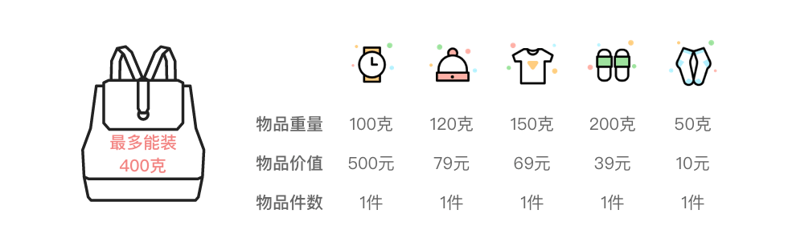
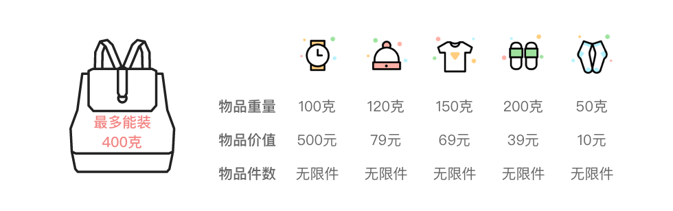
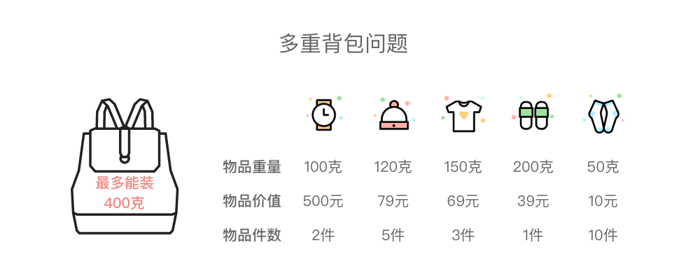
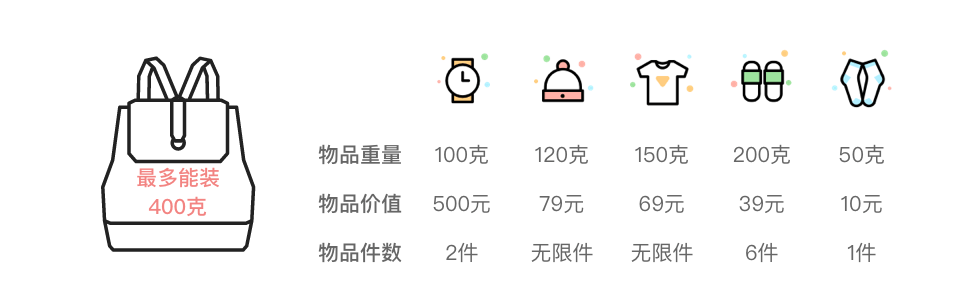
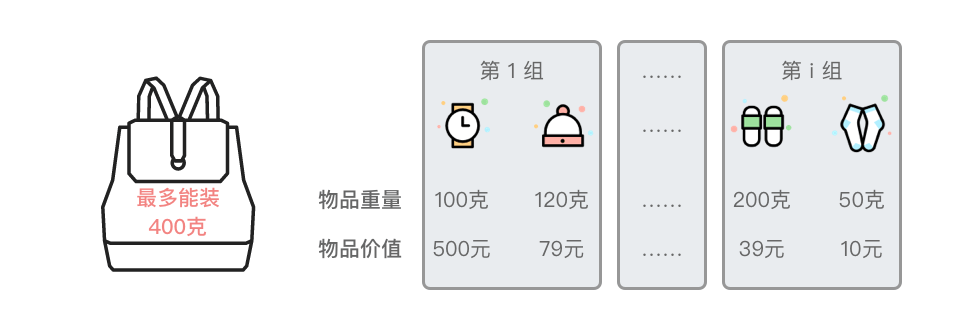
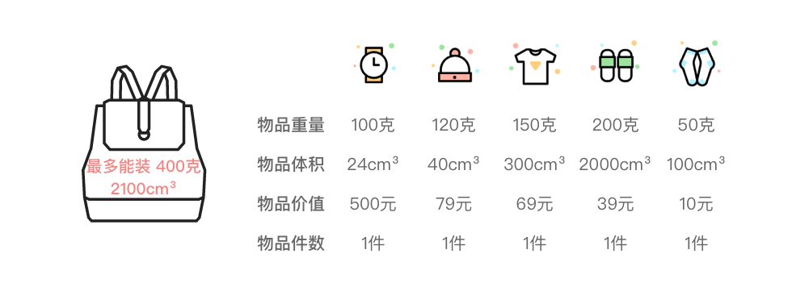
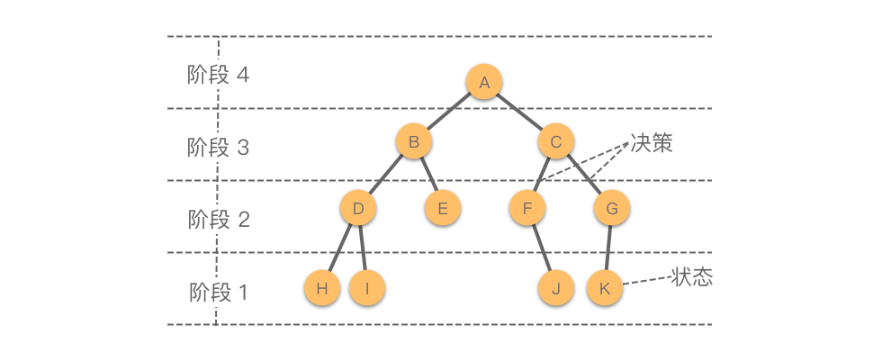
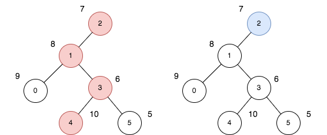

## 背包

[TOC]


### 01 背包



- 阶段划分：假设第 i 阶段表示处理第 i 种物品

- 状态表示：`c[i][j]`表示前 i 种物品在上限容量为 j 的背包中所获得的最大价值。

- 状态转移方程：
  $$
  dp[i][j] =  \left \{ 
  \begin{array}{lr} 
  dp[i - 1][j] &, j < w[i] \\ 
  max\{dp[i - 1][j], dp[i - 1][j - w[i]] + v[i]\} &, j\geq w[i]\end{array}
  \right \}
  $$

  ```java
  // n 表示 n 件物品
  for (int i = 1; i <= n; i++) {
      //  W 表示背包的最大容量
      for (int j = 1; j <= W; j++) 
          // 若物品 i 的体积大于背包容量，就不放置
  		if (j < w[i])	 
              c[i][j] = c[i - 1][j]
          else 
              c[i][j] = max(c[i - 1][j], c[i - 1][j - w[i]] + v[i])
  }
  ```


构造解：

  [](https://github.com/AtsukoRuo/note/blob/default/计算机科学理论/算法/assets/image-20240216114505201.png)

- 若`c [i][j] > c [i −1][j]`，则说明第 i 种物品被放入背包，令`x[i] = 1，j −= w [i ]` 

- 若`c[i][j] ≤ c[i −1][j]`，则说明第 i 种物品没被放入背包，令`x[i] = 0`。

  ```java
  for (int i = n; i > 0; i--) {
  	if (c[i][j] > c[i - 1][j]) {
          x[i] = 1;
          j -= w[i];
      } else {
          x[i] = 0;
      }
  }
  ```

 

优化思路 ，**若不构造最优解**，那么第 i -1 种物品之前的处理结果已经没用了，因此可以将优化为： $$ dp[j] = max\{dp[j], dp[j - w[i]] + v[i]\} $$

```java
// 这需要倒推
for (int i = 1; i <= n; i++) {
    for (int j = W; j >= w[i]; j--) {
        dp[j] = max(dp[j], dp[j - w[i]] + v[i]);
    }
}
```

**注意，这仅仅优化存储空间，并不优化时间复杂度**


### 完全背包



状态转移方程：
$$
c[i][j] = \left \{ 
\begin{array}{lr} 
c[i - 1][j] &, j < w[i]\\ max\{c[i - 1][j - w[i] * k] + v[i] * k\} &, k = 0, 1,... \and  k * v[i] \leq j \end{array} \right.
$$


我们接下来对上述方程进行优化，可以观察到：
$$
c[i][j] = max\{c[i - 1][j], c[i-1][j-w[i]]+v[i], c[i-1][j - 2w[i]]+2v[i],....\}
$$
由
$$
c[i][j-w[i]] = max\{c[i - 1][j - w[i]],c[i-1][j-2w[i]]+v[i],c[i-1][j-3w[i]] + 2v[i],...\}
$$
可以推出：
$$
c[i][j-w[i]] + v[i]= max\{c[i - 1][j - w[i]] + v[i],c[i-1][j-2w[i]]+2v[i],c[i-1][j-3w[i]] + 3*v[i],...\}
$$
 结合上面两式，可以我们得到
$$
dp[i][j] = max\{dp[i-1][j], dp[i][j-w[i]] + v[i]\}
$$
01背包与完全背包的对比：

- 01背包：$max\{c[i - 1][j], \textcolor{red}{c[i - 1]}[j - w[i]] + v[i]\}$
- 完全背包：$max\{c[i-1][j], \textcolor{red}{c[i]}[j-w[i]] + v[i]\}$


代码可以优化为

```java
for (int i = 1; i <= n; i++) {
    // 正推即可
    for (int j = w[i]; j <= W; j++) {
        dp[j] = max(dp[j], dp[j - w[i]] + v[i]);
    }
}
```


给你一个整数数组 `cost` 和一个整数 `target` 。请你返回满足如下规则可以得到的 **最大** 整数：

- 给当前结果添加一个数位（`i + 1`）的成本为 `cost[i]` （`cost` 数组下标从 0 开始）。
- 总成本必须恰好等于 `target` 。
- 添加的数位中没有数字 0 。

由于答案可能会很大，请你以字符串形式返回。如果按照上述要求无法得到任何整数，请你返回 "0" 。

~~~go
func largestNumber(cost []int, target int) string {
	W := target
	n := len(cost)
	dp := make([][]string, n+1)
	
    INF := "0"
	for i, _ := range dp {
		dp[i] = make([]string, W+1)
		for j, _ := range dp[i] {
			dp[i][j] = string(INF)      // 置于无效状态
		}
	}
	// 这里的 value 数组是隐式的，下面会说明
    
    // 初始化边界
    for j := 0; j <= n; j++ {
        dp[j][0] = ""
    }

    // 这个边界不能初始化，因为不符合恰好的语义
    // for j := 0; j <= W; j++ {
    //     dp[0][j] = ""
    // }

    // 通过这个函数来间接表达 value 数组
	betterString := func(a, b string) string {
        //如果a和b长度一样。返回string 字典序
	if len(a) == len(b) {
		if a > b {
			return a
		}
		return b
	}
	//否则返回长度较长的值
	if len(a) > len(b) {
		return a
	}
	return b
	}

	for i := 0; i < n; i++ {
		for j := 1; j <= W; j++ {
			if cost[i] > j {
                // 无效状态直接跳过
                if (dp[i][j] != INF) {
                    dp[i+1][j] = dp[i][j]
                }
			} else {
                if dp[i+1][j-cost[i]] != INF && dp[i][j] != INF{
                    dp[i+1][j] = betterString(dp[i][j], string(i+1 +'0')+dp[i+1][j-cost[i]])
                } else if dp[i][j] != INF  && dp[i+1][j-cost[i]] == INF {
                    dp[i+1][j] = dp[i][j]
                } else if dp[i][j] == INF  && dp[i+1][j-cost[i]] != INF {
                    dp[i+1][j] = string(i+1 +'0')+dp[i+1][j-cost[i]]
                }
			}
		}
	}

	if dp[n][W] == INF {
		return "0"
	}
	return dp[n][W]
}

~~~

### 多重背包



对于容量为 w 的 背包，最多可以装 $min\{count[i-1],\frac{w}{weight[i-1]}\}$件第 `i-1` 个物品。那么我们外加一层循环，枚举第 `i-1` 件物品可以选择的件数，从而将「多重背包问题」转换为「0-1 背包问题」。

我们可以使用二进制来优化枚举，使得时间复杂度降低。就是把物品的数量 $count[i]$ 拆分成由 $1,2,4,...,2^m$ 件单个物品组成的大物品，以及由剩余不足 2 的整数次幂数量的物品组成大物品


~~~go
func  multiplePackMethod(weight []int, value []int, count []int, W int) {
    n := len(count)
    newWeight, newValue := []int{}, []int{}
    for i := 0; i < n; i++ {
        cnt := count[i]
        k := 1
        // 开始以 2 次幂来进行合并
        for k <= cnt {
            cnt -= k
            newWeight = append(newWeight, weight[i] * k)
            newValue = append(newValue, value[i] * k)
            k *= 2
        }
        // 将剩下不足 2 次幂的部分进行合并
        if cnt > 0 {
        	newWeight = append(newWeight, cnt)
            newValue = append(newValue, cnt)
        }
    }
    
    // 按 01 背包开始处理
}
~~~


### 混合背包



~~~go
func mixedPackMethod(weight []int, value []int, count []int, W int) {
    n := len(count)
    newWeight, newValue, newCount := []int{}, []int{}, []int{}
    for i := 0; i < n; i++ {
        cnt := count[i]
        // 多重背包问题，转换为 0-1 背包问题
        if cnt > 0 {
            k := 1
            // 开始以 2 次幂来进行合并
            for k <= cnt {
                cnt -= k
                newWeight = append(newWeight, weight[i] * k)
                newValue = append(newValue, value[i] * k)
                k *= 2
            }
            // 将剩下不足 2 次幂的部分进行合并
            if cnt > 0 {
                newWeight = append(newWeight, cnt)
                newValue = append(newValue, cnt)
            }
            newCount = append(newCount, 1)
        } else if cnt == -1 {
            //  0-1 背包问题，直接添加
            newWeight = append(newWight, weight[i])
            newValue = append(newValue, value[i])
            newCount = append(newCount, 1)
        } else {
            // 完全背包问题
            newWeight = append(newWight, weight[i])
            newValue = append(newValue, value[i])
            newCount = append(newCount, 0)
        }
    }
    
    // 一维优化形式：
    dp := make([]int, W)
    n = len(newWeight)
    for i := 1; i <= n; i++ {
        if newCount[i - 1] == 1{
            // 01 背包问题
            // 逆序遍历
        } else {
            // 完全背包问题
            // 正序遍历
        }
    }
}
~~~


### 分组背包



每组物品中最多只能选择 1 件物品装入背包。

- 状态定义：`dp[i][w]`表示为前 𝑖 组物品放入最多能装重量为 𝑤 的背包中，可以获得的最大价值。

- 状态转移方程：
  $$
  dp[i][w] = max\{dp[i-1][w], dp[i-1][w-weight[i-1][k]] + value[i - 1][k]\}, 0\leq k \leq group_count[i-1]
  $$
  

~~~python
def groupPackMethod1(self, group_count: [int], weight: [[int]], value: [[int]], W: int):
    size = len(group_count)
    dp = [[0 for _ in range(W + 1)] for _ in range(size + 1)]

    # 枚举前 i 组物品
    for i in range(1, size + 1):
        # 枚举背包装载重量
        for w in range(W + 1):
            # 枚举第 i - 1 组物品能取个数
            dp[i][w] = dp[i - 1][w]
            for k in range(group_count[i - 1]):
                if w >= weight[i - 1][k]:
                    # dp[i][w] 取所有 dp[i - 1][w - weight[i - 1][k]] + value[i - 1][k] 中最大值
                    dp[i][w] = max(dp[i][w], dp[i - 1][w - weight[i - 1][k]] + value[i - 1][k])
~~~


### 多维背包



- 定义状态 `dp[i][w][v]` ：前 i 件物品放入一个最多能装重量为 *w*、容量为 *v* 的背包中，可以获得的最大价值。

- 状态转移方程：
  $$
  dp[i][w][v] = max(dp[i - 1][w][v], dp[i-1][w-weight[i-1]][v-volume[v - 1]] + value[i-1]), 0\leq weight[i-1] \leq w, 0 \leq volume[i-1] \leq v
  $$
  

### 变种

#### 恰好装满

在恰好装满的语义下，背包状态的含义发生了微妙的变化，即前 i 种物品在**装满**容量为 j 的背包中所获得的最大价值。在普通背包下，如果尚未装满，那么状态值为有效的；但是在恰好装满背包下，**状态值必须是无效的**。而且无法从无效状态推导出有效状态

我们以 01 背包为例来说明，在取最大值的情况下，我们将无效状态定义为 <0 的值，并且都初始化为 -INF，

~~~c++
#define INF 0x80000000

for (int i = 0; i <= N; i++) {
    f[i] = INF;
}

// f[0] 是有效状态
f[0] = 0;

// 动态规划过程
for (int i = 1; i <= N; i++) {
    for (int j = V; j >= v[i]; j--) {
        f[j] = max(f[j], f[j - v[i]] + w[i]);
        // 处理 f[j] 和 f[j - v[i]] + w[i] 都是无效的情况
        if (f[j] < 0)
            f[j] = INF;
    }
}

// 判断能否恰好装满背包
if (f[V] > 0) {
    cout << f[V] << endl;		//背包恰好装满了，输出结果
} else {
    cout << "error" << endl; 	//背包不能恰好装满
}
~~~

#### 求总方案数

这种问题就是将原有状态转移方程中的「求最大值」变为「求和」即可，而且无需考虑 value 数组。**此时，就按照正常的 DP 思路来考虑即可**。以求  01 背包问题的方案数为例，它的状态转移方程为：
$$
dp[i][w] = dp[i-1][w] + dp[i][w-weight[i-1]]
$$
例如，2585 获得分数的方法数、0879 盈利计划

#### 求最优方案数

我们要维护两个状态：

- `dp[i][w]`：前 𝑖 种物品放入一个最多能装重量为 𝑤 的背包中，可获得的最大价值。
- `op[i][w]`：前 𝑖 种物品放入一个最多能装重量为 𝑤 的背包中，使背包总价值最大的方案数。

状态转移方程为：

~~~python
# 选择第 i - 1 件物品获得价值更高
if dp[i - 1][w] < dp[i - 1][w - weight[i - 1]] + value[i - 1]:
    dp[i][w] = dp[i - 1][w - weight[i - 1]] + value[i - 1]
    
    # 在之前方案基础上添加了第 i - 1 件物品，因此方案数量不变
    op[i][w] = op[i - 1][w - weight[i - 1]]
    
# 两种方式获得价格相等
elif dp[i - 1][w] == dp[i - 1][w - weight[i - 1]] + value[i - 1]:
    dp[i][w] = dp[i - 1][w]
    # 方案数 = 不使用第 i - 1 件物品的方案数 + 使用第 i - 1 件物品的方案数
    op[i][w] = op[i - 1][w] + op[i - 1][w - weight[i - 1]]
    # 不选择第 i - 1 件物品获得价值最高
    
else:
    dp[i][w] = dp[i - 1][w]
    # 不选择第 i - 1 件物品，与之前方案数相等
    op[i][w] = op[i - 1][w]
~~~


## 树形 DP

简称为「树形 DP」，是一种在树形结构上进行推导的动态规划方法。



大部分树形 DP 都是采用「自底向上」的方向进行推导。如果树形 DP 按照「是否有固定根」进行划分，可以划分为以下两种类型：

1. **固定根的树形 DP**：事先指定根节点的树形 DP 问题，通常只需要从给定的根节点开始，使用 1 次深度优先搜索（先序、中序、后序）。

2. **不定根的树形 DP**：事先没有指定根节点的树形 DP 问题，并且根节点的变化会对一些值，例如子节点深度和、点权和等产生影响。通常需要使用 2 次深度优先搜索，第 1 次预处理诸如深度，点权和之类的信息，第 2 次开始运行**换根动态规划**。

   这里的核心操作就是换根，在此过程中，根据第一次获取的预处理信息，处理换根的动态规划信息。并且要不断执行一些逆操作，来更新预处理信息。

### 相邻字符不同的最长路径

给你一棵**树**（即一个连通、无向、无环图），根节点是节点 `0` ，这棵树由编号从 `0` 到 `n - 1` 的 `n` 个节点组成。用下标从 **0** 开始、长度为 `n` 的数组 `parent` 来表示这棵树，其中 `parent[i]` 是节点 `i` 的父节点，由于节点 `0` 是根节点，所以 `parent[0] == -1` 。另给你一个字符串 `s` ，长度也是 `n` ，其中 `s[i]` 表示分配给节点 `i` 的字符。请你找出路径上任意一对相邻节点都没有分配到相同字符的 **最长路径** ，并返回该路径的长度。

~~~go
type _TreeNode struct {
	children [](*_TreeNode)
	str      byte
}

func NewTreeNode(str byte) *_TreeNode {
	return &_TreeNode{make([]*_TreeNode, 0), str}
}
func longestPath(parent []int, s string) int {
	table := map[int]*_TreeNode{}
	var root *_TreeNode = NewTreeNode(s[0])
	table[0] = root
	for i, v := range parent {
		if i == 0 {
			continue
		}
		if _, ok := table[v]; !ok {
			table[v] = NewTreeNode(s[v])
		}
		if _, ok := table[i]; !ok {
			table[i] = NewTreeNode(s[i])
		}
		table[v].children = append(table[v].children, table[i])
	}

	ans := 1
	var dfs func(node *_TreeNode) int
	dfs = func(node *_TreeNode) int {
		if node == nil {
			return 0
		}
        // 维护第一大与第二大
		first, second := 0, 0
		for _, v := range node.children {
            tmp := dfs(v)
			if node.str != v.str {
				if tmp > first {
					second = first
					first = tmp
				} else if tmp > second {
					second = tmp
				}
			}
			ans = max(ans, first+second+1)
		}
		return first + 1
	}
	dfs(root)
	return ans
}
~~~

### 最大价值和与最小价值和的差值

给你一个 `n` 个节点的无向无根图，节点编号为 `0` 到 `n - 1` 。给你一个整数 `n` 和一个长度为 `n - 1` 的二维整数数组 `edges` ，其中 `edges[i] = [ai, bi]` 表示树中节点 `ai` 和 `bi` 之间有一条边。每个节点都有一个价值。给你一个整数数组 `price` ，其中 `price[i]` 是第 `i` 个节点的价值。一条路径的 **价值和** 是这条路径上所有节点的价值之和。你可以选择树中任意一个节点作为根节点 `root` 。选择 `root` 为根的 **开销** 是以 `root` 为起点的所有路径中，**价值和** 最大的一条路径与最小的一条路径的差值。请你返回所有节点作为根节点的选择中，**最大** 的 **开销** 为多少。



左图（红色的节点）是最大价值和路径，右图（蓝色的节点）是最小价值和路径。

~~~go
func maxOutput(n int, edges [][]int, price []int) int64 {
	graph := make([][]int, n)

	for i, _ := range graph {
		graph[i] = []int{}
	}
    
	for _, v := range edges {
		u, v := v[0], v[1]
		graph[u] = append(graph[u], v)
        graph[v] = append(graph[v], u)
	}

	maxPath := make([]int, n)
	dp := make([]int, n)

	var dfs1 func(u, p int) int
	dfs1 = func(u, p int) int {
		maxSum := 0
		for _, v := range graph[u] {
			if v == p {
				continue
			}
			maxSum = max(maxSum, dfs1(v, u))
		}
		maxPath[u] = maxSum + price[u]
		return maxPath[u]
	}

	var dfs2 func(u, p int)
	dfs2 = func(u, p int) {
		// 先处理 DP
		maxSum1, maxSum2 := 0, 0
		for _, v := range graph[u] {
			if maxPath[v] > maxSum1 {
				maxSum1, maxSum2 = maxPath[v], maxSum1
			} else if maxPath[v] > maxSum2 {
				maxSum2 = maxPath[v]
			}
		}
		dp[u] = maxSum1 + price[u]

		// 换根
		for _, v := range graph[u] {
			if v == p {
				continue
			}
			// 更新第一次获取的预处理信息
			if maxPath[v] != maxSum1 {
				maxPath[u] = maxSum1
			} else {
                // 换根正好是 u 的最长路径，此时更新
				maxPath[u] = maxSum2
			}
            maxPath[u] += price[u]
			dfs2(v, u)
		}
	}
	dfs1(0, -1)
	dfs2(0, -1)

	ans := 0
	for i, v := range dp {
		ans = max(ans, v-price[i])
	}
	return int64(ans)
}
~~~

## 状态压缩 DP

在状压 DP 中，我们通常采用二进制数的形式来表示一维状态。二进制数的每一个二进位，都对应了集合中某一个元素的选取状态。状压 DP 的状态转移方式有两种：

1. 枚举子集：对于一个状态，枚举它的所有子集，找到比当前状态少选一个元素的子集。然后根据子集的值和状态之间的关系，更新当前状态的值。
2. 枚举超集：对于一个状态，枚举它的所有超集。然后根据超集的值和状态之间的关系，更新当前状态的值。

 DP 只适用于求解小数据规模问题（通常 𝑛≤20）

设 n 为集合中元素的个数，A，B 为两个集合对应的二进制数，i 表示某个元素的位置，那么有：

- 总状态数量：`1 << n`

- 在集合 A 中加入第 i 位元素：`A = A | (1 << i)`

- 在集合 A 中删除第 i 位元素：`A & ~（1 << i）`    `A = A ^ (1 <)`

- 判断集合 A 是否选取了第 i 位元素：`(A & (1 << i)) > 0`

- 求集合 A 的补集：`A = A ^ ((1 << n) - 1)`

- 求集合 A 与集合 B 的并集：`A|B`

- 求集合 A 与集合 B 的交集：`A & B`

- 枚举集合 A 的子集

  ~~~go
  subA := A
  for subA > 0 {
      //...
      subA = (subA - 1) & A
  }
  ~~~

- 枚举全集的所有子集：

  ~~~python
  for state in range(1 << n):		# state 为子集
      for i in range(n):			# 枚举第 i 位元素
          if (state >> i) & 1:	# 如果第 i 位元素对应二进制位 1，则表示集合中选取了该元素
              ...
  ~~~

  

### 两个数组最小的异或值之和

~~~go
func minimumXORSum(nums1 []int, nums2 []int) int {
	n := len(nums1)
	states := 1 << n
	dp := make([]int, states)
	for i := 0; i < states; i++ {
		dp[i] = 0x03f3f3f3f
	}
	dp[0] = 0
	// states 表示全集，即选择全部在 nums2 中的元素
	// 而 state 表示 states 的一个子集
	for state := 1; state < states; state++ {
		// 统计 1 的个数
		numOf1 := getNumOf1(state)
		for i := 0; i < n; i++ {
			// 如果选取了在 nums2 中的第 i 个元素
			if (state>>i)&1 == 1 {
				// state ^ (1 << i) 表示一个 state 的子集（注意 if 语句前提），该子集剔除了第 i 个元素
				dp[state] = min(dp[state], dp[state^(1<<i)]+(nums1[numOf1-1]^nums2[i]))
			}
		}
	}
	return dp[states-1]
}

func getNumOf1(m int) int {
	count := 0
	for m > 0 {
		// 通过减法的借位来消除第一个 1
		m = m & (m - 1)
		count++
	}
	return count
}
~~~

### 数组的最大与和

~~~go
func maximumANDSum(nums []int, numSlots int) int {
	n := len(nums)
    // 将 n 个篮子扩展到 2 * n 个篮子
	states := 1 << (2 * numSlots)
	dp := make([]int, states)
	ans := 0
	for state := 1; state < states; state++ {
		numOf1 := getNumOf1(state)
		if numOf1 > n {
			continue
		}
		for i := 0; i < 2*numSlots; i++ {
			if (state>>i)&1 == 1 {
				dp[state] = max(dp[state], dp[state^(1<<i)]+(nums[numOf1-1]&(i/2+1)))
			}
		}
		ans = max(ans, dp[state])
	}
	return ans
}

~~~

## 计数 DP

卡特兰数的递推式为：
$$
H_n = \sum^{n-1}_{i=0}H_iH_{n-i-1}
$$
可以简化为
$$
H_n = \frac{H_{n-1}(4n-2)}{n+1}
$$

其对应的序列为：

|  H0  |  H1  |  H2  |  H3  |  H4  |  H5  |  H6  | ...  |
| :--: | :--: | :--: | :--: | :--: | :--: | :--: | :--: |
|  1   |  1   |  2   |  5   |  14  |  42  | 132  | ...  |


**偶数** 个人站成一个圆，总人数为 `num_people` 。每个人与除自己外的一个人握手，所以总共会有 `num_people / 2` 次握手。将握手的人之间连线，请你返回连线不会相交的握手方案数。由于结果可能会很大，请你返回答案 **模** **`10^9+7`** 后的结果。

~~~go
func numberOfWays(numPeople int) int {
    // dp[i] 表示 i 次握手的不相交握手方案数。
	dp := make([]int, numPeople/2+1)
	dp[0], dp[1] = 1, 1
	const MODULO int = 1e9 + 7
	for i := 2; i <= numPeople/2; i++ {
		for j := 0; j < i; j++ {
            // 考虑最后一个人与另一个人的握手，两个握手的人之间的连线将其余的人分成两部分
            // 如果第一部分的握手次数是 j 且第二部分的握手次数是 i−j−1，则此时的不相交握手方案数是 dp[j]×dp[i−j−1]
			dp[i] = (dp[i] + dp[j]*dp[i-j-1]) % MODULO
		}
	}
	return dp[numPeople/2]
}

~~~

## 数位 DP

DP 用于解决满足特定条件的数值个数，或者求解满足特定条件的第 𝑘 小的数。

题目要求一段区间  `[left, right - 1]` 内满足特定条件的数值个数，我们可以使用「前缀和」思想，分别计算出区间 `[0, left - 1]` 与区间 `[0, right]` 内满足特定条件的数值个数，然后将两者相减即为所求答案。

然后使用数位 DP 策略，即将区间数字拆分为数位，然后逐位进行确定。因为数位 DP 中需要考虑的参数有：

- pos：当前所枚举数位的位置
- total：前一位数位（或前几位数位）的情况
- cnt：某个数字出现次数
- state：前几位所选数字集合
- isLimit：表示是否受到选择限制。如果为假，则最大可为 9。
  - minX：当前位数位所能选择的最小数字
  - maxX：所能选择的最大数字
- isNum：表示 pos 前面的数位是否填了数字。如果为真，则当前位不可跳过；如果为假，则当前位可跳过。

这里我们使用「记忆化搜索」，来更加方便地处理这些参数

