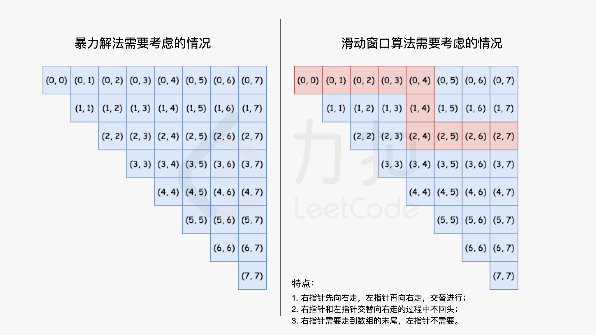

[TOC]

## 循环不变量

「循环不变量」是指在循序过程「初始化」「循环遍历」「结束」中，要一直不变的性质。

下面我们来通过一道题品味一下：在未排序的数组中找到第 k 个最大的元素。请注意，你需要找的是数组排序后的第 k 个最大的元素，而不是第 k 个不同的元素。

~~~java
示例 1:
输入: [3,2,1,5,6,4] 和 k = 2
输出: 5
    
示例 2:
输入: [3,2,3,1,2,4,5,5,6] 和 k = 4
输出: 4
~~~

~~~go
func findKthLargest(nums []int, k int) int {
	rand.Seed(time.Now().UnixNano())
	len := len(nums)
	l, r, target := 0, len-1, len-k
    // 这里用到了二分的思路
	for {
        // 我们保证在调用 partition 后， nums[p] 为第 p 大的数
		p := partition(nums, l, r)
		if p == target {
			return nums[p]
		} else if p > target {
			r = p - 1
		} else {
			l = p + 1
		}
	}
}

// 我们定义 pivot = nums[left]，那么循环不变量如下
// [left + 1 .. le] <= pivot；
// (le..i) > pivot；
// [i..right] 是程序没有看到的部分。
func partition(nums []int, left, right int) int {
    // 避免极端情况
	randomIndex := rand.Intn(right-left+1) + left
	nums[randomIndex], nums[left] = nums[left], nums[randomIndex]
	le := left
	pivot := nums[left]
	for i := left + 1; i <= right; i++ {
		if nums[i] <= pivot {
			le++
			nums[le], nums[i] = nums[i], nums[le]
		}
	}
	// 记得交换回来
	nums[left], nums[le] = nums[le], nums[left]
	return le
}
~~~

## 滑动窗口

有一类数组上的问题，需要使用两个指针变量（我们称为左指针和右指针），同向、交替向右移动完成任务。这样的过程像极了一个窗口在平面上滑动的过程，因此我们将解决这一类问题的算法称为「滑动窗口」问题。在两个指针同向、交替向右移动的过程中，少考虑了很多「暴力解法」需要考察了情况，将时间复杂度降到了线性级别 

思路为**固定左端点，不断枚举右端点，** **不满足条件时缩短左端点**。

滑动窗口的模板如下:

~~~python
# 开始滑窗
for right, x in enumerate(nums):  # 不断枚举右端点
    # xxx 依据题意统计
    
    # 滑动窗口的长度是`固定`的！！！ 使用 `if条件`来更新
    # 滑动窗口的长度是`可变`的！！！ 使用 `while条件`来更新
    while xxx: 
        # 缩短左端点
        xxx # xxx 依据题意改变
        left += 1
   ans = xxx  # 更新答案
~~~

### 计数问题

解决**子数组个数**问题有**至多、至少、恰好三种类型**。

对于恰好这种问题，可以使用前缀和的思路来解决。下面我们来看两道例题：

#### 区间子数组个数

给你一个整数数组 nums 和两个整数：left 及 right 。找出 nums 中连续、非空且其中最大元素在范围 [left, right] 内的子数组，并返回满足条件的子数组的个数。

**示例 1：**

~~~java
输入：nums = [2,1,4,3], left = 2, right = 3
输出：3
解释：满足条件的三个子数组：[2], [2, 1], [3]
~~~

~~~go
func numSubarrayBoundedMax(nums []int, left int, right int) int {
	lessThanBoundedMax := func(nums []int, bound int) int {
		r, l, res := 0, 0, 0
		nLen := len(nums)
		for ; r < nLen; r++ {
			if nums[r] > bound {
				l = r + 1
			} else {
				// 1 + 2 + 3 + 4 + ... + (r - l + 1) = 2^{r - l + 1} - 1
				// 正好是 [left, right] 这个区间的组合数
                 // 这个是求区间个数很常用的技巧 ***
				res += r - l + 1
			}
		}
		return res
	}
	// 这里使用前缀和，有个重要假设，即 lessThanBoundedMax(nums, right) 的区间包括 lessThanBoundedMax(nums, left-1)的区间
	return lessThanBoundedMax(nums, right) - lessThanBoundedMax(nums, left-1)
}
~~~

#### K 个不同整数的子数组

给定一个正整数数组 nums和一个整数 k，返回 nums 中 「好子数组」 的数目。如果 nums 的某个子数组中不同整数的个数恰好为 k，则称 nums 的这个连续、不一定不同的子数组为 「好子数组 」。例如，[1,2,3,1,2] 中有 3 个不同的整数：1，2，以及 3。子数组是数组的连续部分。

~~~go
func subarraysWithKDistinct(nums []int, k int) int {
	getAtMostKDistinct := func(nums []int, k int) int {
		l, r, res := 0, 0, 0
		distinct := 0
		nLen := len(nums)
		freq := make([]int, nLen+1)
		for ; r < nLen; r++ {
			s := nums[r]
			if freq[s] == 0 {
				distinct++
			}
			freq[s]++
			for distinct > k {
				t := nums[l]
				l++
				freq[t]--
				if freq[t] == 0 {
					distinct--
				}
			}
			// 区间累加
			res += r - l + 1
		}
		return res
	}
	return getAtMostKDistinct(nums, k) - getAtMostKDistinct(nums, k - 1)
}
~~~

### 使用数据结构来维护窗口性质

单调队列是一个双端队列，一般用于维护连续区间/窗口内的最大/小值。我们以维护窗口中的最大值，来说明单调队列是如何使用的：

1. 队首到队尾依次递减
2. 若新元素小于队尾元素，那么就直接入队。因为它可能作为未来窗口的候选最大值
3. 若新元素大于队尾元素，那么队尾元素直接弹出，直到新元素小于队尾

下面我们来看一道例题：

给你一个整数数组 nums，有一个大小为 k 的滑动窗口从数组的最左侧移动到数组的最右侧。你只可以看到在滑动窗口内的 k 个数字。滑动窗口每次只向右移动一位。返回滑动窗口中的最大值。

~~~java
输入：nums = [1,3,-1,-3,5,3,6,7], k = 3
输出：[3,3,5,5,6,7]

滑动窗口的位置                最大值
---------------               -----
[1  3  -1] -3  5  3  6  7       3
 1 [3  -1  -3] 5  3  6  7       3
 1  3 [-1  -3  5] 3  6  7       5
 1  3  -1 [-3  5  3] 6  7       5
 1  3  -1  -3 [5  3  6] 7       6
 1  3  -1  -3  5 [3  6  7]      7
~~~

注意，这里保存的是下标，可以快速判断是否在窗口中。

~~~go
func maxSlidingWindow(nums []int, k int) []int {
	q := []int{}
	push := func(i int) {
		for len(q) > 0 && nums[i] >= nums[q[len(q)-1]] {
			q = q[:len(q)-1]
		}
		q = append(q, i)
	}

	for i := 0; i < k; i++ {
		push(i)
	}
    
	n := len(nums)
	ans := make([]int, 1, n-k+1)
	ans[0] = nums[q[0]]
	for i := k; i < n; i++ {
		push(i)
		for q[0] <= i-k {
			q = q[1:]
		}
		ans = append(ans, nums[q[0]])
	}
	return ans
}
~~~

这题还可以使用优先队列来实现。

## 双指针

下面给出一些经典例题：

给你一个链表，删除链表的倒数第 `n` 个结点，并且返回链表的头结点。

~~~go
func removeNthFromEnd(head *ListNode, n int) *ListNode {
	dummy := &ListNode{0, head}				// 小细节
	first, second := head, dummy
	for i := 0; i < n; i++ {
		first = first.Next
	}
	for ; first != nil; first = first.Next {
		second = second.Next
	}
	second.Next = second.Next.Next
	return dummy.Next
}
~~~

给定一个长度为 n 的整数数组 height 。有 n 条垂线，第 i 条线的两个端点是 (i, 0) 和 (i, height[i]) 。找出其中的两条线，使得它们与 x 轴共同构成的容器可以容纳最多的水。

显然，如果一边短，那么就向中间移动。

给你一个包含 n 个整数的数组 nums，判断 nums 中是否存在三个元素 *a，b，c ，*使得 a + b + c = 0 ？请你找出所有和为 0 且不重复的三元组。问题转换为 a + b = -c 即两数之和问题，时间复杂度为 $O(n^2)$
