# 图

[TOC]

## 概念

图可以表示任意的二元关系，因此它属于**非线性结构（non-linear structure）**。

**图（graph）**，可定义为 G = (V, E)。其中，集合 V 中的元素称作**顶点（vertex）**；集合 E 中的元素分别对应于 V 中的某一对顶点 (u, v)，表示它们之间存在某种关系，故亦称作**边（edge）**。从计算的需求出发，我们约定 V 和 E 均为有限集，通常将其规模分别记 n = |V| 和 e = |E| 。

若我们并不关心边 (u, v) 所对应顶点 u 和 v 的次序，则称作**无向边（undirected edge）**反之若 u 和 v 不对等，则称**(u, v)为有向边（directed edge）**。有向边 (u, v)从 u 指向 v，其中 u 称作该边的**起点（origin）**或尾顶点（tail），而 v 称作该边的**终点（destination）**或头顶点（head）。

若 E 中各边均无方向，则 G 称作**无向图（undirected graph，简称undigraph）**。若E中只含有向边，则 G 称作**有向图（directed graph，简称digraph）**。若 E 同时包含无向边和有向边，则G称作**混合图（mixed graph）**。相对而言，有向图的通用性更强，因为无向图和混合图都可转化为有向图。

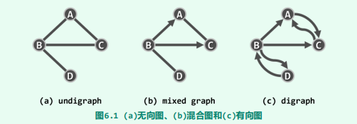

任何边 e = (u, v)，称顶点 u 和 v 彼此**邻接（adjacent）**，互为邻居；而它们都与边 e 彼此**关联（incident）**。在无向图中，与顶点 v 关联的边数，称作 v 的**度数（degree）**，记作 deg(v)。

对于有向边 e = (u, v)，e 称作 u 的**出边（outgoing edge）**、v 的**入边（incoming edge）**。v 的出边总数称作其**出度（out-degree）**，记作 outdeg(v)；入边总数称作其**入度（in-degree）**，记作 indeg(v)。

连接于同一顶点 v 之间的边 (v, v)，称作**自环（self-loop）**，不含任何自环的图称作**简单图（simple graph）**，也是本书主要讨论的对象。

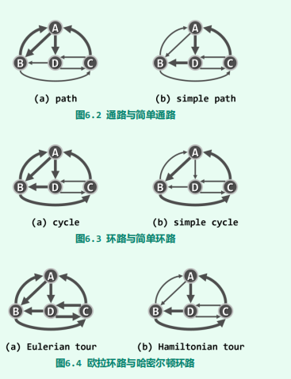

所谓**路径**或**通路（path）**，就是由 m + 1 个顶点与 m 条边交替而成的一个序列：
$$
\pi = \{v_0, e_1, v_1, e_2, ..., e_m, v_m\} \quad \forall0 < i \leq m,e_i=(v_{i-1}, v_i)
$$
其中沿途边的总数 $m$，亦称作通路的长度，记作$|\pi| = m$。也可以简化表述为
$$
\pi = \{v_0, v_1, ... ,v_m\}
$$
沿途顶点互异的通路，称作**简单通路（simple path）**。

对于长度$m \geq1$的通路 $\pi$，若起止顶点相同（即$v_0 = v_m$），则称作**环路（cycle）**。若沿途除 $v_0 = v_m$ 外所有顶点均互异，则称作**简单环路（simple cycle）**。

不含任何环路的有向图，称作**有向无环图（directed acyclic graph, DAG）**。

经过图中各边一次且恰好一次的环路，称作**欧拉环路（Eulerian tour）**。经过图中各顶点一次且恰好一次的环路，称作**哈密尔顿环路（Hamiltonian tour）**

可以为每一条边$e$指定一个权重$W(e)$​。各边均带有权重的图，称作**带权图（weighted graph）**或带权网络（weighted network），有时也简称**网络（network）**，记作$G(V, E, W)$。

## 图的存储

### 矩阵

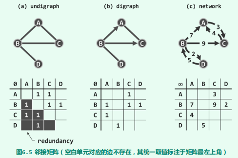

边的静态和动态操作也仅需$O(1)$时间。但是，顶点的动态操作接口均十分耗时。向量 `E[][]`也需要增加一行，且每行都需要添加一个元素。顶点删除操作，亦与此类似，删除操作的空间复杂度为$O(n^2 )$

### 邻接表

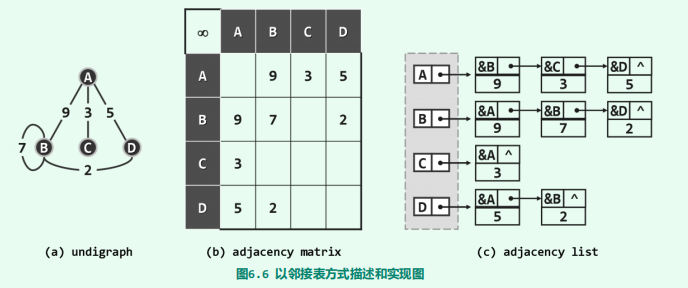

exists(v, u) 需在 v 对应的列表中顺序查找，共需$O(n)$时间。顶点的插入操作，可在$O(1)$完成。顶点的删除操作，仍需遍历所有邻接表，共需$O(e)$时间。

尽管邻接表访问单条边的效率并不算高，却十分擅长于以批量方式，即处理同一顶点的所有关联边。在以下图遍历等算法中，这是典型的处理流程和模式。

## 图遍历

图的遍历都可理解为，**将非线性结构转化为半线性结构的过程**。经遍历而确定的边类型中，最重要的一类即所谓的树边，它们与所有顶点共同构成了原图的一棵支撑树（森林），称作**遍历树（traversal tree）**。各种图搜索之间的区别，体现为边分类结果的不同，以及所得遍历树（森林）的结构差异。其决定因素在于，搜索过程中的每一步迭代，将依照何种策略来选取下一接受访问的顶点。

~~~java
//边在遍历树中所属的类型
enum EType {
    UNDETERMINED,			// 尚未被发现
    TREE,				   // 树边，当从 v 遍历到尚未访问过的 u 时，(v, u) 被标记为树边
    CROSS,				   // 跨边，当 v 遍历到已访问过的 u 时，(v, u) 标记为跨边
    FORWARD,
    BACKWARD;
}
~~~

图遍历对于无向图必能覆盖 s 所属的**连通分量（connected component）**，对于有向图必能覆盖以s为起点的**可达分量（reachable component）**。

### 广度优先

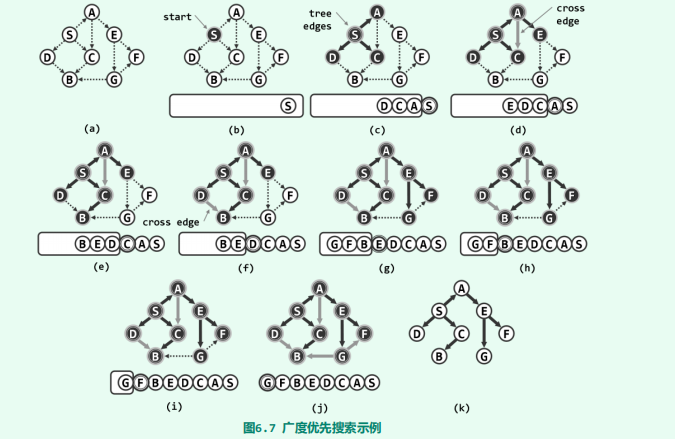

- `TREE`：树边，当从 v 遍历到尚未访问过的 u 时，(v, u) 被标记为树边
- `CROSS`：跨边，当 v 遍历到已访问过的 u 时，(v, u) 标记为跨边

下面很多算法就是以 BFS 为基础的，例如 Prim、Dijskra、SPFA、拓扑排序等等。基本思路就是

1. 维护一个队列。每次遍历时，从队首弹出元素。
2. 以该元素遍历周围的节点，根据条件做松弛操作、统计操作等等。
3. 最后将这个周围节点加入到队列中。

### 深度优先

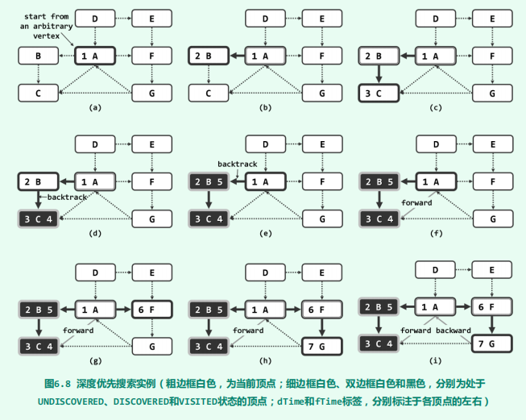

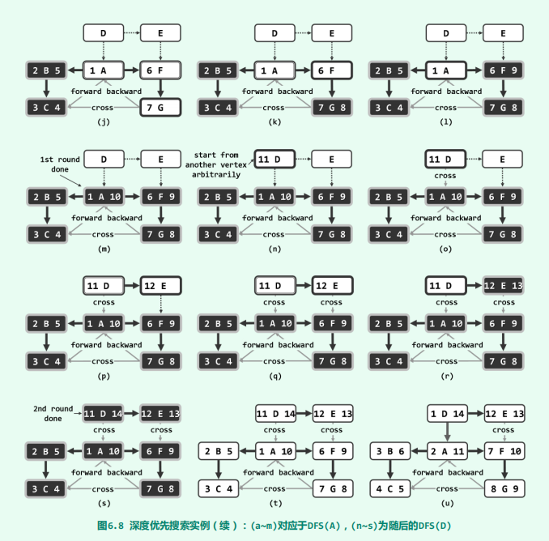

~~~java
public void dfs(int s) {
    int v = s;
    do {
        if (status(v) == VStatus.UNDISCOVERED)
            dfs(v, clock);
    } while (s != (v = (v + 1) % n));
}

private void dfs(int s, MutableInteger clock) {
    status(s, VStatus.DISCOVERED);
    for (var iterator = getIteratorOfNode(s);
         iterator.hasNext();) {
        int v = iterator.next();
        if (status(v) == UNDISCOVERED) {
            dfs(v, clock);
        }
    }
    status(s, VStatus.VISITED);
}
~~~

## 最小生成树

连通图 G 的某一无环连通子图 T 若覆盖 G 中所有的顶点，则称作 G 的一棵支撑树或**生成树（spanning tree）**。

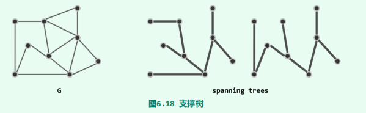

若图G为一带权网络，则每一棵支撑树的成本（cost）即为其所采用各边权重的总和。在G的所有支撑树中，成本最低者称作**最小支撑树（minimum spanning tree, MST）**。

显然，有些图的最小支撑树具有**歧义性**，即最小生成树并不唯一，下面给出一个例子：

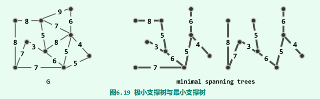

### Kruskal

该算法的基本思想是从小到大加入边，是个贪心算法。Kruskal 在编码上的好处是，你无需建图，仅仅维护边的集合即可。可以用「排序」或者「优先队列」来维护边的大小。在添加边的时候，如果已经终点已经被访问过了，那么就直接略过这条边。

例题：你准备参加一场远足活动。给你一个二维 `rows x columns` 的地图 `heights` ，其中 `heights[row][col]` 表示格子 `(row, col)` 的高度。一开始你在最左上角的格子 `(0, 0)` ，且你希望去最右下角的格子 `(rows-1, columns-1)` （注意下标从 **0** 开始编号）。你每次可以往 **上**，**下**，**左**，**右** 四个方向之一移动，你想要找到耗费 **体力** 最小的一条路径。一条路径耗费的 **体力值** 是路径上相邻格子之间 **高度差绝对值** 的 **最大值** 决定的。请你返回从左上角走到右下角的最小 **体力消耗值** 。

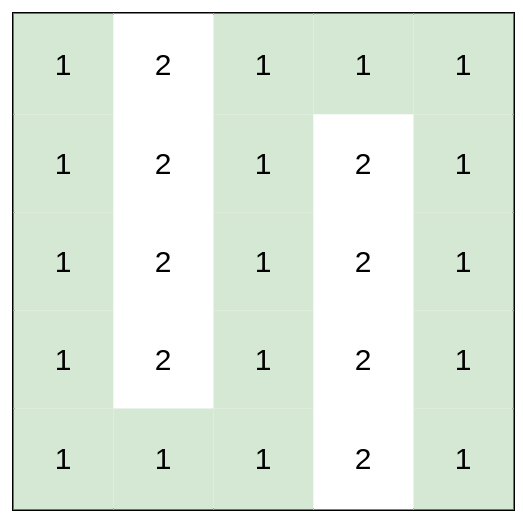

~~~go
func minimumEffortPathKrusKkal(heights [][]int) int {
    // 输入的原始图，不可直接用，要经过处理
	h, w := len(heights), len(heights[0])

	type Pair struct{ x, y int }
	directions := []Pair{
		{1, 0},
		{0, 1},
	}
    // 邻接表的 Edge 无需存储起点 u
	type Edge struct{ u, v, w int }
    // 注意，这可不是邻接表，而是一个 Edge 的集合
	edges := []Edge{}
	abs := func(num int) int {
		if num < 0 {
			num = -num
		}
		return num
	}
	getId := func(x, y int) int {
		return x*w + y
	}

	for i, row := range heights {
		for j, _ := range row {
			for _, d := range directions {
				if ni, nj := d.x+i, d.y+j; ni != h && nj != w {
					weight := abs(heights[ni][nj] - heights[i][j])
					edges = append(edges, Edge{getId(i, j), getId(ni, nj), weight})
					edges = append(edges, Edge{getId(ni, nj), getId(i, j), weight})
				}
			}
		}
	}
 	// 排序
	sort.Slice(edges, func(i, j int) bool {
		return edges[i].w < edges[j].w
	})

	pa := make([]int, h*w)
	for i, _ := range pa {
		pa[i] = i
	}
	var find func(x int) int
	find = func(x int) int {
		if pa[x] != x {
			pa[x] = find(pa[x])
		}
		return pa[x]
	}
	union := func(x, y int) {
		pa[find(x)] = find(y)
	}
	query := func(x, y int) bool {
		return find(pa[x]) == find(pa[y])
	}
	ans := 0
	for _, edge := range edges {
		ans = max(ans, edge.w)
		union(edge.u, edge.v)
		if query(0, w*h-1) {
			return ans
		}
	}
	return 0
}
~~~

### Prim

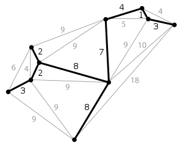

该算法的基本思想是从一个结点开始，不断加点（而不是 Kruskal 算法的加边）。具体来说，每次要选择距离最小的一个结点，以及用新的边更新其他结点的距离。

~~~go
type Vertex struct {
    // 这里的封装是必要的，因为要根据 dist 来排序
   v, dist int
}
// 已实现 heap.interface 接口
type VertexHeap []Vertex

type Graph struct {
   n      int
   adjMat [][]int		// 邻接矩阵
}

func prim() int {
    // n 为节点的个数
    visited := make([]bool, n)
    dist := make([]int, g.n)
    parent := make([]int, g.n)		// 记录生成路径
    for i := range dist {
        dist[i] = math.MaxInt32
    }
    dist[0] = 0
    h := &VertexHeap{}
    heap.Push(h, Vertex{0, 0})
    cost := 0
    for h.Len() > 0 {
        u := heap.Pop(vertex).(Vertex).v
        if visited[u] {
            continue
        }
        visited[u] = true
        cost += dist[u]
        for v := 0; v < g.n; v++ {
            // 集合中的 u 到 v 的距离，比 dist[v] 小，那么就更新
            if g.adjMat[u][v] != 0 && !visited[v] && g.adjMat[u][v] < dist[v] {
                dist[v] = g.adjMat[u][v]
                parent[v] = u
                heap.Push(h, Vertex{v, dist[v]})
            }
        }
    }
    return cost
}
~~~

还是以上面例题来说明 Prim 算法：

~~~go

import "math"
type Vertex struct {
    v, dist int
}

// 优先队列，已实现 heap.Interface 接口
type VertexHeap []Vertex

func minimumEffortPath(heights [][]int) int {
    h, w := len(heights), len(heights[0])
    // 这里的 Edge 定义和 Kraskal 中的不一样，注意区别
    type Edge struct{ u, w int }
    edges := make([][]Edge, h*w)
    for i, _ := range edges {
        edges[i] = []Edge{}
    }
    // 这里就省略邻接表建图的逻辑了
    // 感觉没必要建图，直接使用原生输入即可
	// 这里建图相当于将「邻接矩阵」转换为「邻接表」，感觉多次一举
    // prim
    dis := make([]int, w*h)
    for i := range dis {
        dis[i] = math.MaxInt32
    }
    dis[0] = 0
    visited := make([]bool, w*h)
    ans := 0
    vertex := &VertexHeap{}
    parent := make([]int, w*h)
    heap.Push(vertex, Vertex{0, 0})
    for vertex.Len() > 0 {
        x := heap.Pop(vertex).(Vertex).v
        if visited[x] {
            continue
        }
        for _, edge := range edges[parent[x]] {
            if edge.u == x {
                ans = max(ans, edge.w)
            }
        }
        if x == w*h-1 {
            return ans
        }
        visited[x] = true
        for _, edge := range edges[x] {
            u := edge.u
            if !visited[u] && dis[u] > edge.w {
                dis[u] = edge.w
                parent[u] = x
                heap.Push(vertex, Vertex{u, dis[u]})
            }
        }
    }
    return 0
}

~~~

## 拓扑排序

命题：有向无环图一定存在拓扑排序

~~~go
// DFS 版
private boolean tSort(int s, Stack<VertexType> stack) {
    status(s, VStatus.DISCOVERED);
    for (var iterator = getIteratorOfNode(s);
        iterator.hasNext();) {
        int t = iterator.next();
        switch (status(t)) {
            case DISCOVERED:
                //在有向图中发现后向边（back edge）
                return false;
            case UNDISCOVERED:
                if (!tSort(t, stack))
                    return false;
			// visited 的节点对于接下来拓扑排序无影响，可以认为是已经从图中删除了，不再考虑
        }
    }
    status(s, VStatus.VISITED);
    // 按逆序给出了原图的一个拓扑排序。
    stack.push(vertex(s));
    return true;
}
~~~

~~~go
// BFS 版

in := make([]int, n)
graph := make([][]int, n)		// 建图
for i, _ := range graph {
    graph[i] = []int{}
}

cnt := n // 用于判断是否有环
for _, relation := range relations {
    v, u := relation[0], relation[1]
    graph[v] = append(graph[v], u)
    in[u]++
}

queue := []int{}
for i, v := range in {
    if v == 0  {
        queue = append(queue, i)
        cnt--
    }
    
}

for len(queue) != 0 {
    n := queue[0]
    queue = queue[1:]
    for _, v := range graph[n] {
        in[v]--
        if in[v] == 0 {
            queue = append(queue, v)
            cnt--
        }
    }
}
if (cnt != 0) {
    return -1 // 说明有环
}
~~~

## 单源最短路径

### Bellman-Ford

这里我们介绍 Bellman-Ford 算法可以处理负权边的情况，但是它要求不能存在负环（回路的权值之和为负）

对于边 $(u, v)$，其松弛操作对应下面这个式子：
$$
dis(v) = min(dis(v), dis(u) + w(u, v))
$$
因为一次松弛操作会使最短路的边数至少 + 1，而最短路的边数最多为 n - 1。所以如果第 n 轮循环时仍然存在能松弛的边，说明从 S 点出发，能够抵达一个负环。

~~~c++
struct Edge {
    int u, v, w
}
vector<Edge> edge; 			// 注意，这里并没有建图，仅使用边集即可

int dis[MAXN], u, v, w;
const int INF = 0x3f3f3f3f;	// 注意初始化的值

bool bellmanford(int n, int s) {
    memset(dis, 0x3f, sizeof(dis));
    dis[s] = 0
    bool flag = false;  // 判断一轮循环过程中是否发生松弛操作
    for (int i = 1; i <= n; i++) {
        flag = false;
        // 遍历所有的边
        for (int j = 0; j < edge.size(); j++) {
            u = edge[j].u, v = edge[j].v, w = edge[j].w;
            if (dis[v] > dis[u] + w) {
                dis[v] = dis[u] + w;
                flag = true;
            }
        }
        // 没有可以松弛的边时就停止算法
        if (!flag) {
            break;
        }
    }
    // 第 n 轮循环仍然可以松弛时说明 s 点可以抵达一个负环
    return flag;
}
~~~

需要注意的是，以 S 点为源点跑 Bellman–Ford 算法时，如果没有给出存在负环的结果，只能说明从 S 点出发不能抵达一个负环，而不能说明图上不存在负环。

特别强调，在解决**「有边数限制的最短路问题」**时，要记得在迭代时复制以下 Dis 数组，以及限制迭代次数。经典例题：[787. K 站中转内最便宜的航班](https://leetcode.cn/problems/cheapest-flights-within-k-stops/)

### SPFA

很显然，只有上一次被松弛的结点，所连接的边，才有可能引起下一次的松弛操作。那么我们用队列来维护「哪些结点可能会引起松弛操作」，就能只访问必要的边了。

~~~c++
struct edge {
  int v, w;
};
vector<edge> e[maxn];  			// 这里用邻接表进行了建图

int dis[maxn], cnt[maxn], vis[maxn];
queue<int> q;					// 不用优先队列

bool spfa(int n, int s) {
    memset(dis, 63, sizeof(dis));
    dis[s] = 0;
    q.push(s);
    while (!q.empty()) {
        int u = q.front();
        q.pop(), vis[u] = 0;
        for (auto ed : e[u]) {
            int v = ed.v, w = ed.w;
            if (dis[v] > dis[u] + w) {
                dis[v] = dis[u] + w;
                cnt[v] = cnt[u] + 1;  // 记录最短路经过的边数
                // 在不经过负环的情况下，最短路至多经过 n - 1 条边
                // 因此如果经过了多于 n 条边，一定说明经过了负环
                if (cnt[v] >= n) 
                    return false;
                if (!vis[v]) 
                    q.push(v), vis[v] = 1;
            }
        }
    }
    return true;
}
~~~

### Dijkstra

Dijkstra 是一种求解非负权图上单源最短路径的算法：

~~~c++
// 这个独立于邻接表的
struct node {
    int dis, u;
    // 用在优先队列中做比较
    bool operator>(const node& a) const { return dis > a.dis; }
};
// 使用优先队列优化
priority_queue<node, vector<node>, greater<node> > q;

struct edge {
    int v, w;
};
vector<edge> e[maxn];			// 邻接表
int dis[maxn], vis[maxn];

void dijkstra(int n, int s) {
    memset(dis, 63, sizeof(dis));
    dis[s] = 0;
    q.push({0, s});
    while (!q.empty()) {
        int u = q.top().u;
        q.pop();
        if (vis[u]) 
            continue;
        vis[u] = 1;
        for (auto ed : e[u]) {
            int v = ed.v, w = ed.w;
            if (dis[v] > dis[u] + w) {
                dis[v] = dis[u] + w;
                q.push({dis[v], v});
            }
        }
    }
}
~~~

我们发现 Dijkstra 算法的优先队列版本与 Spfa 算法的代码极为相似，但是核心思想完全不一样，具体体现在 `vis[u]` 的使用上。

在稀疏图中，使用二叉堆实现的 Dijkstra 算法较 Bellman–Ford 算法具有较大的效率优势；而在稠密图中，这时候使用暴力做法较二叉堆实现更优。

## 多源最短路径

### Floyd 算法

~~~c++

for (k = 1; k <= n; k++) {
    for (x = 1; x <= n; x++) {
        for (y = 1; y <= n; y++) {
            // f[x][y]是一个邻接矩阵
            f[x][y] = min(f[x][y], f[x][k] + f[k][y]);
        }
    }
}
~~~

## 并查集

并查集是一种用于管理元素所属集合的数据结构，实现为一个森林，其中每棵树表示一个集合，树中的节点表示对应集合中的元素。

**对于集合的划分是并查集问题的关键**。

我们就可以定义一下「并查集」结构所支持的操作接口：

- 合并 `union(x, y)`：将集合 𝑥 和集合 𝑦 合并成一个集合。
- 查找 `find(x)`：查找元素 𝑥 属于哪个集合。
- 查找 `is_connected(x, y)`：查询元素 𝑥 和 𝑦 是否在同一个集合中。

 

### 初始化

~~~go
pa := make([]int, m)
for i, _ := range pa {
    pa[i] = i
}
~~~

### 查询

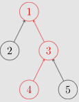

~~~c++
func find(int i) int {
    if pa[i] == i {
        return i
    } else {
        return find(pa[i])
    }
}
~~~

路径压缩：查询过程中经过的每个元素都属于该集合，我们可以将其直接连到根节点以加快后续查询。

~~~go
func find(i int) int {
    if pa[i] == i {
        return i
    } else {
        pa[i] = find(pa[i])
        return pa[i]
    }
}

// 简化
func find(i int) int {
    if pa[i] != i {
        pa[i] = find(pa[i])
    }
    return pa[i]
}
~~~

### 合并

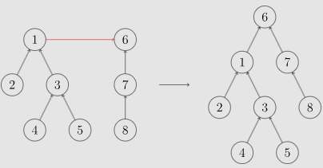

~~~go
func union(x, y int) {
    pa[find(x)] = find(y)
}
~~~

合并时，选择哪棵树的根节点作为新树的根节点会影响未来操作的复杂度。我们可以将节点较少或深度较小的树连到另一棵，以免发生退化。这里我们以节点数量为依据进行合并。

~~~go
unite := func(x, y int) {
    x, y = find(x), find(y)
    if x == y {
        return
    }
    if y < x {
        x, y = y, x
    }
    pa[x] = y
    sz[y] += sz[x]
}
~~~

### 例题

对于集合的划分是并查集问题的关键，我们以下面这些题为例：

- [最长连续序列](https://leetcode.cn/problems/longest-consecutive-sequence/)：如果它周围的数存在，那么就添加到集合中
- [803. 打砖块](https://leetcode.cn/problems/bricks-falling-when-hit/)：如果它周围存在方块，那么就加入

我们可以在每个集合中维护一些属性，例如集合大小，这些属性要在合并时正确处理，一般是根节点持有正确的属性。

