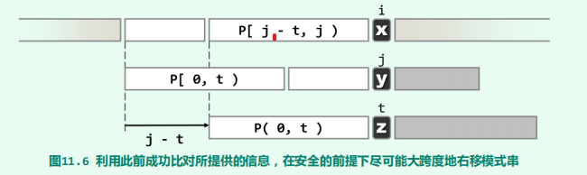
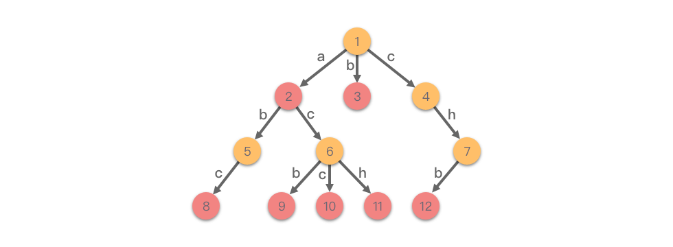

# 字符串

[TOC]

## 单模式串匹配

有很多字符串匹配算法，例如 BruteForce、RabinKarp、KMP、BoyerMoore、Horspool 等等。这里我们就介绍 KMP 算法。

观察 BruteForce 算法，我们发现在匹配失败后，它会令两个字符指针同步回退（即令$i = i - j + 1$和$j = 0$）。事实上我们可以保持指针 $i$ 不变，而是将**$T[i]$与$P[t]$对齐并开始下一轮比对**



观察不难发现有以下关系成立：
$$
P[0, j) = T[i - t, i) = P[j - t, j)
$$
我们用 `next[j] = t` 来维护这种关系。它表明模式串 𝑝 的子串 𝑝[0:𝑗] 中，使得「前 t 个字符」恰好等于「后 t 个字符」的「最长的 t」。举个例子来说明一下，以 `p = "ABCABCD"` 为例。

- 𝑛𝑒𝑥𝑡[0]=0，因为 `"A"` 中无有相同前缀后缀，最大长度为 0。
- 𝑛𝑒𝑥𝑡[1]=0，因为 `"AB"` 中无相同前缀后缀，最大长度为 0。
- 𝑛𝑒𝑥𝑡[2]=0，因为 `"ABC"` 中无相同前缀后缀，最大长度为 0。
- 𝑛𝑒𝑥𝑡[3]=1，因为 `"ABCA"` 中有相同的前缀后缀 `"a"`，最大长度为 1。
- 𝑛𝑒𝑥𝑡[4]=2，因为 `"ABCAB"` 中有相同的前缀后缀 `"AB"`，最大长度为 2。
- 𝑛𝑒𝑥𝑡[5]=3，因为 `"ABCABC"` 中有相同的前缀后缀 `"ABC"`，最大长度为 3。
- 𝑛𝑒𝑥𝑡[6]=0，因为 `"ABCABCD"` 中无相同前缀后缀，最大长度为 0。

因此，`"ABCDABD"` 的前缀表为 `[0,0,0,0,1,2,0]`。


~~~c++
func strStr(haystack string, needle string) int {
	next := getNext(needle)
	n := len(haystack)
	m := len(needle)
	if n < m {
		return -1
	}
	i := 0 // 文本串指针
	j := 0 // 模式串指针
	for i < n && j < m {
		if j < 0 || haystack[i] == needle[j] {
			// // j < 0 表示，无公共的前后缀，此时 i++ 表示文本串向前移，而 j++ 将 j 的值恢复到0，开始下一次比较
			i++
			j++
		} else {
			//  不匹配，那么 j 按照 next[j] 进行回退，而 i 保持不变
			j = next[j]
		}
	}
	if i-j > n-m {
		return -1
	}
	//  返回第一次匹配的位置
	return i - j
}

func getNext(needle string) []int {
	n := len(needle)
	i := 0
	j := -1 // 初始值不一样
	next := make([]int, n)
	next[0] = -1
	for i < n-1 { 		// 这里不以言
		if j < 0 || needle[i] == needle[j] {
			i++
			j++
			// 这里不一样
			if needle[i] != needle[j] {
				next[i] = j
			} else {
				next[i] = next[j]
			}
		} else {
			j = next[j]
		}
	}
	return next
}

~~~


## 多模式串匹配

字典树、AC 自动机、后缀数组都可以实现多模式串匹配，这里我们介绍字典树。



字典树的基本性质：从根节点到树上某一节点的路径就代表了一个单词，在每个单词对应路径的结束位置增加一个结束标记 𝑒𝑛𝑑（图中红色节点），表示从根节点到这里有一个单词。

它的核心思想是：利用空间换时间，利用字符串的公共前缀来降低查询时间的开销，最大限度的减少无谓的字符串比较，以达到提高效率的目的。


如果字符串所涉及的字符集合只包含小写英文字母的话，我们可以使用一个长度为 26 的数组来表示当前节点的多个子节点，如下面代码所示。

```python
class Node:                                         # 字符节点
    def __init__(self):                             # 初始化字符节点
        self.children = [None for _ in range(26)]    # 初始化子节点
        self.isEnd = False                          # isEnd 用于标记单词结束
```

如果所涉及的字符集合不仅包含小写字母，还包含大写字母和其他字符，我们可以使用哈希表来表示当前节点的多个子节点，如下面代码所示。

```python
class Node:                                     # 字符节点
    def __init__(self):                         # 初始化字符节点
        self.children = dict()                  # 初始化子节点
        self.isEnd = False                      # isEnd 用于标记单词结束
```

~~~python
# 向字典树中插入一个单词
def insert(self, word: str) -> None:
    cur = self.root
    for ch in word:                         # 遍历单词中的字符
        if ch not in cur.children:          # 如果当前节点的子节点中，不存在键为 ch 的节点
            cur.children[ch] = Node()       # 建立一个节点，并将其保存到当前节点的子节点
        cur = cur.children[ch]              # 令当前节点指向新建立的节点，继续处理下一个字符
    cur.isEnd = True                        # 单词处理完成时，将当前节点标记为单词结束

~~~


除此之外，我们可以把字典树的应用分为以下几种：

- **字符串检索**
- **前缀统计**：统计⼀个串所有前缀单词的个数，只需统计从根节点到叶子节点路径上单词出现的个数，也可以判断⼀个单词是否为另⼀个单词的前缀。
- **最长公共前缀问题**：利用字典树求解多个字符串的最长公共前缀问题。将⼤量字符串都存储到⼀棵字典树上时， 可以快速得到某些字符串的公共前缀。对所有字符串都建⽴字典树，两个串的最长公共前缀的长度就是它们所在节点最近公共祖先的长度，于是转变为最近公共祖先问题。
- **字符串排序**：利⽤字典树进⾏串排序。例如，给定多个互不相同的仅由⼀个单词构成的英⽂名，将它们按字典序从⼩到⼤输出。采⽤数组⽅式创建字典树，字典树中每个节点的所有⼦节点都是按照其字母⼤⼩排序的。然后对字典树进⾏先序遍历，输出的相应字符串就是按字典序排序的结果。
