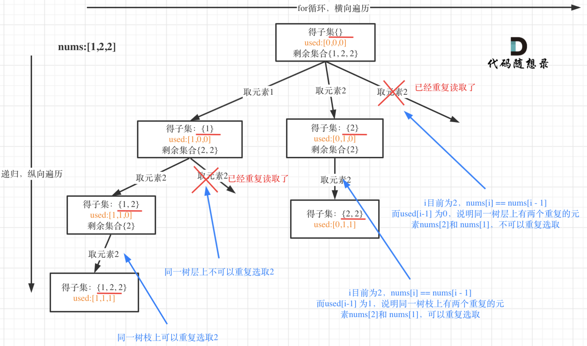
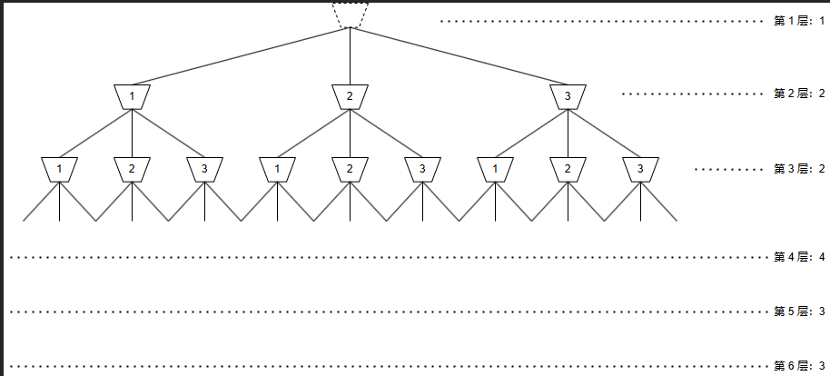

[TOC]

无论是回溯、BFS、DFS，其核心思想都是遍历解空间。而递归是它们的语法基础。

## 回溯

解决一个回溯问题，实际上就是一个决策树的遍历过程。你只需要思考 3 个问题：

1. **路径**：用于记录所有（或上一次）已经做出的选择。
2. **选择列表**：也就是你当前可以做的选择。
3. **结束条件**：也就是到达决策树底层，无法再做选择的条件。

下面就是一个模板：

~~~python
result = []				# 答案
def backtrack(路径, 选择列表):
    if 路径满足结束条件:
        # 记录答案
        result.add(路径)
        return
    
    for 选择 in 选择列表:
        # 做选择
        # 这里还需考虑一点，即选择是否满足约束
        将该选择从选择列表移除（可选）
        路径.add(选择)
        backtrack(路径, 选择列表)
        # 撤销选择
        路径.remove(选择)
        将该选择再加入选择列表（可选）
~~~

- 我们可以稍微做些变通，如果选择列表固定，或者可以通过其他变量推导出来，那么直接在代码中体现即可，无需以参数形式来传递。

- 此外，路径也可以定义在全局中。当路径的撤销操作十分复杂，那么考虑以空间成本来换取维护成本，即通过**参数形式**传递**深复制的**路径。如果你能确保在添加答案之前，不修改在本次 dfs 之前的路径，那么可以浅复制，记得在添加答案时深复制即可。

  好在大多数题的路径撤销操作比较简单，我们直接在全局定义即可。

- 如果无需所有的决策，而是仅关心当前决策，那么路径的变量形式就很简单（参照 DFS）。

- 有一些额外的信息（出于约束或者优化的目的），可以先根据当前决策计算出来，然后通过参数传递下去，例如 level 变量。

- **同一个问题，不同的视角，有着不同的决策树**

下面我们通过几道例题来体会一下：

- 分割问题：传递子串，并应用剪枝
  - [93.复原IP地址](https://leetcode.cn/link/?target=https%3A%2F%2Fprogrammercarl.com%2F0093.复原IP地址.html)
  - [1593. 拆分字符串使唯一子字符串的数目最大](https://leetcode.cn/problems/split-a-string-into-the-max-number-of-unique-substrings/)
- 子集问题
  - [90.子集II](https://leetcode.cn/link/?target=https%3A%2F%2Fprogrammercarl.com%2F0090.子集II.html)
  - [40.组合总和II](https://leetcode.cn/link/?target=https%3A%2F%2Fprogrammercarl.com%2F0040.组合总和II.html)
- 划分集合问题
  - [473. 火柴拼正方形](https://leetcode.cn/problems/matchsticks-to-square/)
- 排列问题
  - [47.全排列II](https://leetcode.cn/link/?target=https%3A%2F%2Fprogrammercarl.com%2F0047.全排列II.html)
- 棋盘问题
  - [51.N皇后](https://leetcode.cn/link/?target=https%3A%2F%2Fprogrammercarl.com%2F0051.N皇后.html)
  - [37.解数独](https://leetcode.cn/link/?target=https%3A%2F%2Fprogrammercarl.com%2F0037.解数独.html)

求最少次数的回溯题，一般使用 BFS 算法来解决。例如「279. 完全平方数」、「433. 最小基因变化」以及 [752. 打开转盘锁](https://leetcode.cn/problems/open-the-lock/)

### 例题

#### 47. 全排列 II

给定一个可包含重复数字的序列 `nums` ，***按任意顺序*** 返回所有不重复的全排列。

~~~go
func permuteUnique(nums []int) [][]int {
    // 在全局中维护所有做出的选择
    perm := []int{}
    result := [][]int{}
    visited := make([]bool, len(nums))
    var bfs func()
    bfs = func() {
        // 结束条件
        if len(perm) == len(nums) {
            result = append(result, append([]int(nil), perm...))
            return
        }
        // 选择列表固定下来了，所以这里就直接在代码中体现，就不在参数中传递了
        for i, num := range nums {
            // 防止重复
            if (i > 0 && nums[i] == nums[i-1] && !visited[i-1]) || visited[i] {
                continue
            }
            // 做决策
            visited[i] = true
            perm = append(perm, num)
            bfs()
            // 撤销决策
            perm = perm[:len(perm)-1]
            visited[i] = false
        }
    }
    // 防止重复
    sort.Ints(nums)
    bfs()
    return result
}
~~~

#### 90. 子集 II

给你一个整数数组 `nums` ，其中可能包含重复元素，请你返回该数组所有可能的 子集（幂集）。解集 **不能** 包含重复的子集。返回的解集中，子集可以按 **任意顺序** 排列。

先给一个不包含重复元素的模板（79. 子集）：

~~~go
func subsets(nums []int) [][]int {
	ans := [][]int{}
	result := []int{}
	var bfs func(idx int)
	bfs = func(idx int) {
		if idx == len(nums) {
            // 这里一定要复制 result
            // 否则后续在修改 result 的元素时，对于已经添加到 ans 中的 []int，该修改可见
			tmp := make([]int, len(result))
			copy(tmp, result)
			ans = append(ans, tmp)
			return
		}
		// 做决策：不选
		bfs(idx + 1)
        // 做决策：选
		result = append(result, nums[idx])
		bfs(idx + 1)
		result = result[:len(result)-1]
	}
	bfs(0)
	return ans
}
~~~

先给出一张图理解以下如何处理重复的：

~~~go
func subsetsWithDup(nums []int) [][]int {
	path := []int{}
	ans := [][]int{}

	var dfs func(idx int)
    
	dfs = func(idx int) {
        // 每个节点都要记录答案
		tmp := make([]int, len(path))
		copy(tmp, path) // 这里一定要做一个复制操作
		ans = append(ans, tmp)
        
        // 这里 i = idx + n 就是表示不选前 n 个元素
		for i := idx; i < len(nums); i++ {
			if i > idx && nums[i] == nums[i-1] {
				continue
			}
			path = append(path, nums[i])
			dfs(i + 1)
			path = path[:len(path)-1]
		}
	}
    
    // 一定要排序，将重复的元素集中在一起
	sort.Ints(nums)
	dfs(0)
	return ans
}

~~~

这道题 [LCR 082. 组合总和 II](https://leetcode.cn/problems/4sjJUc/)与 90. 子集 II 思路一样，只不过引入的剪枝操作。这里仅给出核心代码：

~~~go
dfs = func(idx int) {
    if sum == target {
        tmp := make([]int, len(path))
        copy(tmp, path)
        ans = append(ans, tmp)
        return
    }
    if sum > target {
        return
    }

    for i := idx; i < len(candidates); i++ {
        if i > idx && candidates[i] == candidates[i-1] {
            continue
        }
        path = append(path, candidates[i])
        sum += candidates[i]
        dfs(i + 1)
        sum -= candidates[i]
        path = path[:len(path)-1]
    }
}
sort.Ints(candidates)
dfs(0)
~~~

#### 698. 划分为k个相等的子集

- 视角一：我们站在球的视角，每个球均需要做出三种选择，即：选择放入 1 号桶、2 号桶、3 号桶。
- 视角二：我们站在桶的视角，每个桶均需要做出六次选择，即：是否选择 1 号球放入、是否选择 2 号球放入、...、是否选择 6 号球放入。

下面给出视角一的决策树：

~~~go
func canPartitionKSubsets(nums []int, k int) bool {
	ans := false
	buckets := make([]int, k)
	sum := 0
	for _, num := range nums {
		sum += num
	}
	if sum%k != 0 {
		return false
	}
	target := sum / k
	var bfs func(idx int)
	bfs = func(idx int) {
		if idx == len(nums) {
			ans = true
			return
		}
		for i, _ := range buckets {
			// 如果上一个桶放不下，这个和上一个桶的容量相同，那么就说明这个桶仍放不下去，直接跳过即可
			// 或者该桶放不下。
			if buckets[i]+nums[idx] > target ||
				(i > 0 && buckets[i] == buckets[i-1]) {
				continue
			}
			buckets[i] += nums[idx]
			bfs(idx + 1)
			if ans {
				return
			}
			buckets[i] -= nums[idx]
		}
	}
	bfs(0)
	return ans
}
~~~

#### 华为 OD

给定一个数组，里面有 6 个整数，求这个数组能够表示的最大 24 进制的时间是多少，输出这个时间，无法表示输出 invalid。

~~~go
nums := strings.Split(input, ",")
path := [LEN]string{}			// 所作出的选择在全局维护
expr := `(([01][0-9])|([2][0-3])):[0-5]\d:[0-5]\d`
visited := [LEN]bool{}
reg, _ := regexp.Compile(expr)
ans := []string{}

var dfs func(level int)
dfs = func(level int) {
    // 由于 path 是一个数组，我们必须使用 level 来维护有效下标
    // 即使 path 是一个切片，我们也可以出于优化的目的维护 level 变量
    if level == LEN {
        tmp := path[0] + path[1] + ":" + path[2] + path[3] + ":" + path[4] + path[5]
        if reg.MatchString(tmp) {
            ans = append(ans, tmp)
        }
    }

    for i, v := range nums {
        // 这里 nums + visited 来推导出选择列表
        // 这样维护起来比较方便。
        if !visited[i] {
            path[level] = v
            visited[i] = true
            dfs(level + 1)
            visited[i] = false
        }
    }
}
dfs(0)
~~~

## DFS

我们以「回溯」的视角认识一下 DFS。通常， DFS 选择列表一般是固定的，所以它直接出现在代码中，而以参数形式来传递。DFS 仅关心当前已经做出的抉择，所以参数形式很简单，无需记录所有的已做出的抉择。

一般回溯是没有返回值的，但是 DFS 可能有。

~~~ go
func tarversal(node *TreeNode) {
    // DFS 选择列表固定的体现（一）树
    tarversal(node.Left)
    traversal(node.Right)
}

func dfs(i, j int) {
    // DFS 选择列表固定的体现（二） 矩阵
    directions = []pair {
        {0, 1},
        {1, 0}
    }
    for _, d := directions {
        dfs(i + d.x, j + d.y)
    }
}

func dfs(x int) {
    // DFS 选择列表固定的体现（三） 图
    for _, edge := edges[x] {
        dfs(edge.to)
    }
}
~~~

## BFS

BFS 也可以用「回溯」的视角理解。它的选择列表通常用队列来维护，而与 DFS 一样，它仅关心当前已经做出的抉择，其参数的形式很简单，无需记录所有的已做出的抉择。

模板如下：

~~~python
while queue 不空：
    cur = queue.pop()
    处理 cur
    for 节点 in cur 的所有相邻节点：
        if 该节点有效且未被访问：
            queue.push(该节点)
~~~

如果要确定当前遍历到了哪一层，BFS 模板如下：

~~~python
level = 0
while queue 不空：
    size = queue.size()
    # 这样不同再封装一个结构体了
    while (size --) {
        cur = queue.pop()
        处理 cur
        for 节点 in cur 的所有相邻节点：
            if 该节点有效且未被访问：
                queue.push(该节点)
    }
    level++;
    
    
# 这个经常用在双向中
while queue 不空：
	nextQueue = new Queue()
    for element in queue 
    	处理
        
    queue = nextQueue
~~~

### 双向广度优先遍历

双向广度优先遍历，分别从起始状态和目标状态开始，**以交替的方式扩展每一层**，当两边搜索的状态列表有交集的时候，表示搜索过程相遇，搜索终止。

这常常是一种优化手段，广度优先搜索的搜索空间大小依赖于每层节点的分支数量。假如每个节点的分支数量相同，搜索空间会随着层数的增长指数级的增加。如果使用两个同时进行的广搜可以有效地减少搜索空间。

[752. 打开转盘锁](https://leetcode.cn/problems/open-the-lock/) 使用双向 BFS 后，性能大幅度提高。可见这种优化手段是必要的

我们来一道题：字典 `wordList` 中从单词 `beginWord` 到 `endWord` 的 **转换序列** 是一个按下述规格形成的序列 `beginWord -> s1 -> s2 -> ... -> sk`：

- 每一对相邻的单词只差一个字母。
-  对于 `1 <= i <= k` 时，每个 `si` 都在 `wordList` 中。注意， `beginWord` 不需要在 `wordList` 中。
- `sk == endWord`

给你两个单词 `beginWord` 和 `endWord` 和一个字典 `wordList` ，返回 *从 `beginWord` 到 `endWord` 的 **最短转换序列** 中的 **单词数目*** 。如果不存在这样的转换序列，返回 `0` 。

~~~txt
输入：beginWord = "hit", endWord = "cog", wordList = ["hot","dot","dog","lot","log","cog"]
输出：5
解释：一个最短转换序列是 "hit" -> "hot" -> "dot" -> "dog" -> "cog", 返回它的长度 5。
~~~

~~~go

func ladderLength(beginWord string, endWord string, wordList []string) int {

	visited := make(map[string]struct{}, len(wordList))
	// 这里将 []string 转换为 Set，是为了加速搜索
	wordSet := make(map[string]struct{}, len(wordList))
	for _, item := range wordList {
		wordSet[item] = struct{}{}
	}

	// 特殊情况，endWord 不再 wordList 中，直接返回 0
	if _, ok := wordSet[endWord]; !ok {
		return 0
	}

	beginQueue := map[string]struct{}{}
	endQueue := map[string]struct{}{}
	beginQueue[beginWord] = struct{}{}
	endQueue[endWord] = struct{}{}
	step := 1
	for len(beginQueue) != 0 && len(endQueue) != 0 {
        // 这就相当于来回切换了
		if len(beginQueue) > len(endQueue) {
			beginQueue, endQueue = endQueue, beginQueue
		}

		newQueue := map[string]struct{}{} //用于维护 Pop Push 的逻辑
		for word, _ := range beginQueue {
			nextWord := word
			for i, c := range nextWord {
				for s := 'a'; s <= 'z'; s++ {
					if s == c {
						continue
					}
					nextWord = word[:i] + string(s) + word[i+1:]
					if _, ok := wordSet[nextWord]; ok {
						if _, ok := endQueue[nextWord]; ok {
							return step + 1
						}
						if _, ok := visited[nextWord]; !ok {
							// 相当于 Push
							newQueue[nextWord] = struct{}{}
							visited[nextWord] = struct{}{}
						}
					}
				}
			}
		}
        // 相当于一口气处理完当前层的所有节点，和普通模板并不一样，可用于处理层数
		beginQueue = newQueue
		step++
	}
	return 0
}
~~~

### 多源 BFS

我们以前看过的 BFS 问题，起始顶点只有一个，而有一类问题起始顶点有多个。这就是「多源 BFS」但是多源 BFS 问题可以转换为单源 BFS 问题，只需要认为「多源」来自「一个虚拟的源」，也就是在一开始的时候，把所有符合条件的结点都加入队列，剩下的都一样。

普通的 BFS

~~~python
while queue 非空:
	node = queue.pop()
    for node 的所有相邻结点 m:
        if m 未访问过:
            queue.push(m)
~~~

多源 BFS

~~~python
depth = 0 # 记录遍历到第几层
while queue 非空:
    depth++
    n = queue 中的元素个数
    # 一口气处理完这一层的 n 个结点
    循环 n 次:
        node = queue.pop()
        for node 的所有相邻结点 m:
            if m 未访问过:
                queue.push(m)
~~~

在给定的 `m x n` 网格 `grid` 中，每个单元格可以有以下三个值之一：

- 值 `0` 代表空单元格；
- 值 `1` 代表新鲜橘子；
- 值 `2` 代表腐烂的橘子。

我们来一道题：每分钟，腐烂的橘子 **周围 4 个方向上相邻** 的新鲜橘子都会腐烂。返回 *直到单元格中没有新鲜橘子为止所必须经过的最小分钟数。如果不可能，返回 `-1`* 。

 

~~~go
func orangesRotting(grid [][]int) int {
    step := -1
    h, w := len(grid), len(grid[0])
    visited := make([][]bool, h)
    for i, _ := range visited {
        visited[i] = make([]bool, w)
    }

    type node struct {x, y int}
    queue := []node{}
    cnt := 0
    for i, row := range grid {
        for j, v := range row {
            if v == 2 {
                visited[i][j] = true
                queue = append(queue, node{i, j})
            }
            if v == 1 {
                cnt++
            }
        }
    }

    type pair struct {x, y int}
    directions := []pair {
        {0, -1},
        {0, 1},
        {1, 0},
        {-1, 0},
    }
    for len(queue) > 0 {
        newQueue := []node{}
        for _, n := range queue {
            for _, d := range directions {
                if nx, ny := n.x + d.x , n.y + d.y; 0 <= nx && nx <  h &&
            0 <= ny && ny < w && grid[nx][ny] != 0 && !visited[nx][ny] {
                    newQueue = append(newQueue, node{nx, ny})
                    visited[nx][ny] = true
                    cnt--
                }
            }
        }
        queue = newQueue
        step++
    }
    if (cnt > 0) {
        return -1
    }
    if (step == -1) {
        return 0
    }
    return step
}
~~~
