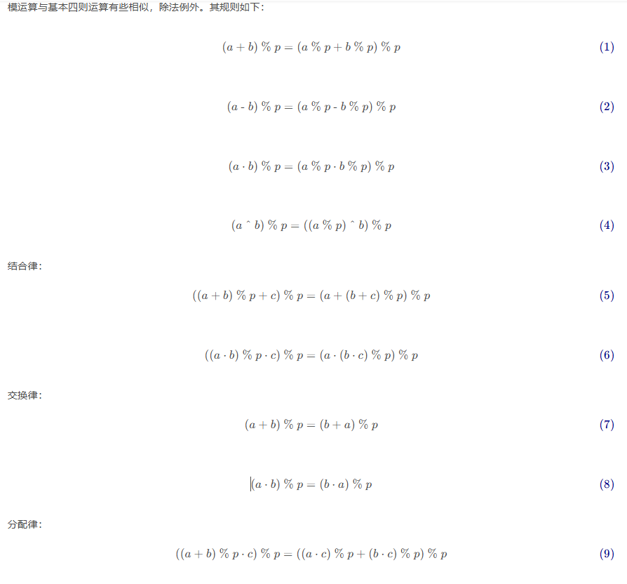

# 其他

[TOC]

## 模运算

**模运算（Modulo Operation）**和**余运算（Remainder Operation）**它们主要的区别在于，对负整数进行除法运算时操作不同。模运算主要用于计算机术语中，余运算则更多是数学概念。

例如:

- $(-7)mod 4=(-7)-(-2)*4=1$
- $(-7)rem 4 = -7-(-1)*4 = -3$

对于负数的

在不同的计算机语言中 % 运算符的含义不同，例如 C/C++/Go/Java/JavaScript 为余运算，而 Python 为模运算；

我们在代码实现时，要考虑上述定理：

~~~go
(a*b*c) % m // ERROR 可能溢出
(a % m * b % m * c % m) % m // 尽可能防止溢出

(a + b + c) % m 		// ERROR 可能溢出
a % m + b % m + c % m		// 尽可能防止溢出

(x % m + m) % m // 这样保证即使 x 为负数，我们仍可以去取模到 [0, m - 1]中
~~~

[2156. 查找给定哈希值的子串](https://leetcode.cn/problems/find-substring-with-given-hash-value/) 纯纯在 ex 人

给定整数 `p` 和 `m` ，一个长度为 `k` 且下标从 **0** 开始的字符串 `s` 的哈希值按照如下函数计算：`hash(s, p, m) = (val(s[0]) * p0 + val(s[1]) * p1 + ... + val(s[k-1]) * pk-1) mod m`.其中 `val(s[i])` 表示 `s[i]` 在字母表中的下标，从 `val('a') = 1` 到 `val('z') = 26` 。给你一个字符串 `s` 和整数 `power`，`modulo`，`k` 和 `hashValue` 。请你返回 `s` 中 **第一个** 长度为 `k` 的 **子串** `sub` ，满足 `hash(sub, power, modulo) == hashValue` 。测试数据保证一定 **存在** 至少一个这样的子串。**子串** 定义为一个字符串中连续非空字符组成的序列。

~~~go
func subStrHash(s string, power int,
	modulo int, k int, hashValue int) string {
	sLen := len(s)
	hash := make([]int, sLen-k+1)
	pk := 1
	for i := 0; i <= k-1; i++ {
		hash[sLen-k] = hash[sLen-k] + (int(s[sLen-k+i]-'a'+1) * pk) % modulo		// 防溢出
		pk = (pk*power) % modulo  // 防溢出
	}
    
    pos := 0
	hash[sLen-k] %= modulo
    if (hash[sLen-k] == hashValue) {
        pos = sLen - k
    }
    
	for i := sLen - k - 1; i > -1; i-- {
		hash[i] = (int(s[i])-'a'+1 + (power*hash[i+1]) - (int(s[i+k])-'a' + 1)*pk) 
        // 修正负数
        hash[i] = (hash[i] % modulo + modulo) % modulo
        if (hash[i] == hashValue) {
            pos = i
        }
	}
    return s[pos : pos+k]
}
~~~

## 前缀和

前缀和的核心思想就是**预先处理数据**，优化我们解题的时间复杂度。如果在计数问题中，出现多次询问序列中连续的元素和（区间和），那么就可以使用前缀和进行优化。**要指出的是，它仍脱离不了蛮力算法的解题思路。**

将前缀和的思路推广，我们可以得到前缀积，前缀异或的定义：

- 前缀积，表示的是序列中前 𝑖 个元素的乘积，预处理为 `mul[i] = mul[i - 1] * arr[i]`。我们可以用除法 `/` 消去前 𝑙−1 个数对结果的影响；`mul[0] = 1`
- 前缀异或，表示的是序列中前 𝑖 个元素的异或和，预处理为`xorsum[i] = xorsum[i - 1] ^ arr[i]`。我们可以用异或 `^`消去前 𝑙−1 个数对结果的影响 `xorsum[0] = 0`

但是，并不是所有的前缀值都能够用来求区间值，比如说前缀最大值和前缀最大公约数，因为我们无法找到一个简便的方式消去前 𝑙−1 个数对最终结果的影响。

### 一维

$$
\sum^{r}_{i=l}a_i = f(r) - f(l-1)
$$

其中$f(i)$表示，前  $i$ 个数的和，我们规定 $f(0) = 0$

### 二维

~~~go
type NumMatrix struct {
	sum [][]int
}

func Constructor(matrix [][]int) NumMatrix {
	h := len(matrix)
	w := len(matrix[0])

	res := NumMatrix{}

	res.sum = make([][]int, h+1)
	for i, _ := range res.sum {
		res.sum[i] = make([]int, w+1)
	}

	for i, row := range matrix {
		for j, v := range row {
			x, y := i+1, j+1
			res.sum[x][y] = res.sum[x-1][y] + res.sum[x][y-1] - res.sum[x-1][y-1] + v
		}
	}
	return res
}

func (this *NumMatrix) SumRegion(row1 int, col1 int, row2 int, col2 int) int {
	x1, y1, x2, y2 := row1+1, col1+1, row2+1, col2+1
	return this.sum[x2][y2] - this.sum[x2][y1-1] - this.sum[x1-1][y2] + this.sum[x1-1][y1-1]
}
~~~

### 后缀和

$$
\sum^{r}_{i=l}a_i = g(l) - g(r+1)
$$

其中$g(i)$表示，后 $len - i$ 个数的和，我们规定 $g(len) = 0$。后缀和的唯一作用就是美化代码 :)

举个例子，对于 `[1, 7, 3, 6, 5, 6]`，前缀和为 `[0, 1, 8, 11, 17, 22, 28]`，而后缀和为`[28, 27, 20, 17, 11, 6, 0]`。

下面我们来看一道例题：如果一个二进制字符串，是以一些 `0`（可能没有 `0`）后面跟着一些 `1`（也可能没有 `1`）的形式组成的，那么该字符串是 **单调递增** 的。给你一个二进制字符串 `s`，你可以将任何 `0` 翻转为 `1` 或者将 `1` 翻转为 `0` 。返回使 `s` 单调递增的最小翻转次数。

~~~go
func minFlipsMonoIncr(s string) int {
	n := len(s)
	preSum := make([]int, n+1)  // 统计 1 的个数
	postSum := make([]int, n+1) // 统计 0 的个数

	for i, v := range s {
		preSum[i+1] = preSum[i] + (int(v-'0') & 1)
	}

	for i := n - 1; i >= 0; i-- {
		postSum[i] = postSum[i+1] + (int(s[i]-'0') ^ 1)
	}

	ans := math.MaxInt
	for i := 0; i <= n; i++ {
		ans = min(ans, postSum[i]+preSum[i])
	}

	return ans
}

~~~

### 前缀积

### 前缀异或

### 差分

不断地对 `sum` 数组的相邻两项做差，因此我们将这个操作称作为对 `sum` 数组的差分。对 A 数组做前缀和可以得到 B 数组，那么对 B 数组做差分就能够得到 A 数组。因此我们可以认为**前缀和与差分互为“逆运算”。**

我们知道，利用前缀和可以方便查询，而一旦对原数组进行修改，就需要重新计算前缀和，因此它适用于改多次查询的问题。而差分数组则恰好相反，它方便修改，但是每次查询都需要遍历一遍差分数组来获得原数组，不适合多次查询的情况。

假设我们将 $[a_l,a_r]$ 之间的数全部加上 𝑘，自行分析可以得到： $[a_1, a_{l-1}]、[a_l,a_r]、[a_{r+1}、a_n]$  这三段之内的相邻元素的差值并不会发生变化，只有 $a_l - a_{l-1}$  会增大 𝑘，$a_{r+1} - a_r$会减小 𝑘
 ，因此在差分数组上，我们只需要修改两个元素的值，即` diff[l] += k `和 `diff[r + 1] -= k `

下面给出一道模板题：

~~~go
func corpFlightBookings(bookings [][]int, n int) []int {
	const SIZE int = 2e4 + 2
	diff := [SIZE]int{}

    // 编号从 1 还是 0 开始都无所谓
	for _, v := range bookings {
		first, last, seats := v[0], v[1], v[2]
		diff[first] += seats
        // 注意最后一个数无法做差分，但是我们仍保留了它的 diff，这样减少一次判断
		diff[last+1] -= seats
	}

	ans := make([]int, n)
	idx := 0
	sum := 0
    // 前缀和
	for i := 1; i <= n; i++ {
		sum += diff[i]
		ans[idx] = sum
        idx++
	}
	return ans
}
~~~

下面来看一道巨难的差分题：给你一个长度为 **偶数** `n` 的整数数组 `nums` 和一个整数 `limit` 。每一次操作，你可以将 `nums` 中的任何整数替换为 `1` 到 `limit` 之间的另一个整数。如果对于所有下标 `i`（**下标从** `0` **开始**），`nums[i] + nums[n - 1 - i]` 都等于同一个数，则数组 `nums` 是 **互补的** 。例如，数组 `[1,2,3,4]` 是互补的，因为对于所有下标 `i` ，`nums[i] + nums[n - 1 - i] = 5` 。返回使数组 **互补** 的 **最少** 操作次数。

假设 a <= b，那么有

1. 当 target<1+a 时，这表明即使把 b 改为最小值 1，a + b 仍大于 target，此时还要修改 a，才有 a + b = target，一共修改两次
2. 当 1+a ≤ target < a+b 时，修改一次 b 即可；
3. 当 target=a+b 时，不需要修改；
4. 当 a+b < target ≤ b+limit 时，修改一次 a 即可
5. 当 target>b+limit 时，与第一种情况类似，即使把 a 修改为最大值，b + a 仍小于 target，此时还要修改 b，一共修改两次。

令 target 从数轴最左端开始向右移动，我们会发现：

1. 在 1+a 处，操作次数减少一次；
2. 在 a+b 处，操作次数减少一次；
3. 在 a+b+1 处，操作次数增加一次；
4. 在 b+limit+1 处，操作次数增加一次。

~~~go
func minMoves(nums []int, limit int) int {
	n := len(nums)
	const SIZE int = 2 * (1e5 + 10)
	diff := [SIZE]int{}
	for i := 0; i < n/2; i++ {
		l, r := nums[i], nums[n-1-i]
		low := 1 + min(l, r)
		high := limit + max(l, r)
		diff[low]--
		diff[l+r]--
		diff[l+r+1]++
		diff[high+1]++
	}

	ans := n
	cnt := n
	for i := 2; i <= limit*2; i++ {
		cnt += diff[i]
		ans = min(ans, cnt)
	}
	return ans
}
~~~

