# 树

[TOC]

## 概念

在线性结构中，元素之间都存在一个自然的线性次序。树则不然，其中的元素之间并不存在天然的直接后继或直接前驱关系。但是只要附加某种约束（比如中序遍历），也可以在树中的元素之间确定某种线性次序（全序关系）。树的结构可以表示一个具有最大元的偏序关系，因此且属于**半线性结构（semi-linear structure）**。

从图论的角度看，**树等价于连通n个顶点、n-1条边的无环图**。下面介绍下有关树的概念：

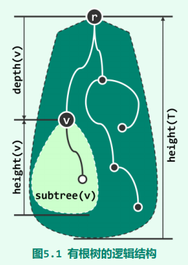

- **深度（depth）**：沿每个节点 v 到根 r 的唯一通路所经过边的数目，称作 v 的深度（depth），记作depth(v)。

  特别地，约定根节点的深度 depth(r) = 0

- 任一节点 v 在通往树根沿途所经过的每个节点都是其**祖先（ancestor）**，v 是它们的**后代（descendant）**。特别地，v 的祖先/后代包括其本身，而 v 本身以外的祖先后代称作**真祖先（proper ancestor）**/**真后代（proper descendant）**。

- 特别地，若节点 u 是 v 的祖先且恰好比 v 高出一层，则称 u 是 v 的**父亲（parent）**，v 是 u的**孩子（child）**。

- v 的孩子总数，称作其度数或**度（degree）**，记作deg(v)。无孩子的节点称作**叶节点（leaf）**，包括根在内的其余节点皆为**内部节点（internal node）**

- v 所有的后代及其之间的联边称作**子树（subtree）**，记作 subtree(v)。

- 树 T 中所有节点深度的最大值称作该**树的高度（height）**，记作 height(T)。特别地，仅含单个节点的树高度为0，空树高度为 -1。推而广之，任一节点 v 所对应子树 subtree(v) 的高度，亦称作该**节点的高度**，记作 height(v)。特别地，全树的高度亦即其根节点 r 的高度，$height(T) = height(r)$。

## 遍历

**通过中序遍历，可在二叉树各节点之间定义一个线性次序**。相应地，各节点之间也可定义前驱与后继关系。

而遍历需要一个全局次序，而二叉树本身并不具有天然的全局次序。故首先需要在各节点与其孩子之间约定某种局部次序，从而间接地定义出全局次序。而局部访问的次序有`VLR`、`LVR`和`LRV`三种选择，这三种策略也相应地分别称作先序遍历、中序遍历和后序遍历：

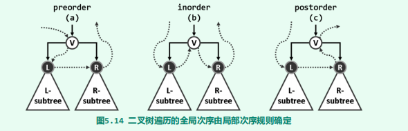

### 先序遍历

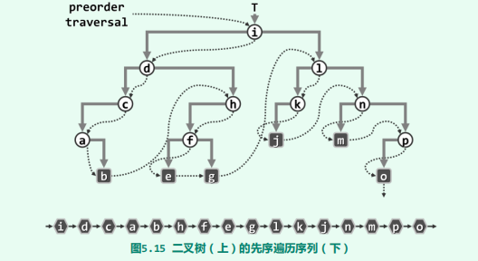

~~~java
public static <T extends Comparable<T>>
void travelPre(BinaryTreeNode<T> node, Consumer<T> consumer) {
    if (node == null) return;
    consumer.accept(node.data);
    travelPre(node.leftChild, consumer);
    travelPre(node.rightChild, consumer);
}
~~~

递归版遍历算法时间、空间复杂度的常系数，相对于迭代版更大。

~~~java
public static <T extends Comparable<T>>
void travelPreIteration1(BinaryTreeNode<T> node, Consumer<T> consumer) {
    Stack<BinaryTreeNode<T>> nodes = new Stack<>();
    if (node != null)
        nodes.push(node);
    while (!nodes.empty()) {
        BinaryTreeNode<T> x = nodes.pop();
        consumer.accept(x.data);
        if (hasRightChild(x))
            nodes.push(x.rightChild);
        if (hasLeftChild(x))
            nodes.push(x.leftChild);
    }
}
~~~

很遗憾，以上思路并不容易推广到非尾递归的场合，比如在中序或后序遍历中，至少有一个递归方向严格地不属于尾递归。此时，如下另一迭代式版本的实现思路，则更具参考价值，即模拟调用栈（While + Stack）。

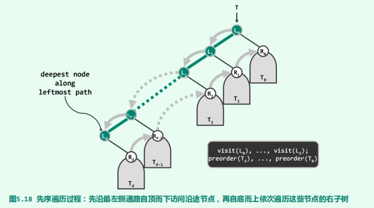

~~~java
public static <T extends Comparable<T>>
void travelPreIteration2(BinaryTreeNode<T> node, Consumer<T> consumer) {
    Stack<BinaryTreeNode<T>> rightNodes = new Stack<>();
    while (true) {
        while (node != null) {
            consumer.accept(node.data);
            if (node.rightChild != null)
                rightNodes.push(node.rightChild);
            node = node.leftChild;
        }
        if (rightNodes.empty()) break;
        node = rightNodes.pop();
    }
}
~~~

### 中序遍历

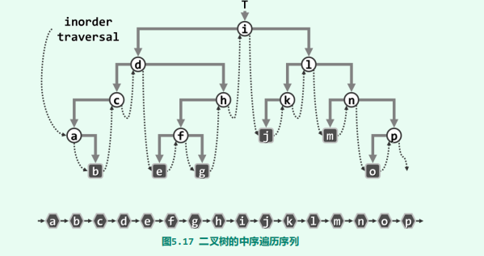

~~~java
public static <T extends Comparable<T>>
void travelIn(BinaryTreeNode<T> node, Consumer<T> consumer) {
    if (node == null) return;
    travelIn(node.leftChild, consumer);
    consumer.accept(node.data);
    travelIn(node.rightChild, consumer);
}
~~~

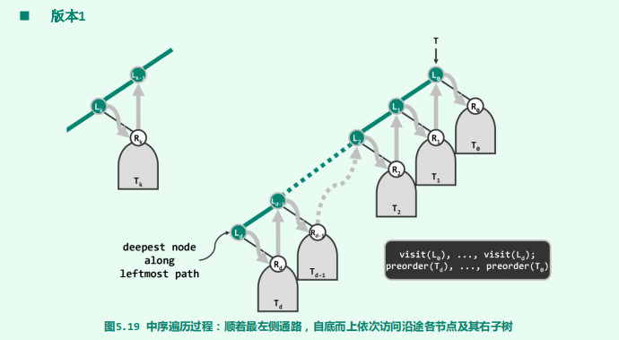

~~~java
public static <T extends Comparable<T>>
void travelInIteration1(BinaryTreeNode<T> node, Consumer<T> consumer) {
    Stack<BinaryTreeNode<T>> leftNodes = new Stack<>();
    while (true) {
        while (node != null) {
            leftNodes.push(node);
            node = node.leftChild;
        }
        if (leftNodes.empty())
            break;
        node = leftNodes.pop();
        consumer.accept(node.data);
        node = node.rightChild;
    }
}
~~~

### 后序遍历

先序遍历序列与后序遍历序列并非简单的逆序关系。

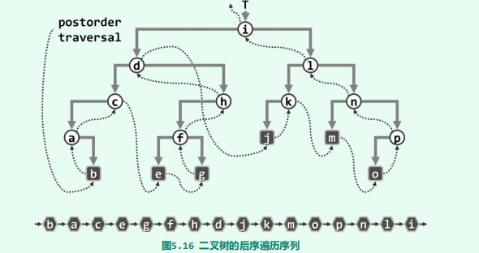

~~~java
public static <T extends Comparable<T>>
void travelPost(BinaryTreeNode<T> node, Consumer<T> consumer) {
    if (node == null) return;
    travelPost(node.leftChild, consumer);
    travelPost(node.rightChild, consumer);
    consumer.accept(node.data);
}
~~~

如图所示，将树T画在二维平面上，并假设所有节点和边均不透明。于是从左侧水平向右看去，未被遮挡的最高叶节点 v 称作**最高左侧可见叶节点（HLVFL）**，**即为后序遍历首先访问的节点**。请注意，该节点既可能是左孩子，也可能是右孩子，故在图中以垂直边示意它与其父节点之间的联边。

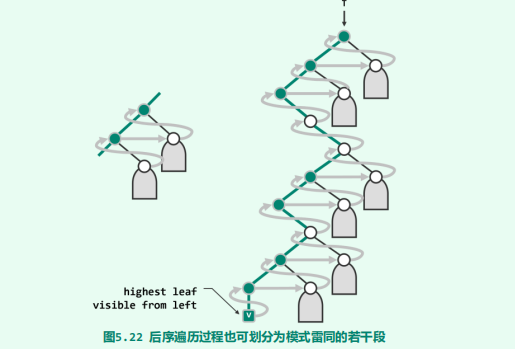

~~~java
public static <T extends Comparable<T>>
void travelPostIteration(BinaryTreeNode<T> x, Consumer<T> consumer) {
    Stack<BinaryTreeNode<T>> nodes = new Stack<>();
    if (x != null) nodes.push(x);
    while (!nodes.empty()) {
        if (x.parent != nodes.top())		//只有当前节点的父亲不是下一个要访问的节点，此时要对右子树遍历入栈
            gotoHLVFL(nodes);
        x = nodes.pop();
        consumer.accept(x.data);
    }
}

private static <T extends Comparable<T>>
void gotoHLVFL(Stack<BinaryTreeNode<T>> stack) {
    BinaryTreeNode<T> node;
    while ((node = stack.top()) != null) {
        if (node.leftChild != null) {				//尽可能地走左边
            if (node.rightChild != null)			//如果有右孩子，优先入栈
                stack.push(node.rightChild);
            stack.push(node.leftChild);
        } else {
            stack.push(node.rightChild);
        }
    }
    stack.pop();        //弹出最后添加的空节点
}
~~~

下面给出一个实例：

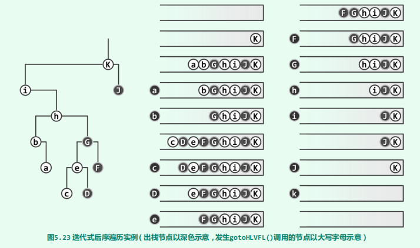

### 层次遍历

有根性和有序性是层次遍历序列得以明确定义的基础。正因为确定了树根，各节点方可拥有深度这一指标，并进而依此排序；有序性则保证孩子有左、右之别，并依此确定同深度节点之间的次序。

~~~java
public static <T extends Comparable<T>>
void travelLevel(BinaryTreeNode<T> node, Consumer<T> consumer) {
    Queue<BinaryTreeNode<T>> queue = new Queue<>();
    queue.enqueue(node);
    while (!queue.empty()) {
        node = queue.dequeue();
        consumer.accept(node.data);
        if (node.leftChild != null)
            queue.enqueue(node.leftChild);
        if (node.rightChild != null)
            queue.enqueue(node.rightChild);
    }
}
~~~

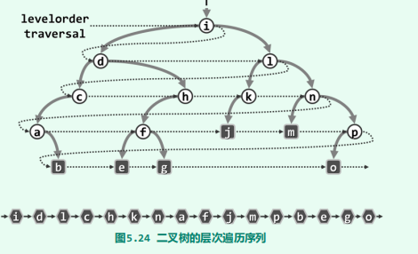

## 例题

### 遍历序列还原树

由二叉树的先序和中序序列，或者中序和后序序列，可以唯一地还原一棵二叉树。由二叉树的先序和后序序列不能**唯一地**还原一棵二叉树。下面首先给出从前序与中序遍历构造二叉树的模板：

~~~go
func buildTree(preorder []int, inorder []int) *TreeNode {
    if (len(preorder) == 0) {
        return nil
    }
    // 先序序列的第1个字符为根
    root := preorder[0]
    index := 0
    // 在中序序列中，以根为中心划分左、右子树
    for i, num := range inorder {
        if (num == root) {
            index = i
            break
        }
    }
    
    // 还原左、右子树
    node := new(TreeNode)
    node.Val = root
    node.Left = buildTree(preorder[1:1+index], inorder[:index])
    node.Right = buildTree(preorder[1+index:], inorder[index+1:])
    return node
}
~~~

已知一棵树的先根遍历序列 ABEFCDGIH 和后根遍历序列 EFBCIGHDA， 还原这棵树。树的先根遍历、后根遍历与其对应的二叉树的先序遍历、中 序遍历相同，因此我们先还原二叉树。然后在这颗二叉树的基础上，还原树即可。

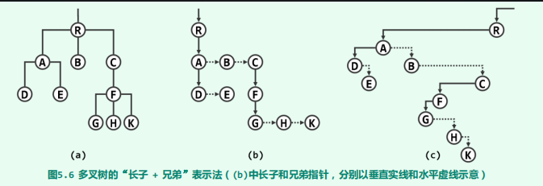

由于森林的先序遍历、中序遍历与其对应二叉树的先序遍历、中序遍历相同，因此可以根据该对应关系，先将其还原为二叉树，然后将二叉树转换为森林。

森林是由 m （m ≥0）棵不相交的树组成的集合。可以把森林中的每棵树的树根都看作兄弟，因此三棵树的树根B、C、D是兄弟，兄弟关 系在右斜线上，其他的转换和树转二叉树一样，将长子当作左孩子，将兄弟关系向右斜。 

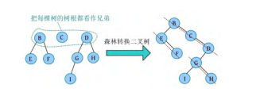

同理，二叉树也可以被还原为森林

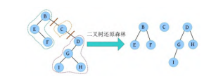

### 最大二叉树

给定一个不重复的整数数组 nums 。 最大二叉树 可以用下面的算法从 nums 递归地构建：

- 创建一个根节点，其值为 nums 中的最大值。
- 递归地在最大值 左边 的 子数组前缀上 构建左子树。
- 递归地在最大值 右边 的 子数组后缀上 构建右子树。

返回 nums 构建的 最大二叉树 。

~~~go
func constructMaximumBinaryTree(nums []int) *TreeNode {
    if (len(nums) == 0) {
        return nil
    }
    findMax := func(nums []int)(val, position int) {
        val = -0x80000000
        for i, num := range nums {
            if (num > val) {
                val = num
                position = i
            }
        }
        return
    }
    root := new(TreeNode)
    tmp, pos := findMax(nums)
    root.Val = tmp
    root.Left = constructMaximumBinaryTree(nums[:pos])
    root.Right = constructMaximumBinaryTree(nums[pos+1:])
    return root
}
~~~

### 结构问题

给你两棵二叉树 root 和 subRoot 。检验 root 中是否包含和 subRoot 具有相同结构和节点值的子树。如果存在，返回 true ；否则，返回 false 。

~~~go
func isSubtree(root *TreeNode, subRoot *TreeNode) bool {
    if (root == nil || subRoot == nil) {
        return false
    }
    if root.Val == subRoot.Val {
        if (isSameTree(root, subRoot)) {
            return true
        }
    }
    // 相当于一个前序遍历了
    return isSubtree(root.Left, subRoot) || isSubtree(root.Right, subRoot)
}

func isSameTree(p *TreeNode, q *TreeNode) bool {
    if p == nil && q == nil {
        return true
    }
    if p == nil || q == nil {
        return false
    }
    if p.Val != q.Val {
        return false
    }
    return isSameTree(p.Left, q.Left) && isSameTree(p.Right, q.Right)
}
~~~

### 自底向上整合子树结果

有很多对树上的信息进行统计的应用问题，可以抽象为树的后序遍历。在后序遍历过程中，需要将子树的答案交给当前节点，根据需求进行整合后，再继续向根节点传。整棵树遍历完成后，根节点整合后的就是统计结果。

二叉树中的 路径 被定义为一条节点序列，序列中每对相邻节点之间都存在一条边。同一个节点在一条路径序列中至多出现一次 。该路径 至少包含一个节点，且不一定经过根节点。路径和 是路径中各节点值的总和。给你一个二叉树的根节点 root ，返回其 最大路径和 。

~~~go
import "math"
var maxAns int = math.MinInt32
func maxPathSum(root *TreeNode) int {
    maxAns = math.MinInt32
    getPathSum(root)
    return maxAns
}

func getPathSum(root *TreeNode) int {
    if root == nil {
        return 0
    }
    l := max(getPathSum(root.Left), 0)
    r := max(getPathSum(root.Right), 0)
    maxAns = max(maxAns, root.Val + l + r)
    return root.Val + max(l, r)		// 这里只取一边，避免节点在路径中重复
}
~~~

给定一个二叉树，我们在树的节点上安装摄像头。节点上的每个摄影头都可以监视**其父对象、自身及其直接子对象。**计算监控树的所有节点所需的最小摄像头数量。

~~~go
const (
    HAS_CAMERA = iota
    NO_CAMERA
    COVERED
)

func minCameraCover(root *TreeNode) int {
    camera := 0
    if (root == nil) {
        return 0
    }
    var traversal func(root *TreeNode) int;
    traversal = func(node *TreeNode) int {
        if (node == nil) {
            return COVERED
        }
        l := traversal(node.Left)
        r := traversal(node.Right)
        if (l == NO_CAMERA || r == NO_CAMERA) {
            camera++
            return HAS_CAMERA
        }
        if (l == HAS_CAMERA || r == HAS_CAMERA) {
            return COVERED
        }
        return NO_CAMERA
    }
    
    if (traversal(root) == NO_CAMERA) {
        camera++
    }
    return camera
}
~~~

### 层次遍历

只要操作与节点的高度有关，可以考虑层次遍历：层序遍历用 BFS 实现方便点，因为函数参数携带高度信息，这样我们就不用封装一个带高度字段的结构体了。

~~~go
// 官方提供的
type TreeNode struct {
    Val int
    Left *TreeNode
    Right *TreeNode
}

type MyNode struct {
    TreeNode 			// ERROR 这样遍历时，只能遍历 TreeNode，而不是MyNode
}

// 正确的
type MyNode struct {
    Val int
    Left *TreeNode
    Right *TreeNode
    height int		
}
// 再递归建树
func buildTree(*TreeNode) *MyNode {}

// 由此可见，还是 bfs 比较方便
func bfs(node *TreeNode, height int) {}
~~~

### 搜索

实际上，先序、后序、中序都可以归结到 DFS 中。而层次可以归结到 BFS 中。**DFS、BFS 的搜索策略更加灵活**

这类树上搜索的问力扣上有很多，大体上有三类。

- 只能按 DFS 的顺序遍历
- 按 DFS/BFS 顺序遍历都可以
- 需要两次遍历

给定一个二叉树的 **根节点** `root`，想象自己站在它的右侧，按照从顶部到底部的顺序，返回从右侧所能看到的节点值。

~~~go
func rightSideView(root *TreeNode) []int {
	view := map[int]*TreeNode{}
	ans := []int{}
	var dfs func(root *TreeNode, height int)
    // 等价于一个先序遍历，但携带了高度信息，不用自己封装对象了
	dfs = func(node *TreeNode, height int) {
		if node == nil {
			return
		}
		if _, ok := view[height]; !ok {
			view[height] = node
			ans = append(ans, node.Val)
		}
        // 尽量先走右边
		dfs(node.Right, height+1)
		dfs(node.Left, height+1)
	}
	dfs(root, 0)
	return ans
}
~~~

## LCA

我们递归遍历整棵二叉树，定义 $f_x$  表示 x 节点的子树中是否包含 p 节点或 q 节点，如果包含为 true，否则为 false。那么符合条件的首个共同祖先 x 一定满足如下条件：

$$
f_{lson} \&\& f_{rson} || ((x==p || x==q) \&\&(f_{lson}||f_{rson})))
$$
其中 lson 和 rson 分别代表 *x* 节点的左孩子和右孩子。

~~~go
func lowestCommonAncestor(root *TreeNode, p *TreeNode, q *TreeNode) *TreeNode {
    if (root == nil) {
        return nil
    }
    if (root.Val == p.Val || root.Val == q.Val) {
        return root
    }
    left := lowestCommonAncestor(root.Left, p, q)
    right := lowestCommonAncestor(root.Right, p, q)
    if left != nil && right != nil {
        return root
    }
    if (left == nil) {
        return right
    }
    return left
}
~~~

